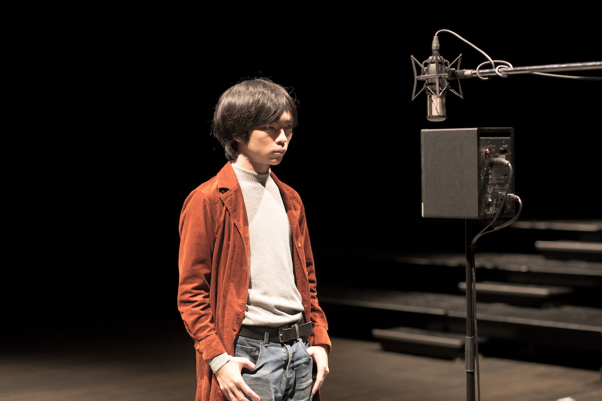

Matsuura Tomoya

マツウラトモヤ

松浦知也

(Photo by [Noguchi Shohei](https://ngcsh.tumblr.com))

SoundMaker:Artist/Engineer/Designer/Researcher/Programmer

Tomoya Matsuura is a musician and a sound artist who starts from building systems that describe and generate sound to create his own sound and music. From a media-archaeological viepoints, he pursues possible and alternative expressions of sound by building a sound installation and an electro-acoustic instrument, and performs with them.

He also works as an engineer who does a technical direction, sound design and programming for commercial installations and other artists' works.

He is born in 1994 and graduated Department of Musical Creation and Environment in Tokyo University of the Arts. He is now Graduate Student of Graduate School of Design, Kyushu University.

Web Site : <https://matsuuratomoya.com/en>

**[See Full Artist Statement](./statement)**

---

# CV

## Education

Born in 1994 in Chigasaki City, Kanagawa Pref. Living in Fukuoka Pref. Japan.

2010.04~2013.03 Kanagawa Sohgoh Highschool

2013.04~2017.03 Tokyo University of the Arts Music Creation and Environment in Music Program(Project 3:Sound Engineering, Kamekawa Toru lab.) Bachelor(Music)

2017.04~2019.04 Kyushu University Graduate School of Design, Master Program Department of Design, Content and Creative Design Course, Digital Content Design Division(Jo Kazuhiro lab.)

2018.09~11 [School for Poetic Computation](https://sfpc.io) Fall 2018 Class

2019.04~ Kyushu University Graduate School of Design, Ph.D Program Department of Design, Content and Creative Design Course(Jo Kazuhiro lab.)

## Work

2015.02~2017.03 teamlab Sound Engineer

2015.08~09 YCAM(Yamaguchi Center for Art and Media) interlab Internship

### Awards/Prizes/Scholarships/Grants

2015 [Ataka-Scholarship](https://www.geidai.ac.jp/life/scholarship/geidai_scholarship)

2017(on the Graduation of the Bachelor) [Acanthus Music Prize](https://www.geidai.ac.jp/information/prize/acanthus)

2017 Asia Digital Art Award 2017 Interactive Art(Student) Section Finalist Award ([送れ | 遅れ / post | past](/en/works/post-past_sotsuten))

2017 23rd Campus Genius Award Nominate ([送れ | 遅れ / post | past](/en/works/post-past_sotsuten))

2018 [KAKEHASHI foundation](https://kakehashi-foundation.jp) Scholarship Student

2019年 [Kitakyushu Digital Creators Contest　Selected](http://kdcc.info/archive/2019.html) ([Aphysical Unmodeling Instrument](/en/works/aphysical-unmodeling-instrument))

---

## Technical Skills

### Programming

- Cycling 74 Max
- Faust
- HTML5/CSS3
- C++
- Openframeworks
- Javascript(Node.jsも)
- Julia
- Puredata

### Sound Design

basic recording/mixing/foley with...

- Cubase
- Protools

### Digital Fablication

- Laser Cutter
- Basic 3D printing
- Fusion360
- PCB prototyping with CNC milling machine

### Electronics

- Arduino
- Autodesk Eagle
- FlatCAM

## Researchs/Publications

to [Research](/en/research)