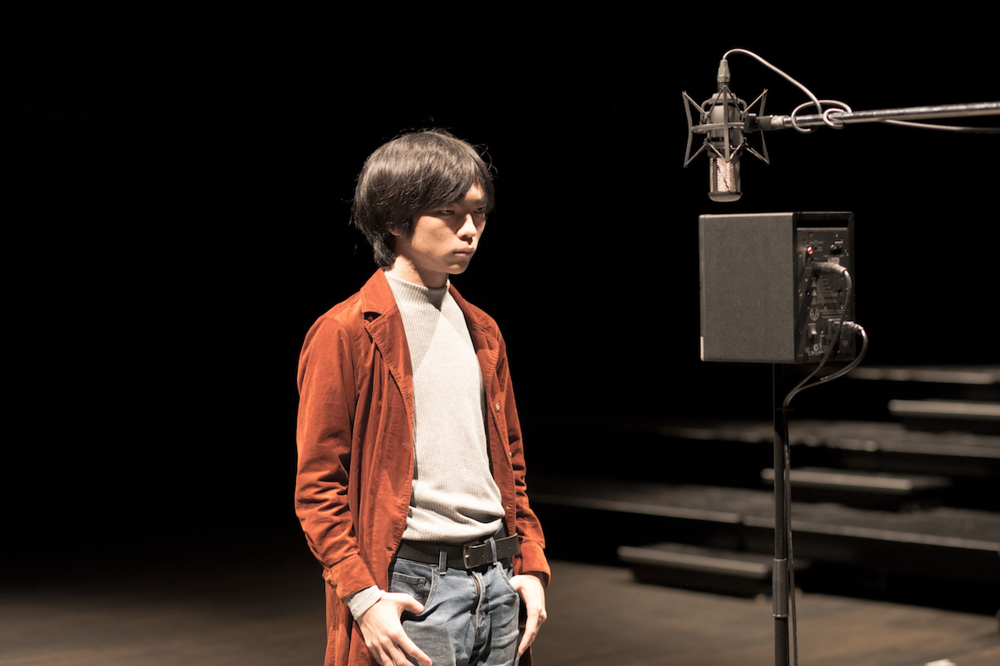

# 過去のプロフィール一覧

(学歴等の部分は省略)

[現在のプロフィール](/about)

photos by 野口翔平

## 2019年

SoundMaker:Artist/Engineer/Designer/Researcher/Programmer

音・音楽を作るためにその生成・記述のシステム自体を作ることから始めるアプローチを取る音楽家・サウンドアーティスト。メディア考古学的視点から有りうるオルタナティブな音表現の可能性を追求し、サウンドインスタレーション、電子楽器の制作やそれを用いた演奏活動、作曲などを行う。

またインスタレーションやサウンドアートのサウンドシステム・プログラム開発のテクニカルなサポートや、レコーディング、映像のサウンドデザイン、舞台音響などを務める。

## 2016年

Sound Maker/Engineer/Designer/Programmer

音を中心とした様々なメディアにおける「システム」、その中でも特に「ライブ/通信」と「アーカイブ/記録/記憶」の関係性をテーマに音響装置作品や電子楽器、演奏システムの制作や作曲、演奏などを行う。

またインスタレーションやサウンドアートのサウンドシステム・プログラム開発のテクニカルなサポートや、レコーディング、映像のサウンドデザイン、舞台音響などを務める。
