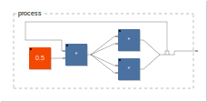
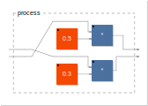
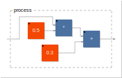
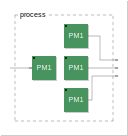
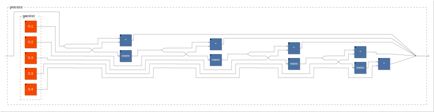

*この記事は[Faust(多分ひとり)Advent Calender](https://qiita.com/advent-calendar/2016/faust)の4つ目の記事です。*

年が明けてますがアドベントカレンダーです。
本日はなんとも独特なFaustの記法について解説していきます。

<!--more-->

# 色々な書き方

まず以下に**「入力に0.5を掛ける」**という簡単なゲイン調節のモジュールの書き方を示そうと思います。それぞれのダイヤグラムも載せます。

## 例1

```java
process = (_,0.5) : *;
```


## 例2

```java
process = _ : *(0.5);
```


## 例3

```java
process = *(_,0.5);
```


## 例4

```java
process = _*0.5;
```


・・・は？って感じですよね。一番上の記法ほど普通の言語からすると謎な表現に見えますがFaustでは上から順に普遍的な書き方になります。

例1が**ダイヤグラム記法**、例2は関数定義の記法、例3は演算子型での記法となります。

# 用語の定義

まだ日本語訳の資料が存在しないので幾つかここで用語を定義しておきます。

## expression=ブロック

直訳するには変なのでこのようにします。expression/ブロックはFaustの中でのすべての最小単位で、先程の

```java
_
0.5
*
*(0.5)
(_:*(0.5))
```

などはすべて0以上の入力と出力を持つ機能ブロックで表現できます。

## function = 関数

そのまんまですが、**Faustではすべてのブロックが関数とみなせる**ので、明示的に「関数」と呼ぶのは**引数つきのブロック定義をする場合**において主に使われます。

```java
applygain(gain) = _ * gain;
```

## diagram expression＝ダイアグラム記法

これもそのまんまですが、ブロック同士を**接続、あるいは並列**する場合の記法です。
ダイアグラム記法には**composition＝接続**の記法と**iteration＝反復接続**の記法があります。

```java
// , : <: :> ~ の5つが接続の記法
process = (_,0.5 : *)<:(*,*):>~(_);

// par() seq() sum() prod()の4つが反復接続の記法

fi = library("filter.lib");

process = _<:par(i,5,fi.bandpass(1,1,i*100));
```




残りは後々出てきたらその時々訳すことにします。

# 接続の記法

とりあえず覚えておけば色々できるようになるのが接続(diagram-composition)記法です。

前回も説明したとおり、5種類の接続法が有ります。それぞれの記法はつなげるブロック同士の出力/入力数の制限があり、それに反した場合コンパイルエラーになります。

自分がつなげようとしているブロックたちがそれぞれいくつ入力があり、いくつ出力があるのかをイメージしておくことが大事です。


## 並列/Parallel

ブロック同士をコンマで並べるとそのブロックは横並びで一括りのブロックになります。

```java
process = (10,*);
```


特に記法の制限はなし。
上の例では0in1out+2in1outのブロックの組み合わせで2in2outのブロックが出来ました。

## 直列/Sequencial

ブロック同士をセミコロンで並べると直列接続。になります。

```java
process = ((*,/):+);
```


制限:左側の出力数==右側の入力数

上の例では4in2outと2in1outで一致しています。

## 分岐/Split

<:で複数の入力に分岐するような書き方ができます。

```java
process = ((10,20)<: (+,*,/));

```


制限：左側の出力数*(2,3,4...)==右側の入力数

左が2outならば右側は4,6,8,10inなどのブロックが必要です。

上の例は0in2out<:6in3outで満たしています。

## 結合/Merge

さっきと逆向き、:>で複数入力を少ない数にまとめるような書き方になります。


```java
process = ((10,20,30,40):> *);

```


制限:左側の出力数==右側の入力数*(2,3,4...)

先程の逆ですね。

注意点として、結合接続が集まったときは**すべての入力の和**として出力されます。
つまり、上の例は明示的に表すとこうなります。


## 再帰/Recursive

一番ややこしいやつ、右側の出力を左側の入力へフィードバックするやつです。

この例は44100サンプルのフィードバックディレイです。実際に鳴らすと多分発振するのでお気をつけて。。。

なお、フィードバックされた信号は暗黙的に**1サンプル遅れた信号**になります。

```java
process = + ~ @(44100);

```


制限:左側の**出力**≧右側の**入力**　かつ　左側の**入力**≧右側の**出力**

右側のブロックはダイヤグラム上で上下左右が反転します。

左側は2in1out、右側は1in1outなので、

左の出力==右の入力かつ左の入力>右の出力になっているので、条件満たしてますね。

# 優先順位

それぞれの演算子には先に計算される優先順位と右左どちらを先に計算するかの決まりがあります。大体はカッコでグルーピングしていけば困らないのですが、気がつくとソースコードがカッコでネストされまくってて超読みづらい、という現象が発生するのでできるだけカッコを少なくするためにも覚えておいたほうが良いです。

- 優先順位

**再帰>並列>直列>分岐＝結合**

- 評価順

**再帰のみ左から**、他は右から

（評価順は普段はそこまで気にしなくても良いが、パターンマッチングのときなどに影響してきます。）

例えば以下のコードはこのぐらいカッコでくくっときたくなりますが、


```java
process = (((_,0.5):*)<: (*,*) :> _) ~ _;
```

実際はコレだけでOKです。

```java
process = (_,0.5 : * <: *,* :>_ ) ~ _;
```

ただ、カッコがなければソースの可読性が上がるというわけでもないので実際には場合に応じてカッコを付けていくのが良いでしょう。

# 接続記法の応用

さて、以下のダイヤグラムはどのようにして書いたでしょうか？



普通に書こうと思うとこうですが、インプットがクロスしていますね。

```java
process = (_,_) : (*(0.5),*(0.3));
```

正解はこうです。

```java
process = (_,_)<:(!,*(0.5),*(0.3),!);
```

!は何だったかというと、入力をカットする1in0outのブロックです。カットされた以降何もつながってない部分は、ダイヤグラム上からは省かれます。
イメージ的にはこうなっているということです。


こういった例以上に複雑なのは標準ライブラリのro.interleaveやro.crossなどを利用するとだいぶ見やすくなります。

例えば4×2の入力を2×4のセットに変えるときは

```java
import("stdfaust.lib");
process = si.bus(8):ro.interleave(4,2)
```


ちなみに手実装するとこうです。おわかりいただけますでしょうか。

```java
process = (_,_,_,_,_,_,_,_)<:(_,!,!,!,!,!,!,!,!,!,_,!,!,!,!,!,!,!,!,!,_,!,!,!,!,!,!,!,!,!,_,!,!,_,!,!,!,!,!,!,!,!,!,_,!,!,!,!,!,!,!,!,!,_,!,!,!,!,!,!,!,!,!,_)
```

# 反復接続

他の言語でのforループに当たるのがこの反復接続です。

## par(変数,回数,内容)　並列

正直コレ以外はあんまり使わないです。

```java
//これを
process = _<:(*(1),*(2),*(3),*(4));
//こう書ける
process = _<:par(i,4,*(i));
```

## seq(変数,回数,内容) 直列

```java
//これを
process = _:*(1):*(2):*(3):*(4);
//こう書ける
process = _:seq(i,4,*(i));
```

## sum(変数,回数,内容) 全加算

```java
//これを
process = 1+2+3+4;
//こう書ける
process = sum(i,4,i);
```

ただ、こいつは実は

```java
process = par(i,4,i):>_;
```

で完全に表現できてしまう上にダイヤグラムもこちらが見やすいので、一番使いません。

重要な点として、Faustでは基本的に全てがサンプル単位のfloatになりますが、反復で使う**iはコンパイル時に定数の整数**でなければいけません。普通はならないですが、複雑なコードになるとシグナルのインプットがこのiに代入されたりする状況が発生したりしてコンパイルエラーになることがあります。

## prod(変数,回数,内容) 全乗算

```java
//これを
process = 1*2*3*4;
//こう書ける
process = prod(i,4,i);
```

これ以上複雑な事をやる場合には実は後述するパターンマッチングを使うほうが上手く行ったりします。

# 関数定義

さて、今度は関数定義です。

```java
gain_offset(gain,offset) = _:*(gain):+(offset);

process = gain_offset(0.5,-0.3);
```



この例はわかるでしょうか。入力を0.5倍してDCオフセットを0.3つけるという処理になります。

なので、gain_offsetを引数無しで置いたりするとコンパイルエラーに、、、と思いきや、

```java
gain_offset(gain,offset) = _:*(gain):+(offset);

process = gain_offset;
```


はい、実は引数なしでも使えてしまうというのがFaustのもう一つややこしいところです。この場合、引数が左から順にインプットとして追加されます。

ちなみに引数を一つで使うと、

```java
gain_offset(gain,offset) = _:*(gain):+(offset);

process = gain_offset(0.5);
```


このように、左の引数から代入され、残ったやつがインプットとして扱われます。

コレを覚えておくと関数の設計でちょっと便利になります。

## with{} ローカル変数

その関数定義内だけで使えるローカル変数はwith{}内で定義できます。
微妙なポイントとしてwithを使う場合は行末のセミコロンはwithの後に来るので注意しましょう。

```java
gain_offset(gain,offset) = _*gain+offset+initial_offset
	with{
			initial_offset = -0.5
	};
```

## ラムダ式

上のコードはこのようにも書くことが出来ます。

```java
gain_offset = \(gain,offset).(_*gain+offset+initial_offset)
	with{
			initial_offset = -0.5;
		};
```

この記法をラムダ式と呼んでいて、後述するパターンマッチングなどのより複雑な表現にはこちらが向いていることもあります。

## パターンマッチング

```java

duplicate = case {
                    (1,x) => x;
                    (n,x) => duplicate(n-1,x);
                };
//もしくは
duplicate(1,x) = x;
duplicate(n,x) = (x, duplicate(n-1,x) );

process = duplicate(3)
```



このように、関数内で自分の関数を使う再帰関数のような定義の仕方が出来ます。慣れないとすぐコンパイルエラーを起こしますが、慣れると反復接続だけでは出来ない、入れ子であったり並列と直列が組み合わさったような表現が可能になります。

例えば5タップのFIRフィルター(1サンプルずつのディレイにそれぞれゲインを掛けて加算したもの)が以下のように表現できます。

コレがわかれば大体のFaustのコードは読めるんではないでしょうか。

```java
import("stdfaust.lib");

fir(taps,gainlist) =  (_,gainlist):routes(taps):>_
			with{
				swap=(_,_)<:(!,_,_,!);
				routes = case{
					(1) => *;
					(taps) => ((_<:_,_),si.bus(taps)):(_,swap,si.bus(taps-1)):(*,mem,si.bus(taps-1)):(_,routes(taps-1));
				};

			};

gainlist = (0.1,0.2,0.3,0.3,0.4);

process =fir(5,gainlist);
```



# 演算子

さて、ここまで見れば実は+や＊などの演算子はブロックであり関数であり演算子的な記法もできる特殊な奴なのでアレだけたくさんの書き方ができるということです。

```java
process = A*B;
process = (A,B):*;
process = *(A,B);
process = A:*(B);
```

すべてをブロック的な記法でやることも出来ますが、コードの可読性的に関数記法や演算子っぽい記法を使ったほうが良いこともあります。

慣れるまではできるだけ接続文法だけで書いてみて、慣れてきたところで演算子の用法も使うようにしていくと良いでしょう。

---

本当はディレイやテーブルなども紹介したかったんですが長くなりすぎたのでこのぐらいにします。

次はライブラリの使い方について説明するので、library()やcomponent()、environment()、import()などはそちらで説明しようと思います。
