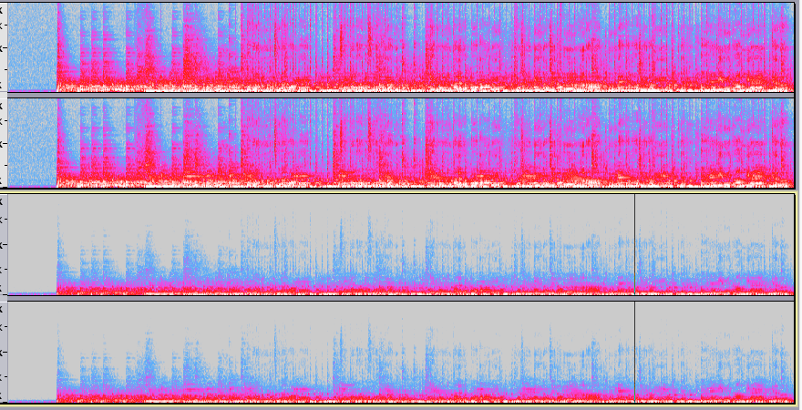

今回は最近追加されたFaustで書いたエフェクトをwavファイルに対して掛ける方法を紹介します。

<!--more-->

# Faustでファイルを処理するメリット

**MatlabやPython**などREPLで処理するバッチ処理の高速化が大きいのではないかなと思います。ある程度複雑な処理(統計的な処理や、複数ファイルの相関を取ったりするような)になると無理ですが、事前の下処理などでまとめてエフェクトを掛けるのにffmpegのフィルターやDAWのオートメーションを駆使して大量処理するなどがあり得ますが、そういった雑処理を厳密性を保ちつつも高速に出来ることがウリだと思います。

## デメリット

現状出力ファイルの長さは入力ファイルに一致するようです。つまりディレイやリバーブなどテールの長いものはぶった切られてしまうようです。

---

# faust2sndfile

結論から言うと今回はこのfaust2sndfileというのを使います。これは残念ながらFaustLiveやオンラインコンパイラのリモートビルドに対応していないので、ローカルのコマンドラインでfaustコマンドが使えるようになっている必要があります。

## Faustをローカルで使えるようにしよう

[Faustのコンパイラのビルドとインストール時の注意点](blog/2016-12-11/faust_build_compiler)を参照して下さい。releaseの中のv2.1.0にはまだfaust2sndfileがありませんので、Homebrewで入れる人は--HEADオプションを付けることを推奨します。

## スクリプトの中身

<https://github.com/grame-cncm/faust/blob/master-dev/tools/faust2appls/faust2sndfile>

中身はまんまこのシェルスクリプトです。
まず.dspファイルをCLIツールに変換してから、そのツールにwavファイルのパスを与えてあげると、Faustでエフェクトの掛かったwavファイルが出て来るというわけです

バイナリをビルドするのにはlibsndfileがインストールされてる必要があります。

```bash
pkg-config --cflags --static --libs sndfile
```

でエラーがなければ問題ないでしょう。もしエラーが出るようであれば

```
brew install libsndfile
```

などで入れれば良いと思います。

# 使ってみよう

```bash
faust2sndfile -h
```

で`faust2sndfile <file.dsp>`と帰ってきたらきちんとインストールされてます。

早速試しに、

```java
import("stdfaust.lib");
process = fi.lowpass(1,1000),fi.lowpass(1,1000);
```
という、ステレオの1000Hz以上を切るローパスフィルターのエフェクトを作って、`lowpass.dsp`という名前などで保存しましょう。そして

```bash
faust2sndfile lowpass.dsp -double
```

dspファイルをバイナリにコンパイル、ビルドします。注意点としてはfaustコンパイラへのオプションはこの時点で通さなければならないということです。おそらく使うのは-double -quadなどの制度指定くらいではないかと思いますが。

そうすると`lowpass`というバイナリが出てくると思います。あとは

```bash
./lowpass test.wav test_processed.wav
```

のように、入力ファイルのパス、出力ファイルのパスの順で入れてあげると、ファイルがでてきます。試しにAudacityに突っ込んでみると、



上が処理前、下が処理後です。1000Hz以下はきちんとカットされてる感じしますね。

出力フォーマットは入力ファイルの拡張子と同じものに強制的に変換されます。
libsndfileを使っているのでwav、aiffの他flacなんかもいけます。

ちなみにいくつか試した限りでは、Faust側の入出力が1chでオーディオファイルがステレオだった場合Lchのみ処理されるなど、エラーは返さずある程度上手いこと処理してくれるようです。

# もっとまとめて処理する

こんな感じでしょうか。これで最初に挙げた高速バッチ処理みたいなことが出来るのではないかと（あまりちゃんと動作確認してないですが・・・）。

```bash
#!/bin/bash

dsp='./lowpass'

src=($(find src -name '*.wav' -o -name '*.aif'))

mkdir out

faust2sndfile $(echo $dsp'.dsp') -double

for obj in "${array[@]}"; do
  echo $obj
  out=$(echo $obj | sed s/src/out/g)
  dsp $obj $out
done

```
