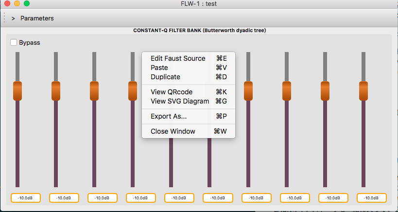
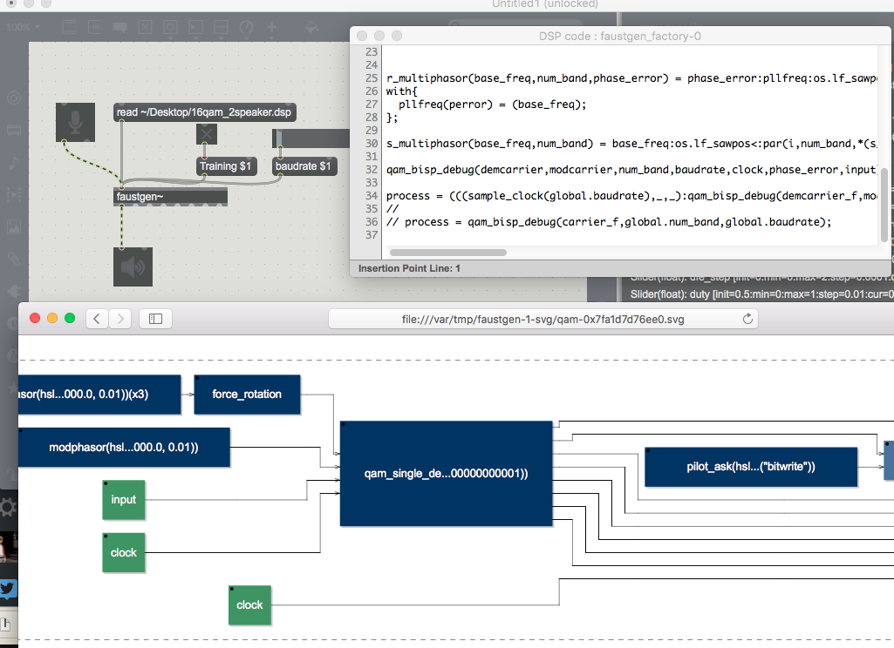
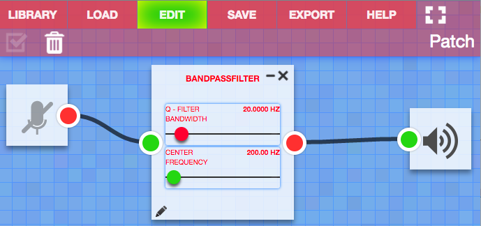

*この記事は[Faust(多分ひとり)Advent Calender](http://qiita.com/advent-calendar/2016/faust)の2個めの記事です。*

今回は「なんでもいいからとりあえずFaust触ってみたいんだけど」という人のための開発環境について書こうと思います。

<!--more-->

# 環境一覧

現在Faustのコンパイラをローカルにインストール以外の方法で開発するならば以下の4種類の環境が挙げられます。

- ローカル
    + FaustLive
    + faustgen~(Cycling'74 Max上で動作)
- Web上
    + Online Compiler
    + Faust Playground

その他、FaustWorksというIDEを作るプロジェクトもあったんですが、現在は開発が止まっているようです。

上記いずれの環境も、faust2のJITコンパイル機能やFaustWebというサーバサイドコンパイラを使ったリモートコンパイル機能などが使われています。

## FaustLive

FaustLiveはFaustのソースコードを読み込んでリアルタイムでGUI付きのアプリケーションを生成してくれるアプリケーションです。

現在手っ取り早くFaustでの開発を行うための最も一般的な手段だと思われます。

ソースコードの読み込み自体も変更を自動監視してコンパイルし直してくれます。ご丁寧に再コンパイル時には音が1秒ほどクロスフェードして切り替わるのでクリックノイズなどで再生機器を痛める心配もありません。

こちらはfilterbankのサンプルを開いた状態です。
Edit SourceはFinderでdspをダブルクリックするのと同じなので、システムで.dspに紐付けられたアプリが開きます（なので.dspにFaustLiveを指定してるともう一個アプリが立ち上がるだけです）。

view QR codeではローカルサーバ上に同じUI画面を立ち上げてブラウザ上でアプリをコントロールできます（この場合は音声処理自体はブラウザ上では行われていません）。

view SVG DiagramでシグナルダイヤグラムのSVGファイルがブラウザなどで開かれます。

エクスポートするとGRAMEのサーバー経由でコードをVSTやPuredataオブジェクトにビルドして、zipでダウンロードできます（その為、エクスポートは要ネットワークです）。

ちなみに、process = _;のような簡単なコードから始めるとインプットとアウトプットはそれぞれシステム上のそれに対応することになるので、ノーパソとかでやってるといきなりハウリングを起こすのでお気をつけてください（かといって、ヘッドホンもコードミスって爆音にならないとも言えないのでヘッドホンで小音量をオススメします）。

### インストール

こっからそれぞれのOSに対応したのを選んで落としてください。

対応OSはWindows、MacOS、Linuxのクロスプラットフォームです。
最新版は2016年12月時点で2.44(Macのみバグフィックスで2.45)です。

[https://sourceforge.net/projects/faudiostream/files/?source=navbar](https://sourceforge.net/projects/faudiostream/files/?source=navbar)

インストーラを展開したら**先にJACKのインストールをします。**
（JACKはソフトウェア間のオーディオルーティングをするソフトです。MacではPuredata同様CoreaudioかJackか選んで使うので、あんまり使わないですが起動するためには必要です。）
JACKのインストーラも一緒に入っているのでZipを展開してインストールしてください。

※MacはElCapitan以降でインストーラがおかしいので付属しているパッケージだとインストールに失敗します。以下のGithubのIssueに修正されたバージョンのDropboxのリンクが上がってるので落としてみてください（せめてGithubのリリースに入れてほしい・・・）。ちなみに、HomebrewのJACKのfomulaはこの問題があるのでJACK1(v0.125)の方を指定しているみたいです。未確認ですが、多分faustliveには対応してない気がします。

[https://github.com/jackaudio/jack2/issues/144](https://github.com/jackaudio/jack2/issues/144)

余談ですが、JACKは割と広く使われてますがFaustとおなじGRAMEが開発してます。その割にはGRAMEの知名度低いですが

### トラブルシューティング

#### 起動に失敗する

~/.FaustLive-CurrentSession-2.0　というフォルダをまるごと削除してみてください。(Linux/Mac。Windowsのフォルダの場所忘れました…)

このフォルダにキャッシュ（SVGのダイアグラムとか作ったら残りっぱなしになってます）が全部入ってるので、たまにおかしくなることがあります。消しても起動したらもう一回作られるので気にしないでください。

#### 落ちます

よくあることです。ほとんど同じコードでコード側に問題がなくても自動で再コンパイルされたときに時々落ちますが、もう一回起動するとケロッと立ち上がったりするので現状はしぶとく使い続けるしか無いと思います。

## faustgen~

Maxをお持ちの皆様にはfaustgen~という「faustのコンパイラが乗っかったオブジェクト」がオススメです。

### インストール

さっきと同じURLですが、現在の最新版は1.10です。
Windows、Mac共に使えますがMaxのバージョンが6か7かによってインストール方法が異なりますが、基本オブジェクトを指定の場所にコピーしていくだけで使えます。
MacでかつMax7ならば~/Documents/Max 7/PackagesのフォルダにZipを展開した中のOSX/Max7/faustgenをフォルダごとコピーすれば終了です。

[https://sourceforge.net/projects/faudiostream/files/?source=navbar](https://sourceforge.net/projects/faudiostream/files/?source=navbar)

普通のオブジェクトにはあまりないですが、オブジェクトをダブルクリック（編集モードはCmd+ダブルクリック）でこのようなメニューが出てきます。

faustgen~に限らずfaustで出力したMaxオブジェクトは全てそうですが、Faustのコード上のインプット、アウトプットの数だけインレット、アウトレットが作られ、UIのコントロールを全て第1インレットにUIのラベルと数値のメッセージを送ることでコントロールします。

エディタでコードを編集して**エディタを閉じるたびに**コードがコンパイルされ更新されます。コンパイルに失敗するとオブジェクトが赤くなってコンソールにエラーが出ます。

ただ、初期状態だと標準ライブラリ以外のインポートがパスが通らないので、その場合は外部に置いたDSPファイルをreadするようにすると、そこからの相対パスが効くように。

### バグ

UIのラベルに長過ぎる文字列が入ってると「view DSP Parameters」を押した時にMaxを巻き込んで落ちます。サンプルのclarinet.dspとかで落ちます。

あと、FaustLiveがSVGを開くのはデフォルトブラウザですがfaustgen~はMacの場合強制でSafariが開きます。何故。。。

## シンタックスハイライト

残念ながらFaustLiveは基本的にはコンパイラとしての機能しか無いので、**エディタは付いてません。**その為エディタは好きなものを自分で選んでくる必要があります。

また、Maxでjsなどを書いたことがある方はお分かりかもしれませんがMax上のテキストエディタもカッコの自動補完とかが無い＆FaustはハイライトがないためMaxのエディタ上で編集するのは結構現実的ではありません。
個人的にはいつもfaustgen~の場合でも外部エディタで編集して、read hoge.dspで読み込み直しています。

ただ、Faustのシンタックスハイライトが最初っから入っているエディタは今のところ無いので、適当な他の言語の物を流用するか、コンパイラに付属しているFaust用のシンタックスハイライトをインストールする必要があります。

流用する場合には一番オススメなのはJavaなんですが、「'」（シングルクォーテーション）を「1サンプルディレイ」として扱うためにこれが含まれているコードを読もうとするとディレイが入ったところからちゃんと表示されなくなってしまいます。

なので、シンタックスハイライトのDLは強くオススメします。（実際、シングルクォーテーションは全て「mem」というブロックに置き換えられるので自分のコードだけしか見ない場合には使わず頑張るという手も無くはないですが。）

シンタックスハイライトはコンパイラのソースのsyntax-highlightingの中にあります。README読めばわかりますが、**KDE Kate/Kwrite、GNOME gedit、TextWrangler、highlight、Emacs、vim、Atom、CodePress**用があります。

FaustLiveやfaustgen~だけでいいやという方はこちらから直にDLしちゃっても良いでしょう。

ちなみに僕はAtomでやっています。hsliderなどUI系の補完が効くので開発効率もよくなりました。

## オンラインコンパイラー

さて、インストールするのもめんどくさいからとにかく試すだけ試させろ、という場合にWeb上でFaustを試せる環境があります。

そのうちの一つがこれ、オンラインコンパイラーです。

[http://faust.grame.fr/onlinecompiler/](http://faust.grame.fr/onlinecompiler/)

オンラインコンパイラでは、シンタックスハイライト付きのコードエディタ、それがコンパイルされたC++などのコード、SVGダイアグラムなどを確認しながら、コードを最終的にVSTやMaxオブジェクトなどにしてDLすることが出来ます。

残念ながら**音は出ません**。のでSVGダイアグラムを確認しながらぽちぽちと拾ったサンプルなどをいじっていくのが現実的です。

## Faust Playground

音声処理言語なんだから音が出なきゃ意味が無いだろ、という方にはこちらです。

[http://faust.grame.fr/faustplayground/](http://faust.grame.fr/faustplayground/)

FaustPlaygroundはFaustのWebオーディオ出力機能を活用したWebアプリケーションで、**Faust製のモジュールをMaxの様にパッチングしたり、モジュールそのものをFaustで書き換えたりする**ことが出来ます。

…なんですが、おそらくFaustのライブラリの形態が変わったのに伴ってExampleのコードが対応しきれてないっぽく、幾つか動かないのがたくさんあるみたいです。
それから僕の環境ではマイクが無効になってしまいました。

FaustPlaygroundは今年稼働し始めたばかりなのでまだまだこれからに期待、という感じではあります。

# 比較

各アプリのメリット・デメリットを比較するとこんな感じでしょうか。

| アプリ | 自動コンパイル | 外部ファイル※読み込み | 音出し | バイナリ書き出し |エディタ|
|---|---|---|---|---|---|
|FaustLive|自動監視・クロスフェード|◯|◯|◯|✕|
|faustgen~|エディタ閉じる度に|readでファイル読み込み時のみ|◯|✕|◯|
|オンラインコンパイラ|✕|✕|✕|◯|◯シンタックスハイライトあり|
|Playground|エディタ閉じる度に|✕|◯|◯|✕|

※ここでいう外部ファイルとは自分で作ったライブラリファイルや他のdspファイルなどのことです。標準ライブラリファイルはどの環境でも関係なく使えます。

# 自力で勉強したい人のための資料

まだまだ少ないですが以下はめっちゃ有用です。

リファレンス

<http://faust.grame.fr/Documentation/>

公式チュートリアル

<http://faust.grame.fr/examples.html>

フィルタライブラリを作ったスタンフォード大学CCRMAのJurius.O.Smith氏（DSP界隈の大御所です）の解説

<https://ccrma.stanford.edu/~jos/aspf/>

同CCRMAでSTK（物理モデリングシンセ）のFaust実装をつくったRomain Michon氏のワークショップをまとめたサイト(動画付きでわかりやすい！)

<https://ccrma.stanford.edu/~rmichon/faustWorkshops/course2015/>

# 次は

コンパイラのビルド（バイナリ配布がありません）のインストールについて解説する予定です。
