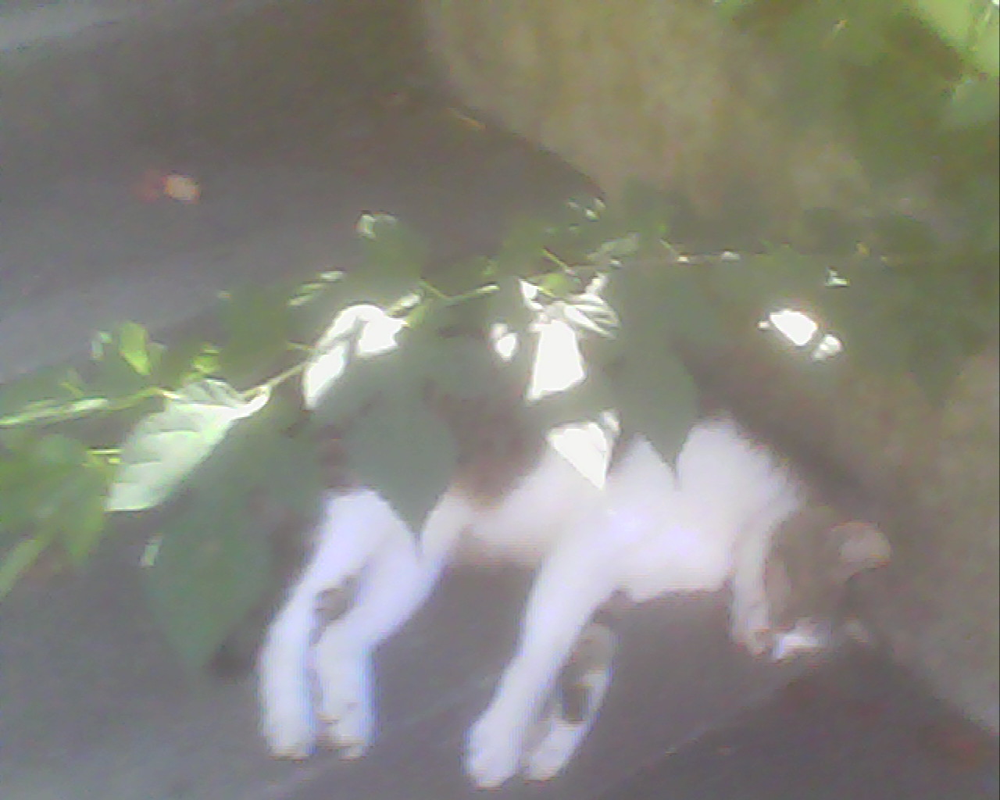
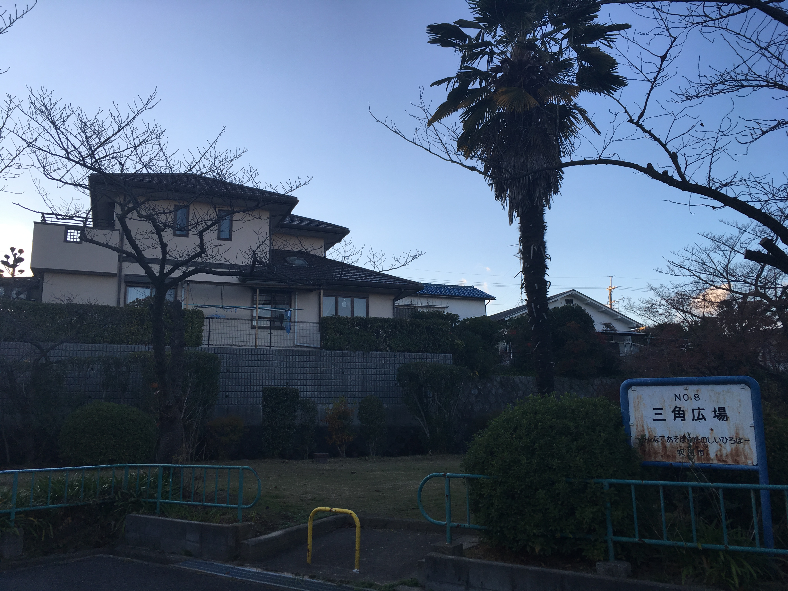
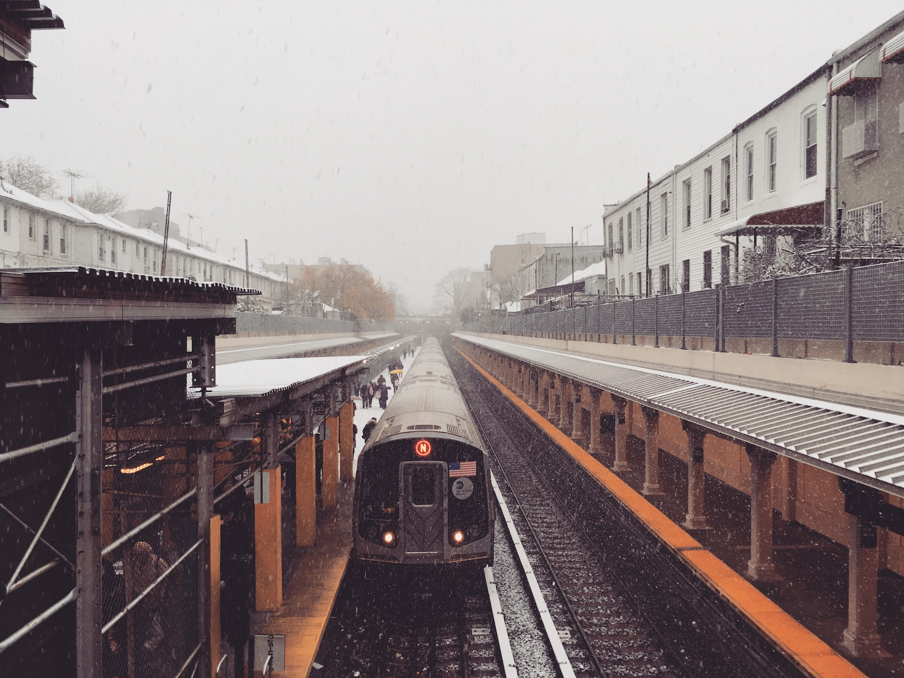

一人称が安定しない。

ということを[milieuの記事](/info/2018-01-27/milieu)を書きながら悩んでいた。高校とかぐらいまでは「俺」で安定していたと思う。大学入ってしばらくした後ぐらいからは「僕」「私」「自分」どれも微妙にハマる感じがしないなあと思いながらその時の気分とか相手によって使い分けているんだけど、バラバラというのもどうにも気持ち悪い。

そうなると無意識に文章の中で出来るだけ一人称を使わないようになる。

<!--more-->

ちょうどその記事を書き始めた頃はNYで、ポストコロニアルスタディーズとかフェミニズムとかをベースにした技術の批評理論の授業で死ぬほどディスカッションをしていた頃で、英語とかの言語だと3人称をジェンダーニュートラルな表現とかを知った頃だった（最近だとhe she 以外にxeとかzeとかを使ったりする。実際に使われてた場面は見なかったけど）。

ディスカッションとか、自分について話す場面で一人称の選択肢がそもそもIしか無いのは気楽だなあと思ったりしつつも、内容には全然参加できてなくて結構凹んでもいた。

毎週の課題になる読み物がネイティブのみんなでさえ「難しい〜」と言っていたほどなので、自分はそれを読みこなしてその上でたどたどしい英語でディスカッションに参加するだけで精一杯だ。なのだが、だんだん英語の方に慣れていくのに従ってうっすら気づき始める。どうやらうまく議論に参加できない根っこは言語的なハードルと別のとこにもあるようだと。

みんな、ディスカッションの中で「アフリカ系の黒人として〜」だったり、「中国で生まれてからアメリカに移った移民として〜」と、とてもはっきりと自分のバックグラウンドを背負った主張をしていた。

いや、知識ではそういう感じなんだろうなとわかっていた。が、目の前の人が実際にディスカッションの中で民族としての自分、についての話を聞くのは、重みがぜんぜん違う。

自分は結局最後まで「日本人としての自分」を語る気にはなれなかったんだけど、なぜそうなのかをずたぼろの英語で説明しているうちに少しづずつわかってきた。

あまり意識してこなかったが、日本でなくても何かへの帰属意識がとにかく薄い。

---

自分の育った神奈川県茅ヶ崎市という場所は、外から見るとサーフィンしてる人がいっぱいいるイメージだけれど、そういう文化に馴染みのない人間には都会でも田舎でもない、ただただ郊外のベッドタウン、なんとも特徴の無い街でしかなかった。

隣の藤沢市で育った美術家の毛利悠子さんが昨年地元で展示をした時のタイトルがそういった印象を表したらしい「グレイ スカイズ」というものだったことにえらく共感してしまった。

そんで、神奈川県というのも「横浜」「川崎」「湘南」「それ以外」みたいな区分けで、神奈川県出身に神奈川出身という名乗り方をするやつはいないというのはよく笑い話ではある。そして湘南に帰属意識のない人は神奈川に帰属意識も置けないのである。

ではもっと広げて日本人としての自覚があるかというと、よく知らないが1/16ぐらいヨーロッパの血が入ってるという話をぼんやり聞かされているので胸を張って日本人です！！というには若干気も引ける。しかも正確にはイギリスとオランダの1/32ずつだとか。なにそれ。

そうして冒頭の話にも戻るわけだけど、ジェンダーはジェンダーで、自分の体が少なくとも男らしい男ではないのは小学生の体育の授業で50m走を11秒で走った頃からずっと思っている。けれど別に女になりたいわけでは全然ない。

男らしさを強要される状況にはしんどくなるけど、マイノリティだと声を上げるには忍びないし、だからこそ微妙に生きづらい。

---

それでも、そういう話を気にせずにやってこれたのは自分の選んだ場所がある意味当たりだったからというのもある。

通っていた高校のコースは「普通科・個性化コース」というちょっとそれ矛盾してるだろ、という名前だった。

実際はただの授業が選べる単位制の高校だったのだけど、県立には珍しく後期入学だったり、外国人入学もあったりで、別の高校を辞めた同い年が2コ下の代に入学して、1コ下の代と一緒に卒業みたいなことも平気であった。

部活じゃない有志団体が毎年山のようにできては解散していく。とにかく自主性が高い。進路も、成績が良くてもやりたい事があるので専門学校に進学する人もいっぱいいる。でも東大に入る人も普通にいる。

これは高校の頃使っていたトイデジカメに収まっていた猫の写真

不思議なもので、コミュニティの中のある属性がある一定以上多様になると、細かい違いはどうでもよくなるのだ。本当にどうでもいい。 年齢がある程度バラければ細かい年齢差はどうでもよくなる。人種も、ジェンダーも、考え方でもいいけど、特別ななにかが必要なわけじゃなくて、いればそれでいい。

だからSFPCにいても、皆がいろんなバックグラウンドを背負って生きているとはいえ、背負うようなものがない自分みたいな人もその中に加わっていられる。

藝大が最後の秘境だの何だの言われているのも、そうといえばそうだ。だけどあれは美大とかが「変人がたくさんいる」というよりはその中にいるうちに「普通の人間など存在しない」という形で下から足場を解体されていくところこそ本質があるのだと俺は思ったりする。

…一方そういう環境に慣れすぎたおかげで、卒業してからはアーティストレッテルと藝大レッテルの予想してた以上の強さに軽く打ちのめされたのはmilieuの記事で書いたとおり。

---

NY留学も終わりの時期が近づいてきたころ、何人かの人に「日本に帰りたい？帰りたくない？」と訊かれた。

結構答えに困ったというか、何人かには「どっちでもない」と答えた。

別に、気持ち的にはNYでも暮らしていけると思った。多分、精神的には日本よりも安心できたと思う。けれど現実的にはビザがないから90日でわたしは退去しなければいけないし、生活費も奨学金がなければ生活していけない。

東京から福岡に来るときも、まあ別にどこでも暮らしていけるだろうと思っていたけれど、実際は大変だった。

3年前に山口に2ヶ月インターンをしに行ったとき、2年前に福岡に引っ越した時も、NYに引っ越した時も、3日も経てば2年前ぐらいからここで暮らしていたような不思議な気持ちになった。

山口での2ヶ月とNYでの3ヶ月は、いわば借りぐらしの状態だ。NYではひと月ごとに住む家を変えていた。しかもぜんぶ人の家を間借りすることを初めてしたので、住んでいるんだけれどこの場所は自分の場所ではない、という感覚がいつもあった。

そうして住民票の住所である福岡に戻ってきた今、自分はここに住んで、所属している自覚があるか考えてみると、やっぱりグレーな居場所であった実家とあまり変わらず、住んでいる土地の上に表面的に乗っかって、3mm浮いたような状態で常に移動しているような気分がする。

---

NYから帰ってきてから2週間後、大阪の千里にたまたま用事ができたので行ってきた。千里は母親の実家があった場所で、昔から年何回か通っていた。
あった、というのはちょうど一昨年売却したのだ。家の整理には立ち会ったのだけど、売却直前の最後の片付けには予定が詰まりすぎてて行けず、そのまま訪れる用事も当然無くなってしまったので一度も来ていなかった。

前泊するついでに早めに千里に向かって、家のあった場所まで行ってみた。あの家に駅から歩いて一人で行くことを今までしたことがそういえば無かったな、と思いながら、電池が切れそうな携帯の地図を頼ってどうにかたどり着いた。全然知らない道ばかりだった。適当に歩いてりゃ知ってる道に出るだろうとか思ってたけど、電話帳の祖父の番号に住所が入ってなかったら全然無理だった。

新しい家が売出し中になってて、写真を撮ろうかとも思ったけど、工事の車か何かがちょうど止まっていて人がいたのでどうにもはばかられて、そのまま近所を散歩していた。

家の周りの景色も覚えているような気もしたけど、多分いろんなものが少しずつ建て変わっていて微妙に見慣れない、パラレルワールドを歩いているような気分だった。

これはそのへんで撮った異常な寂れ方をした公園

なんだか落ち着いたカフェがあったのでそこでしばらく紅茶を飲みながら進んでいないmilieuの記事をちょっと書き進めたりした。花屋とカフェが一緒になっているところで、平日の夕方で客は自分しかおらず、店員二人が花の手入れをしながら喋っているだけの落ち着いた空間だった。歩いていける距離なのにこれまで一度も来たことがなかったけど、もう一度くる事は多分ないだろうなあ、と思ったりした。この街も知らないことばかりだ。

カフェを出て、もう一度だけ家の前に寄って写真を撮って、その場を後にしてホテルまで歩いていった。

---

母の実家のあった場所はいわゆる千里ニュータウンのちょっと外れた場所で、ほとんどその近辺しか歩いたことが無かったので、千里が団地のある場所だという認識がそんなになかった。

ホテルまで歩く道中ではじめてニュータウンの団地を横目に歩くことになり、ああここはちゃんとニュータウンだったんだという実感がいまさら湧いた。一年前に訪れた[ナム・ジュン・パイクアートセンター](/blog/2017-12-27/njp-artcenter/)の周りも似たような団地の景色で、大阪万博という日本のニュー・メディアアートが始まった土地とのつながりをぼんやりと感じたりした。

ちょうどホテルについた時、milieuに千里ニュータウンについて書いた記事が上がっていた。

**[私の故郷はニュータウン | milieu](http://milieu.ink/column/newtown)**

<http://milieu.ink/column/newtown>

ちょうど撮った写真を母親に送ったらその記事も読んだらしく、千里の"大阪なんだけど大阪じゃない"というあたりとか、いろいろと共感するものがあったらしい。

祖父も祖母の帰省する家がなくて自分の家はニュータウンなので自分の拠点がない感じは母にもあったり、そもそも祖父も祖母も住処を点々としていたので家族揃ってそういう感じらしい、という話を同時に聞かされた。

そう言われて僕の何が変わるわけではないとはいえ、なんだか納得してしまえるのは人間のずるいところだと思う。

---

ジャンル横断とか、境界領域とか、マルチスキルだとか聞こえは良いけど、蓋を開けるとただの器用貧乏ということにもなりかねない。

時間は有限なので全てを広く深く掘り下げるのは基本的に無理なのだ。

仮に、実際深く掘り下げられていたとしても、幅広く活動をしていればそれぞれのコミュニティから見た時に「あいつは100％こっち側にコミットしていない」と皆から思われることになる。それは、身軽に色んな所を行き来できるけどそれぞれと深く関わることはあんまりない。グレーな生き方だ。

まあでも、元々自分にまつわるいろんな事がグレーだったのだし、それが一番性に合っているのだと思えばあまり気にならなくなってきた。だから、もっと中途半端になりたいね。グレーであることと透明であることは違うのだと思う。

---

昨日ははじめて福岡に雪が降った。雪というか雪混じりの雨なのかなんなのか、はっきりしないグレーな天気だった。

11月、NYから帰る少し前にもいきなり大雪が降った。この冬は初雪を2回も見たことになる。

