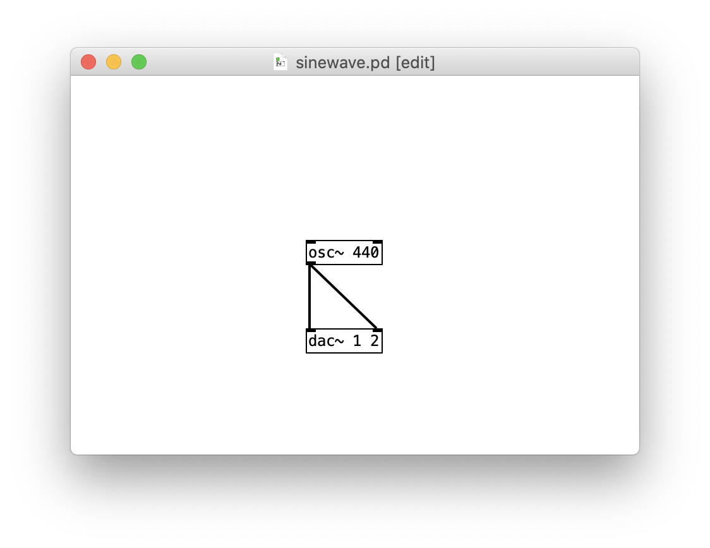
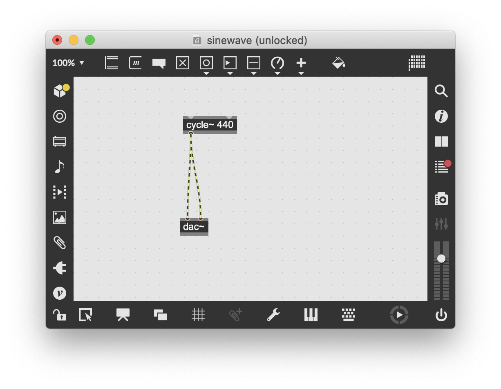
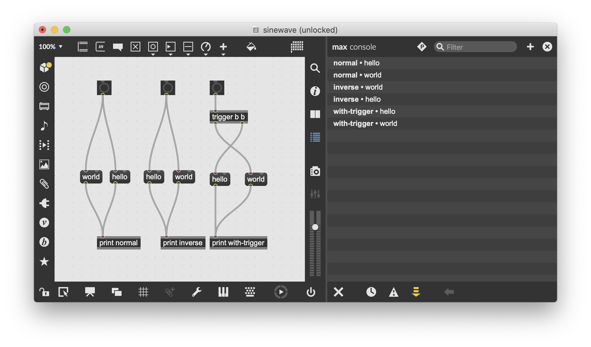
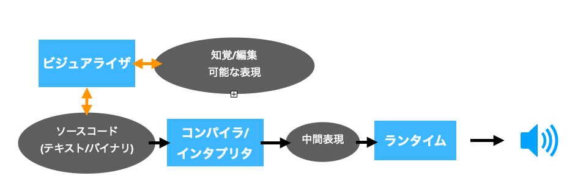

この記事は続き物でおおよそ週間ペースを目指しています。

1. [言語仕様(本記事)](https://matsuuratomoya.com/blog/2021-02-12/what-is-soundprogramming1/)
2. [データとプログラムの境目](https://matsuuratomoya.com/blog/2021-02-12/what-is-soundprogramming2/)

松浦知也です。ここ2年ぐらい音楽のための新しいプログラミング言語mimiumを開発しています。

https://mimium.org/ja


最近この自分で作った言語を人に説明する機会がちょこちょこ増えてきたのですが、その度に「既存の音楽プログラミング言語と比べてどこが新しいのか？」という話にたどり着く前に「そもそも音楽をプログラミングで作るってどういうこと？」みたいな疑問に対する解説をしているうちに話が続かなくなってしまうようなケースが増えてきまして、なんかそういう超初歩的な解説があればいいのになあと思っています。

プログラミングで音楽を作る例としては例えば最近だとAlgoraveに代表されるように、ライブコーディングというリアルタイムでコードを書き換えながら即興で音楽を構築していくスタイルがあったりします。



さて一方で、Cycling'74 Maxなどを用いたクラシカルな（という言い方もどうかと思いますが）音楽プログラミングのやり方としては半自動的に音楽を生成するプログラムを作ってランダムにパターンを展開させていく（そして場合によっては気に入ったパターンだけを抜き出して録音したりする）ようなやり方もあります。

[音楽の自動生成と20世紀以降の作曲の課題 - Akihiko Matsumoto Blog]( https://akihikomatsumoto.com/blog/?p=2396)



音楽プログラミングって何よ？という説明をするにあたって、この2者を同じテーブルに上げてしまってよいものだろうか？ということを考えてしまいます。どちらも確かにプログラミングを用いて音楽を生成していることは間違いないのですが、両者において最終的に音を出すまでの行為はあまりにも別物です。しかしこの2つを分析比較するための下地となる共通の語彙とか概念が少ない。

こうした音楽プログラミング言語に対する美学的な分析としては、各言語の開発者が書いた論文のDiscussionの項では行われているものの、基本的には個別の言語ごとの分析にとどまっているものがほとんどです。

数少ない例として多摩美術大学の久保田はライブコーディングを中心とした音楽プログラミングという行為が人間とコンピューターの共同行為としてどういう可能性を持つのか、短いコードを書き換え続けることによるプログラミングに通底する美しく構築的であるべきというイデオロギーの中における反制度的な役割、といった美学的な観点、あるいはアクティビズムとしてのプログラミングという観点での考察をいくつも行なっています。

<iframe style="width:120px;height:240px;" marginwidth="0" marginheight="0" scrolling="no" frameborder="0" src="//rcm-fe.amazon-adsystem.com/e/cm?lt1=_blank&bc1=000000&IS2=1&bg1=FFFFFF&fc1=000000&lc1=0000FF&t=matsuuratomoy-22&language=ja_JP&o=9&p=8&l=as4&m=amazon&f=ifr&ref=as_ss_li_til&asins=4802510500&linkId=0664a7c505dbe32de67cbafddd8f11b6"></iframe>

https://p-code-magazine.github.io/magazine

技術的な観点でのサーベイとしては1990年代にNyquistという言語を開発し現在も引き続きコンピュータ音楽の研究を行っているRoger B. Dannenbergによる"Languages for Computer Music"(2018)があります。

こちらは簡単に訳したスライドを昔作ったので興味があれば。

<script async class="speakerdeck-embed" data-id="3271dc4777f7429799d78dc0f2df88ae" data-ratio="1.77777777777778" src="//speakerdeck.com/assets/embed.js"></script>

もう1つ詳しい例としてはLCという言語を開発したNishinoらによる["Computer Music Languages and Systems: The Synergy Between Technology and Creativity",pp 1-49 in Handbook of Digital Games and Entertainment Technologies(2016),Hiroki Nishino and Ryohei Nakatsu](https://link.springer.com/referenceworkentry/10.1007/978-981-4560-52-8_19-2)があります。コンピュータを用いた音楽生成の黎明期の話や、MIDIなどを用いる言語などDannenbergよりも広い範囲をカバーしています。

この2つの論文は主に開発者視点での歴史の振り返りであり、実装だけでなく言語のデザインがどうあるべきかについても触れてはいますが、例えばその言語がどういった音楽を生み出したか、文化にどういった影響を与えたかまでの考察には踏み込んでいません。

本稿でそういうところまで議論できれば理想なのですが、とりあえずはそういう議論の下敷きとするための「音楽プログラミング言語」という概念の整理を自分なりにやってみたいと思います。

はじめのとっかかりとして、音楽プログラミング言語をapplicationを中心にするのではなく、言語設計者、開発者の視点から見ていき、言語仕様、インタプリタ、ランタイムといった構成要素に分解して代表的な言語どうしの紹介兼比較を行います。

きちんと書き進められたら、歴史の中でも個人的に議論のしがいがある2つの言語、PuredataとSuperColliderについて詳しく取り上げたいと考えています。

## 「音楽プログラミング言語」とは”どこを”指しているのか

さて、とくに論文とかで用語の用法を明示せず、日常会話の中で音楽に限らずプログラミング言語、という用語が使われた時、そこには3種類の要素が含まれています。

1. 言語そのもの
2. 言語を解釈するプログラム（コンパイラ/インタプリタ）
3. 言語を実行するプログラム（ランタイム）

もう少し堅い言い方をするとこんな感じです。

1. 言語を定義する文法規則
2. 1.の規則に則って記述されたテキストデータをコンピュータが理解できる形に変換するプログラム
3. 2.で出力されたデータをインプットとして受け取り実行するプログラム

汎用プログラミング言語では同じ名前の言語だとしても複数の言語仕様やコンパイラがある例は少なくありません。たとえば、C言語の例を上げると、言語の文法規則はC89やC99、C11といった言語の振る舞いを決める仕様がANSIやISOによって決められています。そしてそれを実装したコンパイラとしてはオープンソースのgcc(GNU Compielr Collection)やclang、intelのiccなどいくつもの種類があります。その中では独自で拡張された構文を受け付けるものも含まれています。

一方で、音楽に用いられるプログラミング言語では、ほとんどの場合この3つがセットになった状態ではじめて1つの音楽プログラミング言語、という形で配布/利用されています。

今回は音楽プログラミング言語という概念を議論する理由の難しさのひとつはここにあるのではないかと仮定して実例を眺めてみます。

### 言語仕様

たとえば[SuperCollider](https://supercollider.github.io/)という言語のWebページの一番最初にあるサンプルを見てみましょう。

```smalltalk
{
        var x = SinOsc.ar(MouseX.kr(1, 100));
        SinOsc.ar(300 * x + 800, 0, 0.1)
        +
        PinkNoise.ar(0.1 * x + 0.1)
}.play;
```

これはプログラミングに慣れている人でもはじめてこの言語を知った人にはまあまあギョッとする文法だったりしますね。これが何を意味しているかを完全に理解する必要はありません。

たとえば中括弧`{}`で囲まれた文はSuperColliderではオブジェクトというデータ構造を表します。オブジェクトに対して、ドット`.`を挟み特定のシンボルを記述するとオブジェクトに紐づけられた手続き（メソッド）を実行できるという仕様があったりします。他にも、文の終わりにはセミコロンが必要、とか変数を宣言するにはvarに続けて半角スペースを挟み変数の名前を置いて＝で初期値を代入する……とか、そういうのも言語仕様です。

たとえばこのセミコロンが文末に付いてなければいけない、などの文法を仕様として定義するにはBNF（バッカス・ナウア記法）のような文法を定義するための記法が存在します。

実際、SuperColliderはBisonというコンパイラ・コンパイラ（BNF風のテキストを読み込ませると、テキストをコンピュータ上で利用しやすい形式に変換してくれるパーサプログラムをC言語などの形式で出力してくれるもの、パーサジェネレータとも）を利用しているので、そのソースコードから文法規則を眺めることができます[^bisonusers]。

https://github.com/supercollider/supercollider/blob/develop/lang/LangSource/Bison/lang11d

[^bisonusers]: 他にBisonを利用している音楽系の言語としてはFaust(https://github.com/grame-cncm/faust/blob/master-dev/compiler/parser/faustparser.y)や拙作mimium(https://github.com/mimium-org/mimium/blob/dev/src/compiler/mimium.yy)などがあります。興味のある人は眺めて見てください。 ↩

### 非テキスト言語

さて、言語のソースコードがテキスト形式として表現される場合はBNFのような仕様の定義がまだしやすいのです。しかし音楽プログラミング言語にはビジュアルプログラミング言語という、ソースコードの形式がテキストではなく、たとえばブロックを画面上でつなぎ合わせて表現する言語も多くあります。

代表的な例としては[PureData](http://puredata.info/downloads)や[Max](https://cycling74.com/products/max/)が存在します。

この場合"言語仕様"が何を指すかはもう少し複雑です。なぜなら、ビジュアルプログラミング言語には**同じソースコードを表していても、それをコンピューター上で保存しておくための内部表現が複数存在する**ケースもあるからです。

再び具体例を挙げてみてみましょう。たとえば、Puredataという言語で440Hzのサイン波を出力するためのパッチ（PuredataやMaxにおける、いわゆるソースコードのこと）はこちらの画面のように表示されます。





さて、このファイルをsinwave.pdという名前で保存して、これをメモ帳などの適当なテキストエディタで開くと次のようなテキストデータが現れます。

```basic
#N canvas 0 23 450 300 12;
#X obj 186 130 osc~ 440;
#X obj 186 200 dac~ 1 2;
#X connect 0 0 1 0;
#X connect 0 0 1 1;
```

ざっくり読むと、1行ごとにオブジェクトの定義やその配置された座標、どのオブジェクトのどのinlet/outletが接続されているかの記述がなされていることがなんとなくわかります。つまり、実際のプログラムではこのテキストデータを1行ごとに読み込んでいくように処理することになりますね。

さて、Max 8で先ほどのPdの例と同じようなものを作りました。



こちらを同様にsinewave.maxpatという名前で保存して、テキストデータとして開いてみるとこのようになります。

```json
{
	"patcher" : 	{
		"fileversion" : 1,
		"appversion" : 		{
			"major" : 8,
			"minor" : 1,
			"revision" : 5,
			"architecture" : "x64",
			"modernui" : 1
		}
,
		"classnamespace" : "box",
		"rect" : [ 35.0, 458.0, 640.0, 480.0 ],
		"bglocked" : 0,
		"openinpresentation" : 0,
		"default_fontsize" : 12.0,
		"default_fontface" : 0,
		"default_fontname" : "Arial",
		"gridonopen" : 1,
		"gridsize" : [ 15.0, 15.0 ],
		"gridsnaponopen" : 1,
		"objectsnaponopen" : 1,
		"statusbarvisible" : 2,
		"toolbarvisible" : 1,
		"lefttoolbarpinned" : 0,
		"toptoolbarpinned" : 0,
		"righttoolbarpinned" : 0,
		"bottomtoolbarpinned" : 0,
		"toolbars_unpinned_last_save" : 0,
		"tallnewobj" : 0,
		"boxanimatetime" : 200,
		"enablehscroll" : 1,
		"enablevscroll" : 1,
		"devicewidth" : 0.0,
		"description" : "",
		"digest" : "",
		"tags" : "",
		"style" : "",
		"subpatcher_template" : "",
		"assistshowspatchername" : 0,
		"boxes" : [ 			{
				"box" : 				{
					"id" : "obj-4",
					"maxclass" : "newobj",
					"numinlets" : 2,
					"numoutlets" : 0,
					"patching_rect" : [ 293.0, 225.0, 35.0, 22.0 ],
					"text" : "dac~"
				}

			}
, 			{
				"box" : 				{
					"id" : "obj-3",
					"maxclass" : "newobj",
					"numinlets" : 2,
					"numoutlets" : 1,
					"outlettype" : [ "signal" ],
					"patching_rect" : [ 305.0, 175.0, 66.0, 22.0 ],
					"text" : "cycle~ 440"
				}

			}
 ],
		"lines" : [ 			{
				"patchline" : 				{
					"destination" : [ "obj-4", 1 ],
					"order" : 0,
					"source" : [ "obj-3", 0 ]
				}

			}
, 			{
				"patchline" : 				{
					"destination" : [ "obj-4", 0 ],
					"order" : 1,
					"source" : [ "obj-3", 0 ]
				}

			}
 ],
		"dependency_cache" : [  ],
		"autosave" : 0
	}

}
```

わかる人はオッ、と思ったはずですが、これはJavascriptという汎用言語の中で使われる、JSONという様々なデータ構造をテキスト形式で簡便に書けるファイルフォーマットです。かなり汎用性が高いフォーマットで読み込み処理を書くのも比較的簡単であるため、javascript以外の言語で書かれたアプリケーションでもよく使われています。

さて、実はMaxはバージョン4までは先程のPuredataで挙げたテキストフォーマットと似た形式の.pat形式というフォーマットを使用しており、一定の相互互換性もありました。これはもともとMaxの祖先となるPatcherというソフトウェアを開発したMiller Packetteという人物がPuredataの開発者だから、という歴史的な理由が存在します。

なので、実はPuredataのパッチ保存時の拡張子の選択肢に.patも一応残っていますし、Max4のサンプルから引っ張ってきた.pat形式のサンプルパッチはMax8でもいまだに読み込めます。（そして、Pdのファイルを.patで保存してMax8で読み込むと謎のクラッシュを発生させるとかもできます。）

さらに、Maxの場合オブジェクトをマウスドラッグで選択し、右クリックメニューから「Copy Compressed」というのを選ぶと、クリップボードに以下のようなテキストがコピーされ、Maxのファイルメニューから「Open From Clipboard」を選択することでこれを開くこともできます。Cyclingのフォーラムではもっぱらこの形式でのシェアが多い印象です。

```html
<pre><code>
----------begin_max5_patcher----------
310.3ocqRsraCCBD7L7Uf3raD9Qbi5uRUUEAiRIxFr.bpihR91KrXm31nppp
1KKZGF1YG18DFQ2ZFkNJ4IxyDD5DFg.nH.ZJGQ63ihVtCnQ0x2Ma2SyRW4ki
d.tgKtLCpZ.n.sGplwzCcJcqzCEoXBrm6Euoz6d0JE9TSjWxVwxH4OVFOJWG
iEEqXjWtUHyfetRrH3YLNFx9aNPbTzJuPppXyWkzwerWl5MpSsSyaoW6kEFs
72azpn2p1Di00+fOyW3SfBsUo+5fCTIh+Yy6LCVwrEl5UxMgZjNuRy8JidAm
vfijekiw1Hse++8+svr6E99O.de+Ao0M8ZPyvbduAnuICRU5TZNjZkGTy7WC
HbaXr3CyjAKzmzw5zFKsyDDVOnlzN31fjvNjl2Ic87jwfUM7Y7G.G6Kwt.
-----------end_max5_patcher-----------
</code></pre>
```

さて、本題に戻ると、Maxは複数の内部形式を読み込んでパッチとして表示することができるのでした。それでは**MaxやPuredataにおける言語仕様**とは具体的になんのことを指すのでしょう？

中身のデータフォーマットのことでしょうか？Max4から5では中身のデータフォーマットは大きく変わっていますが、どちらの形式のデータでも読み込んだときに視覚的に現れるオブジェクト同士の結線から、我々はその2つが挙動をするプログラムだということを理解できるでしょう。Maxというプログラムが異なるデータフォーマットを読み込んでいたとしても、最終的に内部のデータ表現が同じになるように変換プログラムが動いてくれていれば同じ言語として振る舞える、と言えます。

ひとまず、言語そのものがコンピュータ上に保存されている時のデータフォーマットそのものが言語仕様のすべてではない、ということは言えるでしょう。

### 暗黙的言語仕様

逆に、そうしたデータフォーマットには表れないところにある言語仕様も存在します。

たとえば、ある1つのオブジェクトのアウトレットから複数のオブジェクトへ結線しメッセージを送るとき、**Puredataでは繋いだ順番に**メッセージが送られるようになっており、**Maxでは送り先のオブジェクトが右側にあるものから左側にあるものの順で**メッセージが送られます[^max_order]。

[^max_order]: ただそういえば、Maxの配置が意味に影響を与える仕様がいつのバージョンから存在するのかは僕も知りません。多分5以降な気はするのですが、古めのMaxに詳しい方教えてください



どちらも、メッセージが送られる順番を明示したい時にはtriggerオブジェクトという専用のオブジェクトを使用すれば良いのですが、そうでない時のデフォルトの挙動が違うのです。

Maxでは**オブジェクトの空間的配置がプログラムの挙動に影響を与えます**。これは2次元平面上にオブジェクトを置いていくことでプログラムをする上で、自然にオブジェクトの位置をユーザーに整理させていくことを促すデザインだと解釈できます。

一方でPuredataは、**オブジェクト同士の接続の関係性だけがプログラムの意味として機能するべき**部分だとする立場といえます。そもそもメッセージを送る順番によってプログラムの意味や挙動が変わってしまうような場合は必ずtriggerオブジェクトを使うべきで、そうでなく**メッセージを送る順番が関係ない時は、順番が関係ないことを明示する意味としてtriggerを挟まず複数のメッセージを送るような接続をすれば良い**という仕様だと解釈できます[^puredata-spec]。例えば、複数のオシレータの周波数を同時に変えるだけであれば、どの順番でやっても処理が変わりません。

[^puredata-spec]: もちろんこれは僕のかなり好意的な解釈です。実際には繋いだ順番にテキストフォーマット上のconnect xxxの行が追加されていき、プログラム内ではそれを上から順に読み込んでいるのでそういう挙動になっているだけというのが関の山でしょう。本当に接続順によらない処理であることをデザインとして徹底するならばconnectのある行をシャッフルして読み出すとか、そのくらいはやってもよいかもしれません。

この違いをもう少し専門的な用語で説明すると、オブジェクトの空間的配置をいう要素を**Syntax**として見るか**Semantics**として考えるか、ということができます。

この2つの用語を厳密にかつわかりやすく説明できる自信がないのでまた例を挙げてみます。例えば、javascriptで入力を2乗して返す関数powerを定義すると次のようになります。

```javascript
function power(input){
  return input*input;
}
```

このソースコードにおいて`function`という語はJavaScriptの中であらかじめ定められている用語（いわゆる予約語）です。

たとえばJavaScriptの言語仕様がある日、「**この予約語`function`を`fn`に変える**」となったらどうでしょうか。困りはするものの、エディタなどでテキスト一括置換を使って`function`を`fn`に入れ替えれば済むことです。

一方で、ある日「**演算子`*`は整数同士の掛け算を表すもので、小数点同士の掛け算を表すには`*.`という演算子を使用しなければエラーにしなければなりません**」という仕様変更の場合はどうでしょう？[^ocaml]プログラムを修正しようと思ったら実際にその関数が小数点の計算に使われているのか整数の計算に使われているのかを判断して置換しなければいけないので、先ほどのように一括置換というわけにはいきません。

[^ocaml]: この整数と小数点の演算子を分ける仕様実際OCamlなどのML系言語で実際に使われています。もっともその目的はひとつの演算子で不動小数点と整数と異なる種類の演算を賄おうとすると実装が複雑になる（型によって演算子の意味を変えるオーバーローディングが必要になる）からという現実的な都合の方が大きく、JavaScriptのように動的型付け言語で導入するメリットはあんまりないと思います。

前者のように、プログラムの意味論そのものに影響を与えない言語仕様をSyntax、後者のように意味論に影響を与えるものがSemanticsと呼びます。Syntaxも、たとえ意味論に影響は与えなくとも、予約語が短ければタイピングが早くなってプログラムが早く書けるかもしれない、というように言語の使い勝手を変えることはもちろんあります。

改めて音楽プログラムにおける比較に戻れば、Puredataではオブジェクトの空間的位置はあくまでパッチ全体を見やすくしたりするためには意味があるものの、プログラムの挙動には影響を与えないSyntaxとしての要素です。一方でMaxではオブジェクトの位置は実行処理の順番に影響するのでSemanticsとしての要素も含んでいる、という整理ができるわけです。

---

閑話休題。パッと見の仕様としてはMaxのように空間的配置が順番を制御してくれる方がプログラムは見やすくなってよさそう、と思う人が多い気はしますし、実際Pdの挙動は知らないと結構戸惑うのですが、言語実装者の視点としては筋がいいのはPuredataだと思っています。

それは**並行性**（concurrency）の問題です[^concurrency]。

[^concurrency]: 当初並列性と書いてましたが間違いです。t-sinさんありがとうございます。ちなみに並列性といった場合はParallelismのことを指し、実際に別のタスクをコアを分けて作業する状態を指す一方、Concurrencyの場合はOSのタスクスケジューリングのように1つのCPUを時間を細切れに分けて少しづつ進めていくようなケースも含みます。つまりPdでtriggerを使わない場合はConcurrentな処理だと思って扱う必要があるけど、実際には繋いだ順という解釈もできるよという感じです。

たとえば今後Pdで超巨大なアプリケーションを作ることが多くなってきた時、マルチコアに対応した処理をできるようにしたい、と思ったらtriggerで順番が制御されているところはこれまで通り順番に処理して、1つのオブジェクトから複数のメッセージが出ている部分はそれぞれ別のスレッドでバラバラに処理しても一応はOKなはずです。

一方で、Maxで同じようなマルチコア対応をしたくなった場合、配置が処理順に影響することが前提の作りになっているので、どの部分が処理を並行化しても悪影響が出ないかを解析するのは限界があるしかなり大変です。

実際、Pdはシングルスレッドな作りですし、Maxはメッセージ/音声信号/グラフィックをスレッド分けして非同期で動作させていますがそれ以上のマルチコア対応はpoly~オブジェクトのようにパッチを複数インスタンス同時に立ち上げる専用オブジェクトの中でしか扱うことはできず、メッセージ処理そのものをマルチコアで処理することはできません。

……という意味で配置が処理順に影響するMaxの仕様はまあまあ悪手だとは思っているんですが、そんなことよりPdのグラフィック処理がtclで書かれてる方がよっぽど悪手だよ！とかメッセージをマルチコアで処理するほど重たい処理にMax使わねえよ、みたいな理由で現実的に問題になるかどうかとは別の話です。

---

さて、というわけで我々は音楽言語における言語仕様とはなんだ、という話をしていたのでした。

改めて最初の言語仕様/コンパイラ/ランタイムの関係性を図示すると以下のような画像になります。


MaxやPd、SuperColliderでは概ねインタプリタがソースを読み込み内部的に保持するデータはどのオブジェクトがどう接続されているのか、というグラフ情報です。これは音楽言語の実装としてはスタンダードなものですが、もっと抽象度をマシン側に落としていく実装もあります。

今後詳しく触れると思いますが、たとえばChucKという言語は信号処理以外の処理に関しては仮想機械（Virtual Machine,VM）に対する命令列という形で保持しますし、Extemporeや僕の開発しているmimiumではメモリ上で機械語にコンパイルしたものを利用しています。

さて、しかし、ソースコードのデータフォーマットそのものは言語仕様の本質ではどうやらなさそうだということがMaxの4->5の例などから分かります。つまり非テキスト言語では図をさらに以下のように書き加える形があります。



保存されているソースコードのデータを何かしらの形で人間が認識可能な形でディスプレイなどに表示して、さらにマウスやキーボードで編集もできる、という構造になっているので双方向の矢印にしています。テキストの言語だってUTF-8の形式で保存されているバイナリデータをデコードしてディスプレイに表示し、キーボード操作でそのデータ列を書き換えられるようになっている、と言えば構造としては同じですね。

ビジュアル言語の場合は保存されているデータフォーマットの場合はjsonのようにそれ自体を人間がテキスト編集するには辛いフォーマットであることがほとんどですが、これを普通のプログラムのようにヒューマンリーダブルなものとして保存するようなやり方もないわけではありません。

そうした手法はBidirectional-Evaluation（双方向評価）と呼ばれているもので、たとえば橋本麦さんのglispでは表示されたグラフィックをマウスでドラッグしてソースコードの数値を変更できたりします。

https://glisp.app/



グラフィック系のプログラミング環境では[Sketch-n-Sketch](https://ravichugh.github.io/sketch-n-sketch/)などが代表例としていくつかの例がありますが、音楽での応用例はほとんどありません。理由としては、グラフィックにおいてはプログラムの出力＝再編集のUIという図式が成り立っています。一方音楽でこれをやろうとすると、プログラムの出力そのものは音なので、編集のためのUIの解釈機/ビジュアライザを別立てで実装しなくてはならないコストがでかく大変、ということだと思っています。

## 次回予告

若干話がそれたまま力尽きてきたので今回はここまでで終了とします。

次回以降もこの言語仕様/コンパイラ/ランタイムという図式で他の言語についても考察を深めて行きたいと思います。

簡単に予告すると歴史的な経緯でCPUでなく専用ハードウェアに命令を送るという形式を取っていたこととUGenモデルが人間の思考方法的にちょうど良い落とし所だったのではないか、という議論と、その上でじゃあ音楽プログラミング言語において表現の可能性を広げたり自由度を確保したままラーニングカーブを緩やかにできるのだろうか…という議論につなげていければいいな、と思っています。

## 追記（2021-02-20）

Maxの実行順について今井先生からISPW(Max/FTSのころ)にはなってたはずという情報をいただきました。



これを聞いて改めてMiller Pucketteの書いた[Max at Seventeen(Maxの17年)](http://www.shintaroimai.com/MaxAtSeventeen.html)という文章を読み返してみたらきちんと言及している部分がありました。

処理順を定める、定めないそれぞれにメリットがあるとし、定めない側のメリットについては結局触れずに終わってしまっているので、これが並行性のことなのかどうかまではよく分かりません。しかし並行性そのものの重要性自体は文章前半でも大きく取り上げているため多分そうなんじゃないかなあと思っています。

> 一方で、ファンアウト（出力）の接続では深刻な問題が生じ、完全に適切な解決策はないように思える。ファンアウトされた複数のトリガが起動する順番は、全体の結果に影響を与える可能性がある。ファンアウトされたメッセージに明示的な実行順序が与えられていない限り、ファンアウトは予期せぬ振る舞いをする確率が高くなる。この問題への一つの解決策は、Cycling74 Maxで実装されている、画面上の位置に従って各個のアウトレットにつながれた受信ボックスを並べ替えることだ。これは理論的には、画面上の見た目から直接パッチがどのように動くのかが分かる利点がある。しかし画面上のボックスを単に動かす（たとえば片付ける）ことでパッチの振る舞いが変わってしまい得るのが欠点である。（さらに、send/receiveのような、ローカルでない接続がどんなルールに従うかは不明である。）JmaxとPdは、それぞれに利点と欠点がある別の挙動をとる。最良の解決法は、ファンアウトの実行順が問題になる場合に状況を曖昧にしないよう、triggerオブジェクトをユーザが使うことである。おそらく、いつの日かこうした状況を自動的に検出してユーザに警告を与えるのが、一つの良い方法となるだろう。

> Maxのユーザは、1つのボックスにある複数のアウトレットが右から左の慣習的な順序で出力するのによく驚く。これはボックスの「メイン」インレット（左端のもの）が出力をトリガし、ほかのインレットはほぼいつもボックスの内部状態を設定するためだけに使われるのが理由である。したがって、計算が正しく機能するには、関連するすべてのメッセージが他のインレットに送信された後に、左端のインレットをトリガする必要がある。最初のインレットが「ホット」インレットであることを受け入れるなら、それがメッセージを最後に受信べきであり、単一のオブジェクトが2つ以上のメッセージを提供する場合、右から左の順序が正しいことになる。