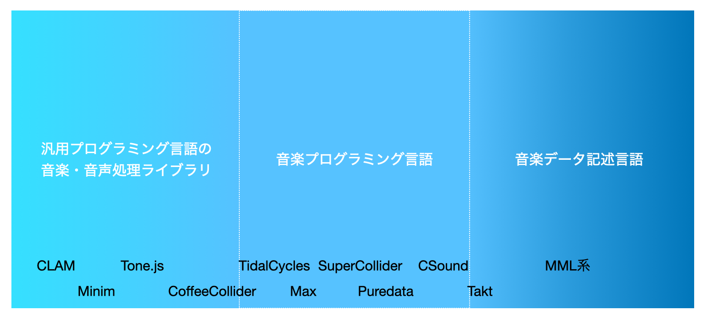

この記事、音楽プログラミング言語って結局なんなのさ?は続き物でおおよそ週間ペースを目指しています。

1. [言語仕様](https://matsuuratomoya.com/blog/2021-02-12/what-is-soundprogramming1/)
2. データとプログラムの境目(本記事)

松浦知也です。ここ2年ぐらい音楽のための新しいプログラミング言語mimiumを開発しています。

https://mimium.org/ja

前回の記事が思ったより反響があってわりと驚きました。

はてブやTwitterに寄せられたコメントを見ていて改めて音楽プログラミング言語という存在の普及度が改めて低いということがよくわかり脳内基準をリセットするいいきっかけになりました。

その中でも「MMLの話かと思ったら違った」というコメントが結構ありましたので、当初と予定を変えて今回はその辺りの話をしていきます。

## 隣接分野と比べる

さて、MMLは音楽プログラミング言語と呼べるのか、という問いから考えることにしましょう。

今回と次回は音楽プログラミング言語とはなんなのかを考える上で「どこまで行ったら音楽プログラミング言語ではないのか」という輪郭を探し出すようなアプローチを取ってみるとします。音楽プログラミング言語を少し引いた目線で見て、「コンピューターにも人間にも解釈可能な音楽を記述するデータ構造」ぐらいの定義で考えてみた場合、そこにはほとんど制御構造や数値の計算機能が存在しないMMLのようなものも含めてよいでしょう。本項ではこのようなプログラミング要素が少ない言語のことを「音楽データ記述言語」と呼ぶことにします[^markuplang]。

[^markuplang]: こうした言語の一般的呼称は定まってないというのが個人的認識ですが、英語だとmusic description languageとかプログラミング言語とHTMLのようなマークアップ言語の関係になぞらえてmusical markup languageと呼ぶこともあります。個人的にはテキストを修飾するという意味でのmarkupという言葉が音楽にはうまくハマらないのでdescriptionの方がしっくり来ます。

加えて、汎用プログラミング言語の中でも音声信号処理や音楽構造を扱えるライブラリ（以下”汎用言語上音楽ライブラリ”）は多々存在していて、そのライブラリを使用しているソースコードも音楽を記述するデータとして見ることができます。最近ポピュラーなのでいうとWebブラウザ上で簡単に音を鳴らせるTone.jsなどがそうですね。

そうして音楽データ記述言語、汎用言語上音楽ライブラリと音楽プログラミング言語の境目がどこにあるのか？というのを考えていくと意外とスッパリ線が引けるわけではなく、グラデーションが存在することがわかってきます。今回はMMLを中心にデータ記述言語に、次回は汎用言語上のライブラリに注目して見ていきます。



## 音楽データ記述言語

### MML(Music Macro Language)

さて、多くのの反応で言及されていたMMLです。

MMLとはざっくりいえば`cdefgab`でドレミファソラシの音階を記述し、`+-`などで半音上げ下げ、`<>`でオクターブの上げ下げ、`-`に続けて数字を記述することで音の長さを指定していくことでメロディを記述できるような記法です。



もっとも、80年代に利用されていたBASICの拡張として存在したものから様々なプラットフォームで統一した規格がされないまま様々な方言や拡張機能が各々の実装として派生していったことから、万能の共通言語というよりも特定のプラットフォームで動作する音楽のための記法をそれぞれ学習する形になります。現代的なプラットフォームではMIDIにタイムスタンプを付けて楽譜相当のものとして扱えるようにしたフォーマットであるSMFとしてエクスポートして、それをハード/ソフトシンセに送って再生するような形式を取るものが多い印象です。

拡張記法の中には`[]`で囲った部分を繰り返し再生できるようなもの、複数の音を同時発音できるようにするもの、特定の記述を予め定義しておいて置換できるマクロ機能など、プログラミング言語的側面を持っているものも多いです。

この辺りの記法の揺れの難しさは先ほどの動画を投稿者であり、Google Chrome上でクリップボードからMMLを再生できる拡張機能を作っていたaikeさんのブログからも伺えます。

**[ブラウザでMMLを演奏するChrome拡張作った - aike’s blog](https://aike.hatenablog.com/entry/20160822)**

面白い使用例としてはNEXONのオンラインゲーム、マビノギでは[音楽スキルを上げるとMMLで演奏ができるようになる](https://mabinogi.nexon.co.jp/community/knowledgeContent.asp?ty=&c1=2&c2=15&lv=&od=2&ix=3066&p=)、みたいなのもあります。

MMLそのものの歴史は僕も世代が外れていることもあって個人的にもまだまだ勉強中なので、詳しい解説はこちらサイトをご参照ください。

**[MMLの成立 - 魔法使いの森](https://www.wizforest.com/OldGood/origin/mml/mml.html)**

### テキスト音楽サクラ

さて、MMLをベースに独自拡張したものの中でも比較的有名なものとしてクジラ飛行机による**テキスト音楽サクラ**があります。

ストトン表記と呼ばれる、MMLにおける`cdefgab`を`ドレミファソラシ`に置き換えるような形で、日本語でMML同様の記述ができるものです。

ただ、ストトン表記の実装が日本語の文字1文字ずつをMMLの文字列に変換する1文字マクロとして定義することで実現されている（たぶん）ため、複数トラックでの演奏など高度なことを行おうと思うとMMLでの表記が必須になります。そのためチュートリアルでも「[ストトン表記を卒業したら、MMLに挑戦しましょう！](http://sakuramml.com/doc/kouza/mml_index.htm)」と書かれていたりするので、MMLに入門する人の敷居を下げるための役割も強いようです。[楽曲をシェアする掲示板](https://sakuramml.com/mmlbbs6/)ではもっぱらMML表記で投稿されています。それにしてもこの掲示板現在も小規模ながら継続して投稿している人たちがいるのはすごい。

ストトン表記という呼び方やその記法自体は当時SonyCSLだった増井俊之によるものと書かれているWebサイトをいくつか見たのですが、作られた時期も2000年頃でほぼほぼテキスト音楽サクラの登場と同時期に見えます

*ストトン表記による楽音生成 増井俊之* http://www.pitecan.com/Sutoton/

ストトン表記という名付け自体も考えてみるとなかなか独特です。増井による最初の紹介文の

> ストトン表記とは 「トットトタタトトスットントン」とか 「ソミミーファレレードレミファソソソー」などといった カタカナ音符で楽音を表記する手法です。

といううちの前者、リズムを表すような記法から来ているのだと思うのですが、前者の「スットントン」とか書くような記法を使っている例は[MMLへの1文字マクロを自分で定義することでドラムを鳴らす方法の解説](http://sakuramml.com/doc/faq/help04.htm)ぐらいでしか見かけません。

同様の拡張としてはWebブラウザ上で平仮名でMML類似の記法を使いリズムパターンを記述してシェアできる[**すたどんたん**](http://app.16dimensional.com/stadon/)とかもありました。



これもベースはMML記法になっていて、実装にはActionScript(Flash用のスクリプト言語)で動くシンセサイザー/MIDI/MMLライブラリのSiONが使われていました。

https://github.com/keim/SiON

残念なことにFlashが死んでしまった今すたどんたんはブラウザで動作しません。音楽言語のWeb移植のハードルの高さ問題もそのうち話したい。

## プログラミング言語に近づいたMML

さて、ここからはMMLをベースにしながらもより汎用的なプログラミング言語としての機能を取り入れた言語という例を見てみましょう。

### Takt

[Takt(2014)](https://www.semanticscholar.org/paper/Takt%3A-A-read-eval-play-loop-interpreter-for-a-score-Nishimura/6443ff73063d5a2afda458c9d0665ece5162e903)は会津大学の西村によって作られた、MMLをベースに制御構造やループなどを付加したプログラミング言語です。もともと西村が開発していた[PMML(1998)](https://www.semanticscholar.org/paper/PMML%3A-A-Music-Description-Language-Supporting-of-Nishimura/d73590abc307ea5e1f4e0444968ea3f7ae075389)という言語の後継という形で作られています。(残念ながら開発が2016年ごろで止まっているようです。)

[高機能な音楽プログラミング言語Takt - 丸井綜研](https://marui.hatenablog.com/entry/2014/09/14/150337)

[Takt基礎文法最速マスター](https://gist.github.com/ayu-mushi/45ecea65635c49bd4978)

MMLのような音階記法はほぼそのまま、マクロのような抽象化に加えてforループやif文が使えるようになってます。[example](http://takt.sourceforge.net/home/example/)より抜粋。

```c
for(i,1,2) {
  ^D {G A B ^C}\ ^D G G
  ^ E {C D E F#}\  G _ G G 
  ^C {^D ^C B A}\ B {^C B A G}\
  if( i == 1 ) {
    F# {G A B G}\  B\\ A\.~~
  } else {
    A {B A G F#}\  G*.
  }
}
```

ドキュメントを読むと変数定義や数値の演算ももちろん、[クラスの作成](http://takt.sourceforge.net/doc/takt-lang.html#_Toc395091070)でOOPっぽいこともできれば[yieldでコルーチンぽい挙動](http://takt.sourceforge.net/doc/takt-lang.html#_Toc395091037)もできたりと、普通のプログラミング言語としてもそれなりに高度なことができるようになっています。REPLもある。

実装の面からしても言語仕様の面からしてもMMLやその派生系のように、特定の記号に特定の音楽的構造を対応させてる以上に、汎用的なプログラミング言語の実装の凡例にしたがって実装したものの上に最後にMMLの音楽的要素を載せるような形になっているように見えます。

MML、PMML、Taktの言語仕様のグラデーションをなんと説明するのが妥当かまだ難しいのですが、汎用プログラミング言語の実装技術が応用されているかどうか、というのは一つの境界線として見ることができると思います。

(ただこの分け方だと、信号処理系をカバーする言語も前回説明したように、MUSIC-1が生まれたのが世界最初の汎用言語FORTRANと同じであることから80年代以前の環境はほとんどプログラミングと呼んでよいのか微妙なことにもなってきます。SuperColliderが[最初の論文](https://www.mitpressjournals.org/doi/pdf/10.1162/014892602320991383)で明示的にクロージャやガベージコレクタと言った汎用言語の中で培われた概念を導入しているのを説明するように、90年代以降に汎用プログラミング言語の技術が音楽言語側にも流れ込んできたことは特にモダンな言語について考える上で重要な視点になってきます。)

---

## 表現の直感性と表現可能な範囲のトレードオフ

ここまでMML系の例をいくつか見て、Taktほど高度な進化をさせずともちょっと自分で文字列処理が作れるくらいの人であればループ構造や繰り返しを数字を使って省略したりと拡張記法を実装してみたくなるのは自然なようにも思えます。

そもそも、考えてみれば伝統的な楽譜にだって繰り返し構造やそれに伴う条件分岐（Da capo,Dal Segno）が存在します。突飛なジャンルの音楽でなくても、音楽の構造記述は結局のところ**手続きを表すもの**であり、楽譜と音楽プログラミング言語の違いは実行する主体が人間であるか、コンピューターであるかぐらいのものかもしれません。そうした構造記述をテキストデータという形にしたとき、コンピュータが行う手続きの記述＝プログラミング言語に近づいていくのは自然なことと言えます。

とはいえ、Taktのように音列をベースにした言語はどんなに言語仕様自体に自己拡張性があったとしてもSuperColliderのように信号処理をできるようになるわけではありません。言語がチューリング完全だったとしてもオーディオドライバーとのブリッジのようなハードウェアとの連携の機能までを言語自身で拡張できるわけでは無いからです。というわけで、TaktとSuperColliderの間にもまた大きな隔たりがあります。

ここの1つの境界線はまた難しいのですが、**特定の表現様式に対して言語仕様上Syntaxを明示的に割り当てているかどうか**……と言ってよいかと思います。つまりMML系でaとかbとかが特定のピッチに対応している、みたいなこととか、`+`や`-`を算術演算ではなくピッチを半音上げたり下げたりという意味で用いたり、ということです。これは12音ベースの記述の中では直感的理解を非常に大きく手助けする一方、汎用言語のSyntaxでは予約語として使われている記号をはじめから特定の表現に割り当ててしまっているので、汎用言語の仕様と混ぜようとすると足し算引き算のための`+-`とピッチ変更のための`+-`が混ざってしまって大変です。

汎用言語をベースにした言語設計をすると、ライブラリの中で`var a4=440`と単なる周波数を表す数値として定義してしまって、半音上げる処理は`pitchup`とか関数で適当に実装してしまえばMMLの範囲内の表現も、その外側に踏み出していくこともできる自由度が得られる一方で、どうしてもMMLの範囲内の表現はMMLで表した方が直感性で勝る…という難しさがあります。

つまり、**言語自体の表現できる範囲が広がっていくほど、その表す内容の直感的理解のしやすさは下がっていく**というトレードオフがあるのです。これは、特に新しい表現を開拓するためのツールとして音楽プログラミング言語を設計する上で一番難しいポイントと言ってもよいかもしれません。

まあ実は型システムと演算子オーバーロードを頑張るとか、賢いマクロを作るとか、多段階計算とかを頑張ると直感的に書けつつ言語仕様も綺麗に保てるんじゃねえか、みたいな話もあるのですが、それはどちらかというと言語自体の一貫性とメタ性のジレンマという次回の話題で触れる話に大きく関わってくるのでそちらにとっておきましょう。

---

余談。

コンピューター上でテキストを使って音楽を表現するといえばMML、という図式が出来上がっているのは実は日本だけです。

これはパーソナルコンピュータが普及した時代に日本では多くの機種で音源チップ（コンピュータの命令を受けて動作するシンセサイザーのようなもの）が搭載されていたのに対して欧米ではほとんど搭載されていなかったことが大きな要因です。

この辺りは「チップチューンのすべて」でも触れられています。

<iframe style="width:120px;height:240px;" marginwidth="0" marginheight="0" scrolling="no" frameborder="0" src="//rcm-fe.amazon-adsystem.com/e/cm?lt1=_blank&bc1=000000&IS2=1&bg1=FFFFFF&fc1=000000&lc1=0000FF&t=matsuuratomoy-22&language=ja_JP&o=9&p=8&l=as4&m=amazon&f=ifr&ref=as_ss_li_til&asins=441661621X&linkId=f70a5cff62968fb21f186782b45f66c4"></iframe>

そしてそれゆえに、アカデミックなコンピューターと音楽の研究の中では半ばMMLの存在は放置状態といって良いと思います。Google ScholarでMusic Macro Languageと検索してもタイトルはおろか論文キーワードにもほとんどその単語は見られません。

数少ない例としては先ほどのTakt、その基となったPMMLの論文や、その中で言及されている"Beyond MIDI: the handbook of musical codes"(1997)の中の章”Music Macro Language(Toshiaki Matsushima)”ぐらいで、やはり著者は全て日本人、といったところです。

<iframe style="width:120px;height:240px;" marginwidth="0" marginheight="0" scrolling="no" frameborder="0" src="//rcm-fe.amazon-adsystem.com/e/cm?lt1=_blank&bc1=000000&IS2=1&bg1=FFFFFF&fc1=000000&lc1=0000FF&t=matsuuratomoy-22&language=ja_JP&o=9&p=8&l=as4&m=amazon&f=ifr&ref=as_ss_li_til&asins=0262193949&linkId=fd2b5525a25f10824b689592953ba411"></iframe>

アカデミックな研究としてまとめづらい理由のもう1つは実行機によって使える言語としての文法、いわば方言が多岐に及んで存在しているためその系統をまとめることが大変難しいことにあります。

一方で歴史的背景としては近しい存在であるTrackerソフトウェアや音源チップの歴史的を紐解く研究は「チップチューンのすべて」をはじめ国内外のチップチューン研究の中で詳しく触れられています。

MMLはいわば大学の研究所で始まった「正統な」コンピューター音楽や音楽プログラミングの研究と、チップチューン/Tracker/音源チップのようにパーソナルコンピューターの普及に伴って発生したノンアカデミックなコンピューター音楽を対象とした歴史研究との狭間で抜け落ちてしまっている存在であり、同時にコンピュータと音楽の歴史、という大きな流れの中で分離しているように見えるアカデミック/ノンアカデミックの溝を埋めるミッシングリンクのひとつであるように思います。

自分自身があまりMMLでの音楽制作をリアルなものとして実感できてないだけに、誰かこれをリアルタイムで見てきた世代の人とかがいなくなってしまう前に1本英語で論文を書いておく価値はものすごくあるように思うのですが、誰かいませんかね（他力本願）。言語設計の面からの考察であれば微力ながらお手伝いできることもあるかと思います。


