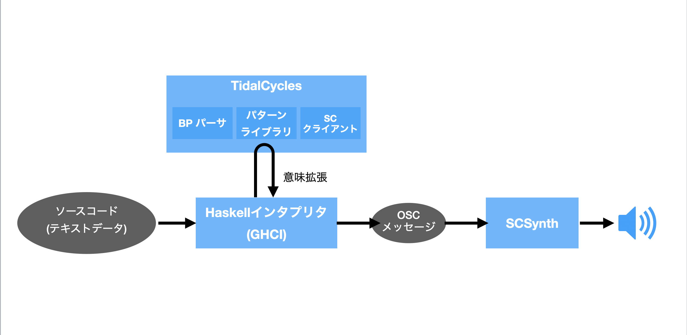
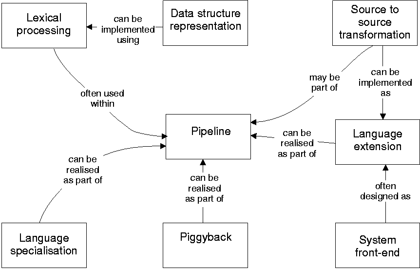

この記事は続き物でおおよそ週間ペースを目指しています。

1. [言語仕様](https://matsuuratomoya.com/blog/2021-02-12/what-is-soundprogramming1/)
2. [データとプログラムの境目](https://matsuuratomoya.com/blog/2021-02-12/what-is-soundprogramming2/)
3. 言語とライブラリの境目(本記事)

松浦知也です。ここ2年ぐらい音楽のための新しいプログラミング言語mimiumを開発しています。 https://mimium.org/ja

さて、前回はMMLのような言語を引き合いに出しつつデータを記述する言語とプログラミング言語の境目はどこにあるのかということを考えてきました。そして、言語において汎用性を高めプログラミング的な要素が増えていけばいくほど特定の表現に対する直感性はどうしても低下しやすいというジレンマがあることも確認しました。

今回も同様に音楽言語の汎用性と局所特化という相反する性質を、しかし汎用言語の上で構築されたライブラリを見ることで考えていきます。

## 汎用言語上での音楽プログラミングライブラリ

さて、汎用言語上の音楽向けライブラリですがここではPortAudioやRtAudioのような各OS向けのオーディオドライバをラップするだけで信号処理に関しては自分で請け負うようなものは除外して考えます。自分がC++をメインに使うのでC++中心になってしまいますが、、、

ひとまず、音楽向けで現在もっとも実用的に使われているのはJUCEでしょう。

http://www.juce.com/about-juce

JUCEはGPL/プロプライエタリのデュアルライセンスのライブラリです。もっとも、音楽プログラミングライブラリと呼ぶにはかなり大規模でスタンドアロンアプリケーションや、VST、AudioUnit、AAXなどの各DAWで動くプラグインを作るためのラッパー機能、グラフィック処理機能、さらにはライセンスアクティベーションのサポートなどもカバーしています。

JUCEは元々Tracktion(現Waveform)を作るためにJulian Storerというプログラマーがほぼ1人で作り上げたライブラリです。名前の由来もJules' Utility Extension Classesですしね。

詳しい歴史はこちらのインタビューに書かれています。

 [カルト的人気を誇るDAW「Tracktion」が遂に復活！ Tracktion Softwareスタッフに訊く、復活までの経緯と今後の展開 -ICON](https://icon.jp/archives/4796)

JUCEはJulesと共にROLIという会社に買いとられ、さらに昨年PACE（iLokなどを作っている会社）に買いとられました。そしてJulesは現在ROLIで[SOUL](https://soul.dev/)というオーディオ用プログラミング言語を開発しています。

肝心のJUCEそのものの機能ですが、個人的に使っていた中で特徴的だなと思ったのは信号処理をカスケードする部分の書き方でしょうか。動的に信号処理のグラフを書き換える場合はAudioProcessorGraphというクラスを利用するのですが、そうでない場合はC++のテンプレートを使ってプロセッサの静的な接続を定義できます。以下のチュートリアルから少し例を挙げてみます。

https://docs.juce.com/master/tutorial_dsp_introduction.html

たとえば、サイン波を生成するプロセッサを音量を変化させるだけのエフェクタに通すとします。その場合このような型名でプロセッサを定義できます。

```cpp
juce::dsp::ProcessorChain<juce::dsp::Oscillator<Type>, juce::dsp::Gain<Type>> processorChain;
```

ここで出てくる`Type`は信号処理の精度を32bit/64bit両方扱えるようにするため導入されている型名なので、実際には`float`か`double`が入ります。`dsp::Oscillator`クラスは任意の関数を使い初期化することでサイン波やノコギリ波、矩形波などをひとつのクラスで扱えるクラスです。たとえばサイン波に設定するためには初期化時に以下のような構文で初期化できます。

```cpp
auto& osc = processorChain.template get<0>(); 
osc.initialise ([] (Type x) { return std::sin (x); }, 128);
```

こういう高階関数を使うようなパターンは他のC++のライブラリだとあまり出てこない印象なので個人的にはおもしろいです。普通にわかりやすい。

---

さて、こういったDSP向けのライブラリはもちろんJUCE以外にもたくさん作られています。

歴史的な側面で触れておくべきは[Xavier Amatriain](http://xavier.amatriain.net/Thesis/)によるオブジェクト指向オーディオ処理フレームワークCLAM(C++)あたりでしょうか。

http://clam-project.org/

このライブラリも現在はメンテナンスされていませんが、2004年に書かれた博論ではSuperColliderやMaxのようなドメイン固有言語と横断した比較も書かれており、理論的なバックグラウンドはJUCEよりもしっかり考えられています。

https://xamat.github.io//Thesis/

あとはこれもちょっと古いですがMaximillian(C++)とか。

http://www.maximilian.strangeloop.co.uk/

それから、映像やインタラクティブな作品制作のためのC++フレームワークの[openFrameworks](https://openframeworks.cc/)のアドオンでも音を扱うためのものが存在します。openFrameworks標準のオーディオ処理機能は、音声ファイルの再生や直接波形を計算するためのAPIなどは用意されていますが、エフェクトを掛けたり高度な音声合成をしようと思うとアドオンの力を借りる必要があります。

有名なものとしては[ofxSoundObjects](https://github.com/roymacdonald/ofxSoundObjects)が挙げられます。一時期oF標準機能入りしそうでしたがなんやかんやあってアドオンのままになっています。UGenのノードを繋いでいくのを以下のような記法で記述できます。

```cpp
 noise.connectTo(filter).connectTo(delay).connectTo(output);
```

もう少しモダンなものとしては[ofxPDSP](https://github.com/npisanti/ofxPDSP)というものもあります。こちらはのちに説明する演算子オーバーロードを使ってUGenを直接掛け算することで音量を変えたり、`>>`で接続を表記できるようになってます。[example](https://github.com/npisanti/ofxPDSP/blob/master/example_basics1_patching/src/ofApp.cpp)より抜粋。

```cpp
//-------------------------PATCHING--------------

// you connect modules ins/outs with the patch operator >>
// the * operator lets you scales the signals by a float
// the dB() function returns a float for setting the volume
osc.out_sine() * dB(-12.0f) >> engine.audio_out(0); // connect to left output channel
osc.out_sine() * dB(-12.0f) >> engine.audio_out(1); // connect to right right channel
```

あとはProcessingの上で動作するMinimとかでしょうか。結構昔からある割にProcessingで音を扱う決定打がないのでいまだによく使われてる印象です。

http://code.compartmental.net/tools/minim/

それから最近のもので言うとWebアプリケーションで音を出すために使われるTone.jsが挙げられるでしょう。

https://tonejs.github.io/

元々WebAudioのAPI自体がUGenを繋いでいくような構造になっているのですが、Tone.jsはそれをさらにラップしたような構造になっていて、DSPだけでなくノートレベルのスケジューリングなどもカバーするようになっています。

```js
const synth = new Tone.Synth().toDestination();
const now = Tone.now()
synth.triggerAttackRelease("C4", "8n", now)
synth.triggerAttackRelease("E4", "8n", now + 0.5)
synth.triggerAttackRelease("G4", "8n", now + 1)
```
フィードバック接続の定義も。`.connect`とかのメソッドチェーンでUGenを繋いでいく記法はofxSoundObjectsで見たのと似ていますね。
```javascript
const player = new Tone.Player({
	url: "https://tonejs.github.io/audio/drum-samples/loops/ominous.mp3",
	autostart: true,
});
const filter = new Tone.Filter(400, 'lowpass').toDestination();
const feedbackDelay = new Tone.FeedbackDelay(0.125, 0.5).toDestination();

// connect the player to the feedback delay and filter in parallel
player.connect(filter);
player.connect(feedbackDelay);
```


## DSL寄りの音楽プログラミングライブラリ

さて、ここからはライブラリとも言えるし音楽言語とも言える、境界線上にある例をcoffeecolliderとTidalCyclesという2つの例を挙げて見ていきます。

### coffeecollider - 演算子オーバーロードによるDSL

coffeecolliderはmohayonaoによって作られた、SuperCollider風の記法でWebAudioを使い音を出すことができるライブラリです。名前の通りcoffeescriptで書かれています。

mohayonao氏はWebAudioのかなり黎明期、仕様がコロコロ変わっていた時期（今も結構そうですが）からcoffeecoliderをはじめpico.jsなど、さまざまな音声処理ライブラリを作っていた方です。先述したTone.jsはある種その時期の先人たちの知識と汗の集大成とも言えるものなのですが、そのReferenceには"Many of codes by mohayonao"とまでクレジットされるほどいろんなことをやっていました。ここ数年はほとんど表立って活動されてなく、coffeecoliderも5年近くメンテされていない&coffeescript自体がJavaScriptの機能が充実したりTypeScriptが覇権を握ってしまい当時と比べてすっかり使われなくなってしまったりと、いろいろと時代を先取りしすぎてしまった感のあるプロジェクトなのですが、それでもexampleは今もきちんと動いてくれるようです。

http://mohayonao.github.io/CoffeeCollider/#noise.coffee

```coffeescript
(->
  noise = PinkNoise.ar(0.2)
  noise = Mix Array.fill 10, (i)->
    Resonz.ar(noise, i * 800 + 200, 0.05)
  noise = (noise * 0.2 + noise * Decay.kr(Dust.kr(0.5), 10))
  noise = RHPF.ar(noise, LFNoise0.kr(0.5).range(220, 880), rq:0.001)
  CombL.ar(noise, delaytime:0.5, decaytime:25).dup() * 0.5
).play()
```

このExampleをSuperCollider本来の記法で書くとこんな感じになります。

```coffeescript
{
   var noise = PinkNoise.ar(0.2);
   noise = Mix.new(Array.fill(10, {arg i;
     Resonz.ar(noise, i * 800 + 200, 0.05)}));
   noise = (noise * 0.2 + noise * Decay.kr(Dust.kr(0.5),10));
   noise = RHPF.ar(noise, LFNoise0.kr(0.5).range(220, 880), rq:0.001);
   CombL.ar(noise, delaytime:0.5, decaytime:25).dup() * 0.5
}.play;
```

SuperColliderでは`{}`で囲みオブジェクトを作っていたのを、うまく無名関数`(-> statements)`によるオブジェクト生成で似せているのが分かりますでしょうか。

#### 演算子オーバーロードと自己反映性

さて、coffeecolliderの何が面白かったかといえば演算子のオーバーロードを積極的に活用することでテキストをパースするプログラムを書くことなく、CoffeeScriptそのままで記法を可能な限りSuperColliderに近づけているという点かと思います。

演算子のオーバーロードとは、たとえば`+`や`*`などの二項演算を数値の加算乗算やテキストの結合などの言語組み込みの型だけではなく、自身の定義したカスタム型に対して新しく振る舞いを定義してやれるような機能のことです。

たとえば、Number型2つで構成されるの2次元ベクトルの型を定義したら+演算子を使ったら要素同士の加算をやってくれたり、`*`演算子を使ったら直積、内積とか外積を計算できるようにしたらコードの記述が短くなってありがたいですね。

演算子のオーバーロードができるようになっている言語としてはたとえばC++、Scala、Haskellなどが有名です。とくにHaskellでは、あらゆる関数を中置演算子のように使える上に`!  #  $  %  &  *  +  .  /  <  =  >  ?  @  \  ^  |  -  ~`あたりの文字から好きな文字を好きなだけ組み合わせて演算子を作ることもできるので`<=>??@`演算子のようなオレオレ演算子をほぼ無限に定義できてしまいます。

JavaScript本体には演算子オーバーロードがないので、Tone.jsの記法は「やっぱりJSだな〜」という印象が残る一方、CoffeeScriptには演算子オーバーロードがついているのでここまでアグレッシブに記法を変えることができるわけです。今から新しく作るならAltJSでほぼHaskellのような文法が書けるPureScriptなら中置演算子の定義が可能なので面白く使えるかもしれません。

演算子オーバーロード以外のこうした言語自体の意味を自己拡張するような機能はたとえばKotlinの[Type-Safe Builder](https://kotlinlang.org/docs/type-safe-builders.html) とかF#の[Applicative Computation Expression](https://docs.microsoft.com/ja-jp/dotnet/fsharp/whats-new/fsharp-50#applicative-computation-expressions)とかでしょうか。後はマクロもそうですね。

こうした言語の意味を拡張していくような言語機能は場合によっては自然な記述を可能にしますが、場合によっては同じ言語で書いてあるのに、書き方が違いすぎて何が書いてあるんだかまったくわからないカオス状態に陥ったりもします。汎用プログラミング言語の範囲内での現実的な利用価値としては諸刃の刃です。代表例はC++のストリーム読み書きのための`<<`演算子とかでしょうか。C言語から移ってきた人がHello Worldしようとして何これ？となるやつですね。

```cpp
#include <iostream>
int main(){
  std::cout << "Hello World!" << std::endl;
  return 0;
}
```

C++でこういう使い方を極めた一例はパーサー記述ライブラリ[Boost.Spirit.Qi](https://www.boost.org/doc/libs/1_75_0/libs/spirit/doc/html/spirit/qi/tutorials/mini_xml___error_handling.html)とかですね。だいぶ悪魔っぽい。

なので、言語設計としてはgoとかのように意図してオーバーロードを禁止することで、ソースの見た目の一貫性をキープする方針も珍しくありません。

### TidalCycles - ハイブリッドなアプローチ

さて、前回の記事でこのようなコンパイラの構造を出しました。

ストレートなアプローチでのコンパイラ設計をするならばテキストデータを読み込み、それを中間表現へと変換するプログラムを作ることになります。一方coffeecolliderの場合は、言語解釈機部分はCoffeeScriptのインタプリタそのもので、演算子オーバーロードを使ってホスト言語に新しく意味を加えていくというアプローチなのでした。

パターンを記述するための言語であるTidalCyclesはこのハイブリッドとも言える構造をとっています。

```haskell
d1 $ sound "bd*4" # gain (every 3 (rev) $ "1 0.8 0.5 0.7")
```

たとえばd1に続けて半角スペース、$、半角スペース、その他シンボルを続けて書いている部分のSyntaxはTidalCyclesのホスト言語であるHaskellの関数適用構文そのものです。Haskellの中でd1やd2といったカスタムの関数がTidalCyclesというライブラリ側に定義してありユーザーはそれを実行する構文を書くことで音を鳴らしているわけです。その上で`”bd *4”`などダブルクオートで囲まれた部分はHaskellの構文上はただの文字列であって、この部分はHaskell内で文字列データをParsecというライブラリを使いパースして内部構造に変換するコードが書かれています。

https://github.com/tidalcycles/Tidal/blob/main/src/Sound/Tidal/ParseBP.hs

この文字列部分は[Bol Processor](https://bolprocessor.sourceforge.io/)という記法をベースにしているらしいです。知りませんでした。

ざっくり図にするとTidalCyclesはこんな感じの構成で作られています。
TidalCycles自身は音響合成エンジンを持たず、SuperColliderにOSCというプロトコルを使いネットワーク経由でコマンドを送ることで音を鳴らすようになっています。



また同時に重要なこととして、TidalCyclesだけを使う上ではHaskellの型定義や関数定義などの比較的高度な構文を知っておく必要はありません。**高度な言語のサブセットだけを利用して敷居を下げる**、というのもDSLのアプローチの1つと言えます。

## DSLの実装アプローチ分類

さて、こうしたDSLともライブラリとも言い難い言語を考えるために、音楽に限らないDSL全般のデザインの分析についてのサーベイ論文を参照してみます。

[Diomidis Spinellis. Notable design patterns for domain specific languages. Journal of Systems and Software, 56(1):91–99, February 2001. (doi:10.1016/S0164-1212(00)00089-3)](https://www.spinellis.gr/pubs/jrnl/2000-JSS-DSLPatterns/html/dslpat.html)

SpinellisによるDSLのデザインパターンは主に以下の8つのアプローチがあります。分類というよりも性質を表すタグのようなものだと思えば分かりやすいかと思います。

#### Lexical Processing

ベタのテキストデータを読み込んで構造体へ変換するプログラムを作る手法。つまりもっともストレートなコンパイラ実装の方法です。利点はホスト言語の言語仕様に縛られないこと、欠点は実装がまあまあ大変になることです。さきほどのTidalのように、部分的に使うアプローチもあります。正規表現なんかもその一種と言えますね。

#### Piggyback（おんぶ）

ホスト言語の機能が存在することを前提に作られている言語。これは音楽言語だと当てはまる例を見つけるのが難しいのですが、論文内ではmimiumの開発でも使っているパーサジェネレータyaccなどが挙げられています。yaccは文法規則を記述するためのDSLなのですが、パースした後のアクションを記述する部分ではホスト言語であるCやC++のコードがほぼそのまま書けるようになっています。たとえば、アクション部分で条件分岐が必要になった時、そうした機能までDSLの言語仕様に盛り込むのは実装が大変になるので、実装を簡略化するためには真っ当なアプローチです。デメリットは当然ですが、ホスト言語が基本的に固定されるので他言語へ移植するハードルが高いことでしょう。

#### Pipeline

複数のDSLを組み合わせていくことでそれぞれの実装コストを減らしていくパターン。音楽言語においてはTidalをはじめOvertone、SonicPi、FoxDot、ixi langといったSuperColliderを音声合成エンジンに利用する言語がそうだと言えるでしょう。

#### Language Extension

ホスト言語自体の意味を拡張することでDSLとする方法。coffeecolliderのところで解説した話ですね。

#### Language Specialisation

ホスト言語の仕様を制限することでDSLとする方法。TidalがHaskellのすべての文法を使用するわけではない、という話はこれに当たりますね。他の言語で言うとたとえばProcessingやArduinoがそうでしょうか。文法規則としてはProcessingはJava、ArduinoはC++をそのまま利用していますが、たとえば必要なヘッダやライブラリのインクルードはユーザーからは隠蔽されており、実行した時にIDEが勝手にテンプレートを組み合わせてホスト言語のコンパイラに渡してくれるわけですね。

#### Source to source transformation

ある言語のソースコードを別のホスト言語へ変換する方法。音関係でこのアプローチをとっているのは[Faust](http://faust.grame.fr/)が典型例ですね。Piggybackとどう違うのかというと、Faustは自身の言語内で意味体系が完結しています。そのため、元々はC++のソースコードに変換する機能がメインの言語でしたが、現在はC言語、Rust、D言語、Java、LLVM IRなどさまざまな言語に変換することができるようになっています。

このアプローチの利点は1つのホスト言語に縛られないながらもホスト言語周りのインフラストラクチャ（ビルド、デプロイのためのツールとか）に乗っかりやすいことです。

一方で個人的に感じるデメリットとしては、C言語とかまで低レベルなものに出力しようと思うと結局普通にコンパイラを実装するのと変わらないだけの実装の負担が出てくることかなあと思います。

#### Data Structure Representation

ホスト言語自体は制御構造などのプログラム的な文法を持たず、データを記述することに特化しており、それをコンパイラに通すとプログラムやコードに変換されるようなパターン。MMLとか当てはまるんでしょうか？論文で例に挙げられてるのは[gperf](https://www.gnu.org/software/gperf/)。

#### System Front-End

巨大なアプリケーションを効率よく管理するためのインターフェイスとして埋め込み型言語を使うパターン。ReaperやArdourのようにスクリプティング機能が存在するDAWみたいなもんだと思えば良いんでしょうかね。

これら8つのデザインパターンは概ね以下の図のように関連するとされています。



## 言語を実装する必要性って？

さて今回話してきたことやSpinellisの論文の内容をまとめていくと以下のようなことが言えると思います。

- テキストをパースするプログラムを書かなくてもライブラリでもホスト言語が演算子オーバーロードのように自己拡張する仕様を持つ場合DSLとしての性質を帯びさせることができる。
- パースするプログラムをゼロから書いた方が言語設計の自由度は高まる一方で、実装のコストが高くなる。さらにユーザーとしてもまったく新しい言語を1から勉強することになるので学習コストが高い。

SuperColliderを開発したJames McCartnyは2001年の論文で、究極的には言語の開発そのものは必要ないと述べています。

[Rethinking the Computer Music Language: SuperCollider](https://doi.org/10.1162/014892602320991383)

> コンピュータ音楽に特化した言語は実際必要なのでしょうか？少なくとも理論的には、私はそうではないと思います。今日の汎用プログラミング言語で利用可能な抽象化の方法の集まりは、コンピュータ音楽を便利に表現するフレームワークを構築するのには十分なものです。ただ残念なことに、実用的には、今日利用可能な言語の実装として欠けている部分もあります。多くの場合、ガベージコレクションはリアルタイムでは実行されず、引数の受け渡しはあまり柔軟ではありません。遅延評価が含まれていないと、パターンやストリームの実装がより複雑になります。SuperColliderを書いたのは、コンピュータ音楽のために柔軟に使えるような抽象化のセットを持ちたいと思ったからです。将来的には他の言語の方が適しているかもしれません。SC Serverの合成エンジンと言語を分離する目的の一つは、SuperCollider言語とクラスライブラリで表現されている概念を他の言語で実装することを模索することができるようにすることです。他にも、将来的にコンピュータ音楽のために面白い可能性を秘めた言語として、 OCaml (www.ocaml.org)、Dylan (www.gwydiondylan.org)、 GOO (www.googoogaga.org)、そして、偶然にも文法規則の多くに似た仕様を持つスクリプト言語であるRuby (www.ruby-lang.org)があります。
>

（翻訳はDeepLに頼りつつ、筆者が修正）

つまりわざわざSuperColliderという言語を実装したのは1990年代にはリッチな機能を持つ言語がそんなに存在しなかったのでわざわざ言語をゼロから作る羽目になった、というような感じなのかもしれません。そして実際、後半で述べられているようにSuperColliderという言語そのものを積極的に利用する人は少なくなった一方、音声合成エンジンとしてのSCServerはさまざまな形で利用され、音楽言語のインフラストラクチャとして機能しています。[FoxDot](https://foxdot.org/)はPython、[Overtone](https://overtone.github.io/)はClojure、[TidalCycles](https://tidalcycles.org/)はHaskell、[Sonic Pi](https://sonic-pi.net/)はRubyといったように実際に多様なホスト言語から利用されています。

もっとも、SuperColliderのプラットフォームに乗っかることで生まれる限界も当然存在します。典型的な例ではサンプル単位で正確なイベント処理を行う必要があったとき、SCではオーディオとメッセージを明確に分離している（`.ar()`と`.kr()`）ので時間方向の解像度に限界が存在します。これらの問題にアプローチしたのが[ChucK](https://github.com/ccrma/chuck)のような言語です。この辺りはプログラミングにおいて正確に時間を扱うことの難しさという根本的な問題が存在しているのですが、それはまた次回。

自分の開発しているmimiumはゴリゴリのテキストを0からパースするタイプの言語という、特化言語不要論とは真逆のアプローチなので反論したいところなのですが、「そう言われるとそうやな」という気分になり言い返せません。が、強いて言うなれば。音楽言語は言語体系としては表現の内容そのものには一切関知せず、音とは関係のないメモリ操作やスレッド、スケジューリングなどハードウェア操作の隠蔽に徹するべき、というのが基本的な主張です。

たとえばSuperColliderの信号処理は最小単位としてUGen、たとえばノイズ生成機やオシレータがプリミティブな関数として用意されているわけですが、オシレータの定義を新しく自分で行おうと思うとC++のコードを書く必要があります（まあFaustはそこをショートカットするための言語として作られていたりしますが）。

そうではなく最終的に音の波形を出力する関数定義を書いたらそれ通りの音が出る、ということだけが最小限保証されていてオシレータの定義などはその言語上でライブラリとして構築されていて欲しい、ということです。

じゃあ、メモリ操作やスレッド、スケジューリングなどハードウェア操作が隠蔽されているスクリプティング言語を使えばいいじゃん……となるかと思いますが、オーディオ処理をしているスレッドでガベコレとかが発生すると容易に音切れが発生したり、音アプリケーションに使う前提で設計されてないスクリプティング言語を使用するとリアルタイム処理のいろんな問題が出てくるのです。WebAudioAPIではなぜわざわざJSの組み込み配列ではなくArrayBufferという使いにくいオブジェクトを経由しなければいけない仕組みになっているのか？ということからもなんとなく察して貰えるかと思います。

というわけで、次回は「解きたいタスクの性質から考える音楽言語」ということでリアルタイム処理の難しさを中心に音楽言語における実装自体の難しい部分に着目してたいと思います。

