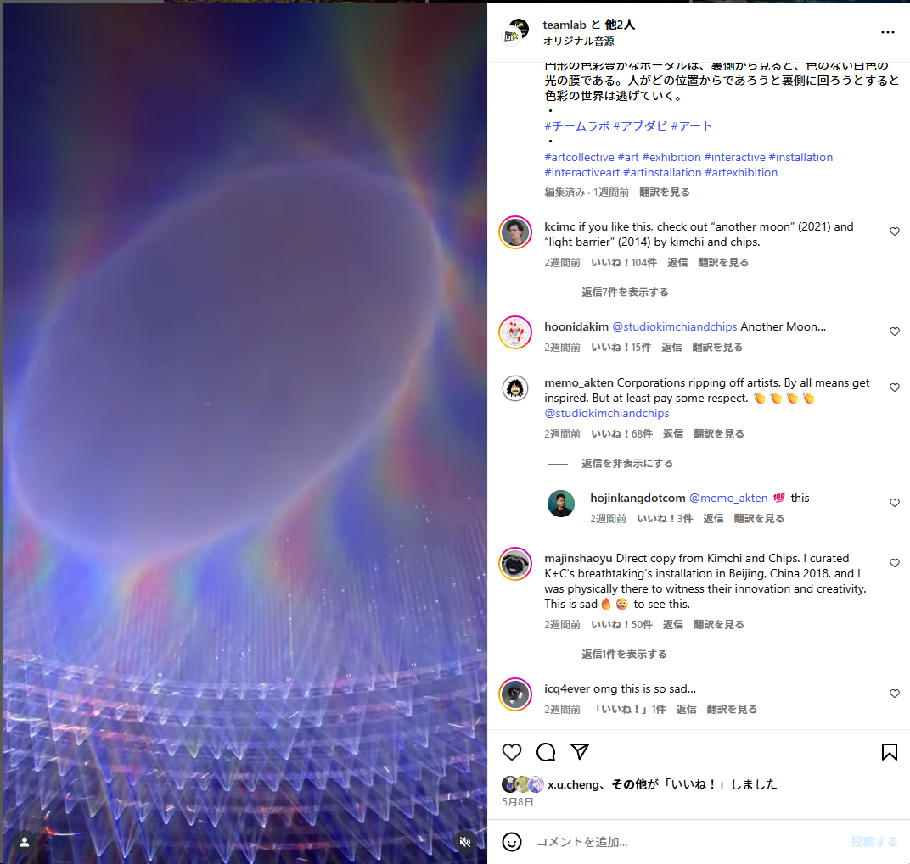
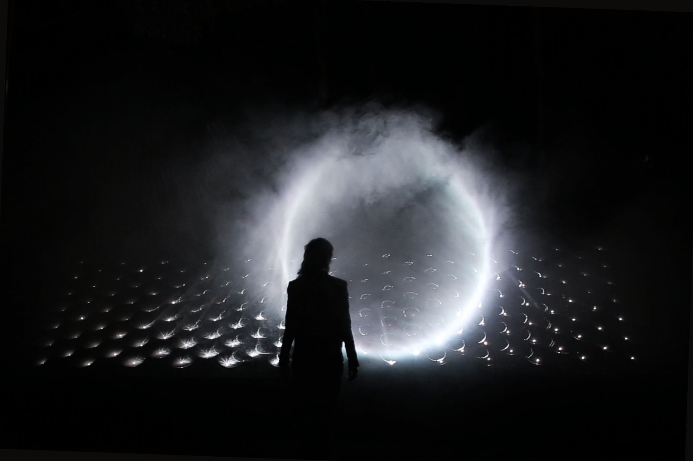
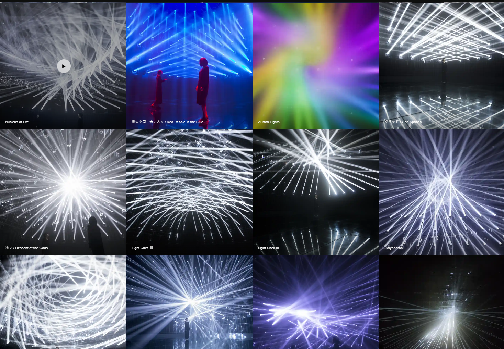

This text is a personal reflection on my time at teamLab and my current opinions about the collective.

What prompted me to write it was an Instagram discussion I came across, concerning a new moving light installation presented at teamLab's large-scale permanent exhibition in Abu Dhabi. Many people were saying that the work resembled projects by the famous new media art duo Kimchi and Chips.

https://www.instagram.com/p/DJY9BL6qv9k/

<small>[**Light Barrier** (2014)](https://www.kimchiandchips.com/works/lightbarrier/): A work that creates rings of light in space by deliberately scattering the beams from projectors using multiple spherical mirrors, then controlling the paths of the reflected light.</small>

<small>[**HALO** (2018)](https://www.kimchiandchips.com/works/halo/): An evolution of _Light Barrier_, this piece uses sunlight reflected by precisely aligned mirrors in an outdoor environment to produce rings of light in midair.</small>

[**Another Moon** (2021)](https://www.kimchiandchips.com/works/anothermoon/): A spherical light form generated above viewers using laser beams powered only by solar energy collected during that day.

---

I worked at teamLab between 2015 and 2017. At the time I joined, the collective was holding a solo exhibition at Miraikan, the National Museum of Emerging Science and Innovation in Odaiba, Tokyo. Although I was technically just an undergrad student intern, I happened to join right when the sound team was being formed. As a result, I was involved in all kinds of audio-related tasks—equipment selection, speaker placement design, sound system programming, installations, and on-site tuning—for multiple domestic and international exhibitions. I left when I moved out of Tokyo to enter graduate school—right before the teamLab Borderless project began in 2017.For this essay, I don’t intend to reveal any confidential internal information. That said, I will share details I feel are ethically necessary.

After reading Elliot Woods of Kimchi and Chips post related Instagram stories, I reached out to him via DM, disclosing my background. Though I’ve never seen their works in person, I’d been following them for quite some time, since their pieces—_Light Barrier_ in particular—were widely known in the circles I was in. What struck me most was a question Elliot asked: “How does that massive collective make creative decisions?” Indeed, while interviews with teamLab’s founder, Toshiyuki Inoko, are common in Japan, from an overseas perspective, it might seem like a mysterious, faceless collective from the Far East is producing unusually large-scale digital artworks. (Though recently, Inoko seems to have intentionally reduced his media appearances.)

With that in mind—and assuming this essay may also be read in English—I want to share some foundational thoughts and my personal impressions of teamLab, both past and present.

According to teamLab’s official website as of 2025, the collective has approximately 1,000 employees[^1]. When I was working there about a decade ago, I recall the number being around 400, so the workforce has more than doubled in the last ten years. Their recruitment site notes that the average employee age is an astonishingly young 28.8 years[^2]. But this also implies a high turnover rate—many people leave after just a few years[^21]. Out of all the people I worked with at the time, I could probably count on one or two hands the ones still there.

[^21]: According to an another ex. employee, he don't think the turnover rate is so high, especially on Unity Engineer. Simply I just feel like that because the many people around me left, soon after I left, and the fact that just many younger people enters and the number of employees is keep growing, makes me feel like it more.  https://x.com/mattatz/status/1928070452309561516

Many in the fine art world—perhaps even within Japan—are unaware that teamLab does not operate solely as an art collective. Since its founding, it has maintained a solutions division that handles web development, smartphone apps, and other digital services. I don’t know the current internal ratio, but when I was there, the split between the art and solutions divisions was roughly 50/50.

This dual-structure approach was quite common among Japanese startups founded in the 2000s focused on web and interactive design. Companies like Rhizomatiks, WOW, Invisible Design Lab, NAKED, 1 to 10 Design, and Whatever (formerly known as Coconoe, PARTY NY, and dot by dot) had similar business models at the outset. Among these, however, teamLab’s scale—both in terms of headcount and the degree of separation between its art and business arms—has become exceptional. It's fair to say that teamLab has undergone a unique trajectory of growth.

---

The conceptual approach to art-making at teamLab is not so much that each individual piece has a unique concept, but rather that the entire collective is unified under overarching ideas—most notably the notion of the “Ultrasubjective Space.” Within that framework, smaller conceptual themes span across series of works. Even pieces that look similar or share the same name are often variations that differ by exhibition, and are continually updated over time[^3].

Let me attempt a rough explanation from my own understanding. In its early days, teamLab was clearly motivated by a desire to fuse Japanese art with digital technology. A prime example is [Flower and Corpse Set of 12](https://www.teamlab.art/jp/w/flowersetof12/), a digital video work rendered using a custom engine that gives 3D spaces the appearance of traditional Japanese painting.

Unlike traditional Japanese painting—where flatness implies the absence of a singular camera perspective—teamLab’s works intentionally avoid establishing a single viewpoint. Instead, multiple perspectives are folded into a single image, resulting in a pictorial space where the viewer is not separated from the artwork by a camera lens. In that sense, it’s a painting without boundaries between the world of the viewer and that of the image.

Of course, one could argue that this reinterpretation is possible only because of our knowledge of Picasso's Cubism. But anyway, I do think teamLab has managed to reframe the value of Japanese art in a way that resists simplistic Orientalism, doing so through forms that would not be possible without digital technology.

This foundational idea of perceiving images without a fixed, singular perspective has evolved into what we now know as teamLab’s immersive installations. These are works where the viewer enters the space of the artwork, each person experiencing a different version of the piece, blurring the boundary between the work and the audience.

From this standpoint, it's clear that teamLab’s immersive exhibitions differ significantly—at the level of concept—from more entertainment-oriented ones that, for example, digitally re-present public domain artworks by Van Gogh or Monet in interactive environments. Of course, it’s fair to question whether the audience actually distinguishes between these kinds of experiences or whether, in the end, they are perceived similarly. Since I haven’t visited those entertainment-style immersive exhibitions myself, I’ll refrain from discussing them further here.

Some may find it odd that teamLab has partnered with a mega-fine-art-gallery like Pace. But in my view, a major factor in enabling this relationship was teamLab’s consistent placement of its work within a broader art-historical context from early on. That said, much of the credit for connecting teamLab to the global art world—including Pace—goes to the gallerist Ikkan Sanada.

If you read Japanese, I recommend the October 2022 teamLab Borderless special issue of _Forbes JAPAN_, which includes an interview with Sanada and Pace president Marc Glimcher[^17]. In English, there’s also a roundtable talk from Art Basel featuring teamLab’s Takashi Kudo, Sanada, and Peter Boris (another key figure at Pace who helped promote teamLab):



[Collective Efforts: teamLab - YouTube](https://www.youtube.com/watch?v=pmOO6P5AUcU)

### Leaving from Projection and Display

To discuss the recent similarities between teamLab’s works and well-known new media art pieces, we need to fast forward a bit in time. I believe a key turning point in this conversation was when teamLab’s video-based installations culminated in _teamLab Borderless_—a large-scale permanent exhibition first opened in Odaiba in 2018 (closed at the end of 2022, then reopened in 2024 in Azabudai Hills in Roppongi).

By the time of this exhibition, teamLab had already held successful shows at fine art galleries such as Pace’s Palo Alto Gallery, Australia’s Martin Browne Gallery, and the UK’s Saatchi Gallery, as well as large institutions like Miraikan in Tokyo, the National Gallery Singapore, and the ArtScience Museum.

However, _Borderless_ differed significantly from these earlier exhibitions—not just in scale, but in structure. Although the works were loosely divided into separate areas, the birds, flowers, and other elements within individual pieces moved freely across spaces. This concept of artworks transcending spatial boundaries had existed before, such as in [_Flutter of Butterflies Beyond Borders_](https://www.teamlab.art/w/butterflies/), where butterflies flit between projection-mapped screens and display panels within an installation. But applying this idea to an entire exhibition was another level entirely.

From the production standpoint, this marked a fundamental shift: no longer “one artwork per computer,” but a completely different system—“one museum, many computers.” In fact, it’s said that _Borderless_ ran on 520 computers[^5].

I don’t know how different _Borderless_ looked to audiences compared to previous shows—many visitors were likely experiencing teamLab for the first time. But my own impression was twofold: I was astounded by the level of detail and craftsmanship, but I also couldn’t shake the feeling that “they might have finished what they wanted to achieve?”

And then, among the few spaces in _Borderless_ that remained visually distinct from the rest, were installations using moving lights—what teamLab refers to as “light sculptures.” 

Their use of moving lights didn’t start here, however. It dates back to experiments at the [teamLab Music Festival](https://www.teamlab.art/e/musicfes/) in Tokushima in 2015, and later events like [teamLab Jungle](https://www.teamlab.art/w/teamlabmusicfestival2016/) held at Dojima River Forum in Osaka and in Shibuya. These earlier formats eventually conveted into the exhibition formats as seen in _Borderless_.



[teamLab Music Festival - YouTube](https://www.youtube.com/watch?v=NAtEvYN7g_Y)  



[The Haze / 靄の彫刻 - YouTube](https://www.youtube.com/watch?v=vN3YXM93ukA)

<small>From https://www.teamlab.art/e/borderless-odaiba/ . As of 2018, over ten light-based works were presented, rotating throughout the day (though I don’t recall seeing that many when I first visited just after opening).</small>

What’s interesting is that, according to Elliot Woods’ talk, Kimchi and Chips’ works like _Light Barrier_, _HALO_, and _Another Moon_—which also create midair light images—originated from experimental lighting arrangement in an experimental club event around 2008[^4]. Neither side began with an exhibition format in mind when using moving lights.

Even before this, teamLab had explored what I’ll call “non-pixel-based” works—installations that don’t rely on projection or screens. Examples include the [teamLab Ball](https://www.teamlab.art/w/teamlabball/), originally intended as part of a music festival stage design too, and [Crystal Universe](https://www.teamlab.art/jp/w/dmm-crystaluniverse/), where a 3D matrix of LEDs is used like voxels.

After 2018, this no-display-no-projection trend accelerated. TeamLab began branding these projects with terms like [“Environmental Phenomena”](https://www.teamlab.art/jp/concept/environmental-phenomena/) and [“Cognitive Sculpture”](https://www.teamlab.art/jp/concept/cognitive-sculpture/). Other examples include works like [Massless Clouds Between Sculpture and Life](https://www.teamlab.art/jp/ew/clouds_macao/), which uses bubble foam.

However, non-display-no-projector-based installations like these have long existed within the Euro-American new media art world. As a result, teamLab’s recent works risk appearing simply as scaled-up versions of pre-existing ideas. Personally, _Massless Clouds_ reminded me of [Soichiro Mihara’s _the blanks to overcome_](https://mhrs.pb.studio/theblankstoovercome), and [Levitation Void](https://www.teamlab.art/w/levitationvoid/)—a light sculpture also shown in Abu Dhabi—inevitably evoked Anish Kapoor's works[^7].

There seem to be subtle conceptual and technical differences, and I doubt teamLab intentionally copied anyone[^6]. But there must be a phenomenon when historical context is omitted—intentionally or otherwise—scale alone can make a work appear “original.” Some people seeing the massive Abu Dhabi installation might reasonably think, “Kimchi and Chips is just a knockoff of teamLab.”

Elliot also expressed this concern—not out of a desire to sue or claim exclusive authorship, but out of a fear that their work might be erased from history.

From teamLab’s perspective, openly acknowledging similarities or precedents offers no benefit. Visitors will come either way. There are many ways to critique this situation, but for the rest of this essay, I’d like to narrow my focus to two points:

1. What can be learned from teamLab’s own lawsuits about how to critique the collective?
2. Has teamLab, as a collective / corporation / legal entity, remained faithful to its own ideals?

## On the Legal Actions

As many already know this too, teamLab has, in recent years, filed multiple lawsuits—, not against those from whom they may have “borrowed,” but against other immersive exhibitions that followed in their wake. In 2021, they won a copyright infringement case against a Chinese company[^9]. They also won a partial victory in a widely reported lawsuit against the _Museum of Dream Space_ (MODS) in the United States—though at the time of that report, the case was still proceeding to a jury trial[^10]. As for their suit against Korea’s Arte Museum, currently operating in Las Vegas, I believe it was dismissed, though I’m not entirely clear on the details[^11].

On this matter, Toyoshi Morioka—formerly of 1-10 Design and now at BASSDRUM—has already shared his opinion, which I largely agree with[^12].

[On the Difficulty of Claiming to Be a Media Art Pioneer – Toyoshi Morioka (note.com, written in Japanese)](https://note.com/toyoshimorioka/n/n40eb95d35847)

Personally, I don’t think these lawsuits are excessively suppressing the industry. As far as I know, teamLab hasn’t targeted those entertainment-oriented immersive experiences based on public domain art—such as Van Gogh or Monet shows. In the case of MODS, there were even allegations that they directly used teamLab’s promotional images. Even setting that aside, the similarities felt too deliberate. It didn’t seem like something that would have emerged “naturally” without teamLab.

What’s particularly interesting is that in its case against MODS, teamLab claimed that **“the overall concept and impression of the installations were substantially similar"**. When I first heard the news, I thought: maybe teamLab was worried that if it allowed these kinds of lookalike digital art installations to proliferate unchecked, the philosophical concepts they’ve developed—such as “ultrasubjective space”—would become hollowed out. Perhaps they feared being reduced to mere visual resemblance themselves.

(And yes, this concern seems closely aligned with the one currently held by Kimchi and Chips.)

However, if teamLab were to explicitly highlight the differences between their works and those of others, they would weaken their legal case. Therefore, they are compelled to say “the overall impression is substantially similar.” Ironically,**that statement tacitly admits that their works resemble the kind of shallow, Instagrammable digital art presented by MODS**.

Half-jokingly, I think MODS could have countered in court by saying: *“Our exhibition may look superficially similar to teamLab’s, but conceptually it’s entirely different. We don’t care about things like ‘ultrasubjective space’—we just want to make something flashy and fun for social media.”* That kind of blunt honesty might have worked.

<small> (In reality, MODS describes its own concept like this:

> The design concept of MODS is inspired by art design from Yayoi Kusama (famous for infinite rooms) and the development of digital art. The aim of MODS is to provide an immersive, magical and unique art appreciative experiences to the visitors.

What the heck is “the development of digital art”? As if digital art naturally evolves on its own?)</small>

Anyway, while I don’t think teamLab’s lawsuits go too far, I can’t help but feel: “Are these small-time imitators really worth going after?” To put it a bit harshly, I always thought teamLab’s attitude—also seen in the earlier issue, as mentioned in Morioka's article, with the Rakugaki Aquarium by Coconoe and teamLab’s own Oekaki Aquarium—was something like: “We might make something similar to what already exists, but we give it proper philosophical and conceptual grounding. And we don’t care who tries to copy us.”

That attitude was, admittedly, problematic in its own right—too much of a survival-of-the-fittest mindset. But at least it felt more consistent with their identity as an artistic collective. Explaining why I feel this way might also shed light on what’s missing in today’s critiques of teamLab.

Take the art critic Tsunehiro Uno, for instance. Much of the existing commentary on teamLab has reinforced the conceptual claims made by the collective and Inoko himself. But if we connect this to the lawsuit issue, we’re forced to ask: If someone builds an installation that is systemically similar to teamLab’s, does that automatically mean their work embodies teamLab’s philosophies, like “Ultrasubjective space”?

Put more simply:  **If is the work intaractive, is it enough?**

My answer is an obvious no. Never! This is a topic that often comes up in conversations among peers in the field. Even when compared to other entertainment-oriented exhibitions, teamLab’s displays stand out for their level of detail in 3D modeling and the quality of their interaction design. While the hardware specs and projectors now available play a part in this, even when I was working there—when budgets were more limited—teamLab spent an unusually long time on-site adjusting their installations.

Even for the same piece, factors like room brightness, spatial relationships with other works, the type of projector used, or even the wall color could significantly affect the final output. So teamLab would fine-tune things like color tone and shader parameters for each venue. They also made fine adjustments to sensor response times on-site. And as far as I know, Inoko was involved in making even these minute decisions.

Of course, these are details only someone who has seen the actual production process would know—so it’s understandable that art critics overlook them. It’s hard to explain what this “quality” really is, but I believe it’s closer to the kind of aesthetic judgment found in interaction design for games, mobile apps and web experiences, or in the nuanced motion design of graphics and animation.

In other words, **the value of teamLab’s work does not lie solely in introducing Japanese or contemporary art concepts into digital art. Rather, their concepts are brought to life and sustained by the countless micro-adjustments made by a large team of engineers.** And this dimension is often missing from current critiques of teamLab.

To put it another way, I think what’s missing in the evaluation of teamLab’s work is a perspective informed by game art. When people hear “game art,” they often think of small indie games made without large capital investment, or conceptual works that bring the game format into contemporary art. But in terms of labor and production environment, teamLab’s process is actually quite similar to large-scale commercial game production, where thousands of people contribute to creating a single title. At least, when compared to other companies creating digital art as a collective (like Rhizomatiks), teamLab is much closer to this model.

That said, teamLab’s works have no scores, narratives, or end goals. As such, they’re difficult to evaluate using the vocabulary of traditional game criticism. While writing this, I was reminded of the work of Toshio Iwai, a pioneer of Japanese media art and visual expression. In the 2000s, he released experimental works in the format of consumer video games (such as [_Electroplankton_](https://www.nintendo.co.jp/ds/dsiware/electroplankton/index.html) for the Nintendo DS). These works also did not contain goals or scoring mechanisms, and they didn’t sell well as games. I suspect people in the game industry didn’t know how to evaluate them.

At the same time, though, the value of these works couldn’t be fully expressed using only the vocabulary of art criticism—concepts and philosophies alone wouldn’t suffice. In that sense, what’s missing from current teamLab criticism might be the same thing that was missing when Iwai’s game-art hybrids emerged two decades ago.

In the end, I worry that teamLab’s decision to sue “lookalike” immersive exhibitions based on visual resemblance alone could lead to a self-destruction of their own artistic integrity. Rather than asserting the originality of their concepts through litigation, I believe that opening up the technical and engineering practices that actually realize those concepts would benefit not only teamLab but also foster stronger ties with Japanese art, new media art, and game culture. It could also lead to mutual recognition with other creators—like Kimchi and Chips—working in similar domains.

---

## The Artist as a Juridical Person

Now for what may feel like a ridiculously long digression: another thing I’ve been thinking about regarding teamLab and how they are evaluated.

One reason I joined teamLab in the first place was to explore the nature of collective creativity. By immersing myself in a large collaborative environment, I hoped to better understand what kinds of works could only be created by an individual. (That's why, at the time, I also interned at Yamaguchi Center for Arts and Media’s InterLab, a kind of contrasting “lab” environment.)

For nearly ten years, this theme has stayed with me. And in the end, I’ve come to believe that what makes teamLab—the so-called “ultra-technologists collective”—so unique is not how they leverage collective creativity among experts, but rather how the artworks they create are collectively labeled under a single legal entity. That is, the name “teamLab” acts as a single virtual author.

Earlier, I compared their labor structure to that of the game industry. In games, it’s standard practice to credit every contributor, including the most junior team members (I guess this is a tradition inherited from film). The same holds true for Takashi Murakami’s studio—each part-time assistant is credited in his exhibitions. From what I’ve heard, Olafur Eliasson operates similarly though I'm not sure.

But in teamLab’s works, you rarely see credits listing who did what. Back when I worked there, I was told that this was intentional: regardless of whether you worked on a specific project—whether you were in the art division or the web solutions team—everyone contributed in some way, so no individual names would be credited. As I recall, Inoko’s name wasn’t specially highlighted either. That said, people were allowed to mention in their personal portfolios which projects they had contributed to (though technical details were generally off-limits)[^13].

This rationale was especially compatible with the company’s structure at the time—“generating revenue through web solutions while building a name through art.”

Under the copyright law, works created within a company typically belong to the legal entity (**法人：juridical person**), not the individual who made them. Come to think of it, teamLab might be the only collective in the contemporary art world that so thoroughly embodies this corporate authorship model—where individual contributions are almost completely invisible.

Even in game production, critics often refer to the producer, director, or lead engineer when evaluating a work. In the realm of technology-based art, even collectives like E.A.T., Japan’s CTG, or Video Hiroba end up being remembered as groups of notable individuals. This issue also intersects with my research interests: in fields like media history, science and technology studies, and art history, there’s an ongoing debate over how to document the contributions of unnamed masses alongside star players[^14].

In a collective with high turnover like teamLab, there are undoubtedly countless techniques and insights handed down from past engineers to their successors. How do we evaluate such accumulated expertise? I honestly don’t know. But despite their popularity and critical acclaim, teamLab—seen as a faceless juridical person— looks solitary, profoundly isolated from both art history and the tech industry.

### Authorship in Digital Art

Let me say a bit more about teamLab as a collective creator. Specifically, I’d like to consider how the free software movement and open-source culture have influenced digital and new media art.

TeamLab—and many other IT startups from the 2000s—grew out of a context where “information technology” was still perceived as something intangible. Among them, companies based on web technologies didn’t sell data or software per se, but rather sold labor involved in producing them. That business model aligned well with a moderate form of open-source culture: software should be executable by anyone, and data should be as accessible and shareable as possible (without necessarily rejecting proprietary software business models outright).

In the field of new media art, I believe our relationship with open-source culture has shifted significantly in the past decade. One obvious example is how creative coding environments like [openFrameworks](https://openframeworks.cc/)—once a dominant force—have gradually fallen out of favor, while proprietary tools like [TouchDesigner](https://derivative.ca/) and game engines like Unity and [Unreal Engine](https://www.unrealengine.com/ja) have taken over. Even back in the 2010s, Unity was already being used alongside openFrameworks, but this shift reflects deeper changes in how digital creative industries operate.

I’d argue that companies that moved closer to the game industry (like teamLab) found Unity’s structure and workflow more suitable, while smaller studios aligned with design or consultancy retained a preference for TouchDesigner or continued using openFrameworks, albeit more sparingly.

Now, this next anecdote might get me in trouble—but here goes. Back when I worked at teamLab, a few members (who were also active VJs) created a self-published technical zine about CG techniques. It wasn’t a guide to reproducing teamLab’s works—it was more like tutorials on how to achieve certain visual effects. But even so, they were reportedly reprimanded, and the project was shut down internally. *(2025-05-29 22:00 This was not correct. According to one of the zine author, they proposed that publishing the book as an official activity of teamLab as a part of PR, but that was rejected by exectives. [^22])*

[^22]: https://x.com/mattatz/status/1928068121065312743

In the game industry, developing a proprietary engine in-house and treating it as a core asset—something never to be shared—is still common (though this too is gradually changing). Meanwhile, the digital creative industry—born out of Flash and web design—has had to continuously recalibrate what gets shared and what gets monetized, depending on team size and scope.

A stark contrast to teamLab’s stance is Rhizomatiks, where Daito Manabe not only shares software but also [opens his surveys and research notes](https://scrapbox.io/artresearch/) on the production process. (Though to be fair, he doesn’t necessarily specify which of his own works use which references.)

There’s another key difference with the game industry: when commercial games use open-source software under licenses like MIT, Apache, or LGPL, they typically credit those libraries—even if the source code itself isn’t redistributed. Most people never notice these credits, but they’re there.

By contrast, art installations created using open-source software don’t typically include such credits. That’s because the viewer is buying an _experience_, not receiving a copy of the software. In that sense, it’s similar to how teamLab’s artworks don’t credit individuals: both cases obscure the collective contributions that make the work possible.

Ultimately, computer-based art stands atop a vast scaffold of collective knowledge and labor. Even in smaller media art projects, authorship and contribution are rarely made transparent—something I say with self-reflection as well[^16].

As for teamLab, I don’t believe they’re freeloading off open-source culture or the tech industry. But their works are the product of a massive, faceless corporate entity—built on top of shared infrastructure and collective effort—and the mechanisms behind them are intentionally hidden. (Otherwise, why pursue lawsuits?). The magic must not expose what's inside.

In teamLab’s world, the “borderless” future must be achieved only by teamLab. And it’s precisely here that I feel a deep contradiction between their stated ideals and their actual conduct.

### Technology Art as a Component of Urban Planning

Sorry, can I keep talking a bit more? Maybe we don’t even need to invoke anything so complex. Perhaps the fundamental issue is simply that teamLab’s noble ideals don’t need to be pursued within the structure of a for-profit enterprise.

There’s a revealing anecdote in the _Forbes JAPAN_ interview with Ikkan Sanada:

> Sanada once asked teamLab’s Inoko, “What is it that you're aiming for?”  
> Inoko replied, “I don’t know what field we’re in, but I just want to be the top of the world.” (p.24)

After reading a bunch of books about teamLab while working on this essay, I have to admit—this was the line that resonated with me the most. Strip everything else away, and it’s just your classic _Shonen Jump_ rise-to-the-top storyline.

And...hey, didn’t everyone who was skeptical of teamLab back in the day already sort of suspect this? I thought some critic to tear them apart properly someday, but all we got were vague gripes on Twitter or Facebook, then ten years passed now. This essay ballooned to this ridiculous length largely out of accumlation of irritation with that. Or maybe people really _do_ like teamLab, deep down. Shall we stop talking this. (If I keep going, I’ll start lobbing knives in all directions.)

With the opening of that absurdly massive exhibition in Abu Dhabi, teamLab has undoubtedly reached the top—whatever that “top” may be. At least compared to how I felt back in 2018, it’s clear they’ve reached a pinnacle that many now recognize. So what does Inoko want to do _next_, having gotten there?

teamLab has charted a path distinct from most smaller artists in the field of technology art. But ironically, I think their expansion into places like Abu Dhabi and Jeddah may have brought them back into alignment with other artists now.

In Japan today, the regional art festivals that flourished in the 2000s—driven by town revitalization efforts—have evolved, post-COVID and post-Tokyo Olympics, into vehicles for major real estate developers in central Tokyo. From Tokyu in Shibuya, to Odakyu in Shinjuku, JR around Takanawa Gateway, Terada Warehouse in Tennozu, and Mitsubishi Estate in Yurakucho, these developers have absorbed the know-how from regional art festivals and retooled it for urban planning. Of course, the context of community building, discovery of local problems, and creation of new town values that have been fostered by local art festivals have been inherited, but in the big picture, they also correspond to the movement toward economic promotion as a tourism-oriented country, as a possible source of income for Japan, which is facing a declining population.

In parallel, teamLab has shifted its focus overseas. In the 2010s, they toured their [_Future Park_](https://futurepark.teamlab.art/places/?type=archive) exhibitions across Japanese shopping malls and regional museums. But after the pandemic, they began focusing more on massive urban developments abroad, such as in China and the Middle East.

Jeddah’s _teamLab Borderless_ was built at the request of the Saudi Arabian government[^18], and the Abu Dhabi exhibition looks like an entire urban development project built around teamLab. It fits perfectly with the ambitions of these oil-rich nations to transition into tourism-driven economies. (The sheer budget difference is enough to make me cry though.)

Back in 2019, in a book of conversations with Tsunehiro Uno, Inoko seemed very conscious of the idea that spreading _Future Park_ installations to regional areas was a meaningful endeavor[^20]. I know there are differing opinions, but I personally found value in children playing inside teamLab exhibits in shopping malls. At the very least, it felt like a coherent activity.

teamLab has also taken on architectural projects that suggest a deeper engagement with urban planning—not merely as tourist attractions. I believe these deserve more recognition.

[Kamakura City New City Hall Proposal](https://www.city.kamakura.kanagawa.jp/kisya/data/2024/20241004-1.html)  
[KidsLabo Minami-Nagareyama Nursery – teamLab Architects](https://architects.team-lab.com/jp/projects/kidslabo-nagareyama/)[^19]

And just as I was writing this article, news of the TeamLab exhibit in front of Kyoto Station came through.

[TeamLab's permanent museum “TeamLab BioVortex Kyoto. Opening this fall in the southeast area of Kyoto Station - Bijutsu Techo](https://bijutsutecho.com/magazine/news/exhibition/30800)

The three-year-old plan of the management company describes this plan.

https://www.adkco.jp/news/n220729/

> ■Art Museum
> Several artworks by TeamLab, including new works, will be exhibited. We aim to become a destination for many people including the creative class from all over the world. And we aim to revitalize the entire area by designing a circulation system to the area.
> Furthermore, the art museum will not only be a place for visitors to view artworks, but will also be a platform for Kyoto City University of Arts and other Kyoto students to use as a place for experimenting with artwork creation. The TeamLab museum is equipped with a variety of digital devices, including hundreds of projectors, sensors, moving lights, and computers that serve as the foundation, on a scale that is completely unprecedented in the world, and the devices are networked with each other. We have also developed our own middleware to operate these devices in tandem. Without facilities and equipment, it is difficult to experiment with new art and creative activities that utilize digital technology, and it is also difficult to imagine what they might look like. We aim to create opportunities for students to come into contact with these facilities and equipment, and to provide a place of well-equipped, practical educational opportunities in art and creative activities that use digital technology, etc. (Translated by DeepL)

Hopefully, this Kyoto exhibit will be more than just using Team Lab as an attraction Panda in a tourist city.

I do think there’s real value in updating the concept of the amusement park to reflect our contemporary media environment. But no matter how large you make an amusement park, it’s still just a huge amusement park. That doesn’t change, even in teamLab’s more “serious” art exhibitions.

What I hope to see instead is for teamLab to move out of the realm of spectacle and step into the everyday. There will be pros and cons to that, no doubt. But if they’ve truly reached the top and find themselves wondering what to do next—why not try heading in that direction?

---

Postscript. After all this pontificating, do I really feel confident that I’ve done something that teamLab couldn’t?Not really. Doing paperwork in a university office, I sometimes recall how fast-paced the work was ten years ago, and the contrast gives me whiplash. For better or worse, my experience at teamLab has had a lasting influence on my research. I can only hope that, someday before I die, I’ll be able to give something back to the world in return.

[^1]: [About | チームラボ](https://www.team-lab.com/about/)
[^2]: [採用情報｜チームラボ](https://www.team-lab.com/recruit/)
[^3]: It was difficult to explain these concept by my words, I'm happy with that now they explain well on their website. [CONCEPTS | teamLab](https://www.teamlab.art/concept/)
[^4]:[Components. Artist Talk Series #2: feat. Elliot Woods\[Kimchi and Chips\] & 藤本実\[MPLUSPLUS\] - YouTube](https://www.youtube.com/watch?v=0ijInyCQBKc)
[^5]:[520台のPC、470台のプロジェクター！お台場に「チームラボ アスレチックス　運動の森」 | お台場ガイドTOKYO](https://odaiba-guide.tokyo/teamlab-borderless-athletic-open-info/)
[^6]:In this respect, Elliot was talking about the possibility of Cryptmnesia (unconsciously forgetting that he was inspired by the idea and thinking he came up with it himself) even if he did not intentionally take the idea down. As for Void, I don't think it's possible to say that he made it without knowing Kapoor, and I think it's a quirk that he knows and is aware that he is making a difference...
[^7]: For example, [a stage set for Giuseppe Verdi “Simon Boccanegra” New National Theatre, Tokyo 2023.11.15 – 26](https://realtokyo.co.jp/en/performance/simon-boccanegra/).
[^8]: If they were Kapoor, Olafur Elliason or James Turrel, they can reject such misunderstanding though...
[^9]: [TeamLab Wins Its Lawsuit Against a Chinese Company That Replicated One of the Collective’s Immersive Art Experiences](https://news.artnet.com/art-world/teamlab-wins-copyright-case-china-2049729)
[^10]:  [Japanese Immersive Art Collective Sues California Company for Copyright Infringement](https://www.artnews.com/art-news/news/teamlabs-copyright-infringement-immersive-1234626924/) [TeamLab Wins an Early Victory in Its Copyright Suit Against an L.A. Museum It Says Copied Its Immersive Installations](https://news.artnet.com/art-world/teamlab-copyright-lawsuit-mods-victory-2242654)
[^11]: [teamLab Inc. v. Arte Museum LV, LLC et al (2:23-cv-01956), Nevada District Court](https://www.pacermonitor.com/public/case/51475557/teamLab_Inc_v_Arte_Museum_LV,_LLC_et_al)
[^12]: As for Crystal Universe, when it was first created in 2015, while technologies like NeoPixel did exist, I don’t think there were widely available environments that allowed for controlling thousands or tens of thousands of LEDs over LAN in an assignable way. At the time I was involved, we had to commission custom hardware, and it constantly malfunctioned to a ridiculous degree. So even from a purely technical standpoint, it was quite a challenging project. I can’t say for sure whether the reason large-scale LED systems are now available on platforms like Alibaba is because teamLab popularized them—but at the very least, when Crystal Universe was made, such mediums were neither cheap nor easy to procure. Another major technical challenge in Crystal Universe was treating the LED 3D matrix as a voxel display. The real originality and innovation lay in the rendering engine that could project data into 3D space across that matrix. That’s why I think it’s off the mark to cite someone like Yayoi Kusama as a direct predecessor. Also, the rendering technology used had been built up through earlier commercial installations like Crystal Tree, which predated Crystal Universe. So honestly, I feel teamLab is entitled to enjoy a certain degree of “first-mover advantage” in this case. Though I fully admit I may be biased.
[^13]: There are exceptions, though, like Hideaki Takahashi, a musician who has been doing outside music for TeamLab for many years.
[^14]: For example, in my field, there is Daniela Rosner’s [Critical Fabulation](https://mitpress.mit.edu/9780262542685/critical-fabulations/), which addresses the question: how can we represent in history the fact that the magnetic core memory used in the Apollo computers was hand-crafted by a large number of female workers?
[^15]: Look at [Reviews on Amazon](https://www.amazon.co.jp/dp/B0007XQ3Z6), for instance.
[^16]: In the aforementioned talk, I asked Elliot from Kimchi and Chips how he thinks about this issue. He said something along the lines of, “We publish the tools used to make our artworks, but not the artworks themselves. It’s like how someone might release software like Adobe Premiere, but wouldn’t share their actual Premiere project files.” He also mentioned that part of the reason they make things public might be to prevent others from copying their work—or to prove that their work isn’t a copy by clearly showing the differences.
[^17]: [8/31特別号刊行！ Forbes JAPAN × チームラボボーダレス | リンクタイズ株式会社のプレスリリース](https://prtimes.jp/main/html/rd/p/000000131.000017289.html)
[^18]: For example, [サウジアラビアに誕生した「チームラボボーダレス ジッダ」をレポート。世界遺産の街に常設される巨大なミュージアムで彷徨い、遊び、新たな感覚を開く｜Tokyo Art Beat](https://www.tokyoartbeat.com/articles/-/teamlab-Jiddah-report-202406)
[^19]:  [チームラボアーキテクツが千葉の保育園設計、デジタル使わず多角形や色で多様性育む | 日経クロステック（xTECH）](https://xtech.nikkei.com/atcl/nxt/column/18/00585/050300093/#:~:text=%E3%83%81%E3%83%BC%E3%83%A0%E3%83%A9%E3%83%9C%E3%81%A8%E3%82%AD%E3%83%83%E3%82%BA%E3%83%A9%E3%83%9C%E3%81%AF,%E6%96%B0%E8%88%88%E4%BD%8F%E5%AE%85%E5%9C%B0%E3%81%AB%E3%81%82%E3%82%8B%E3%80%82)(Note that the nursery school of KidsLab Inc. that TeamLab Architects is working on is a different company, although the company name itself is similar.)
[^20]: [CHAPTER7「地方」のポテンシャルを引き出したい（猪子寿之×宇野常寛『人類を前に進めたい』より）｜PLANETS](https://note.com/wakusei2nd/n/n66e5b2707bdc?magazine_key=m7ad931a7c807)
