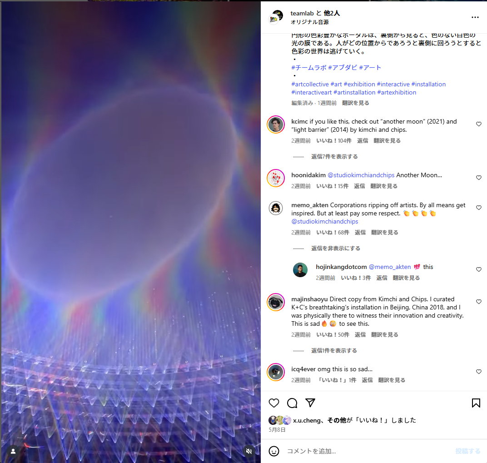
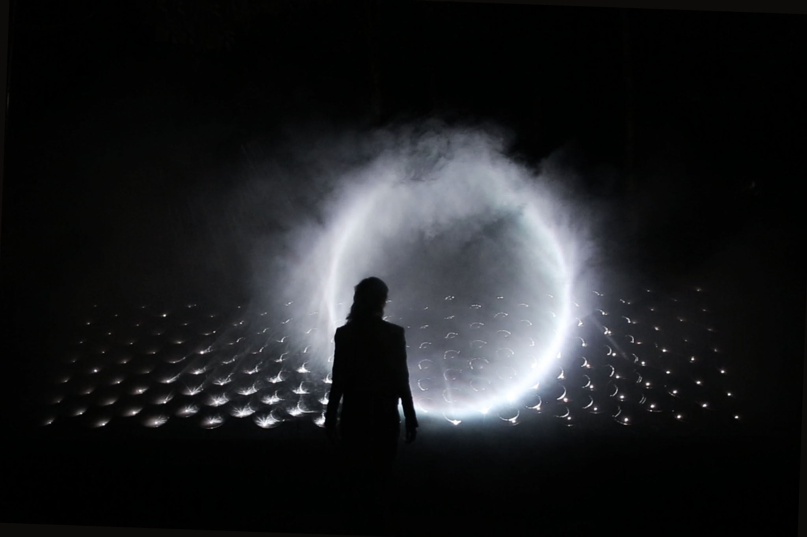

この文章は私のチームラボに関する回顧録と現在のチームラボに対する私の意見を綴ったものだ。

筆を取ったきっかけとなったのは、チームラボのアブダビでの大規模常設展で発表された新作のムービングライト作品がメディアアートユニットであるKimchi and Chipsの作品に似ていると言う議論をInstagramで読んだことである。

https://www.instagram.com/p/DJY9BL6qv9k/

<small>[Light Barrier(2014)](https://www.kimchiandchips.com/works/lightbarrier/)。プロジェクターの光を多数の球面鏡で意図的に散乱させ、反射光のパスを制御して3Dの光の輪を空間上に作り出す。</small>

<small>[HALO(2018)](https://www.kimchiandchips.com/works/halo/)。Light Barrierをさらに発展させ、屋外で太陽光を稼働するミラーで正確に反射させ空間に光の輪を作り出す作品。</small>

<small>[Another Moon(2021)](https://www.kimchiandchips.com/works/anothermoon/)。レーザー光を集めて頭上に光の球を作り出す。このレーザーは、その日の日中に太陽光で発電された電力でのみ生み出される。</small>

---

私は2015~2017にチームラボで働いていた。入社時はちょうどチームラボがお台場の科学未来館での個展をやっている最中だった。働いていたと言っても大学生のアルバイトという立場なのだが、入社時存在しなかったサウンドチームを立ち上げるタイミングでもあったため、複数件国内外展示の機材選定、スピーカー配置、サウンドシステムプログラミング、インストール、現地調整など、音にかかわる作業をなんでもかんでもやらせてもらっていた。2017年に大学院進学で東京を離れたタイミング（teamLab Borderlessに関わるプロジェクトが始まる直前）で離れた。なお、今回の文章では内部事情を大っぴらに話す気はない（が、倫理的に必要だと思った部分は言う）。

Kimchi and ChipsのElliot Woodsが当該ポストに関わるインスタストーリーを上げていたので、DMで私の上記の背景を明かしていろいろ話をした（私は彼らの作品を直接見たことはないものの、Light Barrierをはじめとする彼らの作品は周辺でも知名度が高かったのもあり随分前からフォローしていた）。印象的だったのは、Elliotがあの巨大な集団はどのような意思決定のもと作品を作っているのか？という質問をしてきたことだった。確かに、日本国内であれば代表の猪子のインタビューは至る所で読めるものの、海外からすると極東のよくわからない顔の見えない集団がやたら大規模なデジタルアートを作っているように見えるかもしれない（とはいえ、近年猪子はメディア露出を意図的に減らしているようにも感じるが）。 そこで、この文章は英語でも公開することを前提にして、やや前提的な話も含めて私から見た過去と現在のチームラボの印象について書き残しておきたい。

チームラボは、2025年時点で公式Webサイトによると社員数は1000人[^1]。私が働いていた10年前は400人ぐらいだったと記憶しているので、この10年で倍以上には増えていることになる。採用サイトの情報を見るとわかるが、平均年齢は28.8歳と非常に若い[^2]。ただこれは入れ替わりの激しさも同時に意味していて、結構な人数が数年で辞めてもいる。私が当時働いていた人で知っている人は両手で数えられるかどうかぐらい。

アート分野の人は国内ですら全く知らなかったりするが、チームラボはアート一本で食っているわけではなく、創業当初からWebサイト構築やスマホアプリ開発などを行うソリューション部門を持っている。今の社員の構成比率は知らないが、私がいた当時は半々ぐらいの比率だったはず。この2枚看板の構成は、2000年代に創業した他のWeb・インタラクティブデザインを業とする日本のベンチャー企業、例えばライゾマティクス、WOW、インビジ（Invisible Design Lab）、NAKED、1-10 Design、Whatever(旧ココノエ、PARTY NY、dot by dot)といった企業と創業当時は似通ったものだったと思う。その中で、人数規模的にも、ソリューションビジネスとアートプロジェクトが極端に分かれた現在のチームラボは特異な成長をしたといってよいだろう。

---

チームラボのアート制作のコンセプトは、それぞれに作品ごとにコンセプトが存在しているというよりも、「超主観空間」に代表されるチームラボ全体に通底するコンセプトがまずあり、いくつかの作品のシリーズに連なるコンセプトがまたあり、という感じで、似たような名前やルックの作品でも実際には展示ごとにそれぞれ異なるバリエーションの展開であったり、継続的なアップデートが施されている。[^3]

私の大雑把な理解で短く説明してみよう。初期のチームラボは明らかに日本美術とデジタル技術の融合というモチベーションのもと作品制作をしていた。[花と屍 十二幅対](https://www.teamlab.art/jp/w/flowersetof12/)に代表される、3D空間を日本画のように見える専用のレンダリングエンジンで写したデジタル映像作品である。平面的に見える日本画のような絵とは、逆に3D空間を投影する単一のカメラが存在しないことを意味し、多数の視点が同時に折りたたまれている…我々の生きる世界と作品世界に引かれたカメラという境界のない絵画なのだ。まあ、この辺りの説明はピカソのキュビズムそ知っているからこそそういう再解釈が可能になったのを隠しているだけなのでは？と思わなくもないものの、ともあれ単なるオリエンタリズムとは違う形で、かつデジタル技術を織り込まなければ不可能な形で日本美術の価値を再解釈しているとは思う。

こうした、単一の視点に固定されない絵を見るというコンセプトが、現在のチームラボに代表される、いわゆるイマーシブなインスタレーション＝観客が作品の中に入り込み、誰もが違う絵を見て、作品と鑑賞者の境界が溶ける、という連続性になっているわけである。この点からしても、世間的にいうイマーシブ展示でも、例えばゴッホやモネのようなパブリックドメイン化された芸術作品をインタラクティブな空間で楽しむタイプのものとは、コンセプトレベルでは大きく違うことははっきりしている。無論、観客がその違いを区別できておらず、最終的な鑑賞体験的にも大差ないものになっているのでは？という批判はあり得るが。生憎私はそうしたエンタメ志向なイマーシブ展示に足を運んだことがないためここでは触れない。

チームラボがPACEのようなメガギャラリーとタッグを組んでいることを不思議に思う人も少なくないとは思うが、私は上記の美術史上の文脈をかなり初期から提示しているのが大きいと思っている。ただこれをPACE含めアート業界に押し広げたのはギャラリストの眞田一貫の功績が大きい。日本語ならForbesの2022年10月別冊チームラボボーダレス特集の号で眞田とPACEのマーク・グリムシャーのインタビューが載っているので読むといい[^17]。英語ならチームラボの工藤と、眞田とPACE内でマークと共にチームラボを押し出した立役者であるピーター・ボリスのアートバーゼルでの鼎談が上がっている。



[Collective Efforts: teamLab - YouTube](https://www.youtube.com/watch?v=pmOO6P5AUcU)

---

### プロジェクションとディスプレイからの脱却

さて、現在のチームラボの作品と有名なニューメディアアート作品との類似の問題に移るためにはもう少し時間を進める必要がある。私はこの話題の1つの起点に、映像ベースの作品群が、お台場で大規模常設展のteamlab Borderless(2018、2022年末で閉館し、2024年に六本木の麻布台ヒルズでリニューアルオープン)で1つの完成を見てしまったことがあると考えている。

チームラボはこの展示の時点ですでに、PACEのParo AltoギャラリーやオーストラリアのMartin Browneギャラリー、イギリスのSaachiギャラリーなどのたファインアートのギャラリーに加え、お台場の科学未来館やシンガポールのナショナルギャラリー、アートサイエンスミュージアムといった大規模な館での展示を成功させてはいた。

しかし、Borderlessはそれ以前の展示と比べると、会場規模もさることながら、展示全体の作りがそれまでと大きく異なっている。ゆるさかに作品ごとのエリアとしては分離されているのだが、各作品の中で現れる鳥や花といった物体が他の作品エリアまで飛び出していくのだ。これは、[境界のない群蝶](https://www.teamlab.art/w/butterflies/)のような、作品空間内に置かれたディスプレイとプロジェクション映像の間を蝶が行き来する映像作品のコンセプトを展示全体に発展させたものだ。だが、これを全作品規模に拡張するのは、少なくとも制作側の視点ではまるでレベルが異なる。私はこの展示に関わる前にチームラボを離れていたので、詳しいシステムは知らないが、少なくともそれまでの作品では容易に想像できたであろう「1作品1コンピューター」という形式は崩れさり、「1美術館多コンピューター」という全く別のシステムでの作品作りをすることになったのである（この展示で使われたコンピューターの数は520台ということである[^5]）。

実際のところ、このBorderlessの展示が多くの人にとってどの程度それまでの展示と異なって見えたのかはわからない（そもそも、この展示きっかけで初めて見た人も多かっただろうし）。だが自分が見た時の感想は、その作り込みの驚嘆と同時に、「これ、もうやること無くなったんじゃないか…？」というものだった。

そして、作品世界が接続されまくったBorderless中で数少なく独立した空間になっていたのが、ムービングライトによる光の彫刻作品だった。チームラボにおけるムービングライトの利用の試み自体はもう少し遡って、2015年に徳島で行われた[ケーブルテレビ徳島開局25周年 teamLab Music Festival](https://www.teamlab.art/jp/e/musicfes/)や、その後大阪堂島リバーフォーラムや渋谷で実施された[ミュージックフェスティバル チームラボジャングル](https://www.teamlab.art/jp/w/teamlabmusicfestival2016/)あたりから実験されており、それが展示のフォーマットで結実したものがBorderlessにおける光の彫刻系の作品になる。



[teamLab Music Festival - YouTube](https://www.youtube.com/watch?v=NAtEvYN7g_Y)



[The Haze / 靄の彫刻 - YouTube](https://www.youtube.com/watch?list=TLGGfBYz8EgmmS0yODA1MjAyNQ&v=vN3YXM93ukA)

<small>https://www.teamlab.art/e/borderless-odaiba/ より。2018年のBorderlessの時点でこの部屋には10以上の作品が代わる代わる上演？されていた（開館当初に見に行った際はここまで多くなかった気もするけど）。</small>

興味深いのは、ElliotのトークでKimchi and ChipsのLight Barrier、HALO、Another Moonなどの光で空中に像を作る作品は2008年ごろにクラブのパーティでの実験的な演出に端を発しているという話をしていたことだった[^4]。どちらも最初から展示フォーマットの道具としてムービングライトを使っているわけではない。

チームラボは元々映像フォーマットでない作品-この文章では非ピクセル的作品と呼ぶ-としても、[チームラボボール](https://www.teamlab.art/jp/w/teamlabball/)（そういえばこれも元は音楽フェスでの演出の一環となることを想定して作られたものだ）のようなLEDライトを用いたオブジェクトを使用しての作品制作や、[Crystal Universe](https://www.teamlab.art/jp/w/dmm-crystaluniverse/)に代表される3D上に敷き詰められたLEDをボクセルとして利用する作品を作ってはきた。2018年以降は明らかにプロジェクションとディスプレイを使わない傾向が加速するようになる。チームラボは近年この方向性の作品群に[環境現象](https://www.teamlab.art/jp/concept/environmental-phenomena/)[認識上の彫刻](https://www.teamlab.art/jp/concept/cognitive-sculpture/)といった名前をつけている。わかりやすい例をあげれば他にも、泡を使った[質量のない雲、彫刻と生命の間](https://www.teamlab.art/jp/ew/clouds_macao/)のような作品が挙げられる。しかし、非ディスプレイ・プロジェクション的アウトプットの外側の表現は、それこそ欧米におけるNew Media Artの文脈で様々な取り組みがあるもので、結果的にそれらの作品のスケールアップをしただけのように見えるのではないか。例えば、先ほどの質量のない雲に関しては私は[the blanks to overcome 三原聡一郎](https://mhrs.pb.studio/theblankstoovercome)のことを思い浮かべたし、最初の光の彫刻と同じくアブダビの新作として発表された[Levitation Void](https://www.teamlab.art/jp/w/levitationvoid/)に関してはアニッシュ・カプーア[^7]のことを思い浮かべずにはいられない。

実際にはコンセプトや技術的チャレンジとしての細かい違いがあるようにも見えるし、意図的に彼らの作品をパクって作ったとは思わない[^6]。とはいえ、歴史的な文脈を意図してスキップした結果、大規模な方がオリジネーターに見える現象は確かにあると思う。アブダビの展示は現地を見てないのでなんとも言えないが、あのレベルの（少なくとも個人が助成金を得たりする程度では到底実現不可能な規模の）作品を見た後で、Kimchi and Chipsの作品を見た人が「チームラボのパクリじゃん/劣化版じゃん」と思う可能性は、まあ現実的にあり得るだろうなと思ってしまう[^8]。Elliotも、チームラボを訴えたいとか自分たちがオリジネーターであることを強く主張したいわけではないが、存在が無かったことにされることへの危機感を口にしていた。

チームラボ側からしてみればこうした作品との類似性や文脈を明示することにはなんのメリットもない。別にそんなことしなくても客は入るし。いろんな批評のし方が考えられるとは思うのだが、この文章の残りでは個別の作品の類似性の是非については触れずに、「訴訟の件から考えるチームラボを批評する別の方法」という点、「コレクティブ/企業/法人としてのチームラボが理念に沿った行動をできているのか」という点の2つに絞って私の意見を書いておこう。

## 訴訟の話

これまたよく知られた話ではあるが、チームラボは近年、むしろ彼らの後追いのイマーシブ展示に対して複数件の訴訟を行っている。2021年に中国の会社に起こした件では勝訴[^9]。ニュースとしても大きく取り上げられたアメリカのMuseum of Dream Space（MODS）には部分的に勝訴（そのニュースの時点ではまだ今後陪審員の裁判に移るとのことだが）[^10]。 韓国の会社でラスベガスでやっているArte Museumとの訴訟は棄却された？詳しくないのであんまりわかっていないが[^11]。 

この件に関しては元1-10デザイン、現BASSDRUMの森岡さんがすでに意見を述べており概ね同意できるところである。[^12]

[メディアアートとパイオニアと名乗ることの難しさについて｜Toyoshi Morioka](https://note.com/toyoshimorioka/n/n40eb95d35847)
 
私としてはこれらの訴訟に対する印象は、過度に業界を萎縮させるレベルの訴訟を行なっているとは思っていない。例えば私の知り得る限りでは、先述したゴッホやモネをイマーシブ展示として魅せるようなものにまでは訴訟を広げていない。MODSはそもそも広報写真でチームラボのものをそのままパクったという疑惑もあるのでさらに怪しいところだが、まあ、それを抜きにしたって似せすぎだろうとか、チームラボがいなくて自動的に出てくるような展示じゃあないだろうと直感的には思う。
  
ただ私が注目したいのは、チームラボがこの訴訟でMODSに対する主張のなかで「**全体的なコンセプトや印象が実質的に類似している**」と述べていることである。私はこの訴訟の話を聞いた時に、チームラボとしては、MODSのような見た目だけ類似したデジタルアート展示を放置しておくことによって、チームラボが培ってきた超主観空間のような哲学やコンセプトが形骸化し、チームラボまでもがそういった表面的な見方をされることを危惧しているのではないかと捉えた。（まあ、それはつまりKimchi and Chipsがいま持っている危惧に近いとも思うけども。）

だが、後続する作品との違いを明示してしまうと裁判には勝てない。だからチームラボは「コンセプトや印象が実質的に類似している」と言わざるを得ない。**しかしそれはMODSの薄っぺらいインスタ映えするデジタルアートと彼らの作品が「似ている」ことを認める**皮肉にもなってしまっている。半分冗談ではあるが、私はMODS側は訴訟で「*我々の展示はチームラボとは表面上似ているがコンセプト的には全く違っていて、超主観空間などどうでもよく、とにかくインスタ映えして楽しければそれでいいだけのものとして作っているから問題ない*」と主張してしまえばよかったのにと思っている。
 
<small>（ちなみにMODSは自分たちの展示をこのように説明している。
 
> The design concept of MODS is inspired by art design from Yayoi Kusama (famous of infinite rooms) and the development of digital art. The aim of MODS is to provide an immersive, magical and unique art appreciative experiences to the visitors.

https://jp.linkedin.com/company/museum-of-dream-space-mods

"the development of digital art."ってなんやねん。自動的にデジタルアートが発展するとでも思ってるんだろうか。）</small>

ともあれ、訴訟がやり過ぎだとは言わないまでも、「その程度の有象無象、捨ておけばよかろう」とも思うわけだ。 めちゃくちゃ嫌な言い方にはなるが、私はこれ以前のチームラボの態度は（森岡さんの記事で触れられている、ココノエのらくがき水族館とチームラボのお絵描き水族館の件も含め）、「たまに既存のものと似たもの作るかもしれないけど、俺らはそれにちゃんとした哲学やコンセプト与えているし、逆に誰がどんなにチームラボの作品をパクろうが気にしない」というものだと捉えていたので、ちょっとがっかりしたのが本音だ。

もちろん、この態度だったとしても弱肉強食すぎて問題だらけだとは思うのだが、まだこっちの方がアート制作集団としては一貫性を保てたように思うのだ。その理由を説明することは、結果的に現在のチームラボ批評に足りてないものを説明することにもなると思っている。宇野常寛の批評を含め、既存のチームラボ批評は概ねチームラボおよび猪子の主張するコンセプトを受け入れ補強するものとなっているが、この訴訟問題と引きつけて考えた時、仮にシステム的にチームラボと類似した展示を作れば、超主観空間などの彼らのコンセプトも同時に実現されたことになるのだろうか？という問題が立ち上がる。もっと単純化して言えば、**インタラクティブであればなんでもよいのか？** 。

私の答えは当然NOだ。そんなわけあるかい。これは特に同業と話すときに話題になるのだが、他のエンタメ的な展示も含めて比較した時にチームラボの展示は3DCGの作り込みやインタラクションの設計の質が非常に高い。これは現在の状況を考えると使えるマシンスペックやプロジェクターの性能のような予算規模の問題もあるが、私が働いていた当時の状況や予算感だったとしても、チームラボは同業他社と比べると現地調整に異常に時間を掛けていると思う。同じ作品であっても部屋の明るさや他の作品との位置関係、使うプロジェクターの機種、施工された壁の色の微妙な違いによって絵の写りは毎回異なる。だからプロジェクションの作品は色味やシェーダーの微妙なパラメーターなどを毎回調整している。センシングの反応速度なども毎回最終的に細かい追い込みを掛けている（そして、私の知る限りではその微調整のかなり細かい部分まで猪子は判断に関わっていた）。

もちろん、こうした話は施工現場を見たことがある人でないと知り得ない情報だから美術批評からは抜けても仕方のない部分ではある。この「質」がなんなのか説明するのは難しいが、確かなのは既存の美術批評の語彙で説明されるものよりも、ゲームやWebデザインにおけるインタラクションデザイン、モーショングラフィックスの分野における微調整における美的判断に近いものであることだ。

つまり、**チームラボは単にデジタルアートの制作に日本美術や現代アートのコンテキストを持ち込んだことそれだけで価値が保証されるのではなく、大勢のエンジニアの数多な微調整という仕事によってこそ、コンセプトの体現が下支えされている**。既存のチームラボ評からはその点が欠落している。

これを別の言い方にすると、チームラボの仕事をゲームアートの視点から評価することが欠けているとも思っている。ゲームアートというと、インディーゲームのように小規模なチームが大資本に頼らず切れ味のあるコンセプトのゲームを発表する、あるいはゲームのフォーマットを現代美術の中に持ち込むといったイメージが強いかもしれないが、チームラボの作品制作は労働環境という面で考えると、いわゆるメガヒット作を数千人規模のゲームタイトル制作とかなり近い。少なくともコレクティブ的にデジタルアートを作る他の会社（例えばライゾマティクス）と比べた場合には。

ただしその作品は具体的な点数やストーリー、ゴールがあるわけでもなく、既存のゲーム批評の語彙で作品のクオリティを図るのが難しいのもまた事実である。これを書きながら思い返した作品は日本の視覚表現を扱うメディアアーティストのパイオニア岩井俊雄が2000年代にコンシューマーゲームのフォーマットで作品を発表したことだ（Nintendo DSで発表された[エレクトロプランクトン](https://www.nintendo.co.jp/ds/dsiware/electroplankton/index.html)など）。この作品もやはり、具体的な点数や目標の存在しないものであり、ゲームとしての売れ行きも芳しくはなく、ゲーム業界からはどう評価していいのかわからない作品だったと思う[^15]。かといって、この作品の良さを語ることは、コンセプトや哲学といった美術批評の言葉だけでもできなかっただろう。だが今のチームラボの批評で足りていない要素とは、岩井の当時の作品が出た時に美術批評やゲーム批評でやり損ねた課題がいま再び帰ってきただけのことにも思える。

いずれにせよ、チームラボが後続のイマーシブ展示を「似ているから」という理由で訴えることは、チームラボの作品の良さを結果的に自壊させる方向に導くのではないだろうか。それよりもチームラボのコンセプトを成立させている技術やエンジニアリングが何かを開いていくことは、チームラボにとっても日本美術やニューメディアアート、ゲームなど他の文化との接点を増やし、彼らの評価を安定化させることにつながるのではないか。そしてそれは繋がった先の-Kimchi and Chips含むニューメディアアートの作家たちにとっても良いことになるのではないか。

## 法人としての芸術家

さて、ここからは半ばクソ長い余談である。もう1つ私がチームラボとその評価に対して考えていること。そもそも私がチームラボで働いていた理由の1つに、集合的なクリエイティビティについて、現場に身を置いて考えることで、逆に1人でなければ作れない作品について考えたいというものがあった。（だから、同タイミングで山口情報芸術センターのInterlabという、ある意味で対照的な「ラボ」にもインターンに行ったりした。）

それから10年近くこのテーマは自分の中で常に傍に置いて考えていたのだが、結果としてはチームラボという「ウルトラテクノロジスト集団」の作家としての特異性は、大量のエキスパートが集まることによる集合的なクリエイティビティの発揮というよりも、作った作品が1つの法人というバーチャル人格にラベリングされることに集約されるのでは、という結論に至った。

先ほどゲーム制作の労働環境との類似性の話をしたが、ゲームの場合は作品に関わった末端の一人一人までクレジットがなされるのが普通である（そしてそれは映画に由来するものだと思うけど）。これは、大規模なアートスタジオである村上隆の展示でバイトの一人一人までクレジットされるのとも似ている。実際に見たことないけどオラファー・エリアソンとかもそうなんじゃなかったかな。

しかし、チームラボの作品では誰がこの部分を担当した、みたいなクレジットがされることは基本的にはない。この点は、今どういう風に伝えられているかは知らないが、私が働いていた当時は、「個別の作品に誰がどう関わったかに関わらず、Web（ソリューション）の人も含め、全員のコントリビューションがあって作品が成立してる」から、どの展示であっても個別のクレジットはされない、という説明を受けたと記憶している。なので、逆に猪子の名前が特別クレジットされることもないし、個人のポートフォリオの中でどの作品に関わったかを書くことまでは止められなかった（ただし技術的な詳細を公開することは原則NG）[^13]。この理由付けは、特に当時のチームラボが「ソリューションで稼ぎ、アートで名を売る」という体制だったことにも起因しているだろう。

会社＝法人(juridical person)の中で作ったものは個人ではなく職務著作としてその法人に著作権が帰属する。考えてみると、現代美術の中でそのレベルで個人のコントリビューションがほとんど見えない形で、「アーティストとして法人である」ことを徹底しているコレクティブはチームラボくらいかもしれない。

ゲームであっても、結局その評価をする際にはそのプロデューサーやディレクター、またはリードエンジニアのような代表的個人の抜粋による批評に頼りがちだ。テクノロジーアートであっても、E.A.Tや、日本のCTG、ビデオひろばなど、結局は有名な個人の集まりと言う形での認識をせざるを得ない。これはどちらかというと私の研究上の興味ではあるが、メディア史や科学史、芸術史などの歴史学の中では、スタープレイヤーだけでなく無名の大勢の歴史的貢献をどのように描けばよいのか、という論点がある[^14]。

特にチームラボのような人員の入れ替わりの激しいコレクティブに置いて、前のエンジニアから継続して引き継がれたノウハウやテクニックも多数存在するだろう。そうした蓄積の評価をどうしたらできるのか、私にもまだわからない。ただ、いまチームラボという法の下の人は、その人気と評価に反して結局美術史ともテクノロジー産業とも繋がりを持たず、非常に孤独に思える。

### デジタルアートのオーサーシップ

集合的製作者としてのチームラボについてもう少しだけ書いてみたい。それは、自由ソフトウェア運動・オープンソースカルチャーがデジタルアート・ニューメディアアートにどのように影響を及ぼしてきたのか、という点だ。

チームラボを含め、2000年台のITベンチャー企業は情報技術という実体のない（と、少なくとも当時はそう思われていた）ものを商売として新規開拓してきた。その中でも、特にWeb技術をベースにした企業はデータやソフトウェアそのものを売り買いするのではなく、それを作る労働を売り買いにすることで、ソフトウェアは誰もが自由に実行でき、データはなるべく誰もが使える形で共有されるべきだというオープンソースカルチャー（ただし、プロプライエタリなソフトウェアビジネスを否定するわけではない、マイルドなもの）と結びついて成長してきた。

ニューメディアアートの分野においてオープンソースカルチャーとの付き合い方はこの10年で結構大きな変化があったと私は感じている。代表的なものとしては、[openFrameworks](https://openframeworks.cc/)のようなオープンソースのクリエイティブコーディング環境が徐々に使われなくなり、[TouchDesigner](https://derivative.ca/)のようなプロプライエタリなツールや、[Unity](https://unity.com/)、[Unreal Engine](https://www.unrealengine.com/ja)といったゲームエンジンが業界を席巻したことが挙げられる。2010年代当時からUnityはoFと同じように使われてはいたものの、広告代理店やそこから仕事をもらうデジタルクリエイティブ産業全般の労働形態が、ある会社はゲーム産業に近より（当然、チームラボはこちら側）、ある会社はデザインスタジオやコンサルタントに近い小規模な体勢をキープし、前者に近いほどUnityなどのゲームエンジンが労働形態としてもフィットし、後者はTouchDesignerや、細々とoFなども使い続けるという変化だったのではないか、と思っている。

これはオフレコな話なのでこの記事を書いたことで怒られるとすればこの部分なのだが、当時チームラボのメンバーで個人でVJなどでも活躍していた数人がCG技術の同人誌を書いて販売したことがあった（ちょっと探せば今でも見つかる）。内容は直接チームラボの作品を解説したものではなく、ある表現のための技術的なチュートリアルがメインの内容ではあったが、当時社内でそれなりの怒られが発生して販売活動を停止したと聞いている。

ゲーム産業であれば、場合によっちゃゲームエンジン自体から内製で社の重要な資産であり中身のシェアなんてもっての外、という文化が当然だったりする（それも、ここ数年で多少なり変わってきているとは思うけど）。FlashやWebデザインを出自とするデジタルクリエイティブ産業は何をシェアし、何を売り物とするかを人数規模に応じて微妙に変化させながら今日まで続いてきている。チームラボと対照的な態度としては、ライゾマティクスの真鍋大渡がソフトウェアのみならず、[作品制作のためのサーベイを公開](https://scrapbox.io/artresearch/)していることがある。（自作のどの作品がどれを参照している、というところまで明示しているわけではないけど）

ただ、ゲームとの違いで言うと、仮にゲームで商用利用なライセンス(MITやApache、LGPL)のオープンソースソフトウェアを利用している場合でソースが公開されていなくとも、クレジット表記が入る（ほとんどの人は気に留めたことがないとは思うが）。だが、そうしたライセンスのOSSを使って作られた展示作品を鑑賞する際には、OSSのクレジットは表示されない。鑑賞者はそのアプリを使って作られた体験を買っていて、アプリケーションそのものが再配布されているわけではないからだ。これは先述したチームラボ作品のクレジットに個人の名前が載らない話と根っこは同じだと私は思う。突き詰めると、コンピューターを用いた作品制作はそれ以外の制作と比べて明らかに集合的な知識と労働に乗っかることで成り立っており、そうした作品のオーサーシップとコントリビューションの可視化は、チームラボ以外の小規模なメディアアート作品においてさえ明らかに議論と実践が不足している（自戒も込めてだけど）[^16]。

そしてチームラボに話を戻して言えば、彼らがオープンソースの文化や、既存の産業にフリーライドしているとまでは思わない。だがチームラボの製作は顔の見えない誰か達（と、そこで使われているソフトウェア公共財を築いてきた者たち）が構成する株式会社チームラボという法の下の巨大な顔無し巨人が作り上げたものであり、そのギミックと中身は隠されていなければ成立していない（そうでなければ訴訟を起こすわけがない）。マジックの中身は暴かれてはいけない。

チームラボが目指す境界のない世界はチームラボ以外の主体であってはならない。チームラボの目指す世界と実際の態度の間にはどうしてもこの点が矛盾を抱えているように思えてならない。

## 都市開発の部品としてのテクノロジーアート

すまん、まだ続けていいか？別にそこまで小難しいこと言わなくても、チームラボが目指す理想はご立派なこったけど、別にそれって営利企業のフォーマットでやることじゃなくね？ってだけのことかもしれない。

Forbesの眞田一貫のインタビューの中にこんな一説があった。

> 眞田はチームラボ・猪子に、「何を目指しているのか？」と聞いたことがあるという。その時猪子から返ってきた答えは「どんな分野なのかわからないけど、とにかく世界のトップに行きたい」というものだった。（p24）

私がこの論考を書きながらチームラボに関する書籍を読み漁って、最も実感と一致したのは結局この一説だった（実際このエピソードは私の在籍時にもどこかで聞いた記憶がある）。いろいろ言うとるけど結局少年ジャンプの成り上がりストーリーだったんじゃん。

っていうかさあ、その程度の話は10年前からチームラボに批判的だった人たちは大体みんなうっすら感じていたんじゃないんですか。そのうち誰か批評家が正面切ってケチョンケチョンに言うもんだと思っていたらせいぜいTwitterかFacebookでお気持ちを表明したのが関の山で気が付いたら10年経ってたんだが。気づいたら文量がおかしなことになってきてるけど、原動力の半分はそういうイラつきの蓄積かも。それとも思ったよりみんな心の底からチームラボのことが好きだったんだろうか。

この話やめよう（これを言い始めるとチームラボ以外にも全方向に刃を投げ散らかすことになってしまう）。アブダビのとんでもない規模の展示をオープンさせて、チームラボは何のトップかはわからんけども何かしらのトップになっただろう。少なくとも、2018年に私が思っていた時よりは多くの人がなにかの頂点に辿り着いてしまったように思うのではないか。じゃあ猪子は、トップになったら次は何をしたいと思っているのだろう。

テクノロジーアートの分野含め、多くの小規模なアーティストとは異なる生き方・稼ぎ方を開拓してきたチームラボではあるが、私はアブダビやサウジアラビアのジェッダへの進出を経てむしろ他のアーティストと同列の生き方を選択することになっているのではないかと思う。

日本では今、2000年代からひと時活発になった地方芸術祭における街おこしや地方創生に組み込まれる芸術の場が、コロナ禍と東京オリンピックを経て都心の不動産デベロッパ（渋谷を開発する東急、新宿の小田急、高輪ゲートウェイのJR、天王洲の寺田倉庫、有楽町の三菱地所）による都市開発のノウハウに組み込まれはじめている。そこには、地方芸術祭で培われたコミュニティ形成や地域の問題発見やあらたな街の価値の創出といった文脈ももちろん引き継がれているが、大局的にはこれから人口減少の一途を辿る日本が無理なく可能である稼ぎ口としての、観光立国的な経済振興の動きとも呼応している。

そして、この動きはチームラボが2010年代に日本中のありとあらゆる地方美術館とショッピングモールで[未来の遊園地(Future Park)](https://futurepark.teamlab.art/places/?type=archive)を開催してきたのが、コロナ禍あたりを境に中国や中東といった国外大規模都市に活動の軸足を移してきた動きに対応している。

こと、ジェッダはサウジアラビア政府からの依頼[^18]で作っているし、アブダビに関してはほぼチームラボのために街一帯を開発するプロジェクトという様相を呈している。結局これらも、中東諸国が石油資源を切り売りするだけの国から観光立国へとシフトしようとしているのにフィットするパーツとしてうまく取り立てられたようにも見える。（予算の規模を比較すると泣けては来るが）

少なくとも2019年の宇野との対談まとめ本では地方にチームラボの未来の遊園地がたくさんできることにたいして猪子は意識的でいたし[^20]、賛否あるだろうけど私は地方ショッピングモールのチームラボで子供が遊ぶという図式には割と肯定的でいたし、少なくとも筋が通った活動のように思えた。

それ以外にも、チームラボはあまり知られていないが建築のプロジェクトでは街づくりのレイヤーに観光資源とは異なる形の関わり方を見せている。私はこれらの取り組みこそもっと評価されてもいいと思っている。

[鎌倉市／―「新しい市役所」のイメージの具体化―新庁舎等基本設計等業務公募型プロポーザルにおける最優秀提案者の決定について](https://www.city.kamakura.kanagawa.jp/kisya/data/2024/20241004-1.html)

[キッズラボ南流山園 | teamLab Architects / チームラボアーキテクツ](https://architects.team-lab.com/jp/projects/kidslabo-nagareyama/)[^19]

そして、ちょうどこの記事を書いているときに、京都駅前のチームラボの展示のニュースが流れてきた。

[チームラボの常設ミュージアム「チームラボ バイオヴォルテックス 京都」。京都駅東南部エリアに今年秋オープン　- 美術手帖](https://bijutsutecho.com/magazine/news/exhibition/30800)

運営会社の3年前の計画にはこんなプランが書いてある。

https://www.adkco.jp/news/n220729/

> ■アートミュージアム
> 新作をはじめとした、チームラボのアート作品を複数展示予定です。世界中のクリエイティブクラスをはじめとした多くの人々のデスティネーションとなることを目指します。そして、エリアへの回遊性をデザインし、エリア全体の活性化を目指しています。
> さらに、アートミュージアムは、来館者に観賞していただくだけではなく、京都市立芸術大学をはじめとした京都の学生が、作品創造の実験の場として使用できるプラットフォームになることを検討しています。チームラボのミュージアムには、数百台のプロジェクターやセンサー、ムービングライト、基盤になるコンピューターなど、さまざまなデジタル機器が世界にも全く類を見ない規模で設置され、互い機器がネットワーク化されています。そして、それらを連動させて動かすためのミドルウェアも独自に開発しています。デジタルテクノロジーなどを利用した新しいアートや創造的活動において、設備や機材がなければ、作品の実験もできない上に、想像もしにくいという現実的な問題があります。学生には、これらの設備や機材に触れる機会を創出し、デジタルテクノロジーなどを利用したアート、もしくは創造的活動における、設備のある、実践的な教育機会の場となることを目指しています。

願わくばこの京都の展示が、チームラボを観光都市の客寄せパンダとして利用するだけでないものであっては欲しい。

遊園地を現代のメディア環境に合わせてアップデートするのは価値のあることだと思う。しかし遊園地の規模をどれだけ大きくしても、大きな遊園地にしかならない。それはチームラボのどれだけシリアスなアート展示においても変わらないと私は思う。チームラボが祝祭と非日常から抜け出して、我々の生きる日常に進出してくること。その時はその時の賛否がいろいろあるだろうが、少なくとも私はそちらの未来の方が見てみたいと思っている。トップをとってやることがなくなってたらそういう方向性はいかがですか。

---

あとがき。これだけ偉そうなことを垂れて、私がチームラボを辞めてしばらく、チームラボではできなかった何かをやれているかは自信がない。大学でペーパーワークをやっていると、10年前の仕事の動きの速さを思い出して温度差で風邪をひきそうになることもある。私が今研究で考えていることの根底にチームラボでの経験は良かれ悪しかれそれなりに影響を及ぼしたのも事実だ。その成果は私が死ぬまでにはなんらかの形で世界に還元できるように努めたい。

もし今（も）チームラボで働いてる方とか、読んだ方の中で、これ間違ってるよとか、ここおかしいと思うとかあったら是非お話ししましょう。

me[at]matsuuratomoya.com

https://social.matsuuratomoya.com

[^1]: [About | チームラボ](https://www.team-lab.com/about/)
[^2]: [採用情報｜チームラボ](https://www.team-lab.com/recruit/)
[^3]: 昔はこの辺を説明するのも一苦労だったんですが、ちゃんとWebサイトに整理されたんだなあ。[CONCEPTS | teamLab](https://www.teamlab.art/concept/)
[^4]:[Components. Artist Talk Series #2: feat. Elliot Woods\[Kimchi and Chips\] & 藤本実\[MPLUSPLUS\] - YouTube](https://www.youtube.com/watch?v=0ijInyCQBKc)
[^5]:[520台のPC、470台のプロジェクター！お台場に「チームラボ アスレチックス　運動の森」 | お台場ガイドTOKYO](https://odaiba-guide.tokyo/teamlab-borderless-athletic-open-info/)
[^6]:この点、Elliotは意図してパクっていなくてもCryptmnesia（無意識化に着想を受けたことを忘れて自分で思いついたのだと思ってしまっている）的な状態である可能性はあるという話をしていたが、個人的にこれは作品によりけりかな、、と思う。Levitation Voidに関してはカプーア知らずに作ってましたは無理だろうなと思うし、わかって差分を作っているという認識だと流石に思うが…。
[^7]: 例えば [ジュゼッペ・ヴェルディ『シモン・ボッカネグラ』 新国立劇場のアニッシュ・カプーアの舞台美術](https://realtokyo.co.jp/en/performance/simon-boccanegra/)とか。
[^8]: カプーアやオラファー・エリアソン、ジェームズ・タレルとかだと、まあ突っぱねられるのかもとも思ってしまうけど...
[^9]: [TeamLab Wins Its Lawsuit Against a Chinese Company That Replicated One of the Collective’s Immersive Art Experiences](https://news.artnet.com/art-world/teamlab-wins-copyright-case-china-2049729)
[^10]:  [チームラボ、没入型アートの著作権侵害で米国企業を提訴。両者の主張は？ | ARTnews JAPAN（アートニュースジャパン）](https://artnewsjapan.com/article/205) [TeamLab Wins an Early Victory in Its Copyright Suit Against an L.A. Museum It Says Copied Its Immersive Installations](https://news.artnet.com/art-world/teamlab-copyright-lawsuit-mods-victory-2242654)
[^11]: [teamLab Inc. v. Arte Museum LV, LLC et al (2:23-cv-01956), Nevada District Court](https://www.pacermonitor.com/public/case/51475557/teamLab_Inc_v_Arte_Museum_LV,_LLC_et_al)
[^12]: ただ、Crystal Universeの部分に関しては、あれが制作された2015年当初、NeoPixelとかはあったにせよ、数千発、数万発規模のLEDをLAN経由でアサイナブルに制御できる環境は一般的ではなかったと思う。私が関わった時点では特注品を作ってもらった上でバカみたいに不調が出まくっており、単なる技術的なチャレンジとしても結構頑張っていたような記憶がある。チームラボが大々的に作品に使ったからこういう大規模なLEDがアリババとかで売られるようになった、、、かどうかはわからないし多分違うのだが、少なくともチームラボが作った当時に安くて手軽に手に入るメディウムでなかったのは確か。またCrystal Universeのもう一つのチャレンジはLEDの3Dマトリクスをボクセルディスプレイとして扱う部分が大きく、3D空間上のデータをマトリクスにレンダリングするエンジンにこそ独自性と新規性があったので、よくあるような草間彌生を先行例として挙げることは的外れに思う。ついでに言えば、そのレンダリング技術はさらに先行する[チームラボクリスタルツリー](https://www.teamlab.art/jp/w/crystaltree/)などの商業的インスタレーションでの積み重ねがあってのことでもある。なのでここは正直先行者利益みたいなものをチームラボが享受してもある程度はいいのかな、、、と心情的には思ったりする。バイアスかかってるとは思うけど。
[^13]: チームラボの音楽を長年社外で担当している音楽家の高橋英明さんのような例外はあるんだが。
[^14]: 例えば私の専門分野では、アポロコンピューターに使われた磁気コアメモリが多数の女性工員の手仕事で作られていたことを歴史上にどう描き出すか？というテーマを扱ったDaniela Rosnerの"[Critical Fabulation](https://mitpress.mit.edu/9780262542685/critical-fabulations/)"がある。
[^15]: [Amazonのレビュー](https://www.amazon.co.jp/dp/B0007XQ3Z6)とかを見てみると雰囲気を感じ取れると思う。
[^16]: 前述のトークにてK&CのElliotにもこの点どう考えるかを聞いてみたところ、「作品を作るためのツールを公開するけど作品そのものを公開するわけではないよね。Adobe Premiere的なソフトウェアを公開する人はいても、Premiereのプロジェクトファイルを公開するわけではないような感じで。」というような話をしていた。それから、自分のやっていることがパクられないために（あるいはパクリではないと差分を証明するために）公開してる面もあるのかもと言っていた。 
[^17]: [8/31特別号刊行！ Forbes JAPAN × チームラボボーダレス | リンクタイズ株式会社のプレスリリース](https://prtimes.jp/main/html/rd/p/000000131.000017289.html)
[^18]: [サウジアラビアに誕生した「チームラボボーダレス ジッダ」をレポート。世界遺産の街に常設される巨大なミュージアムで彷徨い、遊び、新たな感覚を開く｜Tokyo Art Beat](https://www.tokyoartbeat.com/articles/-/teamlab-Jiddah-report-202406)等を参照。
[^19]:  [チームラボアーキテクツが千葉の保育園設計、デジタル使わず多角形や色で多様性育む | 日経クロステック（xTECH）](https://xtech.nikkei.com/atcl/nxt/column/18/00585/050300093/#:~:text=%E3%83%81%E3%83%BC%E3%83%A0%E3%83%A9%E3%83%9C%E3%81%A8%E3%82%AD%E3%83%83%E3%82%BA%E3%83%A9%E3%83%9C%E3%81%AF,%E6%96%B0%E8%88%88%E4%BD%8F%E5%AE%85%E5%9C%B0%E3%81%AB%E3%81%82%E3%82%8B%E3%80%82)（チームラボアーキテクツが手がけている株式会社キッズラボの保育園は会社の名前自体は似ているけど別会社なので注意）
[^20]: [CHAPTER7「地方」のポテンシャルを引き出したい（猪子寿之×宇野常寛『人類を前に進めたい』より）｜PLANETS](https://note.com/wakusei2nd/n/n66e5b2707bdc?magazine_key=m7ad931a7c807)