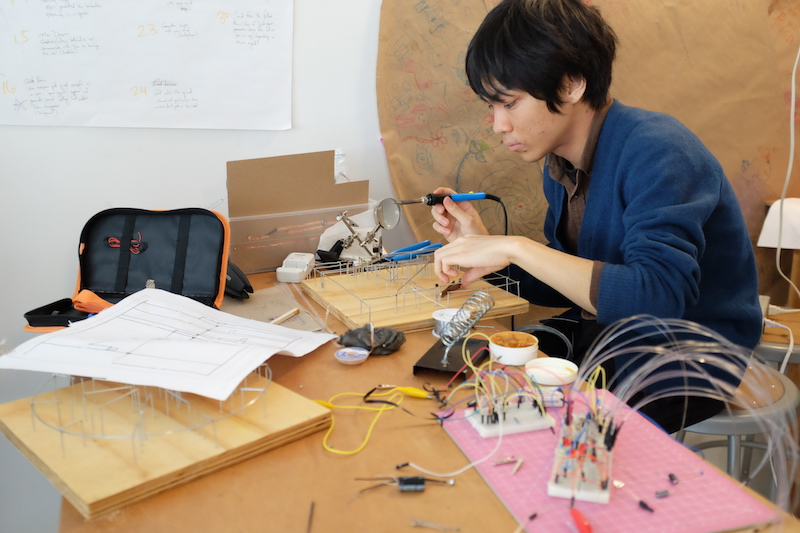
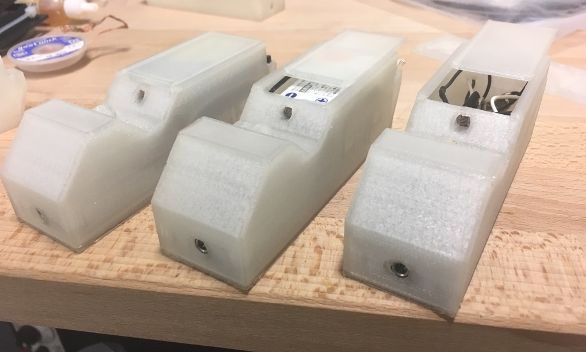
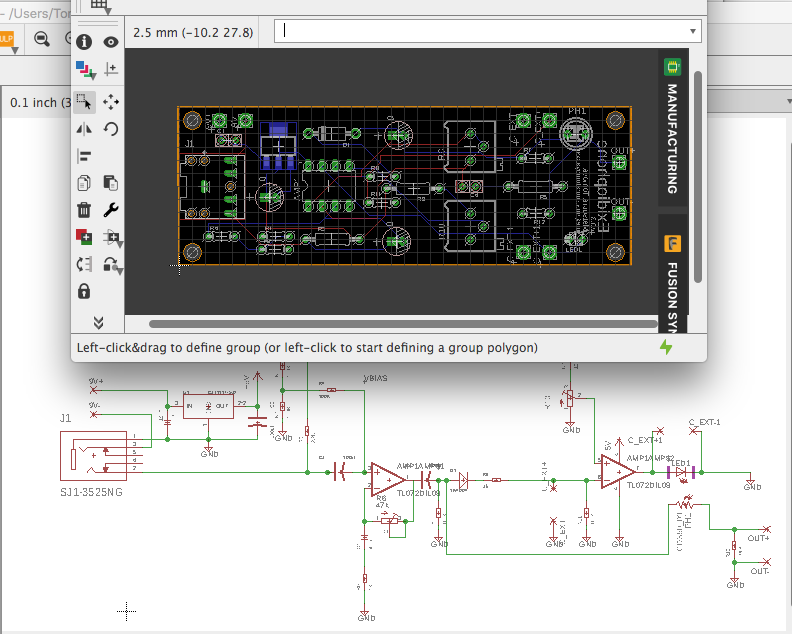
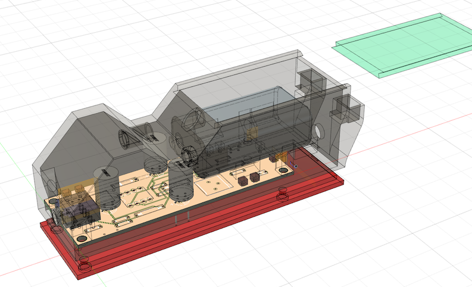
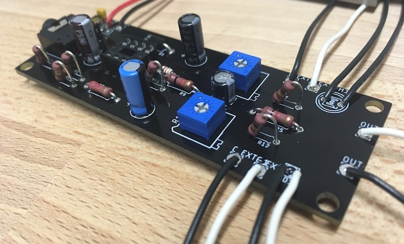

松浦知也は現在2019年のお仕事を募集しています。

# Summary

[CV PDF(英語のみです！)](https://www.dropbox.com/s/q6ptsm6bz7yb6pl/TomoyaMatsuuraCV2019-Work.pdf?dl=0)

[Linkedin](https://www.linkedin.com/in/matsuuratomoya/)

- 松浦知也は2019年に掛けてのお仕事を募集しています

- Cycling'74 MaxやOpenframeworksでのプログラミング、特に音響周りは理論を真面目にかじっているので得意です
- ただのプログラマというよりも、ハードウェア構成の提案から作曲まで全部こなせる小回りが効くところが特徴です
- まだお仕事ではやっていないですが、デジファブやPCBの基板製造などのハードウェアもやってます

- 基本フリーランスのつもりですが、フルタイムのお誘いも頂ければ検討します
- 今年は福岡ベースでやるつもりですが、内容によっては移住もありです
- 福岡にいつつも、去年はリモートで何本か仕事をこなしました&実家が神奈川なのでそれなりに気軽に東京に出られます
- 年間売上400万ぐらいを目指していきたいです
- 9月後半のみスケジュールが確定していますがそれ以外はいけます

# あなたは誰ですか

松浦知也（まつうら ともや）です。1994年生まれで、神奈川県出身の現在福岡市在住です。

<small>筆者近影(撮影:Tiriree Kananuruk)</small>

**SoundMaker**という肩書きを名乗って、普段はアーティストとして展示作品を作ったり、楽器を作って演奏したりしています。

この二年間は、九州大学大学院の芸術工学府というところでメディアアートを専攻し、そうした作品制作を論文に書いて学会に出していたりしました。気になる人は[Research](/research)のページをあとで覗いていただければと思いますが、一応査読のついた国際学会にも通したりしています。

また、2年前までは[teamLab](https://teamlab.art)という会社でサウンドエンジニアの仕事でプログラミングをしたり、海外含め展示の音響周りの設営をばんばんやっていました。学部3年の夏は丸2ヶ月[YCAM(山口情報芸術センター)](https://ycam.jp)でインターンをしていたりもしました。去年の9~11月は[School for Poetic Computation](https://sfpc.io)というNYにあるアーティストラン・スクールに留学していました。

今は修士論文を書いている真っ最中なのですが、4月からの予定が完全に未定です。
フリーランスやる以外のプランもいくつか無くはないのですが、自分のやりたいプロジェクトの実現のために一旦お金を貯めたいと思っているのと、もう少し視野を広げていろんなお仕事がしてみたいと思っています。

# なにやる人ですか？

お仕事としては、サウンドプログラミング、サウンドデザイン、アーティストのテクニカルサポート、作曲、などなどができると思います。

# 仕事でやってきたこと

実際お前は何ができるやつなんだ、というのが想像しづらいと思いますので去年フリーランスとしてやったお仕事を紹介します。

一番大きかった仕事は、ミラノデザインウィークで展示された東京相互木材市場さん、椎茸祭さんの[Tree of gods YAKUSUGI 〜EUR 1 Million Table〜](http://www.mokuzai.co.jp/yakusugi/)でした。



屋久杉一枚板のテーブルにプロジェクションをする映像コンテンツで、観客が手をかざしたりすると映像もリアルタイムで変化します。

松浦はこのコンテンツのための4chサラウンドの音楽制作、効果音のサウンドデザインを行いました。

この案件はハードウェア(スピーカーとか、オーディオインターフェース、ケーブルなど)の構成を予算に合わせて提案する、図面を見ながら配置を相談するところから、実際の作曲、プログラミングにあたるまでまるまる担当しています。

現地には別の予定が先に入っていたので残念ながら行けなかったのですが、現場のセットアップもハードウェアを設置してもらって以降はすべてリモートでおこないました。

個人的に面白かったというかうまくやれたなと思うのは、全てを一人で賄っているため音楽の作曲とプログラミングがほぼ一つのプロセスに収まっているところ、しかも4chの自分で提案したシステム専用に作り込めてしまうところです。

↑が実際に使ったCycling'74 Maxのプログラムの画面です。この中で更に[Faust](https://faust.grame.fr)という別の言語を使用し[^faust]、シンセサイザーやエフェクターのアルゴリズムをフルスクラッチで書くみたいなことを作曲の一要素としてやっています。グラフィックス側の情報をUnity側からOSCで送ってもらってリアルタイムに変化させている部分もあります。

いわゆるゲームやデジタル広告でのインタラクティブミュージックというと曲の一部分をあらかじめ書き出しておいて足し引きしたり（縦の遷移）曲の展開を条件づけして変える（横の遷移）ことをするのですが、**はじめからプログラミングをやる前提なら音楽的にもチャレンジングな事ができる**ので個人的にも楽しいです。(縦、横の遷移の話は[じーくどらむすさんのnoteより](https://note.mu/geekdrums/n/n0466da94d5e3?magazine_key=m4d16cc96ee7b))

チームラボで働いていた頃は作曲家が別にいて、その人と一緒にプログラムを作るという分業体制も経験していたのですが、こういう小回りの効きやすさは自分で言うのもなんですが日本中探してもあんまりいないと思います。

その他、普通にレコーディングやミックス、映像への効果音をつける仕事も経験がありますし、最近やってないのでやりたいです。

[^faust]: 余談ですがこのFaust言語は使ってる人が日本ではまだ本当に少なく、広めるために一人で[ワークショップ](/works/faust-jp)を企画してたくらいなので、業務案件への導入は多分日本初なんじゃないかとおもいます

# 仕事ではやってないけどできること

まだ仕事では使っていないのですがこの2年ぐらいでデジタルファブリケーション全般と回路設計もEagleを使った基本的なものはできるようになってきました。

これは去年作っていた[Exidiophone](/works/exidiophone)という楽器で、Eagleで基板設計、CNCで削った基板でプロトタイピング、いまはSeeedに発注した基板と3Dプリントのボディになっています。

最近はマスプロダクトっぽいものづくりにも興味があるのでチャンスがあればチャレンジしてみたいなと思っているところです。

あとこれは受託の仕事とは関係がないですがこの楽器をキット化して売ってみようかな、と思っていたり、普通に音楽用のプラグインやシンセサイザーを作って売るとかの、ものを売ることに興味が出てきているので自分でチャレンジしようと思っているところです。

# 今年どこにいる？フルタイムで働くつもりある？

今のところ、福岡を拠点にフリーランスとして↑で書いたようなことをしばらくやっていくつもりですが、フルタイムで雇いたいというお声があったりしたら検討はしますし、長期案件が東京や大阪であるので〜とかでしたら移住もあり得ます。どんどんお声がけください。

ただ、いずれ自分で事業化してみたいアイデアがあったり、然るべきタイミングで博士課程にも行きたいと思っているので長く留まることは出来ないとおもいます。

福岡拠点ですが去年はなんだかんだ月1ぐらいで東京に出ていました。Tree of Godsの案件は何度か東京に出たタイミングでMTGをして、残りはほとんどリモートで、という感じでした。9~11月にアメリカに留学していたときも一本プログラミングをして、実際のインストールは別のひとに任せる、といった感じで対応できてました。もちろん、交通費を頂ければ世界中どこでも飛んでいきます。福岡-東京間は平均して飛行機で10000円ぐらいです。

# いくらで頼めるの

金額の相場が業界によって大いに異なる（し、まだそこまで実感としてわかってない）のでなんとも言えないのですがひとまず年間売上400万ぐらいを目指して活動していきたいと思っています。

例えばTree of Gods↑のようなまるっと音周りを担当する案件であれば以下のように仕事内容を分割して考えられます。

仮に一ヶ月フルコミットでやる場合の金額を置きます。

- システム提案：図面や作品案、予算を元に相談して、最適と思われる機材構成の見積もりを作る、図面への配置を書き込む、機材同士の接続のシステム図の作成(60000)
- サウンドディレクション：映像や全体のコンセプトなどと摺り合せて音の方針を決定する(70000)
- サウンドデザイン：ディレクションを元に全体の音の出来上がりのモックアップ(音素材だけとか、インタラクティブなものなら最終的な出来上がりの雰囲気を音ファイルで確認とか)の作成。3回までならディレクション都合で作り直しOK、それを超えたら追加で料金を請求する、という形を取っています。(140000)
- サウンドプログラミング：デザイン段階でOKそうなら実際にプログラムに落とし込んで、自動で起動して自動でシャットダウンするところまで作り込む(120000)

<small>(相場が大いに違うと書いたのですが本当にこればかりは微妙なので、高すぎだとか安すぎて他の連中に迷惑だとかいう話があればコソッと教えてください・・・)</small>

作品の規模がでかいほどサウンドデザイン、サウンドプログラミングの作業の割合が増えますが、システム作成やディレクションはだいたい毎回同じという感覚です。

例えば音素材自体はもうあるんで!とか音の機材はもう決まっちゃってるんで！という場合はその分が省かれていくということになります。(あまりはじめから制約が多いとそれだけできることも少なくなったりはしますが)

もちろん、実際の作業は書いたように作業工程がきちんと分けられるものばかりでないというか、それが面白いとこだったりもするので結局は依頼が来てから相談という形になると思います。

# 連絡お待ちしております

いろいろ書きましたが面白そうな仕事であればどんどん突っ込んでいくので、予算とか考えずに気楽に相談して頂ければと思います！

今回の募集ではクライアントワークな仕事を前提に書きましたが、アーティストとしての展示やライブ、トークなど面白い話のお誘いももちろん大歓迎です。

スケジュールとしては、1月末まで修論、9月後半が埋まっている以外は大丈夫だと思います。

### メール: me@matsuuratomoya.com

（たまに不調で送り返されてしまうのでその際はmatsuura.nonymous@gmail.comにお願いします。）

各種SNSのDMからでも全然平気です。

[twitter](twitter.com/tomoya_nonymous)

[Facebook](https://www.facebook.com/tomoya.matsuura.98)

[instagram](https://www.instagram.com/tomoya_nonymous)

[Linkedin](https://www.linkedin.com/in/matsuuratomoya/)

お読みいただきありがとうございました。
