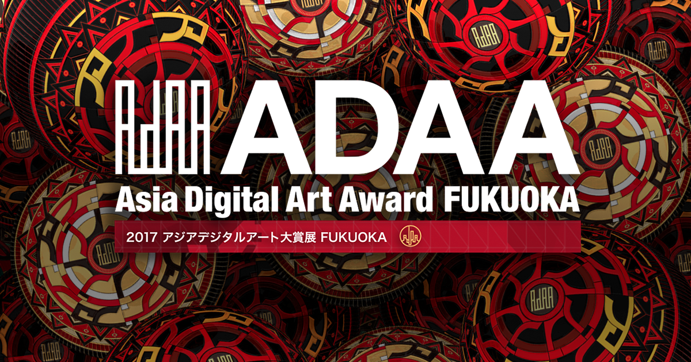

My work『送れ | 遅れ / post | past』 won the Finalists' Awards of Asia Digital Art Award, Student-Interactive Arts Category. Award-Winners' Exhibition will be held in 2/22~27 at Fukuoka Asian Art Museum.

<https://adaa.jp/en/winners/winners2017.html>

**[『送れ | 遅れ / post | past』Introduction Page](/works/post-past-sotsuten)**

<!--more-->

# Award-Winners' Exhibition

## Period

February 22thd (Thursday) - February 27th (Tuesday), 2018　10:00 ~ 20:00 (Last admission is 30 minutes before closing)※Closes at 18:00 on Feburary 27th. (Last admission is at 17:30)

## Location

[Fukuoka Asian Art Museum](https://faam.city.fukuoka.lg.jp/home.html) 7F Exhibition Gallery

## Entrance Fee

Free entry

# Awards Ceremony

## Date

February 24, 2018 (Saturday)

## Location

Venue: Fukuoka Asian Art Museum8F AJIBI Hall
