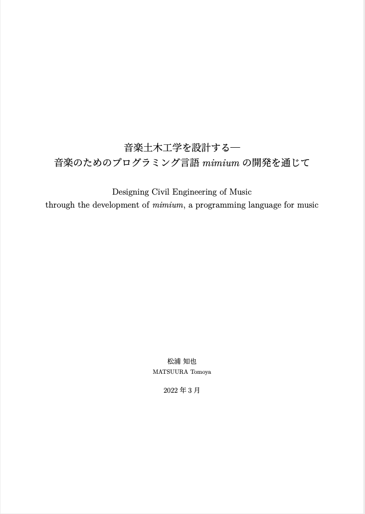
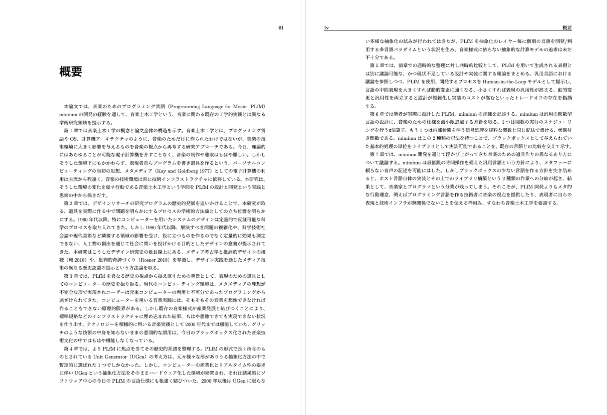
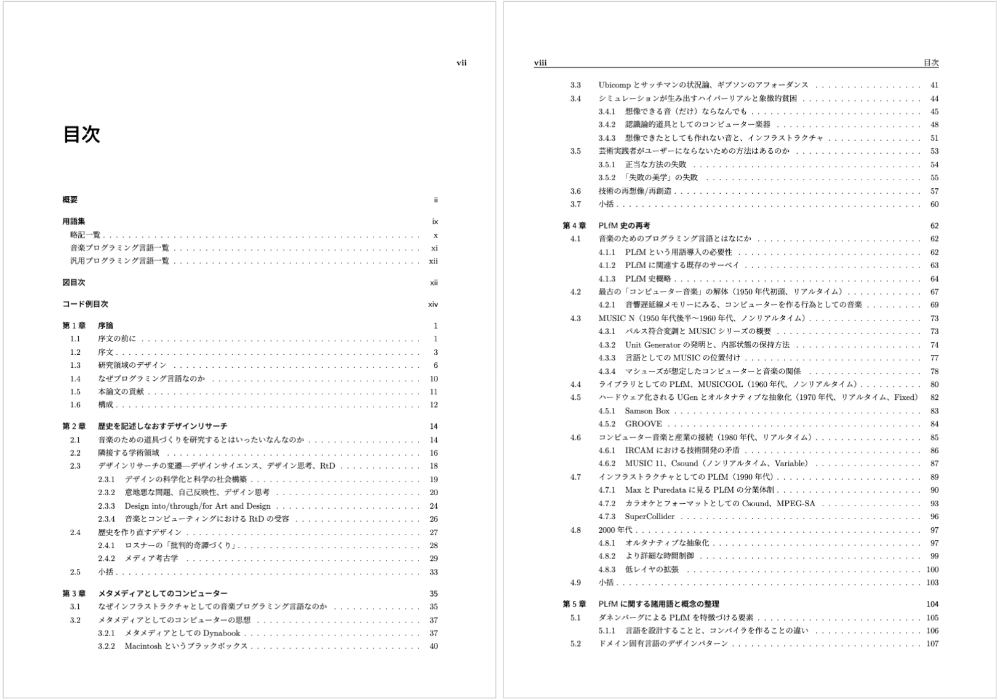
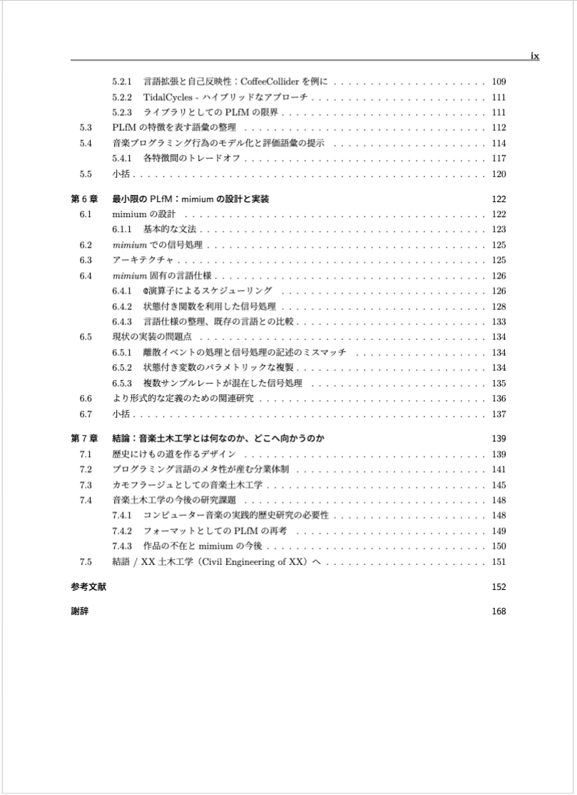

日時：2022年2月14日（月）16:30～18:00（オンライン）

発表者：松浦知也（芸術工学専攻博士課程）

論文題目：「音楽土木工学を設計する——音楽のためのプログラミング言語mimiumの設計を通じて」

主査：城一裕

副査：久保田晃弘（多摩美術大学）、中村美亜

要旨：本論文では、音楽のためのプログラミング言語(Programming Language for Music: PLfM) mimiumの開発の経験を通して、音楽土木工学という、音楽に関わる既存の工学的実践とは異なる学術研究領域を提示する。

以下のフォームから申し込んでいただければ、資料やZoomのリンクをお送りします。
https://forms.gle/AsUxBX1iW7gWLVyw5

<!--more-->

現時点での概要と目次を最後に貼りました。この5年ぐらいかけて考えてきたことが全部詰まったような内容になりました。

内容の中心はmimiumという音楽のためのプログラミング言語ですが、これからの音楽や芸術とテクノロジーの付き合い方全般に対する批評でもあります。単純に日本語で読める音楽プログラミング言語についてのまとまった資料自体も少ないので、テクニカルな事に興味を持った方、テクノロジーアートみたいな分野に興味がある方などいろんな分野の人に聞いてもらいたい内容です。

平日夕方という時間帯ではありますが、是非ご参加いただければと思います。

