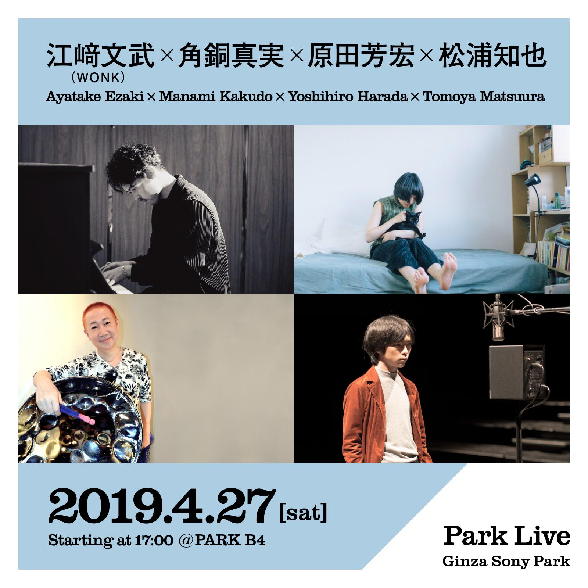

2019年4月27日(土)17:00〜にGinza Sony Park地下4階で行われるPark Liveにて、江﨑文武（WONK）×角銅真実（cero）×原田芳宏×松浦知也での即興セッションを行います。入場は１ドリンクのみ、予約不要です。お気軽にお越しください！

<!--more-->

https://www.ginzasonypark.jp/program/000/

> 4月27日（土）17:00〜のPark Liveは、江﨑文武（WONK）×角銅真実（cero）×原田芳宏×松浦知也。⁣
> WONKのキーボード／ピアノを担当する江﨑文武、ceroのパーカッション他さまざまなミュージシャンからも引っ張りだこの角銅真実、日本のスティールパン第一人者であり世界大会入賞経験をもつ原田芳宏、多様な音響装置をプレイし、蓮沼執太フルフィルにも参加する松浦知也。⁣
>初顔合わせとなる4人の先鋭ミュージシャンが一夜限りの即興セッションを繰り広げます。⁣
⁣

> 開催時間	約30分
> 
> 会場	B4 / 地下4階 [Park Map](https://www.ginzasonypark.jp/map/index.html#B4)
> 
> 料金	ワンオーダー制 (※「["BEER TO GO" by SPRING VALLEY BREWERY」](https://www.ginzasonypark.jp/shop/11.html)でワンオーダーをお願いします。
> 
> 人数	最大約150名様
> 
> 注意事項	
> 
 - 混雑時は立ち見になる場合があります。
 - 事前予約は受け付けていません。
 - 演奏時間はアーティストにより異なります。
 - 出演アーティストの問い合わせにはお答えできません。
 - 録音、録画は禁止しています。
 - 上記は予告なく変更となる場合があります。
 - ライブ観覧には整理券を配布する場合があります。