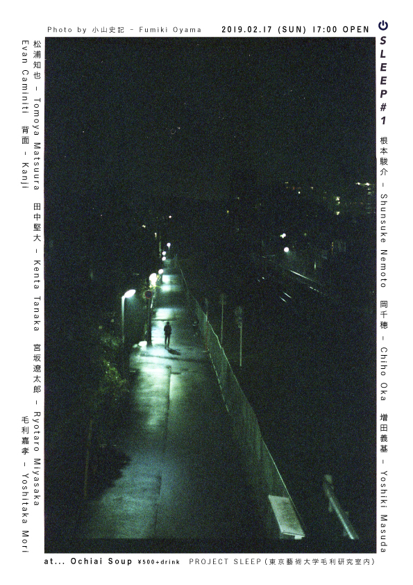

2019年2月17日に行われるライブとトークのイベント「SLEEP #1」に参加します。

楽器[Exidiophone](/works/exidiophone)でのソロ演奏と、トークでExidiophoneの製作背景などをお話しようと思います。

<http://ochiaisoup.com/?p=3200>

<!--more-->

> SLEEP 1
>
> 日時：2019年2月17日（日）17:00開場・17:30開演
>
> 場所：落合SOUP（〒161-0034　東京都新宿区上落合3-9-10 三笠ビルB1F）
>
> 主催：PROJECT SLEEP（東京藝術大学音楽学部音楽環境創造科毛利研究室内）
>
> SLEEPは、今日の音楽や「音」とテクノロジー、社会や経済の関係を、実際に音楽的・音響的な実験を行いながら、議論をする複合型のイベントです。タイトルのSLEEPは、言うまでもなく「睡眠」「眠り」を意味しています。睡眠という行為は、それがなければ人は死んでしまうにもかかわらず、人間の活動からは常に周縁化されてきました。今日情報テクノロジーの発達もあり、私たちの社会は1年365日、1週間7日間、そして1日24時間全く「眠らない社会（ジョナサン・クレーリー）」になりつつあります。私たちにいまこそ必要なのは「睡眠」なのです――目をつぶること。惰眠をむさぼること。夢を見ること。そして、網膜に映る自分自身の血流を経験すること。こうしたことこそが、私たちの思考を鍛え上げるのです。
>
> とはいえ、この会そのものは、必ずしも「睡眠」に関わるものではありません。具体的なテーマを設けて、首尾一貫した議論をすることほど「睡眠」から遠い行為はありません。むしろ、音楽や音について、あれこれうだうだ考えている人を集めて、音楽を演奏したり、音を出したり、あれこれうだうだと散漫な議論をすることこそが大切だと思うからです。SLEEPはそのためのきっかけづくり、実験のための場なのです。
>
> 出演：
>
> - 根本駿介 – Shunsuke Nemoto
>
> - 岡千穂 – Chiho Oka
>
> - 増田義基 – Yoshiki Masuda
>
> - 松浦知也 – Tomoya Matsuura
>
> - 田中堅大 – Kenta Tanaka
>
> - 宮坂遼太郎 – Ryotaro Miyasaka
>
> - 背面 – Kanji
>
> - エヴァン・カミニーティ- Evan Caminiti
>
> - 毛利嘉孝 – Yoshitaka Mori
>
>
>
>
> 500yen + 1 drink. *
