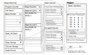

---
authors:
  - "Tomoya Matsuura"
title: "Lambda-mmm: the Intermediate Representation for Synchronous Signal Processing Language Based on Lambda Calculus"
math: true
ogpimage: "lambdammm_vm_structure.png"
journal_title: "Proceedings of the International Faust Conference 2024"
# volume:
# issue:
category: proceedings
pdf_url: "https://doi.org/10.5281/zenodo.13855343"
conference_title: "International Faust Conference"
publisher: GRAME
date: 2024-09-30
publishDate: 2024-09-30
reviewed: true
bibtex: '@inproceedings{matsuura2024,
  title = {Lambda-mmm: The Intermediate Representation for Synchronous Signal Processing Language Based on Lambda Calculus},
  shorttitle = {Lambda-mmm},
  author = {Matsuura, Tomoya},
  year = {2024},
  month = nov,
  publisher = GRAME,
  booktitle = {Proceedings of the International Faust Conference 2024},
  doi = {10.5281/zenodo.13855343},
  urldate = {2024-11-21},
  abstract = {This paper proposes Lambda-mmm, a call-by-value, simply typed lambda calculus-based intermediate representation for a music programming language that handles synchronous signal processing and introduces a virtual machine and instruction set to execute Lambda-mmm. Digital signal processing is represented by a syntax that incorporates the internal states of delay and feedback into the lambda calculus. Lambda-mmm extends the lambda calculus, allowing users to construct generative signal processing graphs and execute them with consistent semantics. However, a challenge arises when handling higher-order functions because users must determine whether execution occurs within the global environment or during DSP execution. This issue can potentially be resolved through multi-stage computation.},
  language = {eng},
  keywords = {Computer Music,Programming Language},
}'
abstract: "This paper proposes Lambda-mmm, a call-by-value, simply typed lambda calculus-based intermediate representation for a music programming language that handles synchronous signal processing and introduces a virtual machine and instruction set to execute Lambda-mmm. Digital signal processing is represented by a syntax that incorporates the internal states of delay and feedback into the lambda calculus. Lambda-mmm extends the lambda calculus, allowing users to construct generative signal processing graphs and execute them with consistent semantics. However, a challenge arises when handling higher-order functions because users must determine whether execution occurs within the global environment or during DSP execution. This issue can potentially be resolved through multi-stage computation."
---

# Abstract

This paper proposes $\lambda_{mmm}$, a call-by-value, simply typed lambda calculus-based intermediate representation for a music programming language that handles synchronous signal processing and introduces a virtual machine and instruction set to execute $\lambda_{mmm}$. Digital signal processing is represented by a syntax that incorporates the internal states of delay and feedback into the lambda calculus. $\lambda_{mmm}$ extends the lambda calculus, allowing users to construct generative signal processing graphs and execute them with consistent semantics. However, a challenge arises when handling higher-order functions because users must determine whether execution occurs within the global environment or during DSP execution. This issue can potentially be resolved through multi-stage computation.

---

\* _This is the HTML version of the pre-print. You can download PDF version from Zenodo Repository(<https://doi.org/10.5281/zenodo.13855343>). If you want to cite this article, please refer to the published version._


## Introduction {#sec:intro}

Many programming languages have been developed for sound and music; however, only a few possess strongly formalized semantics. A language that is both rigorously formalized and practical is Faust [1]; it combines blocks with inputs and outputs with five primitive operations: parallel, sequential, split, merge, and recursive connection. Almost any type of signal processing can be written in Faust by providing basic arithmetic, conditionals, and delays as primitive blocks. In a later extension, a macro based on a term rewriting system was introduced that allowed users to parameterize blocks with an arbitrary number of inputs and outputs [2].

This strong abstraction capability through formalization enables Faust to be translated into various backends, such as C, C++, Rust, and LLVM IR. On the other hand, Faust's Block Diagram Algebra (BDA) lacks theoretical and practical compatibility with common programming languages. Although it is possible to call external C functions in Faust, these functions are assumed to be pure functions that do not have internal states. Therefore, while it is easy to embed Faust in another language, it is not easy to call another language from Faust.

In addition, a macro for Faust is an independent term rewriting system that generates a BDA based on pattern matching. Consequently, the numeric arguments for pattern matching are implicitly required to be integers, which can sometimes lead to compile-time errors despite the fact that BDA does not distinguish between real and integer types. However, the implicit typing rules are not intuitive for novice users.

Proposing a computational model for signal processing based on more generic computational models such as lambda calculus has the potential to enable interoperability between many different general-purpose languages and facilitate the appropriation of existing optimization methods and the implementation of compilers and runtimes.

It has been demonstrated that BDA can be converted into a general-purpose functional language using an arrow, which is a higher-level abstraction of monads [3]. However, higher-order functions in general-purpose functional languages are often implemented using dynamic memory allocation and deallocation, making them difficult to use in host languages designed for real-time signal processing.

In addition, Kronos [4] and W-calculus [5] are examples of lambda calculus-based abstractions influenced by Faust. Kronos is based on the theoretical foundation of the System-$F\omega$, a variation of lambda calculus in which the types themselves can be abstracted (i.e., a function that takes a type as input and returns a new type can be defined). In Kronos, type calculations correspond to signal graph generation, whereas the value calculations correspond to actual processing. Delay is the only special primitive operation in Kronos, and feedback routing can be represented as a recursive function application in type calculations.

W-calculus includes feedback as a primitive operation, along with the ability to access the value of a variable from the past (i.e., delay). W-calculus restricts systems to those that can represent linear-time-invariant processes, such as filters and reverberators, and defines more formal semantics, aiming for automatic proofs of linearity and the identity of graph topologies.

Previously, the author designed the music programming language _mimium_ [6]. By incorporating basic operations such as delay and feedback into the lambda calculus, signal processing can be concisely expressed while maintaining a syntax similar to that of general-purpose programming languages. Notably, _mimium_'s syntax was designed to resemble the Rust programming language.

An earlier issue with _mimium_ was its inability to compile code that contained combinations of recursive or higher-order functions with stateful functions involving delay or feedback because the compiler could not determine the data size of the internal state used in signal processing.

In this paper, I propose the syntax and semantics of $\lambda_{mmm}$, an extended call-by-value simply typed lambda calculus, as a computational model intended to serve as an intermediate representation for _mimium_[^1]. In addition, I propose a virtual machine and its instruction set, based on Lua's VM, to execute this computational model in practice. Finally, I discuss both the challenges and potential of the current  model, one of which is that users must differentiate whether a calculation occurs in a global context or during actual signal processing; the other is that runtime interoperability with other programming languages could be easier than in existing DSP languages.

## Syntax {#sec:syntax}

<figure id = "fig:syntax_v">

$$
\begin{aligned}
\tau_p\; ::= & R &[real] \\
            |&N  &[nat] \\
\tau  \; ::= & \tau_p &  \\
            |& \tau \to \tau &[function] \\
      % |&\quad \langle \tau \rangle
\\
 v_p \; ::=&\ \ r    \quad r \in \mathbb{R}& \\
           |& \ n    \quad n \in \mathbb{N}&\\
 v   \; ::=&\ \ v_p       &\\
           |& \ cls(\lambda\ x.e, E)   &\\
                %%|& \quad (e_1,e_2) \quad & [product]\\
                %%|& \quad \pi_n e \quad n\in \mathbb{N},\; n&gt;0 \quad & [project]\\
                %%|& \quad \langle e \rangle \quad & [code] \\
                %%|& \quad \textasciitilde e \quad & [escape]
\end{aligned}
$$

$$
\begin{aligned}
e \; ::=& \ x                         &x \in {v_p} \  & [value]\\
        |& \ \lambda x.e              &               & [lambda]\\
        |& \ let\; x = e_1\; in\; e_2 &               & [let]\\
        |& \ fix \; x.e               &               & [fixpoint]\\
        |& \ e_1 \; e_2               &               & [app]\\
        |& \ if\; (e_c)\; e_t\; else\; e_e \; &        & [if] \\
        |& \ delay\; n \; e_1 \; e_2  &n \in \mathbb{N}\ &  [delay]\\
        |& \ feed \; x.e              &               & [feed]\\
        |& ... & & \\
                %%|& \quad (e_1,e_2) \quad & [product]\\
                %%|& \quad \pi_n e \quad n\in \mathbb{N},\; n&gt;0 \quad & [project]\\
                %%|& \quad \langle e \rangle \quad & [code] \\
                %%|& \quad \textasciitilde e \quad & [escape]
\end{aligned}
$$

<figcaption>

Figure 1. Definition of Types, Values and Terms of the $\lambda_{mmm}$(Basic arithmetics are omitted).

</figcaption>

</figure>

The types and terms of $\lambda_{mmm}$ are presented in Figure [1](#fig:syntax_v).

Two terms are introduced in addition to the standard simply typed lambda calculus: $delay\ n\ e_1\ e_2$, which refers to the previous value of $e_1$ by $e_2$ samples (with a maximum delay of $n$ to limit memory usage to a finite size), and $feed\ x.e$, an abstraction that allows the user to refer to the result of evaluating $e$ from one time unit earlier as $x$ during the evaluation of $e$ itself.

### Syntactic Sugar of the Feedback Expression in mimium {#sec:mimium}

The programming language _mimium_, developed by the author, includes a keyword $self$ that can be used in function definitions to refer to the previous return value of the function. An example of a simple one-pole filter function, which mixes the input and last output signals such that the sum of the input and feedback gains is 1, is shown in Listing [1](#lst:onepole). This code can be expressed in  as illustrated in Figure [2](#fig:onepole).

<figure id="lst:onepole">

```rust
fn onepole(x,g){
    x*(1.0-g) + self*g
  }
```
<figcaption>

Listing 1. Example of the code of one-pole filter in mimium.
</figcaption>

</figure>

<figure id="fig:onepole">

$$
\begin{aligned}
  let\ & onepole = \\
     & \ \lambda x. \lambda g.\ feed\ y.\ x *(1.0 - g) + y * g \ in\ ...
\end{aligned}
$$

<figcaption>

Figure 2. Equivalent expression to [Listing 1](#lst:onepole) in $\lambda_{mmm}$

</figcaption>

</figure>

### Typing Rules {#sec:typing}

<figure id="fig:typing">
$$
\begin{gathered}
&\frac{\Gamma, x:\tau_a \vdash e:\tau_b}{\Gamma \vdash \lambda x.e:\tau_a \to \tau_b }\ &\textrm{[T-LAM]}\\
&\frac{ \Gamma \vdash n:N \quad \Gamma \vdash e1:\tau\quad \Gamma \vdash e_2:R }{\Gamma \vdash delay\, n\, e_1\, e_2 : \tau}\ &\textrm{[T-DELAY]}\\
&\frac{\Gamma, x : \tau_p \vdash e: \tau_p }{\Gamma \vdash feed x.e:\tau_p} &\textrm{[T-FEED]}\\
&\frac{ \Gamma \vdash e_c : R\quad \Gamma \vdash e_t:\tau\quad \Gamma \vdash e_e:\tau }{\Gamma \vdash if\, (e_c)\, e_t\, e_e : \tau}\ &\textrm{[T-IF]}\\
&\end{gathered}
$$

<figcaption>

Figure 3. Excerpt of the typing rules for $\lambda_{mmm}$.
</figcaption>

</figure>

Additional typing rules for typical simply typed lambda calculus are shown in Figure [3](#fig:typing).

The primitive types include a real number type, used in most signal processing, and a natural number type, used for the indices of delay.

In W-calculus, which directly inspired the design of $\lambda_{mmm}$, the function types can only take tuples of real numbers and return tuples of real numbers. This restriction prevents the definition of higher-order functions. While this limitation is reasonable for a signal processing language---since higher-order functions require data structures such as closures that depend on dynamic memory allocation---it also reduces the generality of lambda calculus.

In $\lambda_{mmm}$, the problem of memory allocation for closures is delegated to runtime implementation (see Section [4](#sec:vm)), which allows the use of higher-order functions. However, $feed$ abstraction does not permit function types to be either input or output. Allowing function types in the $feed$ abstraction enables the definition of functions whose behavior could change over time. While this is theoretically interesting, there are no practical examples in real-world signal processing, and such a feature would likely further complicate the implementation.

## Semantics {#sec:semantics}

<figure id="fig:semantics">

$$
\begin{gathered}
&\frac{E^n \vdash e_1 \Downarrow v_1 \, n>v_1 \, E^{n-v_1} \vdash  e_2 \Downarrow v_2}{E^n \vdash\, delay\, n\, e_1\, e_2 \Downarrow  v_2} &\textrm{[E-DELAY]} \\
&\frac{}{E^n \vdash\, \lambda x.e \Downarrow  cls(\lambda x.e , E^n) }\ &\textrm{[E-LAM]} \\
&\frac{ E^{n-1} \vdash e \Downarrow v_1\, E^n, x \mapsto v_1 \vdash e \Downarrow v_2 }{E^n, x \mapsto v_2\, \vdash\, feed\, x\, e \Downarrow v_1} &\textrm{[E-FEED]} \\
&\frac{E^n \vdash e_c \Downarrow n \, n > 0\, E^n \vdash e_t\, \Downarrow v\ }{E^n \vdash\, if (e_c)\, e_t\, else\, e_t \Downarrow v } &\textrm{[E-IFTRUE]}\\
&\frac{E^n \vdash e_c \Downarrow n \, n \leqq0\, E^n \vdash e_e\, \Downarrow v\, }{E^n \vdash\, if (e_c)\, e_t\, else\, e_t \Downarrow v } &\textrm{[E-IFFALSE]}\\
&\frac{E^n \vdash e_1 \Downarrow cls(\lambda x_c.e_c, E^n_c) E^n \vdash e_2 \Downarrow v_2\, E^n_c,\, x_c \mapsto v_2 \vdash e_c \Downarrow v }{E^n \vdash\, e_1\ e_2 \Downarrow v } &\textrm{[E-APP]}
\end{gathered}
$$

<figcaption>

Figure 4. Excerpt of the big-step semantics of $\lambda_{mmm}$.
</figcaption>
</figure>

An excerpt of the operational semantics for $\lambda_{mmm}$ is shown in Figure [4](#fig:semantics). This big-step semantics conceptually explains the evaluation process. When the current time is $n$, the evaluation environment from $t$ prior samples can be referred to as $E^{n-t}$. If the time is less than 0, any term is evaluated as the default value of its type (0 for numeric types).

Naturally, if we attempt to execute these semantics directly, we would need to recalculate from time 0 to the current time for every sample, saving all the variable environments at each step. However, in practice, a virtual machine is defined to account for the internal memory space used by $delay$ and $feed$, and  terms are compiled into instructions for this machine before execution.

## VM Model and Instruction Set {#sec:vm}

The virtual machine (VM) model and its instruction set for running $\lambda_{mmm}$ are based on Lua version 5 VM [7].

A key challenge when executing a computational model based on lambda calculus is handling the data structure, which is known as a closure. A closure captures the variable environment in which the inner function is defined, allowing it to refer to the variables from the outer function's context. If the inner function is paired with a dictionary of variable names and values, the compiler (or interpreter) implementation is straightforward; however, the runtime performance is limited.

Conversely, the runtime performance can be improved using a process called closure conversion (or lambda lifting). This process analyzes all the outer variables referenced by the inner function and transforms the inner function by adding arguments; thus, the outer variables can be referred to explicitly. However, the implementation of this transformation in the compiler is relatively complex.

The Lua VM adopts a middle-ground approach between these two methods by adding the VM instructions `GETUPVALUE` and `SETUPVALUE`, which allow the outer variables to be dynamically referenced at runtime. The implementation of the compiler and VM using _upvalues_ is simpler than full closure conversion while still avoiding significant performance degradation. In this approach, the outer variables are accessed via the call stack rather than the heap memory unless the closure escapes the context of the original function [8].

In addition, _upvalues_ facilitate interoperability with other programming languages. Lua can be easily embedded through its C API, and when implementing external libraries in C, programmers can access the upvalues of the Lua runtime, not just the stack values available via the C API.

### Instruction Set {#sec:instruction}

The VM instructions for $\lambda_{mmm}$ differ from those for the Lua VM in the following aspects:

1.  Since mimium is a statically typed language, unlike Lua, instructions for basic arithmetic operations are provided for each type[^2].
2.  The call operation is split into normal function calls and closure calls owing to the static typing and to manage higher-order stateful functions (see [4.2](#sec:vmstructure) for details).
3.  Conditional statements are implemented using a combination of two instructions, `JMP` and `JMPIFNEG`, whereas the Lua VM employs a dedicated `TEST` instruction.
4.  Instructions related to for-loops, the `SELF` instruction used in object-oriented programming, and the `TABLE`-related instructions for metadata references to variables are omitted in mimium as they are unnecessary.
5.  Instructions related to list-like data structures are also excluded from this paper, as the implementation of data structures such as tuples and arrays is outside the scope of the $\lambda_{mmm}$ description here.

The VM for $\lambda_{mmm}$ operates as a register machine similar to the Lua VM (post version 5). However, unlike traditional register machines, it does not employ physical registers. Instead, the register number simply refers to an offset index on the call stack relative to the base pointer during VM execution. The first operand of most instructions specifies the register number where the result of the operation is stored.

A list of instructions is presented in Figure [4](#fig:instruction) (basic arithmetic operations are partially omitted). The notation for the instructions follows the format outlined in the Lua VM documentation [7, p. 13]. The operation name, list of operands, and pseudocode of the operation are displayed from left to right. When each of the three operands is used as an unsigned 8-bit integer, it is represented as `A B C`. If an operand is used as a signed integer, then it is prefixed with `s`. When the two operand fields are combined into a 16-bit value, the suffix `x` is added. For example, when `B` and `C` are merged and treated as a signed 16-bit value, they are represented as `sBx`.

In the pseudocode, `R(A)` denotes the data being moved in and out of the register (or call stack) at the base pointer + `A` for the current function. `K(A)` refers to the `A`-th entry in the static variable section of the compiled program, and `U(A)` accesses the `A`-th upvalue of the current function.

In addition to Lua's upvalue operations, four new operations--- `GETSTATE`, `SETSTATE`, `SHIFTSTATE`, and `DELAY` ---have been introduced to handle the compilation of the $delay$ and $feed$ expressions in $\lambda_{mmm}$.

<figure id="fig:instruction">

```
  MOVE       A B      R(A) := R(B)
  MOVECONST  A B      R(A) := K(B)
  GETUPVALUE A B      R(A) := U(B)
  SETUPVALUE A B      U(B) := R(A)
  GETSTATE   A        R(A) := SPtr[SPos] *
  SETSTATE   A        Sptr[SPos] := R(A) *
  SHIFTSTATE sAx      SPos += sAx *
  DELAY      A B C    R(A) := update_ringbuffer(SPtr[SPos],R(B),R(C)) *
//*(SPos,SPtr)= vm.closures[vm.statepos_stack.top()].state
//(if vm.statepos_stack is empty, use global state storage.)
  JMP        sAx      PC +=sAx
  JMPIFNEG   A sBx    if (R(A)\<0) then PC += sBx
  CALL       A B C    R(A),...,R(A+C-2) := program.functions[R(A)](R(A+1),...,R(A+B-1))
  CALLCLS    A B C    vm.statepos_stack.push(R(A))
                      R(A),...,R(A+C-2) := vm.closures[R(A)].fnproto(R(A+1),...,R(A+B-1))
                      vm.statepos_stack.pop()
  CLOSURE    A Bx     vm.closures.push(closure(program.functions[R(Bx)]))
                      R(A) := vm.closures.length - 1
  CLOSE      A        close stack variables up to R(A)
  RETURN     A B      return R(A), R(A+1)\...,R(A+B-2)
  ADDF       A B C     R(A) := R(B) as float + R(C) as float
  SUBF       A B C     R(A) := R(B) as float - R(C) as float
  MULF       A B C     R(A) := R(B) as float * R(C) as float
  DIVF       A B C     R(A) := R(B) as float / R(C) as float
  ADDF       A B C     R(A) := R(B) as int + R(C) as in
...Other basic arithmetics continues for each primitive types...  
```

<figcaption>

Figure 5. Instruction sets for VM to run $\lambda_{mmm}$.
</figcaption>
</figure>

### Overview of the VM Structure {#sec:vmstructure}

<figure id ="fig:vmstructure">



<figcaption>

Figure 6. Overview of the virtual machine, program and instantiated closures for $\lambda_{mmm}$.
</figcaption>
</figure>


The overall structure of the virtual machine program, and instantiated closures for $\lambda_{mmm}$ is depicted in Figure [5](#fig:vmstructure). In addition to the usual call stack, the VM has a dedicated storage area (a flat array) to manage the internal state data for feedback and delay.

This storage area is accompanied by pointers that indicate the positions from which the internal state data are retrieved via the `GETSTATE` and `SETSTATE` instructions. These positions are shi-fted forward or backward using the `SHIFTSTATE` instruction. The actual data layout in the state storage memory is statically determined during compilation by analyzing function calls involving references to `self`, `delay`, and other stateful functions, including those that recursively invoke such functions. The `DELAY` operation takes two inputs: `B`, representing the input value, and `C`, representing the delay time in the samples.

However, for higher-order functions---functions that take another function as an argument or return one---the internal state layout of the passed function is unknown at compile time. Consequently, a separate internal state storage area is allocated to each instantiated closure, which is distinct from the global storage area maintained by the VM instance. The VM also uses an additional stack to keep track of the pointers in the state storage of instantiated closures. Each time a `CALLCLS` operation is executed, the VM pushes the pointer from the state storage of the closure onto the state stack. Upon completing the closure call, the VM pops the state pointer off the stack.

Instantiated closures also maintain their own storage areas for upvalues. Until a closure exits the context of its parent function (known as an "Open Closure"), its upvalues hold a negative offset that references the current execution's stack. This offset is determined at compile time and stored in the function's prototype in the program. Furthermore, an upvalue may reference not only local variables but also upvalues from the parent function (a situation that arises when at least three functions are nested). Thus, the array of upvalue indices in the function prototype stores a pair of values: a tag indicating whether the value is a local stack variable or an upvalue from a parent function and the corresponding index (either the negative stack offset or the parent function's upvalue index).

For example, consider a scenario where the upvalue indices in the program are specified as `[upvalue(1), local(3)]`. In this case, the instruction `GETUPVALUE 6 1` indicates that the value located at index `3` from the upvalue list (referenced by `upvalue(1)`) should be retrieved from `R(-3)` relative to the base pointer, and the result should be stored in `R(6)`.

When a closure escapes its original function context through the `RETURN` instruction, the inserted `CLOSE` instruction moves the active upvalues from the stack to heap memory. These upvalues may be referenced from multiple locations, particularly in cases involving nested closures. Thus, a garbage collection mechanism is required to free memory once these upvalues are no longer in use.

In $\lambda_{mmm}$'s VM, since the paradigm is call-by-value and there is no reassignment expression, the `SETUPVALUE` instruction is omitted. If reassignment is allowed, open upvalues would need to be implemented as shared memory cells, as the values might be accessed by multiple closures that could trigger a `CLOSE` operation.

### Compilation to the VM Instructions

<figure id = "lst:bytecode_onepole">

```rust
CONSTANTS:[1.0]
fn onepole(x,g) state_size:1
    MOVECONST 2 0   // load 1.0
    MOVE      3 1   // load g
    SUBF      2 2 3 // 1.0 - g
    MOVE      3 0   // load x
    MULF      2 2 3 // x * (1.0-g)
    GETSTATE  3     // load self
    MOVE      4 1   // load g
    MULF      3 3 4 // self * g
    ADDF      2 2 3 // compute result
    GETSTATE  3     // prepare return value
    SETSTATE  2     // store to self
    RETURN    3 1
```

<figcaption>

Listing 2. Compiled VM instructions of one-pole filter example in Listing [1](#fig:onepole).
</figcaption>
</figure>

Listing [2](#lst:bytecodes_onepole) shows a basic example of how the mimium code in Listing [1](#lst:onepole) is compiled into VM bytecode. When `self` is referenced, the value is retrieved using the `GETSTATE` instruction, and the internal state is updated by storing the return value with the `SETSTATE` instruction before returning it via the `RETURN` instruction. In this case, the actual return value is obtained using the second `GETSTATE` instruction, which ensures that the initial state value is returned at time = 0.

For example, if a time counter is written as $feed x. x+1$, the decision on whether the return value at time = 0 should be 0 or 1 is left to the compiler design. Although returning 1 does not strictly follow the semantics of E-FEED in Figure [4](#fig:semantics), if the compiler is designed to return 1 at time = 0, the second `GETSTATE` instruction can be omitted, and the value for the `RETURN` instruction should be `R(2)`.

A more complex example, along with its expected bytecode instructions, is shown in Listings [3](#lst:fbdelay) and [4](#lst:bytecodes_fbdelay). The code defines a delay with feedback as `fbdelay`, while another function, `twodelay`, uses two feedback delays with different parameters. Finally, `dsp` uses two `twodelay` functions.

After each reference to `self` through the `GETSTATE` instruction or after calling another stateful function, the `SHIFTSTATE` instruction is inserted to advance the state storage position in preparation for the next non-closure function call. Before the function exits, the state position is reset to where it was at the beginning of the current function context using the `SHIFTSTATE` instruction. The total operand value for `SHIFTSTATE` within a function must always sum to 0. Figure [7](#fig:fbdelay_spos) illustrates how the state position shifts with the `SHIFTSTATE` operations during the execution of the `twodelay` function. The argument for the `SHIFTSTATE` operation is a word size (a number of 64 bit values) and the word size for delay is `maximum delay time + 3` since the read index, write index and the length of the ring buffer are added.

The state data can be stored as a flat array by representing the internal state as a relative position within the state storage, thereby simplifying compiler implementation; this avoids the need to generate a tree structure from the root, which was required in the previous implementation of mimium. This approach is similar to how upvalues simplify the compiler implementation by treating free variables as relative positions on the call stack.

<figure id="lst:fbdelay">

```rust
fn fbdelay(x,fb,dtime){
    x + delay(1000,self,dtime)*fb
}
fn twodelay(x,dtime){
    fbdelay(x,dtime,0.7)
      +fbdelay(x,dtime*2,0.8)
}
fn dsp(x){
    twodelay(x,400)+twodelay(x,800)
}
```


<figcaption>

Listing 3. Example code that combines self and delay without closure call.
</figcaption>
</figure>

<figure id= "fig:bytecode_fbdelay">

```rust
CONSTANTS:[0.7,2,0.8,400,800,0,1]
fn fbdelay(x,fb,dtime) state_size:1004
    MOVE       3 0   //load x
    GETSTATE   4     //load self
    SHIFTSTATE 1     //shift Spos
    DELAY      4 4 2 //delay(_,_,_)
    MOVE       5 1   // load fb
    MULF       4 4 5 //delayed val *fb
    ADDF       3 3 4 // x+
    SHIFTSTATE -1    //reset SPos
    GETSTATE   4     //prepare result
    SETSTATE   3     //store to self
    RETURN     4 1   //return previous self

fn twodelay(x,dtime) state_size:2008
    MOVECONST  2 5 //load "fbdelay" prototype
    MOVE       3 0
    MOVE       4 1
    MOVECONST  5 0 //load 0.7
    CALL       2 3 1
    SHIFTSTATE 1004   //1004=state_size of fbdelay
    MOVECONST  3 5 //load "fbdelay" prototype
    MOVE       4 0
    MOVECONST  5 1 //load 2
    MULF       4 4 5
    MOVECONST  5 0 //load 0.7
    CALL       3 3 1
    ADDF       3 3 4
    SHIFTSTATE -1004
    RETURN     3 1
fn dsp (x)
    MOVECONST  1 6 //load "twodelay" prototype
    MOVE       2 0
    MOVECONST  3 3 //load 400
    CALL       1 2 1
    SHIFTSTATE 2008
    MOVECONST  2 6 //load "twodelay" prototype
    MOVE       2 3
    MOVE       3 0
    MOVECONST  3 4 //load 400
    CALL       2 2 1
    ADD        1 1 2
    SHIFTSTATE -2008
    RETURN     1 1
```

<figcaption>

Listing 4. Compiled VM instructions of feedback delay example in Listing [3](#lst:fbdelay).

</figcaption>
</figure>

<figure>


<figcaption>

Figure 7. Image of how the state position moves while executing `twodelay` function in Listing [3](#lst:fbdelay).

</figcaption>
</figure>

Listing [5](#lst:filterbank_good)　shows an example of a higher-order function `filterbank`, which takes another function `filter`---accepting an input and a frequency as arguments---duplicates `n` instances of `filter` and adds them together[^3].

The previous mimium compiler was unable to compile code that took a function with an internal state as an argument because the entire tree of internal states had to be statically determined at compile time. However, the VM in $\lambda_{mmm}$ can handle this dynamically. Listing [6](#lst:bytecode_filterbank) shows the translated VM instructions for this code. Recursive calls on the first line of `filterbank`, as well as calls to functions passed as arguments or obtained through upvalues (like `filter`), are executed using the `CALLCLS` instruction rather than the `CALL` instruction. The `GETSTATE` and `SETSTATE` instructions are not used in this function because the internal state storage is switched dynamically when the `CALLCLS` instruction is interpreted.

<figure id="lst:filterbank_good">

```rust
fn bandpass(x,freq){
      //...
    }
fn filterbank(n,filter_factory:()->(float,float)->float){
  if (n>0){
    let filter = filter_factory() 
    let next = filterbank(n-1,filter_factory)
    |x,freq| filter(x,freq+n*100)
             + next(x,freq)
  }else{
    |x,freq| 0
  }
}
let myfilter = filterbank(3,| | bandpass)
fn dsp(){
      myfilter(x,1000)
}
```
<figcaption>

Listing 5. Example code that duplicates filter parametrically using a recursive function and closure.

</figcaption>
</figure>

<figure id="lst:bytecode_filterbank">

```rust
CONSTANTS[100,1,0,2]
fn inner_then(x,freq)
    //upvalue:[local(4),local(3),local(2),local(1)]
    GETUPVALUE 3 2 //load filter
    MOVE       4 0
    MOVE       5 1
    GETUPVALUE 6 1 //load n
    ADDD       5 5 6
    MOVECONST  6 0
    MULF       5 5 6
    CALLCLS    3 2 1  //call filter
    GETUPVALUE 4 4 //load next
    MOVE       5 0
    MOVE       6 1
    CALLCLS    4 2 1 //call next
    ADDF       3 3 4
    RETURN     3 1

fn inner_else(x,freq)
    MOVECONST  2 2
    RETURN     2 1

fn filterbank(n,filter)
    MOVE      2 0 //load n
    MOVECONST 3 2 //load 0
    SUBF      2 2 3
    JMPIFNEG  2 12
    MOVE      2 1 //load filter_factory
    CALL      2 2 0 //get filter
    MOVECONST 3 1 //load itself
    MOVE      4 0 //load n
    MOVECONST 5 1 //load 1
    SUBF      4 4 5
    MOVECONST 5 2 //load inner_then
    CALLCLS   3 2 1 //recursive call
    MOVECONST 4 2 //load inner_then
    CLOSURE   4 4 //load inner_lambda
    JMP       2
    MOVECONST 4 3 //load inner_else
    CLOSURE   4 4
    CLOSE     4
    RETURN    4 1
```

<figcaption>

Listing 6. Compiled VM instructions filterbank example in Listing [5](#lst:filterbank_good).

</figcaption>
</figure>

## Discussion {#sec:discussion}

As demonstrated in the example of the filterbank, in $\lambda_{mmm}$, a signal graph can be parametrically generated during the evaluation of the global context, whereas Faust uses a term-rewriting macro and Kronos employs type-level computation, as shown in Table [1](#tab:comparison).

The ability to describe both the generation of parametric signal processing and its execution content within single semantics makes it easier for novice users to understand the mechanics of the language. In addition, unified semantics may simplify runtime interoperability with other general-purpose languages.

However, there is a drawback: unified semantics can cause $\lambda_{mmm}$ to deviate from the behavior typically expected in standard lambda calculus.

<figure>

  |            | Parametric Signal Graph  |    Actual DSP   |
  |:----------:|:-----------------------:| :----------------:|
  |Faust      | Term Rewriting Macro    |       BDA |
  |Kronos     |Type-level Computation    |Value Evaluation|
  |mimium     |Global Context Execution|  `dsp` Function Execution|

<figcaption>

Table 1. Comparison of the way of signal graph generation and actual signal processing between Faust, Kronos and $\lambda_{mmm}$.

</figcaption>
</figure>

### Different Behaviour Depending on the Location of Let Binding {#sec:letbinding}

By using functions with internal states that change over time in mimium, there is counterintuitive behavior when higher-order functions are used compared to general functional programming languages.

Listing [7](#lst:filterbank_bad) presents an example of incorrect code that is slightly modified from the filterbank example in Listing [5](#lst:filterbank_good). The main difference between Listing [7](#lst:filterbank_bad) and Listing [5](#lst:filterbank_good) is whether the recursive calls in the `filterbank` function are written directly or bound using a `let` expression outside the inner function. Similarly, in the `dsp` function, which is called by the audio driver in mimium, the difference lies in whether the `filterbank` function is executed within `dsp` or bound with `let` once in the global context.

In a typical functional programming language, if none of the functions in the composition involve destructive assignments, the calculation process remains unchanged even if the variable bound by `let` is replaced with its term (via beta reduction), as seen in the transformation from Listing [7](#lst:filterbank_bad) to Listing [5](#lst:filterbank_good).

However, in mimium, there are two distinct stages of evaluation. 0: The code is first evaluated in a global environment (where the signal-processing graph is concretized). 1: The `dsp` function is executed repeatedly (handling the actual signal processing) and may involve implicit updates to the internal states.

Although the code contains no destructive assignments, the recursive execution of the `filterbank` function occurs only once in Listing [5](#lst:filterbank_good) during the global environment evaluation. Conversely, in Listing [7](#lst:filterbank_bad), the recursive function is executed, and a closure is generated each time the `dsp` function runs on every sample. Because the internal state of the closure is initialized at the time of closure allocation, in the example of Listing [7](#lst:filterbank_bad), the internal state of the closure is reset at each time step, following the evaluation of `filterbank`.

<figure id="lst:filterbank_bad">

```rust
fn filterbank(n,filter){
  if (n>0){
    |x,freq| filter(x,freq+n*100)
    + filterbank(n-1,filter)(x,freq)
  }else{
    |x,freq| 0
  }
}
fn dsp(){
  filterbank(3,bandpass)(x,1000)
}
```

<figcaption>

Listing 7. Wrong example of the code that duplicate filter parametrically.
</figcaption>
</figure>

This implies that major compiler optimization techniques, such as constant folding and function inlining, cannot be directly applied to mimium. These optimizations must be performed after global context evaluation and before the evaluation of the `dsp` function.

To address this issue, it is necessary to introduce a distinction in the type system to indicate whether a term should be used during global context evaluation (stage 0) or actual signal processing (stage 1). This can be achieved with Multi-Stage Computation [9]. Listing [8](#lst:filterbank_multi) provides an example of the `filterbank` code using BER MetaOCaml's syntax: `.<term>.`, which generates a program to be used in the next stage, and `~term`, which embeds the terms evaluated in the previous stage [10].

The `filterbank` function is evaluated in stage 0 while embedding itself with `~`. In contrast to Faust and Kronos, this multi-stage computation code retains the same semantics for both the generation of the signal processing graph and the execution of signal processing.

<figure id="lst:filterbank_multi">

```rust
fn filterbank(n,filter:&(float,float)->float)->&(float,float)->float{
  .< if (n>0){
    |x,freq| ~filter(x,freq+n*100) 
      + ~filterbank(n-1,filter)(x,freq)
  }else{
    |x,freq| 0
  } >.
}
fn dsp(){
  ~filterbank(3,.<bandpass>.)(x,1000)
}
```
<figcaption>

Listing 8. Example of filterbank function using multi-stage computation in a future specification of mimium.
</figcaption>
</figure>

### A Possibility of the Foreign Stateful Function Call

The closure data structure in  combines functions with the internal states, as shown in Figure [3](#fig:vmstructure). The fact that `filterbank` samples do not require special handling for internal states means that external signal processors (Unit Generators: UGens), such as oscillators and filters written in C or C++, can be called from mimium, just like normal closure calls. Additionally, it is possible to parameterize, duplicate, and combine external UGens[^4]. This capability is difficult to implement in Faust and similar languages but is easily achievable in the  paradigm.

However, mimium currently uses sample-by-sample processing and cannot handle buffer-by-buffer value passing. Because most native unit generators process data on a buffer-by-buffer basis, there are few practical cases where external UGens are currently used. Nonetheless, in , only $feed$ terms require sample-by-sample processing. Therefore, it is possible to differentiate the functions that can process only one sample at a time from those that can process concurrently at the type level. As the multi-rate specification is being considered in Faust [11], it may be possible to facilitate buffer-based processing between an external Unit Generator by having the compiler automatically determine the parts that can be processed buffer-by-buffer.

## Conclusion {#sec:conclusion}

This paper proposed $\lambda_{mmm}$, an intermediate representation for programming languages for music and signal processing, along with a virtual machine and an instruction set to execute it. $\lambda_{mmm}$ enables the description of generative signal graphs and their contents within a unified syntax and semantics. However, users are responsible for ensuring that their code does not create escapable closures during the iterative execution of a DSP, which can be challenging for novice users to grasp.

In this paper, the translation of  terms into VM instructions was illustrated by showing examples of code and the corresponding expected bytecode alongside pseudocode to describe the behavior of the VM. More formal semantics and a detailed translation process should be considered, particularly with the introduction of multi-stage computation.

I hope that this research will contribute to more general representations of music and sound on digital computers and foster deeper connections between the theory of languages for music and the broader field of programming language theory.

## Acknowledgments

This study was supported by JSPS KAKENHI (Grant No.23K12059). I would also like to thank the many anonymous reviewers.

## References

- [1] Y. Orlarey, D. Fober, and S. Letz, "Syntactical and semantical aspects of Faust," _Soft Computing_, vol. 8, no. 9, pp. 623--632, 2004, doi: [10.1007/s00500-004-0388-1](https://doi.org/10.1007/s00500-004-0388-1).
- [2] A. Gräf, "Term Rewriting Extension for the Faust Programming Language," in _International Linux Audio Conference_, 2010. Available: [https://hal.archives-ouvertes.fr/hal-03162973 https://hal.archives-ouvertes.fr/hal-03162973/document](https://hal.archives-ouvertes.fr/hal-03162973 https://hal.archives-ouvertes.fr/hal-03162973/document)
- [3] B. R. Gaster, N. Renney, and T. Mitchell, "OUTSIDE THE BLOCK SYNDICATE: TRANSLATING FAUST'S ALGEBRA OF BLOCKS TO THE ARROWS FRAMEWORK," in *Proceedings of the 1st International Faust Conference*, Mainz,Germany, 2018.
- [4] V. Norilo, "Kronos: A Declarative Metaprogramming Language for Digital Signal Processing," _Computer Music Journal_, vol. 39, no. 4, pp. 30--48, 2015, doi: [10.1162/COMJ_a_00330](https://doi.org/10.1162/COMJ_a_00330).
- [5] E. J. G. Arias, P. Jouvelot, S. Ribstein, and D. Desblancs, "The [W-calculus]{.nocase}: A Synchronous Framework for the Verified Modelling of Digital Signal Processing Algorithms," in _Proceedings of the 9th ACM SIGPLAN international workshop on functional art, music, modelling, and design_, New York, NY, USA: Association for Computing Machinery, 2021, pp. 35--46. doi: [10.1145/3471872.3472970](https://doi.org/10.1145/3471872.3472970).
- [6] T. Matsuura and K. Jo, "Mimium: A self-extensible programming language for sound and music," in _Proceedings of the 9th ACM SIGPLAN International Workshop on Functional Art, Music, Modelling, and Design_, in FARM 2021. New York, NY, USA: Association for Computing Machinery, Aug. 2021, pp. 1--12. doi: [10.1145/3471872.3472969](https://doi.org/10.1145/3471872.3472969).
- [7] R. Ierusalimschy, L. H. de Figueiredo, and W. Celes, "The Implementation of Lua 5.0," _JUCS - Journal of Universal Computer Science_, vol. 11, no. 7, pp. 1159--1176, Jul. 2005, doi: [10.3217/jucs-011-07-1159](https://doi.org/10.3217/jucs-011-07-1159).
- [8] R. Nystrom, *Crafting Interpreters*. Daryaganj Delhi: Genever Benning, 2021.
- [9] W. Taha and T. Sheard, "Multi-Stage Programming with Explicit Annotations," _SIGPLAN Notices (ACM Special Interest Group on Programming Languages)_, vol. 32, no. 12, pp. 203--214, Dec. 1997, doi: [10.1145/258994.259019](https://doi.org/10.1145/258994.259019).
- [10] O. Kiselyov, "The Design and Implementation of BER MetaOCaml," in _[Proceedings of the 12th International Symposium on Functional and Logic Programming]{.nocase}_, M. Codish and E. Sumii, Eds., Cham: Springer International Publishing, 2014, pp. 86--102. doi: [10.1007/978-3-319-07151-0_6](https://doi.org/10.1007/978-3-319-07151-0_6).
- [11] P. Jouvelot and Y. Orlarey, "Dependent vector types for data structuring in multirate Faust," *Computer Languages, Systems & Structures*, vol. 37, no. 3, pp. 113--131, 2011.

[^1]: The newer version of mimium compiler and VM based on the model presented in this paper is on the GitHub. <https://github.com/tomoyanonymous/mimium-rs>
[^2]: In the actual implementation, instructions such as `MOVE` include an additional operand to specify the word size of values, particularly for handling aggregate types like tuples.
[^3]: In the previous specification of mimium [6], the syntax for the variable binding and destructive assignment was the same (`x = a`). However, in the current syntax, variable binding uses the `let` keyword.
[^4]: In fact, in the actual implementation of mimium, an interoperation between VM and audio driver is realized by passing and calling Rust's closure.
