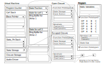

---
authors:
  - "松浦知也"
title: "Lambda-mmm: 同期的信号処理言語のためのラムダ計算を基にした中間表現"
math: true
ogpimage: lambdammm_vm_structure.png
journal_title: "Proceedings of the International Faust Conference 2024"
category: proceedings
pdf_url: "https://doi.org/10.5281/zenodo.13855343"
conference_title: "International Faust Conference"
publisher: GRAME
date: 2024-09-30
publishDate: 2024-09-30
reviewed: true
bibtex: '@inproceedings{matsuura2024,
  title = {Lambda-mmm: The Intermediate Representation for Synchronous Signal Processing Language Based on Lambda Calculus},
  shorttitle = {Lambda-mmm},
  author = {Matsuura, Tomoya},
  year = {2024},
  month = nov,
  publisher = GRAME,
  booktitle = {Proceedings of the International Faust Conference 2024},
  doi = {10.5281/zenodo.13855343},
  urldate = {2024-11-21},
  abstract = {This paper proposes Lambda-mmm, a call-by-value, simply typed lambda calculus-based intermediate representation for a music programming language that handles synchronous signal processing and introduces a virtual machine and instruction set to execute Lambda-mmm. Digital signal processing is represented by a syntax that incorporates the internal states of delay and feedback into the lambda calculus. Lambda-mmm extends the lambda calculus, allowing users to construct generative signal processing graphs and execute them with consistent semantics. However, a challenge arises when handling higher-order functions because users must determine whether execution occurs within the global environment or during DSP execution. This issue can potentially be resolved through multi-stage computation.},
  language = {eng},
  keywords = {Computer Music,Programming Language},
}'
abstract: "This paper proposes Lambda-mmm, a call-by-value, simply typed lambda calculus-based intermediate representation for a music programming language that handles synchronous signal processing and introduces a virtual machine and instruction set to execute Lambda-mmm. Digital signal processing is represented by a syntax that incorporates the internal states of delay and feedback into the lambda calculus. Lambda-mmm extends the lambda calculus, allowing users to construct generative signal processing graphs and execute them with consistent semantics. However, a challenge arises when handling higher-order functions because users must determine whether execution occurs within the global environment or during DSP execution. This issue can potentially be resolved through multi-stage computation."
---

## 概要


本論文では、同期信号処理を扱う音楽プログラミング言語のための、値呼び単純型付けラムダ計算ベースの中間表現 $\lambda_{mmm}$ を提案し、 $\lambda_{mmm}$ を実行するための仮想マシンと命令セットを導入する。デジタル信号処理は、遅延とフィードバックの内部状態をラムダ計算に組み込んだ構文で表現される。 $\lambda_{mmm}$ はラムダ計算を拡張し、生成的な信号処理グラフを構築とその実行を一貫した意味論で実行できる。しかし、高階関数を扱う場合、実行がグローバル環境内で行われるのか、DSP実行中に行われるのかをユーザが判断しなければならないという課題がある。この問題は、多段階計算によって解決できる可能性がある。

---

\* *このHTML上の本文は、[英語版のプレプリントをHTMLにしたもの](/en/research/lambdammm-ifc-2024/)をさらに筆者が日本語へ翻訳したものです。英語版プレプリントのPDFはZenodoリポジトリ(<https://doi.org/10.5281/zenodo.13855343>)からダウンロード可能です。またこの論文を引用する場合は、原則的には出版された原論文を参照して下さい。*

## イントロダクション {#sec:intro}

これまでに音楽と音に特化した多くのプログラミング言語が開発されてきたが、厳密に形式化されたセマンティクスを持つものは少ない。厳密に形式化され、実用的な言語としてはFaust[1]がある。Faustは、入出力を持つブロックを、並列、直列、分岐、合流、再帰の5つの合成子を用いて組み合わせる。基本的な算術演算、条件分岐、遅延をプリミティブ・ブロックとして提供することで、ほぼあらゆる種類の信号処理を記述することができる。また後の拡張では、項書き換え系に基づくマクロが導入され、ユーザーが任意の数の入出力を持つブロックを抽象化できるようになった[2]。

この形式化による強力な抽象化能力により、FaustはC、C++、Rust、LLVM IRなどの様々なバックエンドに翻訳することができる。一方、Faustの理論的基盤であるブロックダイアグラム代数（Block Diagram Algebra-BDA）は、一般的なプログラミング言語との理論的・実用的な互換性に欠ける。Faustで外部のC関数を呼び出すことは可能だが、それらの関数は内部状態を持たない純粋な関数を想定している。そのため、Faustを他の言語に組み込むことは容易だが、Faustから他の言語を呼び出すことは簡単ではない。

また、Faustのマクロは、パターンマッチに基づいてBDAを生成する独立した項書き換えシステムである。そのため、パターンマッチングのための数値引数は暗黙のうちに整数であることが要求され、BDA上整数と実数の方の区分けは存在しないにもかかわらず、コンパイル時エラーにつながることがある。この暗黙の型付けルールは、初学者のユーザーにとっては直感的なものとは言い難い。

ラムダ計算のような、より汎用的な計算モデルに基づく信号処理の計算モデルを提案することは、さまざまな汎用言語間の相互運用性を可能にするほか、既存の最適化手法の流用や、コンパイラやランタイムの実装を容易にする可能性をもつ。

これまで、BDAはモナドの高位抽象化であるアローとしてラムダ計算ベースの汎用関数型言語に変換可能なことが証明されてはいる[3]。ただ、汎用の関数型言語において高階関数は、動的なメモリ割り当てと解放を使用して実装されることが多く、リアルタイム信号処理用のホスト言語として使うことは難しい。

Kronos[4]とW-calculus[5]は、それぞれFaustに影響を受けたラムダ計算ベースの抽象化の例である。Kronosは理論的基盤としてSystem-$F\omega$ というラムダ計算のバリエーションに基づいており、型そのものを抽象化することができる（型を入力として受け取り、新しい型を返す関数を定義することができる）。Kronosでは、型レベルの計算が信号処理グラフの生成に対応し、値の計算が実際の処理に対応する。Kronosにおいては遅延だけが唯一の特殊なプリミティブ演算であり、フィードバックを伴うルーティングは型計算における再帰的関数適用として表現される。

W-calculusは、変数の過去の値にアクセスする機能（すなわち遅延）とともに、プリミティブ操作としてフィードバックを含む。W-calculusでは、表現する対象をフィルタやリバーブのような線形時不変システムに限定し意味論を定義することで、線形性の保証やグラフトポロジーの同一性の形式的証明などが目指されている。

以前、筆者は音楽プのためのログラミング言語 _mimium_ [6]を設計した。この言語では遅延とフィードバックのような基本操作をラムダ計算の中に組み込むことで、汎用プログラミング言語と同様の構文を維持しながら、信号処理を簡潔に表現することができる。特に、_mimium_ の構文は、プログラミング言語Rustに似せて設計されている。

_mimium_ の以前の問題として、遅延やフィードバックを含む内部状態を伴う関数と、再帰的関数や高階関数の組み合わせを含むコードをコンパイルできないという点があった。

本論文では、_mimium_[^1]の中間表現となる計算モデルとして、 $\lambda_{mmm}$ のシンタックスとセマンティクスを提案する。さらに、この計算モデルを実際に実行するための、LuaのVMに基づく仮想マシンとその命令セットを提案する。その1つは、計算がグローバルコンテキストで発生するのか、実際の信号処理中に発生するのかをユーザーが区別しなければならないことであり、もう1つは、他のプログラミング言語との実行時の相互運用性が、既存のDSP言語よりも容易になる可能性があることである。

## 構文 {#sec:syntax}

<figure id = "fig:syntax_v">

$$
\begin{aligned}
\tau_p\; ::= & R &[real] \\
            |&N  &[nat] \\
\tau  \; ::= & \tau_p &  \\
            |& \tau \to \tau &[function] \\
      % |&\quad \langle \tau \rangle
\\
 v_p \; ::=&\ \ r    \quad r \in \mathbb{R}& \\
           |& \ n    \quad n \in \mathbb{N}&\\
 v   \; ::=&\ \ v_p       &\\
           |& \ cls(\lambda\ x.e, E)   &\\
                %%|& \quad (e_1,e_2) \quad & [product]\\
                %%|& \quad \pi_n e \quad n\in \mathbb{N},\; n&gt;0 \quad & [project]\\
                %%|& \quad \langle e \rangle \quad & [code] \\
                %%|& \quad \textasciitilde e \quad & [escape]
\end{aligned}
$$

$$
\begin{aligned}
e \; ::=& \ x                         &x \in {v_p} \  & [value]\\
        |& \ \lambda x.e              &               & [lambda]\\
        |& \ let\; x = e_1\; in\; e_2 &               & [let]\\
        |& \ fix \; x.e               &               & [fixpoint]\\
        |& \ e_1 \; e_2               &               & [app]\\
        |& \ if\; (e_c)\; e_t\; else\; e_e \; &        & [if] \\
        |& \ delay\; n \; e_1 \; e_2  &n \in \mathbb{N}\ &  [delay]\\
        |& \ feed \; x.e              &               & [feed]\\
        |& ... & & \\
                %%|& \quad (e_1,e_2) \quad & [product]\\
                %%|& \quad \pi_n e \quad n\in \mathbb{N},\; n&gt;0 \quad & [project]\\
                %%|& \quad \langle e \rangle \quad & [code] \\
                %%|& \quad \textasciitilde e \quad & [escape]
\end{aligned}
$$

<figcaption>

図 1. $\lambda_{mmm}$ の型、値、項の定義（基本演算は省略）。
</figcaption>

</figure>

図[1](#fig:syntax_v)に $\lambda_{mmm}$ の型と項を示す。

標準的な値呼び単純型付きラムダ計算に加えて、 $e_1$ の $e_2$ サンプル分過去の値を参照する $delay\ n\ e_1\ e_2$（使用するメモリを有限に制限するため、最大遅延として $n$ ） と、$e$ そのものの評価中に1単位時刻前の $e$ の評価結果を $x$ として参照できる抽象化 $feed x\ x.e$ の2つの項が導入されている。

### mimiumにおけるfeed項の糖衣構文 {#sec:mimium}

筆者が開発したプログラミング言語mimiumには、関数定義の中でその関数の直前の時刻の返り値を参照するためのキーワード`self`がある。入力ゲインとフィードバックゲインの和が1になるように入力信号と最後の出力信号を混合する、単純な単極フィルタを表す関数の例をリスト[1](#lst:onepole)に示す。このコードは $\lambda_{mmm}$ では図[2](#fig:onepole)のように表現できる。

<figure id="lst:onepole">

```rust
fn onepole(x,g){
    x*(1.0-g) + self*g
  }
```
<figcaption>

コード1. mimiumでの単極フィルタのコード。
</figcaption>

</figure>


<figure id="fig:onepole">

$$
\begin{aligned}
  let\ & onepole = \\
     & \ \lambda x. \lambda g.\ feed\ y.\ x *(1.0 - g) + y * g \quad in\ ...
\end{aligned}
$$

<figcaption>

図2. [コード1](#lst:onepole)と  $\lambda_{mmm}$  で等価な式。

</figcaption>
</figure>

### 型付け規則 {#sec:typing}

<figure id="fig:typing">
$$
\begin{gathered}
&\frac{\Gamma, x:\tau_a \vdash e:\tau_b}{\Gamma \vdash \lambda x.e:\tau_a \to \tau_b }\ &\textrm{[T-LAM]}\\
&\frac{ \Gamma \vdash e_1:N \quad \Gamma \vdash e_2:\tau }{\Gamma \vdash delay\ e_1\ e_2 : \tau}\ &\textrm{[T-DELAY]}\\
&\frac{\Gamma, x : \tau_p \vdash e: \tau_p }{\Gamma \vdash feed\ x.e:\tau_p} &\textrm{[T-FEED]}\\
&\frac{ \Gamma \vdash e_c : R\quad \Gamma \vdash e_t:\tau\quad \Gamma \vdash e_e:\tau }{\Gamma \vdash if\ (e_c)\ e_t\ e_e\ : \tau}\ &\textrm{[T-IF]}\\
&\end{gathered}
$$

<figcaption>

図3. $\lambda_{mmm}$ における型付け規則の抜粋.
</figcaption>

</figure>

典型的な単純型付きラムダ計算に追加される $\lambda_{mmm}$ の型付け規則を図[3](#fig:typing)に示す。

プリミティブ型には、ほとんどの信号処理で使われる実数型と、ディレイの添字などに使われる自然数型がある。

$\lambda_{mmm}$ の設計に直接影響を与えたW-calculusでは、関数型は実数のタプルを取り、実数のタプルを返すことしかできない。これはすなわち高階関数の定義を制限していることを意味する。高階関数は実行時にクロージャのような動的メモリ割り当てに依存するデータ構造を必要とするので、この制約は信号処理言語として合理的でな一方で、ラムダ計算の汎用性を失わせてしまってもいる。

$\lambda_{mmm}$ では、クロージャのメモリ割り当て問題はランタイム側の実装に先送りすることで（[4節](#sec:vm)を参照）、高階関数の使用が可能にしている。しかし、 $feed$ の抽象化では、関数型を入力にも出力にもできないようにしている。$feed$ 抽象で関数型を許可すると、これは時間とともに振る舞いが変化するような関数を定義可能になることを意味する。これは理論的には興味深い化もしれないが、現実的な信号処理では使用されなさそうなことと、実装をさらに複雑にする可能性が高いためひとまず禁止されている。

## 意味論 {#sec:semantics}

<figure id="fig:semantics">

$$
\begin{gathered}
&\frac{E^n \vdash e_1 \Downarrow v_1 \ n>v_1 \ E^{n-v_1} \vdash  e_2 \Downarrow v_2}{E^n \vdash\ delay\ n\ e_1\ e_2 \Downarrow  v_2}\ &\textrm{[E-DELAY]} \\
&\frac{}{E^n \vdash\ \lambda x.e \Downarrow  cls(\lambda x.e , E^n) }\ &\textrm{[E-LAM]} \\
&\frac{ E^{n-1} \vdash e \Downarrow v_1\ E^n, x \mapsto v_1 \vdash e \Downarrow v_2 }{E^n, x \mapsto v_2\ \vdash\ feed\ x\ e \Downarrow v_1}\ &\textrm{[E-FEED]} \\
&\frac{E^n \vdash e_c \Downarrow n \quad n > 0\ E^n \vdash e_t\ \Downarrow v\ }{E^n \vdash\ if (e_c)\ e_t\ else\ e_t \Downarrow v }\ &\textrm{[E-IFTRUE]}\\
&\frac{E^n \vdash e_c \Downarrow n \quad n \leqq0\ E^n \vdash e_e\ \Downarrow v\ }{E^n \vdash\ if (e_c)\ e_t\ else\ e_t \Downarrow v }\ &\textrm{[E-IFFALSE]}\\
&\frac{E^n \vdash e_1 \Downarrow cls(\lambda x_c.e_c, E^n_c) E^n \vdash e_2 \Downarrow v_2\ E^n_c,\ x_c \mapsto v_2 \vdash e_c \Downarrow v }{E^n \vdash\ e_1\ e_2 \Downarrow v }\ &\textrm{[E-APP]}
\end{gathered}
$$

<figcaption>

図4.　$\lambda_{mmm}$ のビッグステップ操作的意味論の抜粋。

</figcaption>
</figure>

図[4](#fig:semantics)に $\lambda_{mmm}$ の操作意味論の抜粋を示す。このビッグステップ意味論は、評価過程を概念的に説明する。現在時刻が $n$ のとき、 $t$ 個前のサンプルからの評価環境を $E^{n-t}$ と呼ぶ。時間が0より小さい場合、どの項もその型のデフォルト値（数値型の場合は0）として評価される。

当然ながら、これらのセマンティクスを直接実行しようとすると、各サンプルごとに時刻0から現在時刻までを再計算し、各ステップですべての変数環境を保存する必要がある。しかし実際には、 $delay$ と $feed$ が使用する内部メモリ空間を考慮した仮想マシンが定義され、項は実行前にこのマシン用の命令にコンパイルされる。

## VMモデルと命令セット {#sec:vm}

$\lambda_{mmm}$ を実行するための仮想マシン(VM)モデルとその命令セットは、 Luaバージョン5のVM[7]に基づく。

ラムダ計算をベースとした計算モデルを実行する際の重要な課題は、クロージャと呼ばれるデータ構造を扱うことである。クロージャは、入れ子になった関数を定義した場所での変数環境をキャプチャし、外部関数のコンテキストにある変数を参照できるようにする。例えばクロージャを内側の関数の定義とそこで使われる変数と値の辞書との対として定義すれば、コンパイラ（もしくはインタプリタ）の実装は簡単だが、実行時の性能は制限される。

逆に、クロージャ変換（ラムダ・リフティング）と呼ばれる処理を使えば、実行時のパフォーマンスを向上させることができる。この処理では、内部関数が参照するすべての外部変数を解析し、内部関数の隠し引数として追加するような変換を行う。しかし、コンパイラーでのこの変換の実装は比較的複雑になる。

LuaのVMは、VM命令 `GETUPVALUE` と `SETUPVALUE` を追加することで、これら2つの方法の中間的なアプローチを採用しており、実行時に外部変数を動的に参照できるようになっている。upvalueを使ったコンパイラーとVMの実装は、クロージャの完全な変換よりも単純でありながら、大幅な性能低下を避けることができる。このアプローチでは、クロージャが元の関数のコンテキストをエスケープしない限り、外部変数はヒープ・メモリではなくコールスタックを介してアクセスされる[8]。

さらに、upvaluesは他のプログラミング言語との相互運用性を促進する。C言語で外部ライブラリを実装する場合、プログラマはC API経由で利用可能なスタック値だけでなく、Luaランタイムのupvalueにアクセスすることもできる。

### 命令セット {#sec:instruction}

LuaのVM命令と $\lambda_{mmm}$ のVM命令は以下の点で異なる。

1.  mimiumはLuaと異なり静的型付け言語であるため、基本的な算術演算の命令が型[^2]ごとに用意されている。
2.  静的型付けと状態付き高階関数を管理するために、呼び出し操作が通常の関数呼び出しとクロージャ呼び出しに分割されている（詳細は[4.2](#sec:vmstructure)を参照）。
3.  条件文は `JMP` と `JMPIFNEG` の2つの命令を組み合わせて実装されているが、Lua VM では専用の `TEST` 命令が採用されている。
4.  forループに関連する命令、オブジェクト指向プログラミングで使用される`SELF`命令、変数へのメタデータ参照に関連する`TABLE`命令は不要なため、mimiumでは省略している。
5.  リスト、タプル、配列のようなデータ構造の実装は、本稿で示す $\lambda_{mmm}$ の記述の範囲外であるため除外している。

$\lambda_{mmm}$ のVMは、Lua VM（バージョン5以降）と同様にレジスタマシンとして動作する。ただし、通常のレジスタマシンとは異なり、物理レジスタは使うわけではない。命令内でのレジスタ番号は単に、VM実行中のベースポインタに対するコールスタック上のオフセットを指す。またほとんどの命令の最初のオペランドは、演算結果が格納されるレジスタ番号を指定する。

命令の一覧を図[4](#fig:instruction)に示す（基本的な算術演算は一部省略している）。命令の表記は、Lua VMのドキュメント[7, p.13]に概説されている形式に従っている。左から順に、演算名、オペランドのリスト、演算の擬似コードが表示される。3つのオペランドがそれぞれ符号なし8ビット整数として使用される場合、`A B C`と表現される。オペランドが符号付き整数として使用される場合は、その前に `s` が付く。2つのオペランドフィールドを組み合わせて16ビットの値にする場合、接尾辞 `x` が付加される。例えば、`B` と `C` を結合して符号付き 16 ビット値として扱う場合、`sBx` と表現される。

擬似コードでは、`R(A)` は現在の関数のベースポインタ + `A` にあるレジスタ（またはコールスタック）に出し入れされるデータを示す。`K(A)`はコンパイル済みプログラムの静的変数セクションの `A` 番目のエントリを指し、`U(A)`は現在の関数の `A` 番目のupvalueにアクセスする。

Luaのupvalue演算に加えて、$delay$ と $feed$ 式のコンパイルを処理するために、 `GETSTATE`、`SETSTATE`、`SHIFTSTATE`、`DELAY`の4つの新しい演算が導入されている。


<figure id="fig:instruction">

```
MOVE       A B      R(A) := R(B)
MOVECONST  A B      R(A) := K(B)
GETUPVALUE A B      R(A) := U(B)
SETUPVALUE A B      U(B) := R(A)
GETSTATE   A        R(A) := SPtr[SPos]
SETSTATE   A        Sptr[SPos] := R(A)
SHIFTSTATE sAx      SPos += sAx
DELAY      A B      R(A) := update_ringbuffer(SPtr[SPos],R(B))
JMP        sAx      PC +=sAx
JMPIFNEG   A sBx    if (R(A)\<0) then PC += sBx
CALL       A B C    R(A),\...,R(A+C-2) := program.functions[R(A)](R(A+1),\...,R(A+B-1))
CALLCLS    A B C    Sptr := vm.closures[R(A)].Sptr
                    R(A),\...,R(A+C-2) := vm.closures[R(A)].fnproto(R(A+1),\...,R(A+B-1))
                    Sptr := vm.global_sptr
CLOSURE    A Bx     vm.closures.push(closure(program.functions[R(Bx)]))
                    R(A) := vm.closures.length - 1
CLOSE      A        close stack variables up to R(A)
RETURN     A B      return R(A), R(A+1)\...,R(A+B-2)
ADDF       A B C     R(A) := R(B) as float + R(C) as float
SUBF       A B C     R(A) := R(B) as float - R(C) as float
MULF       A B C     R(A) := R(B) as float * R(C) as float
DIVF       A B C     R(A) := R(B) as float / R(C) as float
ADDF       A B C     R(A) := R(B) as int + R(C) as in
...Other basic arithmetics continues for each primitive types...
```

<figcaption>

図5. $\lambda_{mmm}$　を実行するためのVMの命令の抜粋.
</figcaption>
</figure>

### VMの構造 {#sec:vmstructure}


<figure id ="fig:vmstructure">



<figcaption>

図6. $\lambda_{mmm}$ のVMおよびプログラム、インスタンス化されたクロージャの関係を表した図。
</figcaption>
</figure>

図[5](#fig:vmstructure)に、 $\lambda_{mmm}$ のVM、プログラムと、 実行中にインスタンス化されたクロージャの関係を示す。通常のコールスタックに加えて、VMは、フィードバックと遅延のための内部状態データを管理する専用の記憶領域（単純な配列）を持つ。

この記憶領域には、`GETSTATE`命令と`SETSTATE`命令で内部ステートデータを取得する位置を示すポインタが付随している。これらの位置は、`SHIFTSTATE`命令を使用して前方または後方に移動される。状態記憶メモリ内の実際のデータレイアウトは、コンパイル時に `self`、`delay`、およびその他の状態関数を含む関数呼び出しを解析して静的に決定される。`DELAY`操作は2つの入力として`B`は入力される信号、`C`は遅延時間を受け取る。

しかし、高階関数--別の関数を引数として受け取ったり、1つの関数を返したりする関数--では、渡された関数の内部状態のメモリレイアウトはコンパイル時には不明である。そのため、インスタンス化された各クロージャには、VMインスタンスが保持するグローバルな内部状態記憶領域とは別の内部状態記憶領域が割り当てられる。また、VMはインスタンス化されたクロージャの内部状態記憶域のポインタを追跡するために、追加のスタックを使用する。`CALLCLS`操作が実行されるたびに、VMはクロージャの内部状態記憶のポインタをState Stackにプッシュする。クロージャの呼び出しが完了すると、VMは内部状態記憶ポインタをState Stackからポップする。

インスタンス化されたクロージャは、それ自身のupbalue用の記憶領域も保持する。クロージャが親関数のコンテキストにいる（「オープンなクロージャ」とここでは呼ぶ）限り、そのupvalueは、現在のスタックのベースポインタから負のオフセットを保持する。このオフセットはコンパイル時に決定され、プログラム内の関数のプロトタイプに格納される。さらに、upvalueはローカル変数だけでなく、親関数のupvalueを参照することもある（この状況は少なくとも3つの関数が入れ子になっている場合に発生する）。つまり、値が親関数のローカルなスタック変数かさらなるupvalueかを示すタグと、それに対応するインデックス（スタックの負のオフセットまたは親関数のupvalueインデックス）である。

例えば、プログラム中のupvalueインデックスが`[upvalue(1), local(3)]`と指定されている場合を考える。この場合、`GETUPVALUE 6 1` という命令は、（`upvalue(1)`によって参照される）upbalue一覧のインデックス `3` にある値を、ベースポインタに対して相対的に `R(-3)` から取得し、その結果を `R(6)` に格納することを示す。

クロージャが `RETURN` 命令によって元の関数コンテキストから抜け出すとき、事前に挿入された `CLOSE` 命令によってアクティブなupvalueはスタックからヒープメモリに退避させられる。これらのupvalueは、特にネストしたクロージャを含む場合には、複数の場所から参照される可能性がある。したがって、これらのupvalueが使用されなくなった時にはガベージコレクションでメモリを解放する必要がある。

$\lambda_{mmm}$ は値呼びラムダ計算であり、再代入式が存在ないので、 `SETUPVALUE`命令は省略される。再割り当てが許可されているような意味論を追加する場合、オープンなものも含めupvalueは共有メモリセルとして実装される必要がある。

### VM命令へのコンパイル

<figure id = "lst:bytecode_onepole">

```rust
CONSTANTS:[1.0]
fn onepole(x,g) state_size:1
    MOVECONST 2 0   // load 1.0
    MOVE      3 1   // load g
    SUBF      2 2 3 // 1.0 - g
    MOVE      3 0   // load x
    MULF      2 2 3 // x * (1.0-g)
    GETSTATE  3     // load self
    MOVE      4 1   // load g
    MULF      3 3 4 // self * g
    ADDF      2 2 3 // compute result
    GETSTATE  3     // prepare return value
    SETSTATE  2     // store to self
    RETURN    3 1
```

<figcaption>

コード2. コード[1](#fig:onepole)の単極フィルターの例をVM命令にコンパイルした際の例。
</figcaption>
</figure>

コード[2](#lst:bytecodes_onepole)はコード[1](#lst:onepole)のmimiumでの単極フィルターがどのようにVMの命令列にコンパイルされるかの例である。`self`が参照されると、`GETSTATE`命令で値を取得し、`SETSTATE`命令で戻り値を格納して内部状態を更新してから、`RETURN`命令で値を返す。この場合、実際の戻り値は2番目の `GETSTATE` 命令を使用して取得され、初期状態の値がtime = 0で返されるようになる。

例えば、$\lambda_{mmm}$ で時刻のカウンタを $feed x. x+1$  と書いたとき、時刻 = 0 のときの戻り値を 0 にするか 1 にするかは、コンパイラの設計次第である。もしコンパイラが時刻=0で1を返すような設計にする場合、2番目の`GETSTATE`命令は省略でき、`RETURN`命令の値は`R(2)`となる（これは厳密には図[4](#fig:semantics)のE-FEEDのセマンティクスに反する）。

コード[3](#lst:fbdelay) と [4](#lst:bytecodes_fbdelay) に、より複雑な例とそのVM命令列の例を示す。このコードでは`fbdelay`としてフィードバック付きのディレイ関数を定義して、別の関数`twodelay`では異なる引数を使う2つのフィードバック付きディレイを呼び出す。さらに、 `dsp` は `twodelay` 関数を2つ使う。

この例ではVM命令の中で、`GETSTATE` 命令で `self` を参照した後、または別の内部状態付き関数を呼び出した後に、`SHIFTSTATE` 命令が挿入され、次の（非クロージャ）関数呼び出しに備えて内部状態の読み書き位置を移動している。関数が終了する前には、再び`SHIFTSTATE`命令を使用して、読み書き位置を現在の関数の実行開始時の状態にリセットしている。図[7](#fig:fbdelay_spos)は、`twodelay`関数の実行中に`SHIFTSTATE`命令によって内部状態読み書きポインタがどのように遷移するかを示している。`SHIFTSTATE`操作の引数はワードサイズ（64ビットの数値）であり、ディレイのためのワードサイズは読み取り位置インデックス、書き込み位置インデックス、リングバッファの長さの値の3つが付加されるため、`最大遅延時間+3`となる。

内部状態の読み書き位置を相対的なオフセットとして表現することで、（コンパイル時に決定可能な）内部状態のメモリレイアウトは単純な配列として表現可能になり、コンパイラの実装を簡潔にできる。以前のmimiumの実装で必要だった、ルートから内部状態のツリー構造を生成する必要はなくなる。これはLuaのVMがクロージャ変換で全ての自由変数の参照を静的に解決するのではなく、upvalueとしてコールスタック上の相対的な位置として扱うことでコンパイラの実装を簡略化しているのと似たようなアプローチと言える。

<figure id="lst:fbdelay">

```rust
fn fbdelay(x,fb,dtime){
    x + delay(1000,self,dtime)*fb
}
fn twodelay(x,dtime){
    fbdelay(x,dtime,0.7)
      +fbdelay(x,dtime*2,0.8)
}
fn dsp(x){
    twodelay(x,400)+twodelay(x,800)
}
```


<figcaption>

コード3. クロージャの呼び出しなしで`self`と`delay`を組み合わせたコード例。
</figcaption>
</figure>


<figure id= "fig:bytecode_fbdelay">

```rust
CONSTANTS:[0.7,2,0.8,400,800,0,1]
fn fbdelay(x,fb,dtime) state_size:1004
    MOVE       3 0   //load x
    GETSTATE   4     //load self
    SHIFTSTATE 1     //shift Spos
    DELAY      4 4 2 //delay(_,_,_)
    MOVE       5 1   // load fb
    MULF       4 4 5 //delayed val *fb
    ADDF       3 3 4 // x+
    SHIFTSTATE -1    //reset SPos
    GETSTATE   4     //prepare result
    SETSTATE   3     //store to self
    RETURN     4 1   //return previous self

fn twodelay(x,dtime) state_size:2008
    MOVECONST  2 5 //load "fbdelay" prototype
    MOVE       3 0
    MOVE       4 1
    MOVECONST  5 0 //load 0.7
    CALL       2 3 1
    SHIFTSTATE 1004   //1004=state_size of fbdelay
    MOVECONST  3 5 //load "fbdelay" prototype
    MOVE       4 0
    MOVECONST  5 1 //load 2
    MULF       4 4 5
    MOVECONST  5 0 //load 0.7
    CALL       3 3 1
    ADDF       3 3 4
    SHIFTSTATE -1004
    RETURN     3 1
fn dsp (x)
    MOVECONST  1 6 //load "twodelay" prototype
    MOVE       2 0
    MOVECONST  3 3 //load 400
    CALL       1 2 1
    SHIFTSTATE 2008
    MOVECONST  2 6 //load "twodelay" prototype
    MOVE       2 3
    MOVE       3 0
    MOVECONST  3 4 //load 400
    CALL       2 2 1
    ADD        1 1 2
    SHIFTSTATE -2008
    RETURN     1 1
```

<figcaption>

コード4.リスト [3](#lst:fbdelay) のフィードバックディレイの例をVM命令列にコンパイルした例。
</figcaption>
</figure>


<figure>


<figcaption>

図7 コード[3](#lst:fbdelay)の`twodelay`関数実行時の状態位置の移動イメージ。

</figcaption>
</figure>

さらに別の例としてコード[5](#lst:filterbank_good)に高階関数`filterbank`を使うものを示す。この関数は、別の関数`filter`（これは入力と周波数を引数として受け取る）を引数として受け取り、`filter`のインスタンスを`n`個複製し、それらを足し合わせるものである[^3]。

以前のmimiumのコンパイラは、内部状態のツリー全体をコンパイル時に静的に決定する必要があったため、このような内部状態を引数に取る関数をコンパイルすることができなかった。しかし、$\lambda_{mmm}$ のVMではこれを動的に解決することができる。コード[6](#lst:bytecode_filterbank)に、このコードをVM命令にコンパイルした例を示す。`filterbank`の1行目の再帰呼び出しや、引数として渡された関数や(`filter`のように)upvalueとして取得した関数の呼び出しは、`CALL`命令ではなく`CALLCLS`命令を使って実行される。ここで、`GETSTATE`命令や `SETSTATE` 命令はこの関数では使用されない。これは、`CALLCLS` 命令が実行される際に、使用する内部状態記憶領域が動的に切り替わるためである。

<figure id="lst:filterbank_good">

```rust
fn bandpass(x,freq){
      //...
    }
fn filterbank(n,filter){
  let next = filterbank(n-1,filter)
  if (n>0){
    |x,freq| filter(x,freq+n*100)
      + next(x,freq)
  }else{
    |x,freq| 0
  }
}
let myfilter = filterbank(3,bandpass)
fn dsp(){
      myfilter(x,1000)
 }
```
<figcaption>

コード5. 再帰関数とクロージャを使ってパラメトリックにフィルターを複製するコードの例。
</figcaption>
</figure>


<figure id="lst:bytecode_filterbank">

```rust
CONSTANTS[100,1,0,2]
fn inner_then(x,freq)
    //upvalue:[local(4),local(3),local(2),local(1)]
    GETUPVALUE 3 2 //load filter
    MOVE       4 0
    MOVE       5 1
    GETUPVALUE 6 1 //load n
    ADDD       5 5 6
    MOVECONST  6 0
    MULF       5 5 6
    CALLCLS    3 2 1  //call filter
    GETUPVALUE 4 4 //load next
    MOVE       5 0
    MOVE       6 1
    CALLCLS    4 2 1 //call next
    ADDF       3 3 4
    RETURN     3 1

fn inner_else(x,freq)
    MOVECONST  2 2
    RETURN     2 1

fn filterbank(n,filter)
    MOVECONST 2 1 //load itself
    MOVE      3 0 //load n
    MOVECONST 4 1 //load 1
    SUBF      3 3 4
    MOVECONST 4 2 //load inner_then
    CALLCLS   2 2 1 //recursive call
    MOVE      3 0
    MOVECONST 4 2 //load 0
    SUBF      3 3 4
    JMPIFNEG  3 2
    MOVECONST 3 2 //load inner_then
    CLOSURE   3 3 //load inner_lambda
    JMP       2
    MOVECONST 3 3 //load inner_else
    CLOSURE   3 3
    CLOSE     2
    RETURN    3 1
```

<figcaption>

コード6. コード[5](#lst:filterbank_good)のフィルタバンクの例をVM命令列にコンパイルした例。
</figcaption>
</figure>


## 議論 {#sec:discussion}

`filterbank`の例で示したように、Faustでは項書き換えマクロを、Kronosでは型レベルの計算を用いるのに対し、$\lambda_{mmm}$ では表[1](#tab:comparing)のように、グローバル環境の評価中に信号処理グラフをパラメトリックに生成することができる。

この利点としてパラメトリック信号処理の生成とその実行内容の両方を単一のセマンティクスで記述できるため、初心者が言語の仕組みを理解するのを容易にできることがある。また、統一された意味論は、他の汎用言語との実行時の相互運用性を高める可能性がある。

一方で、欠点もある。それは、意味論が統一されていることによって、 $\lambda_{mmm}$ を普通のラムダ計算で期待される振る舞いから逸脱した挙動を見せる点である。

<figure>

  | |パラメトリックな信号グラフ生成|実際のDSP|
  |:---------:|:--------:| :--------:|
  |Faust | 項書き換えマクロ|BDA |
  |Kronos |型レベルの計算|値の評価 |
  |mimium|グローバル環境の評価| `dsp`関数の実行|

<figcaption>

表1. Faust、Kronos、 $\lambda_{mmm}$ の信号処理グラフの生成方法と実際の信号処理の比較。
</figcaption>
</figure>

### Let束縛の位置の違いによる挙動の変化 {#sec:letbinding}

mimiumでは時間の経過とともに変化する内部状態を持つ関数を使用することで、一般的な関数型プログラミング言語と比較して、高階関数を使用した場合に直感に反する振る舞いを引き起こす。

コード[7](#lst:filterbank_bad)に、コード[5](#lst:filterbank_good)のフィルタバンクの例を少しだけ変更して、間違った処理の例を示す。コード[7](#lst:filterbank_bad)とコード[5](#lst:filterbank_good)の主な違いは、`filterbank`関数内の再帰呼び出しを直接書いているか、内部関数の外側で`let`式で束縛しているかである。同様に、`dsp`関数（mimiumのオーディオドライバから呼び出される）でも、`filterbank`関数が`dsp`内で評価されるか、グローバル環境でで一度だけ`let`で束縛されているかという違いがある。

典型的な関数型プログラミング言語では、関数の破壊的代入を伴わない限り、コード[5](#lst:filterbank_good)からコード[7](#lst:filterbank_bad)への変換に見られるように、`let`で束縛された変数をその項にで置き換えたとしても（ベータ変換）、計算処理の内容は変化しない。

しかしmimiumでは、評価の段階が 0:グローバル環境の評価（信号処理グラフの具体化）。1: `dsp` 関数の繰り返しの実行（内部状態の暗黙の更新を伴う実際の信号処理）の2つに分かれている。

例に挙げたmimiumのコードには破壊的な代入は含まれていないが、コード[5](#lst:filterbank_good)では、グローバル環境の評価中に`フィルターバンク`関数の再帰的な実行が1回だけ発生する。逆に、コード[7](#lst:filterbank_bad)では、`dsp`関数が毎サンプル実行されるたびに再帰的な関数が実行され、クロージャが生成される。クロージャの内部状態はクロージャのアロケーション時に初期化されるため、コード[7](#lst:filterbank_bad)の例では、`filterbank`が評価された後クロージャの内部状態は毎時刻リセットされてしまうことになる。

<figure id="lst:filterbank_bad">

```rust
fn filterbank(n,filter){
  if (n>0){
    |x,freq| filter(x,freq+n*100)
    + filterbank(n-1,filter)(x,freq)
  }else{
    |x,freq| 0
  }
}
fn dsp(){
  filterbank(3,bandpass)(x,1000)
}
```

<figcaption>

コード7.　パラメトリックなフィルター複製のコードの間違った例。
</figcaption>
</figure>

このことは、定数畳み込みや関数のインライン展開といった主要なコンパイラ最適化技法がmimiumに直接適用できないことを示唆する。これらの最適化は、グローバル環境の評価の後、`dsp`関数の評価の前に行わなければならないだろう。

この問題に対処する方法として、グローバル環境評価（ステージ0）と実際の信号処理（ステージ1）のどちらで項を使うべきかを示す区別を型システムに導入することが考えられる。これは多段階計算[9]を用いて実現できる。コード[8](#lst:filterbank_multi)は、BER MetaOCamlの構文を使った`filterbank`のコード例である。`.<term>.` は次のステージで使われるプログラムを生成し、`~term` は前のステージで評価された項を埋め込むことを意味する [10]。

`filterbank`関数はステージ0で評価され、`~`でそれ自身を埋め込む。FaustやKronosとは対照的に、この多段計算コードは信号処理グラフの生成と信号処理の実行の両方で統一されたセマンティクスを保持している。

<figure id="lst:filterbank_multi">

```rust
fn filterbank(n,filter){
  .< if (n>0){
    |x,freq| filter(x,freq+n*100) 
      + ~filterbank(n-1,filter)(x,freq)
  }else{
    |x,freq| 0
  } >.
}
fn dsp(){
  ~filterbank(3,bandpass)(x,1000)
}
```
<figcaption>

コード8. mimiumの将来的な仕様における、多段階計算を使用したfilterbank関数の例。
</figcaption>
</figure>


### 外部言語で定義される状態付き関数呼び出しの可能性

クロージャのデータは、図[3](#fig:vmstructure)で示したように、関数と内部状態の組み合わせで表現されている。`filterbank`の例で内部状態に対して特別な操作を必要としていないということは、mimiumからCやC++で書かれた発振器やフィルターなどの外部信号処理ユニット（Unit Generators: UGens）を、通常のクロージャ呼び出しと同じように呼び出すことができることを意味する。もっと言えば、外部UGens[^4]をパラメトリックに複製・合成することもできる。この機能はFaustや類似の言語では実装が難しいが、 $\lambda_{mmm}$ のパラダイムでは簡単に実現できる。

ただし、現在mimiumはサンプル単位の処理を基本にしており、バッファ単位の信号を扱うことができない。ほとんどのネイティブに実装されたUGenはバッファ単位にデータを処理するため、今のところ、既存の外部UGenが使用可能な実用的ケースは多くない。しかしその上で、厳密にサンプル単位の処理を必要とするのは$feed$ の項のみであるため、一度に1サンプルしか処理できない関数と、一括して複数サンプルを処理する関数とを型レベルで区別することは可能なはずである。Faust[11]でマルチレートの仕様が検討されているように、バッファ単位で処理できる部分をコンパイラが自動的に判断することで、外部ユニットジェネレータ間とバッファ単位での連携も可能かもしれない。

## 結論 {#sec:conclusion}

本稿では、音楽・信号処理用プログラミング言語の中間表現 $\lambda_{mmm}$ と、それを実行するための仮想マシン・命令セットを提案した。 $\lambda_{mmm}$ は、信号処理グラフの生成と、その実際の処理を統一された構文と意味論で記述可能にする。ただし、関数がグローバル環境で評価されるかDSPの繰り返し実行で評価されるかの判別はユーザーの責任となり、初学者にはその区別が難しいという欠点がある。

また本論文では、VMの動作を記述する擬似コードとに加えて、mimiumでのコードの例とそれに対応するバイトコードの例を示すことでコンパイル過程を説明したのみである。より正式な意味論と詳細なコンパイル過程の提示は、今後多段階計算の導入も踏まえ検討する必要がある。

この研究が、デジタル/コンピュータ上での音・音楽のより一般的な表現に貢献し、音楽のための言語理論とプログラミング言語理論のより広範な分野との間のより深いつながりを促進することを願っている。

## 謝辞

本研究は、日本学術振興会科研費若手研究「音楽と工学の相互批評的実践としての「音楽土木工学」の研究 」（JP19K21615）の助成を受けた。また、多くの匿名査読者に感謝する。

## 参考文献

- [1] Y. Orlarey, D. Fober, and S. Letz, "Syntactical and semantical aspects of Faust," _Soft Computing_, vol. 8, no. 9, pp. 623--632, 2004, doi: [10.1007/s00500-004-0388-1](https://doi.org/10.1007/s00500-004-0388-1).
- [2] A. Gräf, "Term Rewriting Extension for the Faust Programming Language," in _International Linux Audio Conference_, 2010. Available: [https://hal.archives-ouvertes.fr/hal-03162973 https://hal.archives-ouvertes.fr/hal-03162973/document](https://hal.archives-ouvertes.fr/hal-03162973 https://hal.archives-ouvertes.fr/hal-03162973/document)
- [3] B. R. Gaster, N. Renney, and T. Mitchell, "OUTSIDE THE BLOCK SYNDICATE: TRANSLATING FAUST'S ALGEBRA OF BLOCKS TO THE ARROWS FRAMEWORK," in *Proceedings of the 1st International Faust Conference*, Mainz,Germany, 2018.
- [4] V. Norilo, "Kronos: A Declarative Metaprogramming Language for Digital Signal Processing," _Computer Music Journal_, vol. 39, no. 4, pp. 30--48, 2015, doi: [10.1162/COMJ_a_00330](https://doi.org/10.1162/COMJ_a_00330).
- [5] E. J. G. Arias, P. Jouvelot, S. Ribstein, and D. Desblancs, "The [W-calculus]{.nocase}: A Synchronous Framework for the Verified Modelling of Digital Signal Processing Algorithms," in _Proceedings of the 9th ACM SIGPLAN international workshop on functional art, music, modelling, and design_, New York, NY, USA: Association for Computing Machinery, 2021, pp. 35--46. doi: [10.1145/3471872.3472970](https://doi.org/10.1145/3471872.3472970).
- [6] T. Matsuura and K. Jo, "Mimium: A self-extensible programming language for sound and music," in _Proceedings of the 9th ACM SIGPLAN International Workshop on Functional Art, Music, Modelling, and Design_, in FARM 2021. New York, NY, USA: Association for Computing Machinery, Aug. 2021, pp. 1--12. doi: [10.1145/3471872.3472969](https://doi.org/10.1145/3471872.3472969).
- [7] R. Ierusalimschy, L. H. de Figueiredo, and W. Celes, "The Implementation of Lua 5.0," _JUCS - Journal of Universal Computer Science_, vol. 11, no. 7, pp. 1159--1176, Jul. 2005, doi: [10.3217/jucs-011-07-1159](https://doi.org/10.3217/jucs-011-07-1159).
- [8] R. Nystrom, *Crafting Interpreters*. Daryaganj Delhi: Genever Benning, 2021.
- [9] W. Taha and T. Sheard, "Multi-Stage Programming with Explicit Annotations," _SIGPLAN Notices (ACM Special Interest Group on Programming Languages)_, vol. 32, no. 12, pp. 203--214, Dec. 1997, doi: [10.1145/258994.259019](https://doi.org/10.1145/258994.259019).
- [10] O. Kiselyov, "The Design and Implementation of BER MetaOCaml," in _[Proceedings of the 12th International Symposium on Functional and Logic Programming]{.nocase}_, M. Codish and E. Sumii, Eds., Cham: Springer International Publishing, 2014, pp. 86--102. doi: [10.1007/978-3-319-07151-0_6](https://doi.org/10.1007/978-3-319-07151-0_6).
- [11] P. Jouvelot and Y. Orlarey, "Dependent vector types for data structuring in multirate Faust," *Computer Languages, Systems & Structures*, vol. 37, no. 3, pp. 113--131, 2011.

[^1]: 本稿で紹介したモデルに基づくmimiumコンパイラとVMの新しいバージョンはGitHub上で上で公開されている。<https://github.com/tomoyanonymous/mimium-rs>
[^2]: 実際の実装では、特にタプルのような集約型を扱うために、`MOVE`のような命令には値のワードサイズを指定する追加のオペランドが含んでいる。
[^3]: 以前のmimiumの仕様[6]では、変数束縛と破壊的代入の構文は同じ（`x = a`）だった。しかし、新しいバージョンの構文では、変数の束縛に `let` キーワードを使用している。
[^4]: 実際、mimiumの実装では、Rustのクロージャを渡して呼び出すことで、VMとオーディオドライバの相互運用を実現している。
