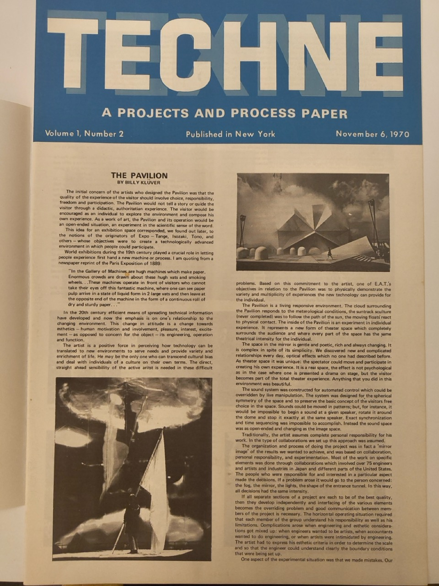
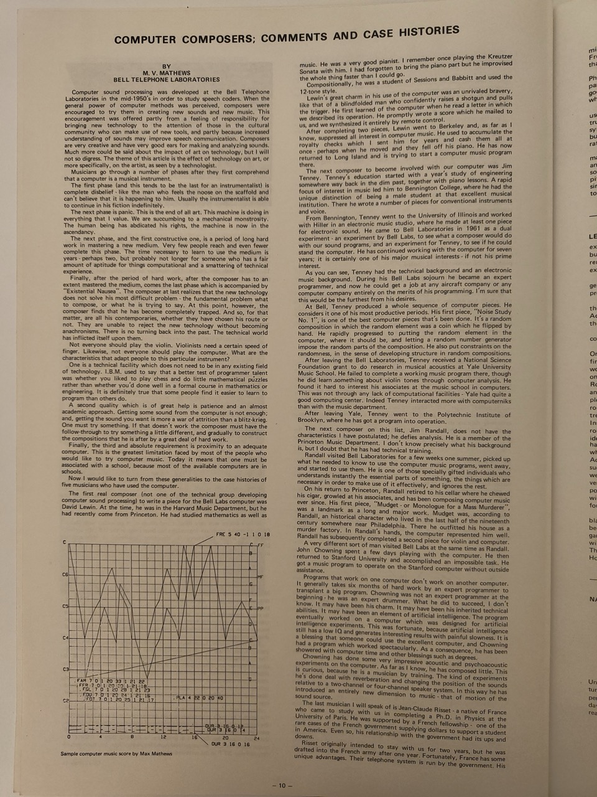
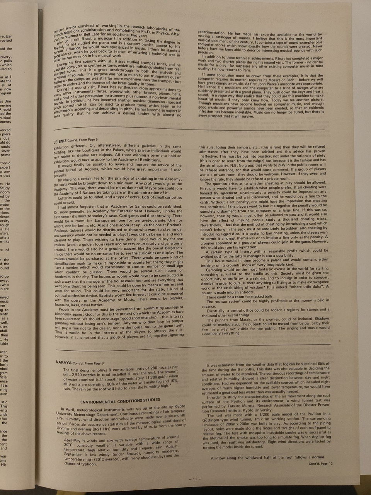

---
authors:
  - Max Mathews
title: "Computer Composers: Comments and Case Histories"
journal_title: Techne
volume: 1
issue: 2
category: other
firstpage:
lastpage:
pdf_url: 
conference_title: 
publisher: Experiments in Art and Technology
date: 2025-11-19
publishDate: 1970-11-06
reviewed: false
bibtex: ''
abstract: 

---

## Preface by Tomoya Matsuura on republishing

This text republishes Max V. Mathews' “Computer Composers: Comments and Case Histories” (1970). This text appeared in issue #2 of “Techne”, a journal published by Experiments in Art and Technology (E.A.T.), a nonprofit organization organized primarily around Billy Clouver of Bell Labs and artist Robert Rauschenberg (E.A.T. changed names several times while publishing journals; TECHNE was a later iteration).

Matthews is widely known as a pioneer in computer music research, notably for developing the world's first PCM-based speech synthesis program, “MUSIC”, at Bell Labs. Less well-known is that he was listed as one of the engineer members constituting E.A.T. Mathews' actual involvement with E.A.T. was limited to three main contributions: providing a statement of principles alongside core members Klüver, Rauschenberg, and John Pierce during E.A.T.'s founding[^statement]; delivering lectures on computer music for the technical lecture series aimed at artists; and this essay submitted to TECHNE. (His primary activities likely shifted to Stanford University and IRCAM thereafter).

[^statement]: Robert Rauschenberg; Billy Klüver; J.R. Pierce; M.V. Matthews, "statements of E.A.T.'s purpose and philosophy", January 1967 https://ccsarchives.bard.edu/repositories/2/archival_objects/9093

I consider this text exceptionally important among Matthews' writings, as it articulates in his own words the aesthetic question of how artists (musicians) should engage with technology. This is because the writings left by Matthews, including his book The Technology of Music (1965), are mainly technical explanations, and his own aesthetic attitude is mainly found in later interviews (Curtis 1980, Park 2008) and symposium records.

This time, with the permission of the Matthews' son, who hold the copyright, and Julie Martin of E.A.T., the original publisher, I republished this text on my website and released Japanese translation by Matsuura (I was able to find this text in October 2025 during my research at Bard College CCS, among the E.A.T. archives, and was then fortunate enough to receive the remaining physical copies of TECHNE from Julie Martin herself). I hope this text will be of some help in future research on computer music and art and technology.

---

# Computer Composers: Comments and Case Histories

by Max V. Mathews - Bell Telephone Laboratories

Computer sound processing was developed at the Bell Telephone Laboratories in the mid-1950's in order to study speech coders. When the general power of computer methods was perceived, composers were encouraged to try them in creating new sounds and new music. This encouragement was offered partly from a feeling of responsibility for bringing new technology to the attention of those in the cultural community who can make use of new tools, and partly because increased understanding of sounds may improve speech communication, Composers are very creative and have very good ears for making and analyzing sounds.

Much more could be said about the impact of art on technology, but I will not so digress. The theme of this article is the effect of technology on art, or more specifically, on the artist, as seen by a technologist. 

Musicians go through a number of phases after they first comprehend that a computer is a musical instrument. The first phase (and this tends to be the last for an instrumentalist) is complete disbelief - like the man who feels the noose on the scaffold and can't believe that it is happening to him. Usually the instrumentalist is able to continue in his fiction indefinitely.

The next phase is panic. This is the end of all art. This machine is doing in everything that I value. We are succumbing to a mechanical monstrosity. The human being has abdicated his rights, the machine is now in the ascendancy.

The next phase, and the first constructive one, is a period of long hard work in mastering a new medium. Very few people reach and even fewer complete this phase. The time necessary to learn to use the medium is years - perhaps two, but probably not longer for someone who has a fair amount of aptitude for things computational and a smattering of technical experience.

Finally, after the period of hard work, after the composer has to an extent mastered the medium, comes the last phase which is accompanied by "Existential Nausea". The composer at last realizes that the new technology does not solve his most difficult problem - the fundamental problem what to compose, or what he its trying to say. At this point, however, the composer finds that he has become completely trapped. And so, for that matter, are all his contemporaries, whether they have chosen his route or not. They are unable to reject the new technology without becoming anachronisms. There is no turning back into the past. The technical world has inflicted itself upon them.

Not everyone should play the violin. Violinists need a certain speed of finger. Likewise, not everyone should play the computer. What are the characteristics that adapt people to this particular instrument? 

One is a technical facility which does not need to be in any existing field of technology. I.B.M. used to say that a better test of programmer talent was whether you liked to play chess and do little mathematical puzzles rather than whether you'd done well in a formal course in mathematics or engineering. It is definitely true that some people find it easier to learn to program than others do.

A second quality which is of great help is patience and an almost academic approach. Getting some sound from the computer is not enough; and, getting the sound you want is more a war of attrition than a blitz-krieg. One must try something. If that doesn’t work the composer must have the follow-through to try something a little different, and gradually to construct the compositions that he is after by a great deal of hard work.

Finally, the third and absolute requirement is proximity to an adequate computer. This is the greatest limitation faced by most of the people who would like to try computer music. Today it means that one must be associated with a school, because most of the available computers are in schools.

Now I would like to turn from these generalities to the case histories of five musicians who have used the computer. 

The first real composer (not one of the technical group developing computer sound processing) to write a piece for the Bell Labs computer was David Lewin. At the time, he was in the Harvard Music Department, but he had recently come from Princeton. He had studied mathematics as well as music. He was a very good pianist. I remember once playing the Kreutzer Sonata with him. I had forgotten to bring the piano part but he improvised the whole thing faster than I could go.

Compositionally, he was a student of 〔Roger〕 Sessions and 〔Milton〕 Babbitt and used the 12-tone style.

Lewin's great charm in his use of the computer was an unrivaled bravery, like that of a blindfolded man who confidently raises a shotgun and pulls the trigger, He first learned of the computer when he read a letter in which we described its operation. He promptly wrote a score which he mailed to us, and we synthesized it entirely by remote control.

After completing two pieces, Lewin went to Berkeley and, as far as I know, suppressed all interest in computer music. He used to accumulate the royalty checks which I sent him for years and cash them all at once - perhaps when he moved and they fell off his piano. He has now returned to Long Island and is trying to start a computer music program there.

The next composer to become involved with our computer was Jim Tenney. Tenney's education started with a year's study of  engineering somewhere way back in the dim past, together with piano lessons. A rapid focus of interest in music led him to Bennington College, where he had the unique distinction of being a male student at that excellent musical institution. There he wrote a number of pieces for conventional Instruments and voice. 

From Bennington, Tenney wen to the University of Illinois and worked with 〔Lejaren〕 Hiller in an electronic music studio, where he made at least one piece for electronic sound, He came to Bell Laboratories in 1961 as a dual experiment - an experiment by Bell Labs, to see what a composer would do with our sound programs, and an experiment for Tenney, to see if he could stand the computer. He has continued working with the computer for seven years; it is certainly one of his major musical interests - if not his prime interest.

As you can see, Tenney had the technical background and an electronic music background. During his Bell Labs sojourn he became an expert programmer, and now he could get a job at any aircraft company or any computer company entirely on the merits of his programming. I'm sure that this would be the furthest from his desires.

At Bell, Tenney produced a whole sequence of computer pieces. He considers it one of his most productive periods. His first piece, "Noise Study No. 1", is one of the best computer pieces that's been done. Its a random composition in which the random element was 4 coin which he flipped by hand. He rapidly progressed to putting the random element in the computer, where it should be, and letting a random number generator impose the random parts of the composition. He also put constraints on the randomness, in the sense of developing structure in random compositions.

After leaving the Bell Laboratories, Tenney received a National Science Foundation grant to do research in musical acoustics at Yale University Music School. He failed to complete a working music program there, though he did learn-something about violin tones through computer analysis. He found it hard to interest his associates at the music school in computers.
This was not through any lack of computational facilities - Yale had quite a good computing center. Indeed Tenney interacted more with computerniks than with the music department.

After leaving Yale, Tenney went to the Polytechnic Institute of Brooklyn, where he has got a program into operation.

The next composer on this list, Jim Randall, does not have the characteristics I have postulated; he defies analysis. He is a member of the Princeton Music Department. I don’t know precisely what his background is, but I doubt that he has had technical training.

Randall visited Bell Laboratories for a few weeks one summer, picked up what he needed to know to use the computer music programs, went away, and started to use them. He is one of those specially gifted individuals who understands instantly the essential parts of something, the things which are necessary in order to make use of it effectively, and ignores the rest.

On his return to Princeton, Randall retired to his cellar where he chewed his cigar, growled at his associates, and has been composing computer music ever since. His first piece, "Mudget - or Monologue for a Mass Murderer", Base Mana as a long and major work. Mudget was, according to Randall, an historical character who lived in the last half of the nineteenth century somewhere near Philadelphia. There he outfitted his house as a murder factory. In Randall's hands, the computer represented him well.

Randall has subsequently completed a second piece for violin and computer.

A very different sort of man visited Bell Labs at the same time as Randall. John Chowning spent a few days playing with the computer. He then returned to Stanford University and accomplished an impossible task. He got a music program to operate the Stanford computer without outside assistance.

Programs that work on one computer don't work on another computer. It generally takes six months of hard work by an expert programmer to transplant a big program. Chowning was not an expert programmer at the beginning - he was an expert drummer. What he did to succeed, I don't know. It may have been his charm. It may have been his inherited technical abilities. It may have been an element of artificial intelligence. The program eventually worked on a computer which was designed for artificial intelligence experiments. This was fortunate, because artificial intelligence still has a low IQ and generates interesting results with painful slowness. It is a blessing that someone could use the excellent computer, and Chowning had a program which worked spectacularly. As a consequence, he has been showered with computer time and other blessings such as degrees.

Chowning has done some very impressive acoustic and psychoacoustic experiments on the computer. As far as I know, he has composed little. This is curious, because he is a musician by training. The kind of experiments he's done deal with reverberation and changing the position of the sounds relative to a two-channel or four-channel speaker system. In this way he has introduced an entirely new dimension to music - that of motion of the sound source.

The last musician I will speak of is Jean-Claude Risset - a native of France who came to study with us in completing a Ph.D. in Physics at the University of Paris. He was supported by a French fellowship - one of the rare cases of the French government supplying dollars to support a student in America. Even so, his relationship with the government had its ups and downs.

Risset originally intended to stay with us for two years, but he was drafted into the French army after one year. Fortunately, France has some unique advantages. Their telephone system is run by the government. His military service consisted of working in the research laboratories of the French telephone administration and completing his Ph.D. in Physics. After that, he returned to Bell Labs for an additional two years.

Why do I call Risset a musician? In addition to taking the degree in Physics, he has studied the piano and is a concert pianist. Except for his parents' influence, he would have specialized in music. I think he stands a good chance, when he goes back to France, of entering a technical area in which he can carry on in his musical work.

During his first sojourn with us, Risset studied trumpet tones, and he used the computer to synthesize tones which are indistinguishable from real trumpet tones. This is a great breakthrough in both the analysis and synthesis of sounds. The purpose was not so much to put trumpeters out of business — the computer was still far more expensive than the trumpet — but rather to understand the essence of the brass quality in tones.

During his second visit, Risset has synthesized close approximations to many other instruments — flutes, woodwinds, other brasses, pianos, bells, and a host of other percussion instruments plus numerous non-instrumental sounds. In addition, he has invented another musical dimension — spectral pitch control〔[^shepard]〕 — which can be used to produce tones which seem to be simultaneously ascending and descending in pitch. He has become so expert in tone quality that he can achieve a desired timbre with almost no experimentation. He has made his expertise available to the world by making a catalogue of sounds. I believe that this is the most important musical document of the century. It contains a tape of sound examples plus computer scores which show exactly how the sounds were created. Never before have we been able to describe interesting musical sounds with such precision.

[^shepard]: This is one of Risset's representational research, spectral continuous version of "Shepard Tone" which is well known as an example of auditory illusion.

In addition to these technical achievements, Risset has completed a major work and two shorter pieces during his second visit. The former — incidental music for a play — far surpasses any other existing computer music in tone quality. He now returns to Paris.

If some conclusion must be drawn from these examples, it is that the computer requires its master — requires its Mozart or Bach — before we will have great computer music. At first John Pierce's anecdote was appropriate. He likened the musicians and the computer to a tribe of savages who are suddenly presented with a grand piano. They push down the keys and hear a sound. In a vague way they realize that they could use this machine to make beautiful music, if they only knew how. Today we see another picture. Enough musicians have become hooked on computer music, and enough good music and powerful sounds have been created, so that an epidemic infection has become inevitable. Music can no longer be cured, but there is every prospect that it will survive.

