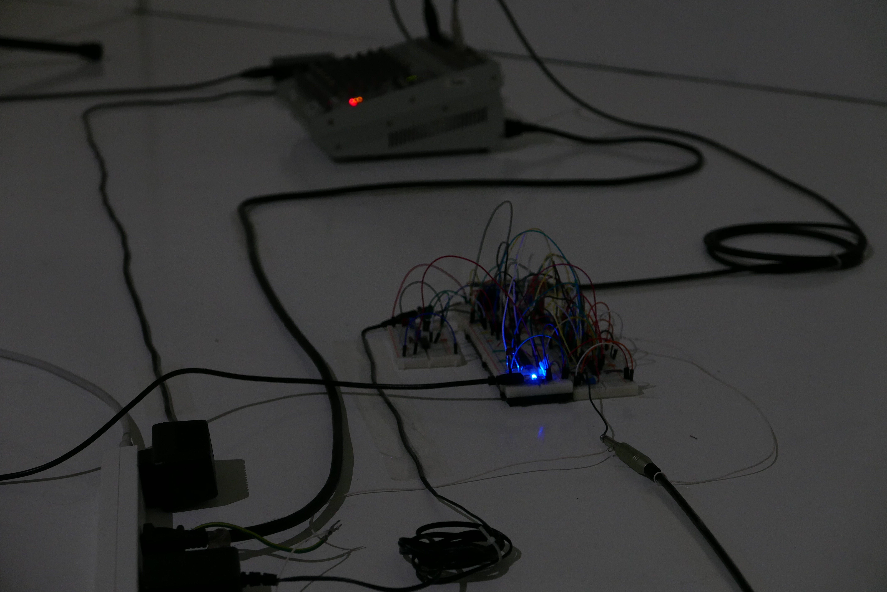

千住 Art Path 2015（東京芸術大学千住キャンパス制作・論文発表会）にて展示

<iframe src="https://player.vimeo.com/video/162286132" width="640" height="360" frameborder="0" webkitallowfullscreen mozallowfullscreen allowfullscreen></iframe>

# 作品概要

コンピューター黎明期(1940~1950年)に使われていた音響遅延線メモリー(Acoustic Delay Line Memory)を可聴状態で、インターネット上から操作可能なシステムの作品。

展示時には[このサイト](https://acousticdelaymemory.herokuapp.com/)上から操作できるようになっていた(現在は稼働していない)。

---
この作品では空気を媒体とした音響遅延線メモリーの中に1バイト＝0/1のデータ列8つの情報が保存されている。
その保存されているデータをオンライン上からコンピュータや携帯電話のインターネットブラウザを使いリアルタイムで見ることができ、上書きすることも出来る。
左/上側にはデータのasciiコードに対応する文字が表示され、また書き換えてEnterキーを押せばメモリーに送信される。
右/下側には0/1の列を白黒に対応付けたものが表示されている。クリックするとその部分の0/1を反転させたものが保存される。

音響遅延線メモリー(Acoustic Delay Line Memory)という記憶装置は、コンピュータの黎明期、1946~1970年代ごろまで使用されていた記憶装置である。
世界で初めてのコンピュータと一般的に言われるENIACの次の世代であるEDSACやEDVAC、UNIVAC、日本で初めての商用コンピュータのFUJICなどに利用された。

仕組みとしては、まず1/0のデータ列を音のパルスとして発する。もう一端のマイクロフォンでそれを受信する。受信するまでには距離÷音速の時間がかかる。その受信したパルス列を再び増幅し反対の端から再び発する。
こうしてデータの列を変化させないまま循環させ続け、「時間を遅らせる」事によってデータを保存する。

---

---

# 文章1

広辞苑曰く、
【保存】もとの状態を保って失わないこと。
原状のままに維持すること。
らしい。

誕生日ケーキのメッセージ入りチョコレートを食べるのを一瞬躊躇してしまう。
別に食べてもメッセージは消えるわけでは無いにもかかわらずそう思うということはそのチョコレートの形として保存されていたメッセージが伝わった時点で保存されていた情報は無くなった、と言うより役目を終えたということではないだろうか。
そう考えると「情報を保存する」とは、例えば食べ物が腐らないように「保存」するということとは幾分違うように思える。

レコードには音圧が溝の深さとして記録されている。しかし摩耗によって少しづつ音の情報は劣化、とまで言わなくとも「別の状態」へ変化していく。
CDならばビットの1/0が盤面に刻まれていて、物体が劣化はしてもデータはある程度までは保存した時と全く同じ状態を保って現れる。
では音響遅延線メモリーにおいては一体どこに何が保存されているのだろうか。

---

# 文章2

自分が生まれた年は1994年なのでその翌年にはWindows95が発売されていて、自分の親は早くからインターネットの環境を整えて（ゲームをして）いたらしいので物心ついた頃からインターネットは身近にあったことになる。
小学校以前となると本当に記憶は曖昧ではあるのだがダイヤルアップ回線に接続するときのピーヒョロロロという音と黒背景に解像度の荒い文字が表示されているのにはなんとなくワクワクしていたことは覚えている。

「デジタルデータっぽさ」という感覚が存在するのではないかと思っていて、例えば、前述したダイヤルアップの発信音、プリンターの印刷してる時の駆動音とか、部屋を暗くしてテレビを見ている時に音声の光端子から赤い光の点滅が見えるのとかそういうのは「データっぽい」と思う。
なにか伝える情報を効率的に伝達するために一度人間が直接読み取れない形に変換して送信する、その過程で漏れ出たものから何か別の感覚を与えられることはあると考えている。

Googleドキュメントという文章をリアルタイムで共同編集できるサービスを初めて使った時にこれは便利だ、と思う一方でデジタルデータの持つ安定した、恒久的なイメージ（これも「データっぽさ」のひとつかもしれないが）が消え去ったように見えて不思議な感覚だった。

僅か70年少しで圧倒的に増えた扱える情報量、通信量によってデジタルデータのテクスチャーとしてアナログっぽさが再び蘇ってきているのではないか、ということを作品を通して確かめられるのではないかと考えている。

