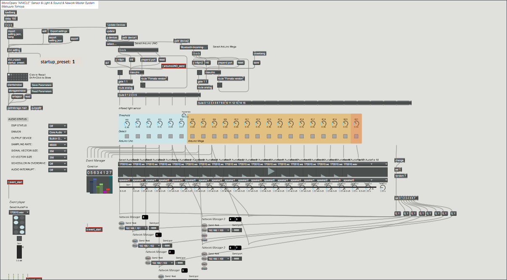

作曲家の[小野龍一](https://ryuitarian.jimdofree.com/)の展示、AINICLEのための技術支援(人の位置に応じた音声、動画の再生システムの構築とプログラミング)を行いました。

[ウェブサイト](https://ryuitarian.jimdofree.com/works/)

2017年7月6ー11日@Gallery NIW

> 自殺したある少女の物語を追体験していく回遊型インスタレーション。展示空間内には18個のセンサーが設置され、鑑賞者の動きによって少女によるモノローグが再生される。また、会場内には常に音楽が流れており、これもセンサーによって徐々に様態が変化していく。鑑賞者ひとりひとりでモノローグ・音楽の体験が異なってくるため、無数のコンテクストが生成される。キャッチコピーは「ひとりのためのモノオペラ」。
> 当日配布したパンフレットには音楽学者の福仲冬子、サウンドデザイナーの川崎義博、写真家の寺田健人の各氏による論考を寄稿していただいた。また、会期中には音楽・文芸評論家の小沼純一 氏とのトークショーも行われた。

