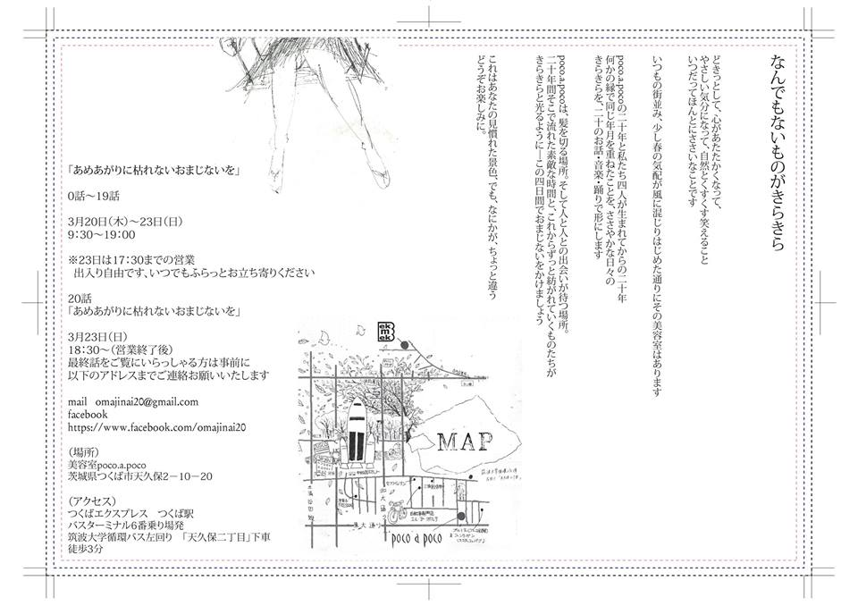

A charm not to wither after the rain

Happening performance held in beauty parlor in its business time.

A visitor see the performance over the mirror and some other people see the situation itself.

I composed music and also played with 6ch surround sound system.

Co-organized with Manami Ishii, Akiho Tani, Yuna Yamada and Keita Ogi

