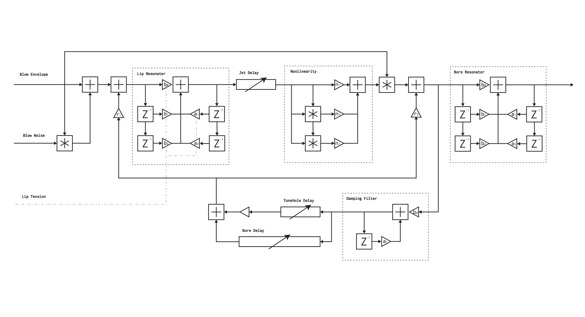
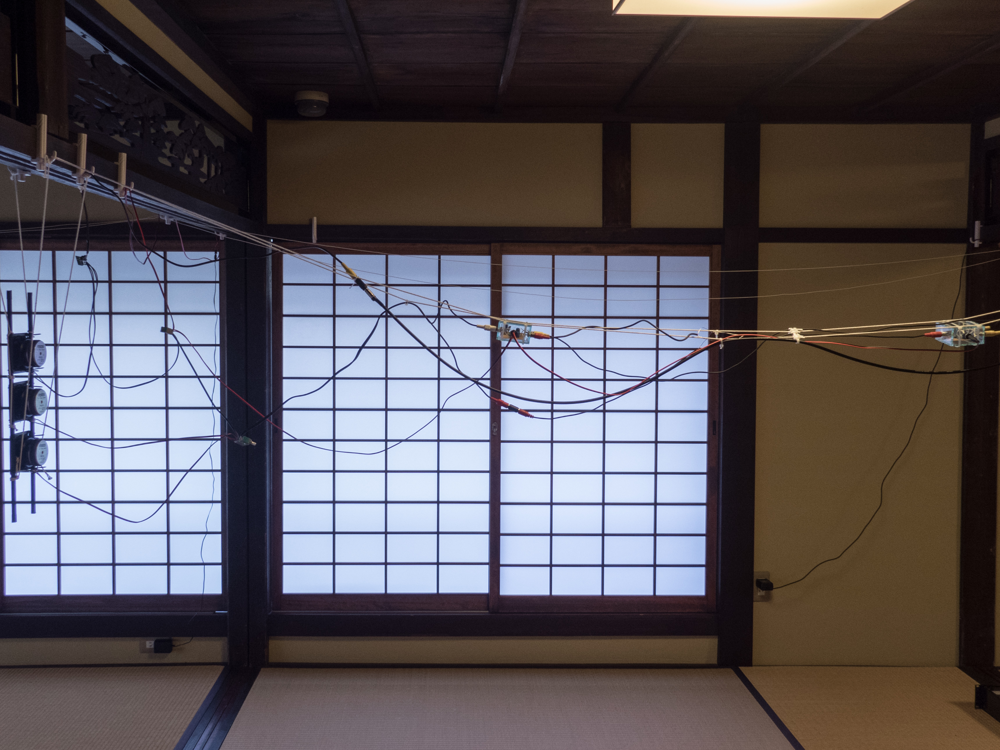
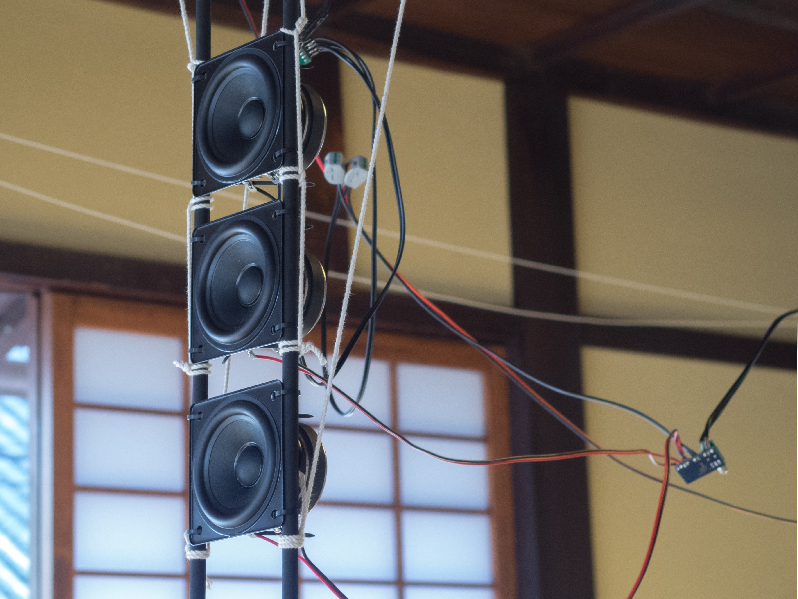

---

関連記事

[Aphysical Unmodeling Instrument rev.2(同作品の2度目の展示記録)](/works/aphysical_icsaf17)

[Aphysical Unmodeling Instrument モデリングから音・音楽を再考するサウンドインスタレーション(本作品についての研究発表)](/works/jssapaper/)

---

[2017/10/27~11/5 奈良・町家の芸術祭 はならぁと 2017　内 はならぁと ぷらす にて展示](http://hanarart.jp/2017/archives/2185)

会場：八木札の辻交流館

<iframe src="https://player.vimeo.com/video/253094723?color=ffffff" frameborder="0" webkitallowfullscreen mozallowfullscreen allowfullscreen style ="width:100%; min-height:360px; max-height:400px;"></iframe>

<small>動画右下CCボタンで日本語字幕</small>

<https://vimeo.com/253094723>

# 文章1

「Aphysical Unmodeling Instrument」は物理モデリング合成を実空間で、物理的に再実装する作品である。

本作品は、Whirlwindというモデルとその再モデリングという行為を通して作曲と演奏という一見逆に見えるものを、共通の音を生み出すプロセスとして捉え直すことを試みるものだ。

---

---

物理モデリング合成という主に80〜90年代ごろから研究されているコンピューター上で現実の楽器の音を模倣する為の技術がある。

この手法は加算、減算、FM、ウェーブテーブル合成などいわゆるシンセサイザーの他手法と並べられることもあるが、これらの手法は技法そのものを指しているのに対して物理モデリングは模倣するという目標が定義になっており、そのため実際の技法は様々な種類がある。

その中でも計算がシンプルなウェーブガイド合成という手法は最もよく使われる。

これは管楽器のモデリングで例えると、管の中を音波が進み、管の端で反射して戻ってきて・・・という進行波の動きに各部が与える影響を計算するものだ。

その研究の中でCookらによって作られた、Whirlwindというハイブリッド管楽器モデルがある\[1\]。これは元々トランペット、フルート、クラリネットの3種類のモデルがあり、それを和集合的に合体させたモデルである。

その大まかな構造は、入力された進行波が共鳴器、歪み(拡声器越しの声のような効果だと思って欲しい)、遅延などを経てまた入力に戻ってくるという下図のような形になっている。

この構造はハウリング（カラオケでマイクのボリュームを上げすぎた時にキーンとなるやつ）と実はよく似ている。ハウリングはマイクで拾った音を音量を上げるために増幅し、スピーカーから発された音がマイクに入り、それがもう一度スピーカーから出力されもう一度マイクへ、といった具合に音がどんどんループして音量が大きくなるものだ。

この時スピーカーから音がマイクにたどり着くまでには音速分の遅延があり、音を増幅する時歪みが発生し、マイクやスピーカー、部屋の特性などである周波数が強調されたり打ち消されたりする。

さてこのような類似性の見出しをより進めると、例えば掛け算や足し算もデジタルでの計算という表現だけでなく電気回路や音響回路を使った様々なパターンの構成ができる。

Aphysical Unmodeling Instrumentはこのような考え方でWhirlwindを物理的に再実装する。下図はその構成である（実際の空間的配置とは対応していない）。

例えば掛け算はLEDと、光の強さで抵抗値が変わるセンサを組み合わせたり、ラジオの変調に使われる電気回路（ダブルバランスドミキサ）などで置き換えられている。

遅延は音波伝搬の遅延で表現されており、スピーカーとマイクのセットで作られる。

共鳴はマイクとスピーカーを遮る紙筒で置き換えられているが、これは実際にはほとんど効果を成さなかった。

息を入れる時のサーッという音の要素であるホワイトノイズは、何も録音されてないレコードのように回転する紙テープを擦る針の音が電気信号に変換されることで鳴る。展示中にモーターが焼けてよく止まった。

息の強さのパラメーターは風車が回転するスピードを電圧に置き換えている。

このような置き換えで、風車が風で回るとLEDが光り、マイクからスピーカーへ流れるまでの音量を変化させハウリングのように音が出たり出なかったりする。

------

Whirlwindが特徴的なのは、模倣することが目的だったはずのモデリングが、3つの楽器が合体したものという現実には存在しない楽器を対象としていることでゴールを失っているという点だ。

これは例えば作曲と演奏の関係に似ていないだろうか。作曲家の頭の中にある理想の音楽があって、それをよく振る舞うように楽譜というフォーマットで記述している。
演奏者がその楽譜を読み、演奏してみて、自分の頭のなかで想像していたものとの差を埋めていく。

しかし当然作曲家の頭にあるモデルと演奏家のモデルが異なっているので、元のモデルを完全に再現したものが演奏されるわけではない。つまり「モデルの記述からモデルを想像する」「モデルをモデリングする」ような事が起きていると言える。そして演奏も作曲もどちらもモデリングという共通した行為になっている。

本作品はWhirlwindの目標としている、あるいはモデル記述する際に頭のなかに浮かんでいた（はずの）モデルを勝手に想像して補完し、モデルの実体を作り上げるプロセスと、その成果物だ。それはあるモデル記述からもとのモデルを想像する演奏にも似るかもしれないし、自分の頭のなかにある理想を実体化する作曲とも似るかもしれない。

# 文章2-1

トーンベンダーという有名なファズ（歪み効果の一種）エフェクターはギタリストがギターでサックスの音を出したいという要望に答えて作ったという話がある。じゃあ、仮にギターの音がどんどんサックスに近づいていったとき、それは「歪んで」いるのだろうか？むしろだんだんクリアなサックスの音に近づいていくという言い方のほうが正しいような気もする。現代ではこのビンテージファズエフェクターの再現モデルがたくさん出ているが、別にギターをサックスの音に近づけるエフェクターというものは出てきていない。

# 文章2-2

風鈴は風で鳴る音を聴くために人間によって作られている。

では風鈴は楽器なのだろうか。仮にそうなら風鈴は誰が演奏しているのか。

これは人もしくは風という答えが考えられる。ではそれぞれの場合風鈴はいつ演奏されているのか。

風鈴を作ったとき、風鈴を吊るすときは直接音の鳴る瞬間ではないが、それは演奏と言っていいのだろうか。風鈴が鳴ったときとするなら人間は何もしていなくてもいいが、それは演奏なのだろうか。

風鈴は楽器ではないとする立場を考える。これは風が勝手に鳴らしているだけで人間は何もしていないから楽器ではないという考え方だが、では風が鳴らしている木のガサガサ言う音は風が勝手に鳴らしている音だが同じということでいいのだろうか。人工物でないから違うとするならばビル風の音はどうだろう。

風鈴のように人間が音を鳴らすことを意図して作っていないから違うというのであれば、風鈴はやはり楽器だということになるがどうだろう。

## 参考文献

[1] Cook, P. R. (1992). A meta-wind-instrument physical model, and a meta-controller for real-time performance control. In ICMC Proceedings.
