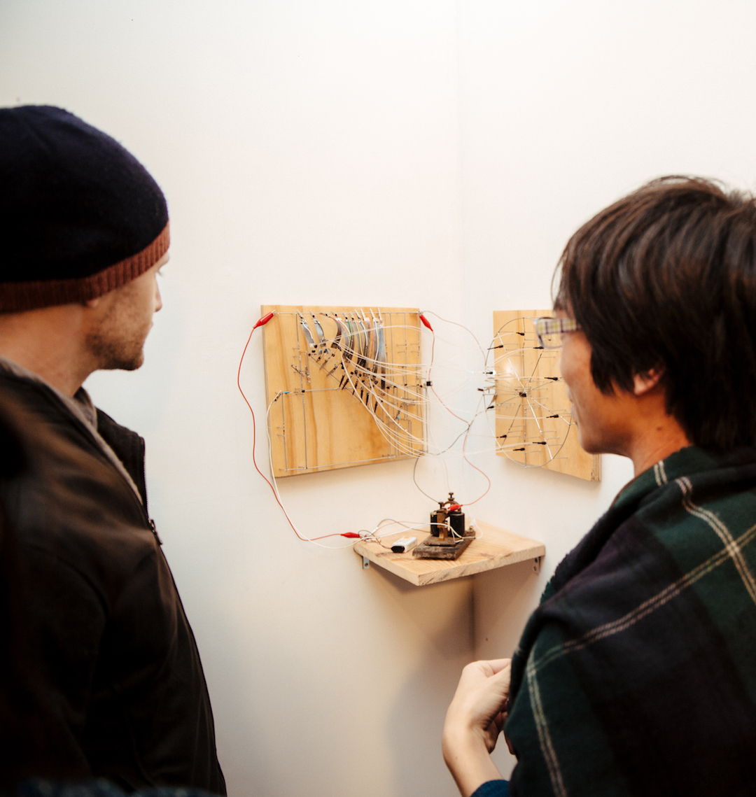
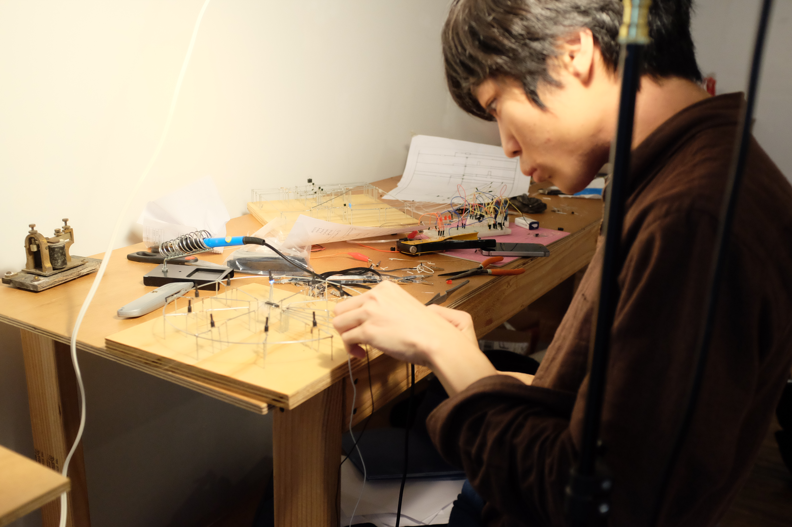

An alternative form of a personal computer that is made to enable programming a time in time. It does not have a master clock and thus does not have a minimum unit of time. Its function is only dividing time as programmed physically.



material: electronic timer circuit, counter circuit, telegraph sounder, optic fiber;

Made in [School for Poetic Computation](https://sfpc.io) Fall 2018 class and presented at Student Showcase.

# On a Computation of Time

Most of today's computers have a master clock. Also, most of the abstract model of computers like Turing machine, finite state machine, and pushdown automaton, which are bases of today's computers do not have a concept of time. They only think how to move a data in a memory in each step and ideally, the infinitely fast clock is the best in practical use if they had.

And when computers treat information of time, we divide time into segments to make a continuous value into a discrete value. However, don't we have the other way to calculate a time without digitizing the time?

For example, there is an analog circuit called monostable multivibrator. The circuit receives an electric pulse and outputs pulse after a certain delay. The interval is determined by a combination of a capacitance and a resistance. So what if the output pulse switch the resistor to another one and is fed back to input? The pulse is triggered again after a different delay time from the previous interval. By repeating this, we should make the timer which has non-uniform intervals. The set of intervals are reproducible and we can say it as programmable but nothing is digitized because the delay times are resistances, physical parameters.

This is a principle of the EDPAC(Electronic Delay Pulse Automatic Calculator).
This device can exist even if there was not a notion of number. Number is the biggest format and standard from ancient in the world. Similarly, computers stand on thousands of standardizations.

This device keeps working even if it is not called a computer by most people. At least, I made it with the purpose for computation of time.

photo by Minu Han

# Working Process

photo by Tiriree Kananuruk

photo by Tiriree Kananuruk

