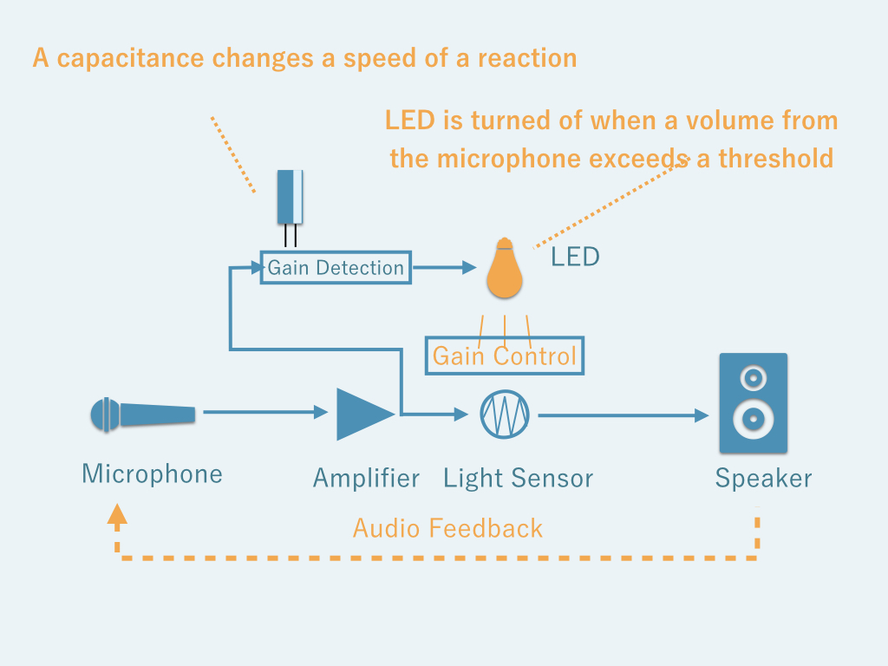
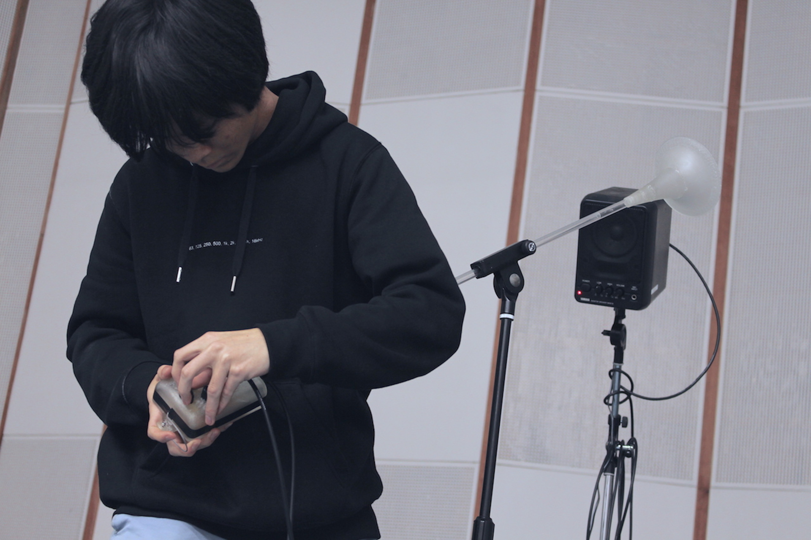
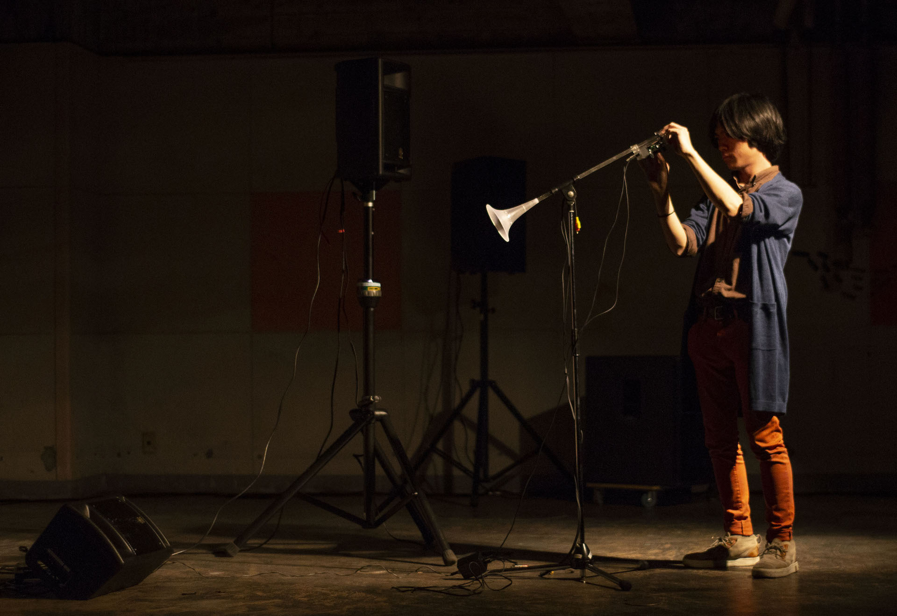

photo by Takehiro Goto



# Exidiophone, An Electro-Acoustic Instrument

Exidiophone is an audio-feedback (Larsen Effect) based musical instrument which does not have any oscillators or audio sources.

An audio-feedback is a phenomenon that produces a constant tone by repeating an amplification of a sound from a speaker to a microphone.

The figure above explains a basic structure of Exidiophone.
An usual audio feedback keeps amplifying until a capability of its amplifier circuit. On the other hand, Exidiophone has a light sensor which controls amplifier's volume and a LED which is placed on the other side of light sensor. The LED is turned off when the gain of a signal coming from the microphone exceeds a threshold. Thus it works as:

1. A loudness of audio-feedback increases
2. LED is turned off
3. Light sensor makes the volume lower
4. Audio feedback stops
5. LED gets back to on
6. back to 1

Then Exidiophone outputs feedback sound with periodical feedback-tone and silent along with the on and off of the light, self-regulatorily. The speed of period can be controlled by changing capacitors which is placed on a socket on a body of exidiophone.

# Document

Idiophone, one of the category of musical instruments, has an origin in the meaning that "The object itself makes a sound" like cymbals and Marrimba, not like a Membrenophone like drums or Chordophone like piano and guitar.

Thinking about Speaker literally, it means "a someone who speaks". It is made for producing a loud voice instead of a human or reproducing auditory information by speaking recorded voices instead of people.

A word Microphone comes from micro and phone. It picks up and amplifies small sound having an origin in the role of Sthethoscope.

Even if the speakers and microphone can record all the sound which exists on earth until now, we can still find a blank area that is not filled with "found sounds" and can be produced with a speaker and a microphone.

Such a sound is "The sound which Speaker and Microphone themselves produces"."Ex"idiophone expands the notion of "The sound which the object itself produces" on Idiophone and also expands a view to existing electronic musical instruments.

# Photos

2018年3月、《FREQ2018 21世紀初頭の音と音楽》でのパフォーマンス。Exidiophoneの最初のパフォーマンスで、楽器は1台のみ。ボディは3Dプリンタ製で、5つのつまみを操作することと、共鳴器のついた本体を動かす事が中心だった。電源は専用の±12Vの電源をモジュールを作り、3.5mmステレオミニ端子で供給している。

3Dプリンタ製のボディが制作の手間がかかりすぎる、大きいなどの理由から、レーザーカッターでアクリル板をカットして組み合わせるより簡便な方法を取った。ただアクリル板の割れが多く発生する問題があった。

photo by 屋上(野口翔平、郷田いろは、小林舞衣)

2018年4月、《Alternative Act 1.0 Tech Performance Fes.》でのパフォーマンスの様子。当日は2台持ち込んだが1台がオペアンプの故障で音が出なくなり、1台+スピーカー2発でのパフォーマンスとなった。2日間のパフォーマンスだったが、2日目にはもう1台からも本番直前で音が出なくなってしまったので急遽別のパフォーマンスをすることになった。

5月までのパフォーマンスを顧みて、6月後半に新しく作り直したもの。変更点としては、つまみを外側ではなく2つだけケースの内側に調整用に残し、基本的な演奏はマイクとスピーカーの位置や共鳴度合い、ケース外側に出したLEDと光センサを直接手で触る、及びソケットに挿すコンデンサの容量で調整する形になった。また、内部の回路的には電源を±で供給することでも回路が煩雑になっていたので、5Vの単電源で動くようにした。ケースは汎用のプラケースに穴を空けていて、基板はパーツ数が減ったこともあり、ユニバーサル基板に手で実装している。

2018年8月の水道橋Ftarriでのパフォーマンスのセットアップ。一台は画像内のスピーカーに直接繋ぎ、もう一台は会場のPAにつないでいる。

2018年12月の《FREQ x HardCcreAmbience》でのパフォーマンスのセットアップ。新しく作ったモデルを3つ、黒い旧型を2つの合計5台をそれぞれ1つのスピーカーに繋いで、会場全体から音を鳴らすパフォーマンスを行った。

回路自体はほぼ同じままレイアウトをスリムにしたプリント基板を発注し、3Dプリンタでボディを再設計した。電源はコネクタを排し、9V電池を中に入れて動かすことで取り回しを良くしている（内部的には5Vで稼働している）。

直付けになっていたマイクロフォンはステレオミニコネクタの端子を付け、同時に電源スイッチとしても働くようになっている。
