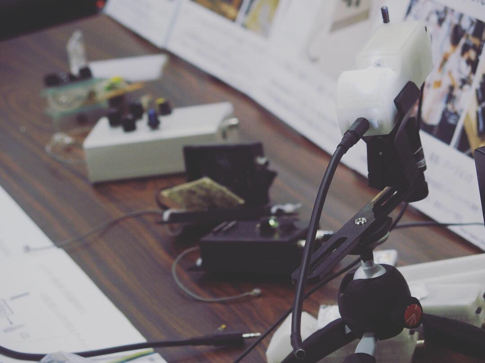

photo by Takehiro Goto



# 電子音響楽器Exidiophone

電子音響楽器Exidiophoneは、オーディオフィードバック(ハウリング)を音の出る基本的な仕組みとして用いた楽器で、発振器などの音源を一切持たない。

オーディオフィードバックとは、スピーカーから出た信号をマイクロフォンが拾い、それが増幅されスピーカーに入力されることで、増幅が繰り返され最終的に持続音になるものだ(カラオケなどで、マイクをスピーカーの方に向けたり近づけ過ぎたりするとキーと音がなる、あれ)。

上図がExidiophoneの基本動作を説明する図である。通常のオーディオフィードバックは、増幅器の限界まで際限なく増幅し続ける。一方、Exidiophoneは音量を光の強さで制御する光センサと、対向して設置されている、通常点灯しているがマイクロフォンからの信号の音量が一定を超えると消灯するLEDが設置されており、

1. フィードバックの音量が大きくなる
2. LEDが消える
3. 光センサーが音量を小さくする
4. フィードバックが止まる
5. LEDが再点灯する
6. 1に戻る

といった流れで、光の明滅と共にフィードバック音が自律的に鳴る鳴らないを繰り返す。この点滅速度は、楽器についているソケット挿し込むコンデンサの容量が大きくなるほど遅くすることができる。

# 文章1

Idiophoneとは体鳴楽器という楽器の分類法の一つで、ドラムのような膜鳴楽器やピアノのような弦鳴楽器ではなく、シンバルやマリンバのように「物それ自体が鳴る」という意味から来た名前だ。

スピーカーとはSpeaker、つまり喋る人のことで、人の代わりに大きな声を出したり、録音された声を喋ることで情報を再生するものとして作られている。マイクロフォンはMicro＝小さなphone＝音、つまり小さな音を拾い上げて拡大する、元々の聴診器などでの役割からきた言葉だ。仮にスピーカーやマイクが今ある音、音楽を全て再生/録音できるとして、それらの領域を塗りつぶしてなおスピーカーとマイクでしか出せない音の領域が残っているはずだ。

それは記録/再生でない「スピーカー/マイクそれ自身が鳴らす音」である。"Ex"idiophoneは「物それ自体が鳴る」Idiophoneの概念を、そして既存の電子楽器の考え方をも拡張する。

# Photos

2018年3月、《FREQ2018 21世紀初頭の音と音楽》でのパフォーマンス。Exidiophoneの最初のパフォーマンスで、楽器は1台のみ。ボディは3Dプリンタ製で、5つのつまみを操作することと、共鳴器のついた本体を動かす事が中心だった。電源は専用の±12Vの電源をモジュールを作り、3.5mmステレオミニ端子で供給している。

3Dプリンタ製のボディが制作の手間がかかりすぎる、大きいなどの理由から、レーザーカッターでアクリル板をカットして組み合わせるより簡便な方法を取った。ただアクリル板の割れが多く発生する問題があった。

photo by 屋上(野口翔平、郷田いろは、小林舞衣)

2018年4月、《Alternative Act 1.0 Tech Performance Fes.》でのパフォーマンスの様子。当日は2台持ち込んだが1台がオペアンプの故障で音が出なくなり、1台+スピーカー2発でのパフォーマンスとなった。2日間のパフォーマンスだったが、2日目にはもう1台からも本番直前で音が出なくなってしまったので急遽別のパフォーマンスをすることになった。

5月までのパフォーマンスを顧みて、6月後半に新しく作り直したもの。変更点としては、つまみを外側ではなく2つだけケースの内側に調整用に残し、基本的な演奏はマイクとスピーカーの位置や共鳴度合い、ケース外側に出したLEDと光センサを直接手で触る、及びソケットに挿すコンデンサの容量で調整する形になった。また、内部の回路的には電源を±で供給することでも回路が煩雑になっていたので、5Vの単電源で動くようにした。ケースは汎用のプラケースに穴を空けていて、基板はパーツ数が減ったこともあり、ユニバーサル基板に手で実装している。

2018年8月の水道橋Ftarriでのパフォーマンスのセットアップ。一台は画像内のスピーカーに直接繋ぎ、もう一台は会場のPAにつないでいる。

2018年12月の《FREQ x HardCcreAmbience》でのパフォーマンスのセットアップ。新しく作ったモデルを3つ、黒い旧型を2つの合計5台をそれぞれ1つのスピーカーに繋いで、会場全体から音を鳴らすパフォーマンスを行った。

回路自体はほぼ同じままレイアウトをスリムにしたプリント基板を発注し、3Dプリンタでボディを再設計した。電源はコネクタを排し、9V電池を中に入れて動かすことで取り回しを良くしている（内部的には5Vで稼働している）。

直付けになっていたマイクロフォンはステレオミニコネクタの端子を付け、同時に電源スイッチとしても働くようになっている。

Maker Faire Kyoto 2019での歴代の筐体を並べて展示している様子。
