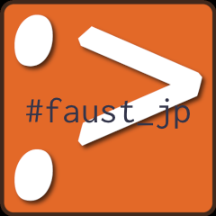

I organized a workshop & meetup of [Faust](http://faust.grame.fr), a functional programming language for an audio signal processing.

Faust is still infamous in Japan. This meetup was probably the first one of its kind in Japan.

Workshop have been held twice currently.

[Faust-jp勉強会 #1](https://faust-jp.connpass.com/event/70954/)

[faust_jp 勉強会&meetup #2](https://faust-jp.connpass.com/event/70954/)

Report blog of the meetup

音響信号処理言語"Faust"の勉強会に参加してきました(アオギリさん)

http://aogiri-m2d.hatenablog.com/entry/2017/08/28/232101

Faust勉強会 \#1(g200kgさん)

https://www.g200kg.com/archives/2017/08/faust-1.html
