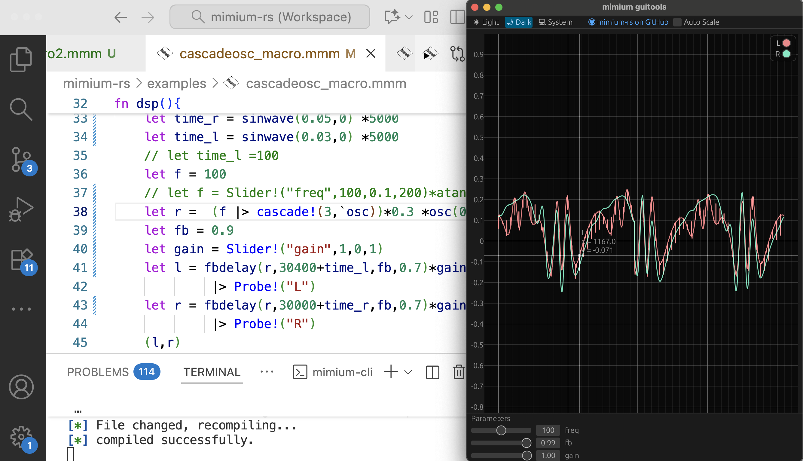

https://mimium.org/

mimium (MInimal-Musical-medIUM) is a programming language for sound and music. Designed and developed with the aim of serving not only as a tool for musicians and programmers but also as an infrastructure for music creation and distribution, mimium distinguishes itself in its capabilities.

mimium is a functional programming language based on lambda calculus, a universal computational system, enhanced with minimal primitives for temporal operations (delays and feedback). This design allows users to define fundamental signal processing units, like oscillators and filters, as just functions within the mimium language, distinguishing it from many existing sound programming environments. The benefits of lambda calculus enable meta-operations, making it straightforward to replicate functions such as oscillators in arbitrary numbers (e.g., 100 or 1000 instances), an operation that is often challenging to implement concisely in other languages.

Also mimium has a unique Live Coding feature. By doing static analysis of diff of the codes, regardless of the part of DSP, the player can continue the performance without audio interruption.

---

Development Repository

https://github.com/mimium-org/mimium

---

### Related Research Articles

[Designing Civil engineering of Music yhrough the development of mimium, aprogramming language for music (Doctoral Thesis, in Japanese)](/hakuron)

[mimium: a Self-Extensible Programming Language for Sound and Music (FARM 2021)](/en/research/farm2021-mimium)

[Lambda-mmm: the Intermediate Representation for Synchronous Signal Processing Language Based on Lambda Calculus (International Faust Conference 2024)](/en/research/lambdammm-ifc-2024)

The project is selected for [2019 Exploratory IT Human Resources Project (The MITOU Program) by IPA: INFORMATION-TECHNOLOGY PROMOTION AGENCY](https://warp.ndl.go.jp/info:ndljp/pid/12446699/www.ipa.go.jp/jinzai/mitou/2019/koubokekka_index.html).

Presentation Slide at Mitou Demoday 2019(in Japanese)

Presentation Video（It is not allowed to embed, jump from the link bellow）

http://www.youtube.com/watch?v=J-K4IWDHgdo