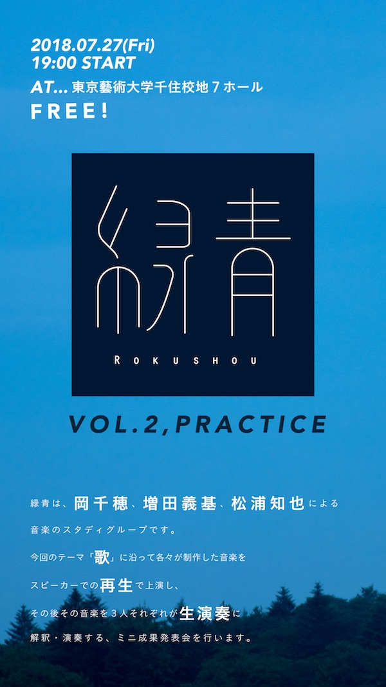

[増田義基](https://yoshikimasuda.com)・[岡千穂](https://twitter.com/chihooka)と共に行っている、音楽にまつわる記録物や音源の制作とライブ演奏をセットにして、電子音楽や即興音楽を軸に音楽について継続的に考え、発表するためのスタディグループ。

# 緑青\#0

2017年12月24日、落合Soupにて

<iframe width="560" height="315" src="https://www.youtube.com/embed/UKJJJTmcLkI" frameborder="0" allow="accelerometer; autoplay; encrypted-media; gyroscope; picture-in-picture" allowfullscreen></iframe>

<iframe width="560" height="315" src="https://www.youtube.com/embed/ztq6noMn9vc" frameborder="0" allow="accelerometer; autoplay; encrypted-media; gyroscope; picture-in-picture" allowfullscreen></iframe>

<iframe width="100%" height="166" scrolling="no" frameborder="no" allow="autoplay" src="https://w.soundcloud.com/player/?url=https%3A//api.soundcloud.com/tracks/377229095&color=%23ff5500&auto_play=false&hide_related=false&show_comments=true&show_user=true&show_reposts=false&show_teaser=true"></iframe>

# 緑青 \#1 “復習(Relisten)”

2018年6月22日、北千住トーチカにて行われたYoutube Liveでの配信トークイベント。

<iframe width="560" height="315" src="https://www.youtube.com/embed/ZIRq0COiWe4" frameborder="0" allow="accelerometer; autoplay; encrypted-media; gyroscope; picture-in-picture" allowfullscreen></iframe>

# 緑青 \#2 “練習(Practice)”

2018年7月25日、東京藝術大学千住キャンパス第7ホールにて行われた、歌ものの曲を作った上でそれをスピーカー再生し、その後同じ曲をライブで演奏するイベント。

<iframe width="100%" height="166" scrolling="no" frameborder="no" allow="autoplay" src="https://w.soundcloud.com/player/?url=https%3A//api.soundcloud.com/tracks/474353772&color=%23ff5500&auto_play=false&hide_related=false&show_comments=true&show_user=true&show_reposts=false&show_teaser=true"></iframe>
