# Park Live at Ginza Sony Park 

2019.04.27

w/[Ayatake Ezaki](https://twitter.com/ayatalce) (Keyboards), [Manami Kakudo](https://www.universal-music.co.jp/kakudo-manami/) (Percussion, Ukulele, Voices, Tape Recorders), [Yoshihiro Harada](https://yoshihiroharada.wixsite.com/home) (Steel Pan)

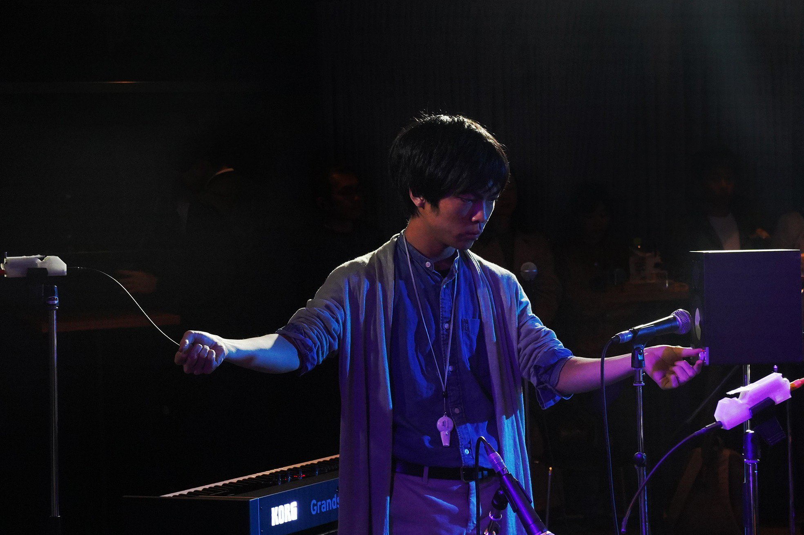

instruments: [Exidiophone](/works/exidiophone)*2, Cracklebox w/ audio feedback from handy recorder, curing tape, Alminium foil

# FREQ x HardCoreAmbience(九州大学大橋キャンパス)

2018.12.20

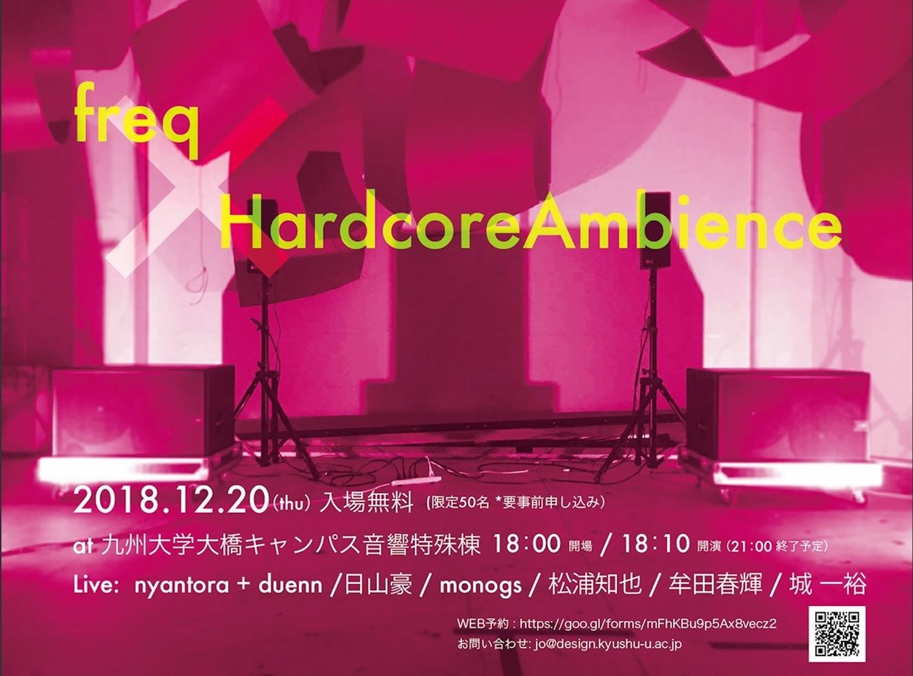

instruments: [Exidiophone](/works/exidiophone)×5、[EDTAC](/works/edtac)、Whistle、Bicycle Bell

# 水道橋Ftarri 6周年記念コンサートvol.3

2018.07.21

# DOMMUNE 蓮沼執太フルフィル特集

2018.08.01

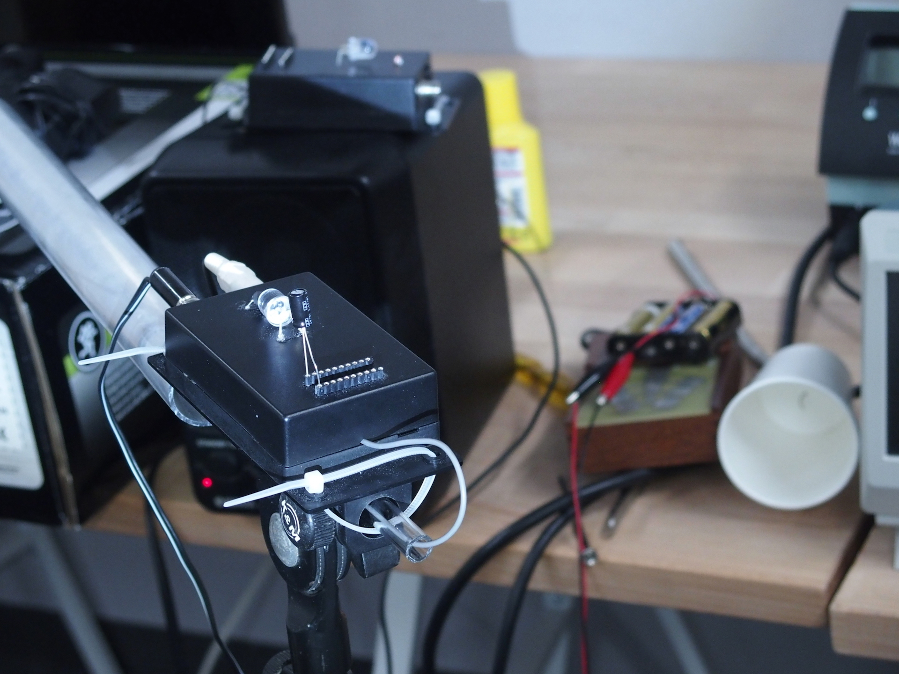

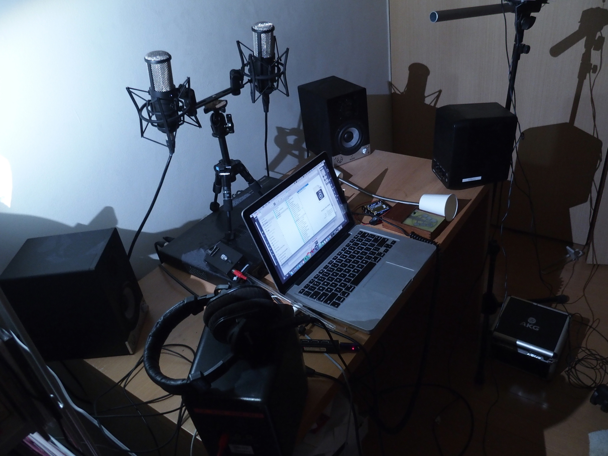

instruments: [Exidiophone](/works/exidiophone)*2, AKG P420 *2, Eve Audio SC204*2, DIY Analapos with Paper Cup&Spring, Cracklebox

# つくると！vol.5(九州大学大橋キャンパス)

2018.07.15

instruments: [Exidiophone](/works/exidiophone)*2, Speaker*4,Mixer, Whistle

# 電磁的音族 KINK GONG JAPAN Tour(薬院 IAF Shop*)

2018.07.08

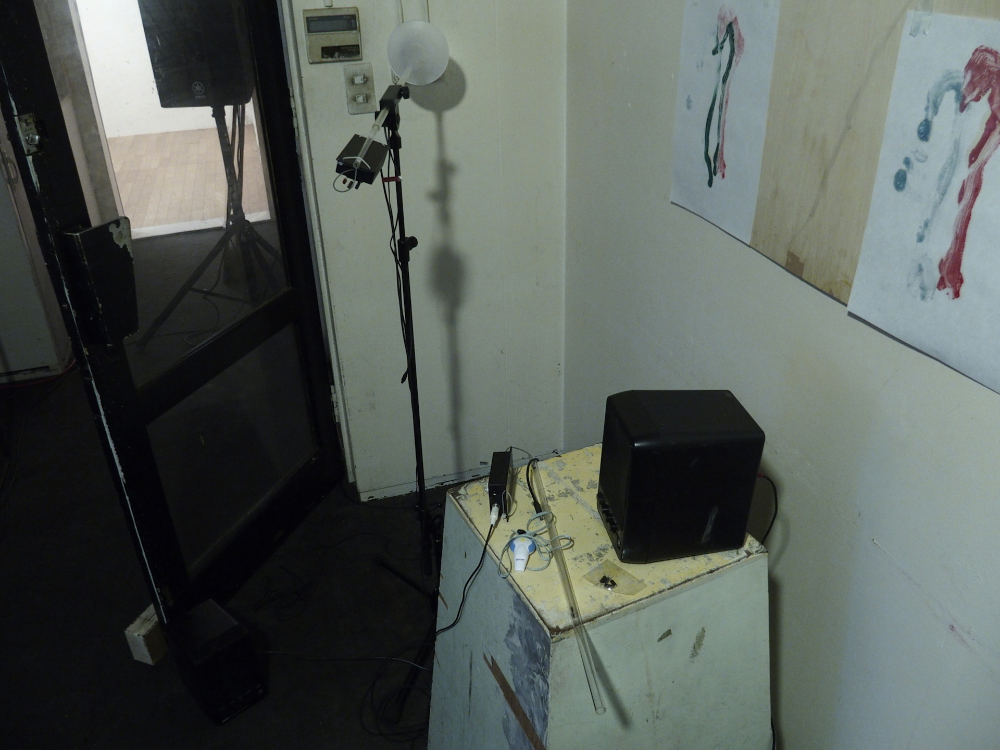

# フタリのさとがえり(水道橋Ftarri)

2018.07.01

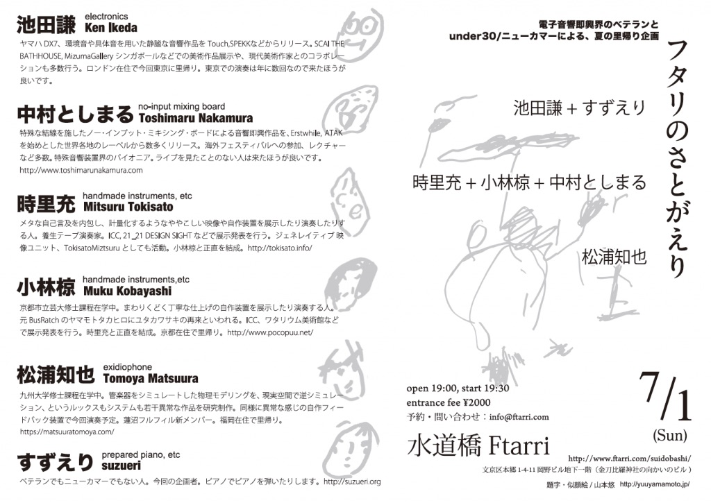

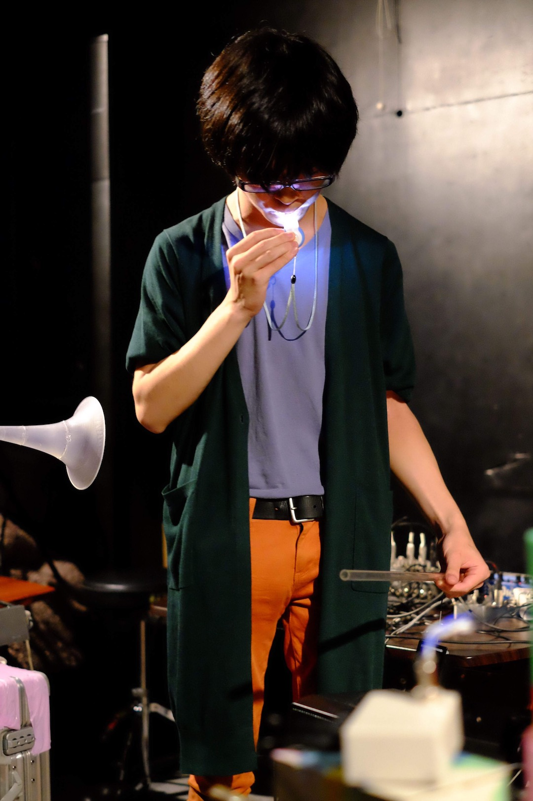

photo by 斉藤聡

instruments: [Exidiophone](/works/exidiophone)*2, Whistle

# Alternative Act 1.0 Tech Performance Fes.

https://2018.alternative-act.tokyo/

北千住 BuOY
2018.04.14

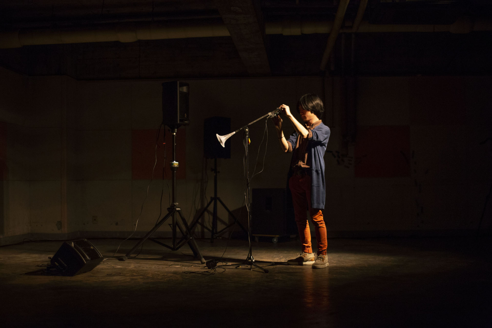

instruments: [Exidiophone](/works/exidiophone)*2, Whistle

# FREQ2018 21世紀初頭の音と音楽

2018.03.30

# 楽譜づくり・楽器作り(薬院 IAF Shop*)

2017.10.31

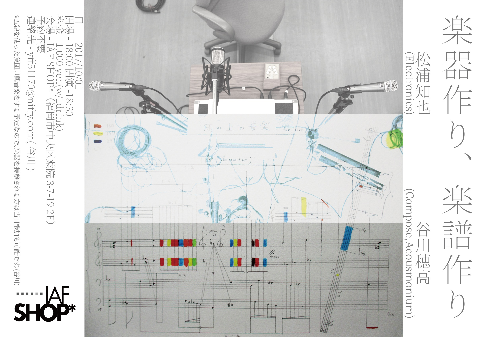

# つくると！vol.3(九州大学大橋キャンパス)

<iframe src="https://player.vimeo.com/video/228039554" width="640" height="480" frameborder="0" webkitallowfullscreen mozallowfullscreen allowfullscreen></iframe>

2017.06.10

# 千住 ArtPath 2016 蓮沼執太&学生によるセッション

2016.12.18

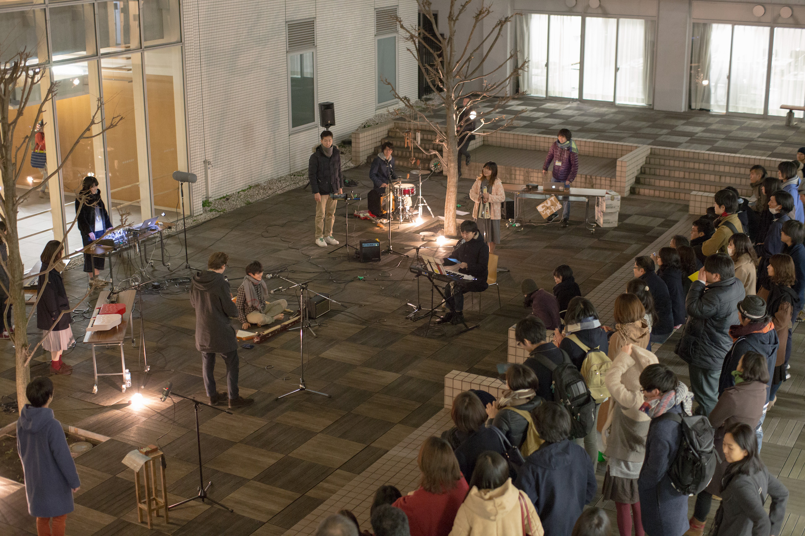

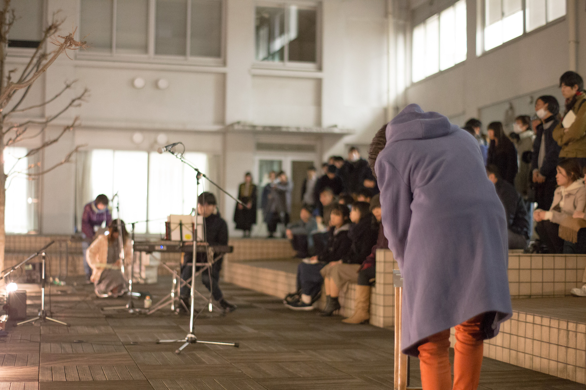

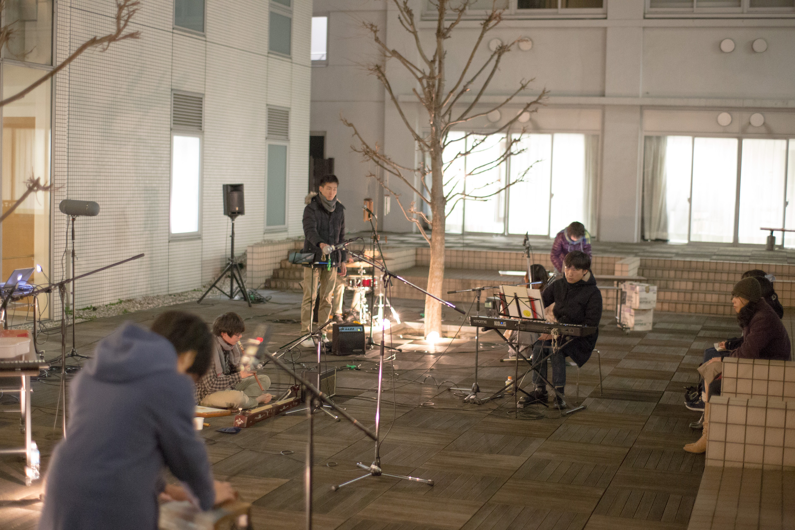

photos by 野口翔平

Instruments: Cracklebox& Audio Feedback with Handy Recorder(Zoom H5)

<http://www.senjuartpath.com/2016/special.html> （2023/01/24 リンク切れ/archive.orgに残っていないことを確認）
