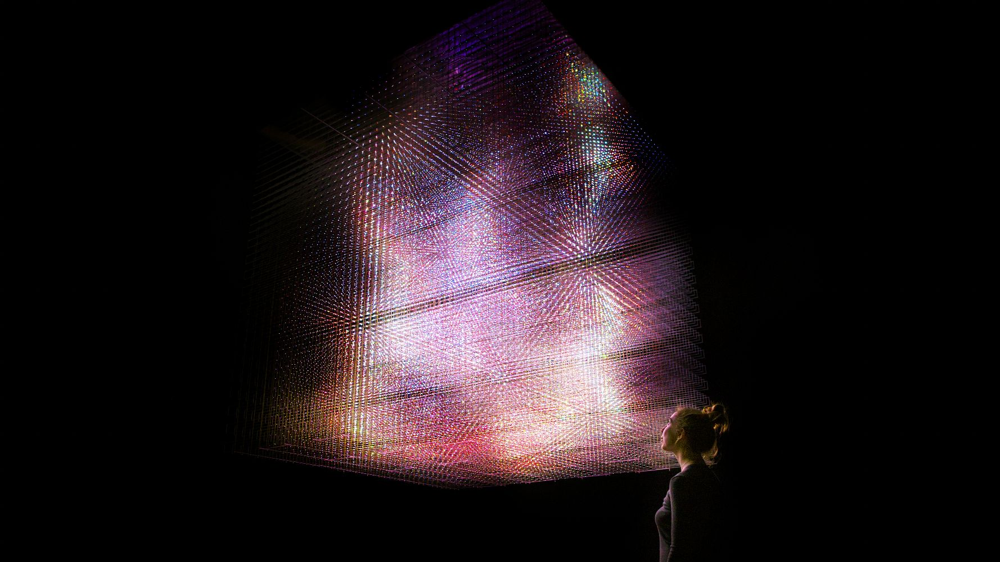

(Last Updated: 2017-01-08)

---

# teamLab: Dance! Art Exhibition, Learn & Play! Future Park at Huashan 1914(台北)

<https://www.team-lab.net/jp/e/huashan/>

installation at venue

---

# National Museum of Singapore

installation at venue and development of sound systems for the works below

## Story of the Forest

<https://www.team-lab.net/jp/w/story-of-the-forest/>

32ch interactive sound system(passageway): Tomoya Matsuura

---

# The Universe and Art：Princess Kaguya, Da Vinci, teamlab(Mori Art Musium)

Co-developed the sound system for the work below

## Crows are Chased and the Chasing Crows are Destined to be Chased as well, Blossoming on Collision - Light in Space

<https://www.team-lab.net/jp/w/crows_blossoming_on_collision/>

Sound System : Keisuke Kimoto and Tomoya Matsuura

---

# DMM.planets Arts by teamLab

<https://www.teamlab.art/jp/e/dmmplanets2016/>

Designed sound systems and software development for the 2 works below and corridors between the works.

## Drawing on the Water Surface Created by the Dance of Koi and People - Infinity

Sound System:Tomoya Matsuura

## Floating in the Falling Universe of Flowers

<https://www.team-lab.net/jp/w/fitfuof/>

Sound System:Tomoya Matsuura

---

### teamLab World: Dance! Art Museum, Learn & Play! Future Park,  at Lotte World(Seoul)

<https://www.team-lab.net/jp/e/teamlabworld/>

Installation at venue

---

### teamLab IsLands: Dance! Art Museum, Learn & Play! Interactive Theme Park at CentralWorld(Bangkok)

<https://www.teamlab.art/jp/e/centralworld/>

Installation at venue

---

### teamLab Exhibition: Dance Through the Crystal Universe at Asutamu Land Tokushima

<https://www.team-lab.net/e/crystaluniverse-tokushima/>

Installation at venue

---

### チームラボアイランド　踊る！美術館と、学ぶ！未来の遊園地 at Hirakata Park

<https://www.teamlab.art/jp/e/hirakatapark/>

Installation at venue

---

# FUTURE WORLD: WHERE ART MEETS SCIENCE at Art Science Musium (Singapore)

<https://www.teamlab.art/jp/e/artsciencemuseum/>

Installation at venue

---

# teamLab: Living Digital Space and Future Parks at Pace Art + Technology(Palo Alto, CA, United States)

<https://www.teamlab.art/jp/e/living_digital_space/>

Installation at venue and development of sound system for the work below

## Light Sculpture of Flames

[https://www.team-lab.net/works/light_sculpture_of_flames/](https://www.team-lab.net/works/light_sculpture_of_flames/)

Sound System: Tomoya Matsuura

---

# Camellia and Butterflies for Eternity

[https://www.team-lab.com/chinzanso2015](https://www.team-lab.com/chinzanso2015)

Sound System: Tomoya Matsuura

---

# Floating Flower Garden

[https://www.team-lab.net/works/ffgarden/](https://www.team-lab.net/works/ffgarden/)

Sound System:Ray Kunimoto, Tomoya Matsuura
