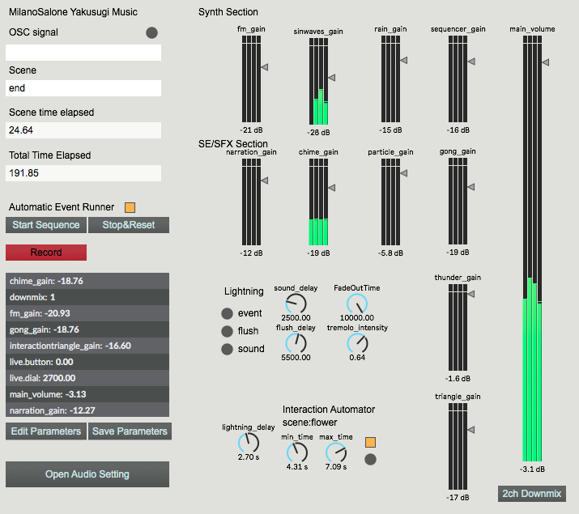
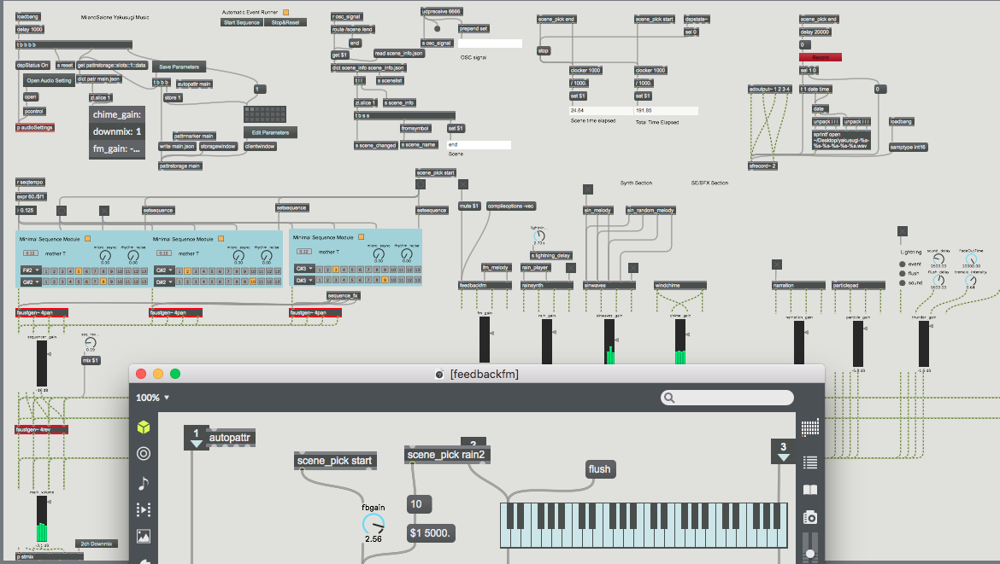

I composed and programmed an interactive music system for "Tree of Gods YAKUSUGI" an installation which is held in Milano Design Week(17th to 22th, April 2018) produced by Tokyo Sohgo Mokuzai Ichiba

<iframe src="https://www.youtube.com/embed/mt1BvUAeaI8" frameborder="0" allow="autoplay; encrypted-media" allowfullscreen style="width:100%; height:500px; min-height:300px;"></iframe>

Clients:[Shiitake Matsuri Inc.](https://www.shiitake-matsuri.com/pages/matsuri-digital-content)、[Tokyo Sohgo Mokuzai Ichiba Inc.](https://www.mokuzai.co.jp/)

Visual Programming: [Hironori Sugino](https://sugi.cc)

> The installation will give you an interactive experience and artistic performance of Yakusugi tree table.
We invite visitors to feel the flow of the eternal time in Yakushima by projecting images and movements directly on the wood grain pattern, where Yakusugi reflects its own beautiful and special pattern created by nature.

Website <https://www.shiitake-matsuri.com/pages/tree-of-gods-yakusugi>

Galleria Fumagalli Milano 17th~22th April 2018 11:00~13:00 15:00~19:00

I directed a placement of speakers, selection of audio equipments, audio hardware system, composition, programming and sound design comprehensively.

The composition itself and the actual programming is tottaly combined. Most part of the music is generated in real time and with 4ch surround system.

The software was developed with Cycling' 74 Max and Faust Language. The composition contains writing algorithms of synthesizers from scratch.

